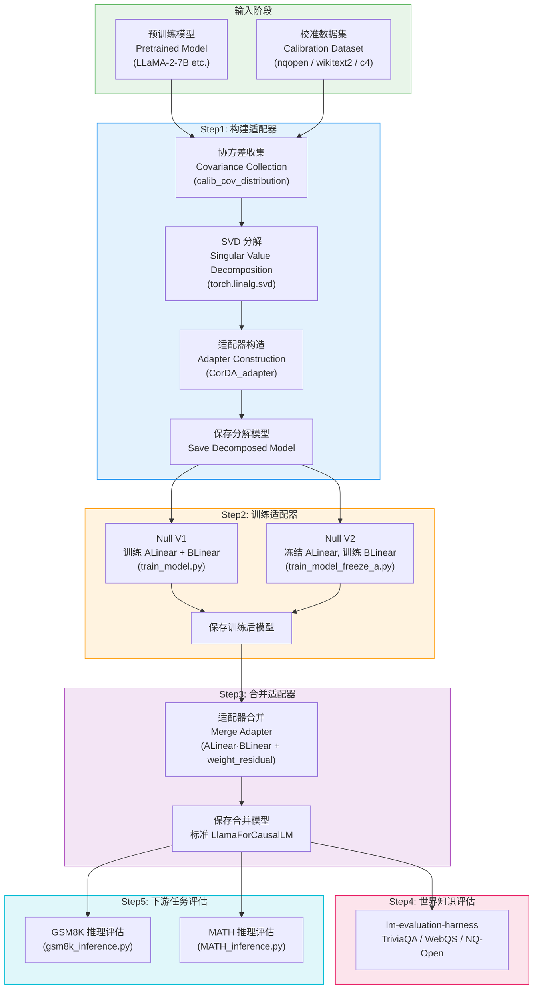
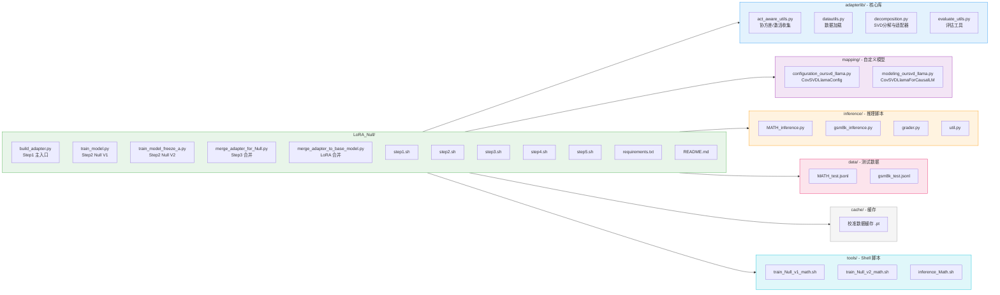
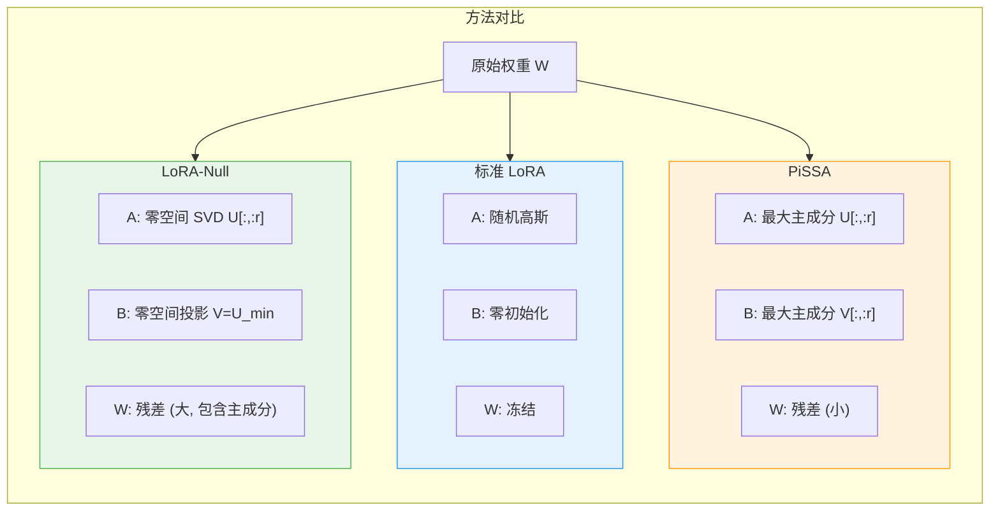
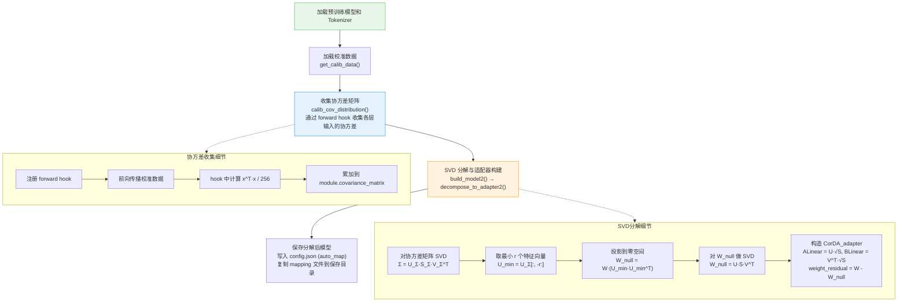
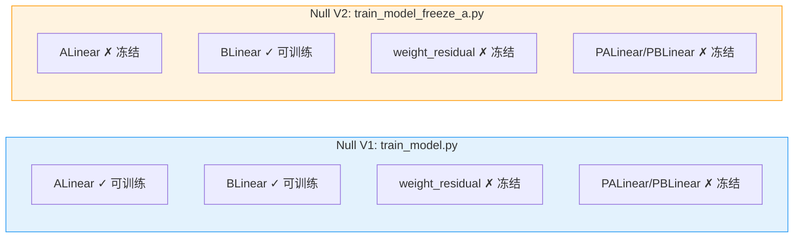
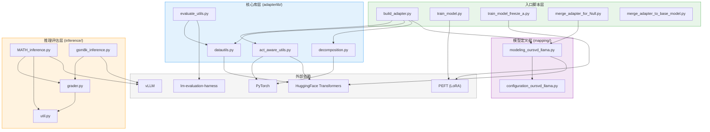

# LoRA-Null 项目总览与架构设计

## 一、项目定位与研究背景

### 1.1 项目概述

LoRA-Null 是一个基于 PyTorch 的研究项目，实现了**基于协方差矩阵零空间的低秩自适应（Low-Rank Adaptation via Null Space）**方法，专门针对 LLaMA 系列大语言模型进行参数高效微调。该项目的核心思想是：利用预训练模型各线性层输入的协方差矩阵进行 SVD 分解，取其最小特征值对应的特征向量（即零空间/近似零空间方向）来初始化 LoRA 适配器，从而在微调时最大程度地保留预训练知识，同时赋予模型学习下游任务的能力。

### 1.2 研究动机

传统 LoRA 方法使用随机高斯初始化或零初始化适配器权重，存在以下问题：

- **随机初始化**：训练初期适配器输出随机噪声，干扰预训练模型的正常推理，导致训练不稳定
- **零初始化**：虽然训练初期不干扰原模型，但梯度方向随机，收敛效率低
- **PiSSA 方法**：使用最大主成分初始化适配器，虽然收敛快，但会显著损害预训练模型的世界知识

LoRA-Null 的核心洞察是：**协方差矩阵的最小特征值对应的特征向量方向，是输入数据分布中方差最小的方向（近似零空间）**。在这些方向上进行适配器学习，意味着：

1. **对预训练知识的影响最小**：零空间方向对原始输入的响应最弱，适配器的变化不会显著改变模型在已有知识上的行为
2. **训练稳定性更好**：适配器从零空间出发，训练初期对原模型输出的扰动最小
3. **知识保留与任务学习的平衡**：在保留世界知识的同时，仍能通过低秩适配器有效学习下游任务

### 1.3 核心创新点

| 特性 | LoRA (随机初始化) | PiSSA (最大主成分) | LoRA-Null (最小主成分/零空间) |
|------|-------------------|--------------------|-------------------------------|
| 初始化方式 | 高斯随机 | 协方差最大特征向量 | 协方差最小特征向量 |
| 训练初期扰动 | 大 | 大 | 小 |
| 世界知识保留 | 中等 | 差 | 好 |
| 下游任务性能 | 中等 | 好 | 好 |
| 收敛速度 | 慢 | 快 | 中等 |

---

## 二、整体架构

### 2.1 架构总览流程图

LoRA-Null 的完整数据流从预训练模型出发，经过五个核心步骤，最终得到可用于推理的微调模型：



**流程说明**：

1. **Step1** 是整个方法的核心创新所在——通过协方差矩阵的 SVD 分解，将预训练权重分解为适配器部分（零空间方向）和残差部分（主空间方向），适配器部分用于后续训练，残差部分冻结保留
2. **Step2** 提供两种训练模式：V1 同时训练 ALinear 和 BLinear，V2 冻结 ALinear 只训练 BLinear（参数更少，更高效）
3. **Step3** 将训练后的适配器权重合并回标准 `nn.Linear` 层，恢复为标准 LLaMA 模型结构
4. **Step4-5** 分别从世界知识保留和下游任务性能两个维度评估模型效果

### 2.2 核心数学原理

对于模型中的每个线性层 $W \in \mathbb{R}^{m \times n}$，LoRA-Null 的分解过程如下：

1. **协方差收集**：通过校准数据前向传播，收集输入 $x$ 的协方差矩阵 $\Sigma = \frac{1}{N} \sum x^T x$
2. **SVD 分解**：对协方差矩阵 $\Sigma$ 进行 SVD 分解，得到 $\Sigma = U_\Sigma S_\Sigma V_\Sigma^T$
3. **零空间提取**：取 $U_\Sigma$ 的最后 $r$ 列（最小特征值对应的特征向量）$U_{min} \in \mathbb{R}^{n \times r}$
4. **投影与分解**：计算 $W_{null} = W \cdot (U_{min} U_{min}^T)$，再对 $W_{null}$ 进行 SVD 分解得到 $U, S, V$
5. **适配器构造**：$W = \underbrace{U \cdot \text{diag}(S) \cdot V^T}_{\text{adapter: ALinear + BLinear}} + \underbrace{W_{residual}}_{\text{frozen}}$

---

## 三、目录结构

### 3.1 目录树



### 3.2 文件详细说明

| 路径 | 功能 | 关键类/函数 |
|------|------|------------|
| `build_adapter.py` | Step1 主入口，编排校准数据加载→协方差收集→SVD分解→适配器构建→保存 | `main()` |
| `train_model.py` | Step2 Null V1 训练入口，训练 ALinear+BLinear | `train()`, `TrainingArguments` |
| `train_model_freeze_a.py` | Step2 Null V2 训练入口，冻结 ALinear 只训练 BLinear | `train()`, `TrainingArguments` |
| `merge_adapter_for_Null.py` | Step3 合并入口，将 CorDA_adapter 合并为 nn.Linear | `main()` |
| `merge_adapter_to_base_model.py` | LoRA 模式合并（使用 PEFT merge_and_unload） | — |
| `adapterlib/decomposition.py` | 核心 SVD 分解与适配器构造 | `CorDA_adapter`, `CorDA_adapter2`, `decompose_to_adapter2()`, `build_model2()` |
| `adapterlib/act_aware_utils.py` | 协方差/激活/Fisher 信息收集 | `calib_cov_distribution()`, `calib_fisher_info()`, `calib_input_distribution()` |
| `adapterlib/datautils.py` | 校准数据加载（支持 8 种数据集） | `get_calib_data()`, `get_eval_loaders()` |
| `adapterlib/evaluate_utils.py` | 困惑度评估与 lm-eval 封装 | `EvalLM`, `evaluate_model()`, `evaluate_perplexity()` |
| `mapping/modeling_oursvd_llama.py` | 自定义模型定义 | `CovSVDLinear`, `CovSVDLlamaForCausalLM` |
| `mapping/configuration_oursvd_llama.py` | 自定义配置 | `CovSVDLlamaConfig` |
| `inference/gsm8k_inference.py` | GSM8K 数学推理评估 | `gsm8k_test()` |
| `inference/MATH_inference.py` | MATH 数学推理评估 | `test_hendrycks_math()` |
| `inference/grader.py` | 数学答案等价判定 | `math_equal()`, `symbolic_equal()` |
| `inference/util.py` | LaTeX 答案提取工具 | `is_equiv()`, `last_boxed_only_string()` |

---

## 四、核心设计哲学

### 4.1 零空间 LoRA 的动机

大语言模型在预训练阶段积累了丰富的世界知识，这些知识编码在模型权重的**主成分方向**（高方差方向）上。传统 LoRA 微调时，适配器的更新不可避免地会沿这些主成分方向修改权重，从而损害预训练知识。

LoRA-Null 的核心设计哲学是：**将适配器的学习约束在输入分布的零空间（或近似零空间）方向上**。具体而言：

- **协方差矩阵的谱结构**反映了输入数据在各方向上的方差分布
- **最大特征值方向**：输入数据方差大，是模型"已学好的知识"，不应轻易修改
- **最小特征值方向**：输入数据方差小（近似零空间），是模型"不太关注的方向"，在这些方向上修改权重对已有知识影响最小

### 4.2 零空间 LoRA 的优势

1. **知识保留**：适配器权重初始化在零空间方向，训练过程中的梯度更新也主要沿零空间方向，最大程度保留预训练知识
2. **训练稳定**：训练初期适配器对原模型输出的扰动极小（零空间方向对输入的响应弱），避免了随机初始化带来的训练不稳定
3. **可逆性**：适配器与残差权重分离，合并后可恢复为标准模型结构，无推理开销
4. **灵活性**：支持 V1（训练 A+B）和 V2（冻结 A 只训练 B）两种训练模式，适应不同场景

### 4.3 与相关方法的对比



关键区别在于**残差权重的大小**：
- **LoRA**：残差 = 原始权重（最大），适配器从零开始学习
- **PiSSA**：残差 = 原始权重 - 最大主成分（最小），适配器承载了最重要的权重信息
- **LoRA-Null**：残差 = 原始权重 - 零空间投影（接近原始权重），适配器只承载最不重要的方向

---

## 五、五步流水线详解

### 5.1 Step1：构建适配器（build_adapter.py）

**功能**：从预训练模型出发，收集协方差信息，进行 SVD 分解，构建零空间适配器。

**执行命令**：
```bash
python build_adapter.py \
    --model_id "meta-llama/Llama-2-7b-hf" \
    --singular_aware \
    --use_cache \
    --r 128 \
    --calib_dataset "nqopen" \
    --calib_loader_size 256 \
    --save_model \
    --save_path save_LoRA_Null_adapter_llama2_PT_128
```

**关键参数**：

| 参数 | 说明 | 默认值 |
|------|------|--------|
| `--model_id` | 预训练模型路径 | `meta-llama/Llama-2-7b-hf` |
| `--singular_aware` | 启用零空间模式（LoRA-Null 核心标志） | False |
| `--r` | 适配器秩 | None |
| `--calib_dataset` | 校准数据集 | `wikitext2` |
| `--calib_loader_size` | 校准样本数 | 256 |
| `--first_eigen` | 使用最大主成分（PiSSA 模式） | False |
| `--sigma_fuse` | 奇异值融合方式 (UV/U/V) | `UV` |
| `--use_cache` | 使用缓存的校准数据 | False |

**核心流程**：



**singular_aware 模式的核心逻辑**（`decompose_to_adapter2` 函数）：

1. 对线性层的协方差矩阵 $\Sigma$ 进行 SVD：$\Sigma = U_\Sigma S_\Sigma V_\Sigma^T$
2. 取 $U_\Sigma$ 的最后 $r$ 列 $U_{min}$（对应最小特征值，即近似零空间方向）
3. 计算零空间投影：$W_{null} = W \cdot (U_{min} U_{min}^T)$
4. 残差权重：$W_{residual} = W - W_{null}$
5. 对 $W_{null}$ 进行 SVD 分解得到 $U, S, V$，用于初始化适配器

### 5.2 Step2：训练适配器

提供两种训练模式：

#### Null V1（train_model.py）

- **训练策略**：同时训练 ALinear 和 BLinear
- **冻结策略**：冻结 `weight_residual`、`PALinear`、`PBLinear`
- **适用场景**：需要更大的学习能力，适配器参数全部可训练

```bash
python train_model.py \
    --model_name_or_path save_LoRA_Null_adapter_llama2_PT_128 \
    --output_dir save_..._trained \
    --Null_mode True \
    --data_path meta-math/MetaMathQA \
    --dataset_field query response \
    --learning_rate 2e-5 \
    --num_train_epochs 1
```

#### Null V2（train_model_freeze_a.py）

- **训练策略**：冻结 ALinear，只训练 BLinear
- **冻结策略**：冻结 `weight_residual`、`ALinear`、`PALinear`、`PBLinear`
- **适用场景**：参数更少，训练更高效，更倾向于保留预训练知识

```bash
python train_model_freeze_a.py \
    --model_name_or_path save_LoRA_Null_adapter_llama2_PT_128 \
    --output_dir save_..._trained \
    --Null_mode True \
    --data_path meta-math/MetaMathQA \
    --dataset_field query response \
    --learning_rate 2e-5 \
    --num_train_epochs 1
```

**训练模式对比**：



**训练还支持其他模式**（通过参数切换）：
- `--lora_r` 指定时：标准 LoRA 模式（使用 PEFT 库）
- 不指定 `--Null_mode` 且不指定 `--lora_r`：全参数微调模式

### 5.3 Step3：合并适配器（merge_adapter_for_Null.py）

**功能**：将训练后的 CorDA_adapter 合并回标准 `nn.Linear` 层，消除适配器结构，恢复为标准 LLaMA 模型。

**合并公式**：
$$W_{merged} = W_{ALinear} \cdot W_{BLinear} + W_{residual}$$

```bash
python merge_adapter_for_Null.py \
    --model_id save_..._trained/ft \
    --save_path save_..._merged
```

**合并过程**：
1. 遍历模型中所有 `CovSVDLinear` 类型的模块
2. 计算 `merged_weight = ALinear.weight @ BLinear.weight + weight_residual`
3. 创建新的 `nn.Linear` 层替换 `CovSVDLinear`
4. 修改 `config.json`：将 `architectures` 改回 `LlamaForCausalLM`，删除 `lora_r` 和 `auto_map`

### 5.4 Step4：世界知识评估

使用 [lm-evaluation-harness](https://github.com/EleutherAI/lm-evaluation-harness) 评估合并后模型在世界知识基准上的表现：

```bash
accelerate launch -m lm_eval --model hf \
    --model_args pretrained=save_..._merged \
    --tasks triviaqa,webqs,nq_open \
    --batch_size 64
```

评估任务包括：
- **TriviaQA**：问答知识
- **WebQS**：网络问题
- **NQ-Open**：自然问题开放域

这些任务用于验证微调后模型是否保留了预训练阶段获得的世界知识。

### 5.5 Step5：下游任务评估

使用 vLLM 进行高效推理，评估数学推理能力：

```bash
# GSM8K 评估
python inference/gsm8k_inference.py --model save_..._merged

# MATH 评估
python inference/MATH_inference.py --model save_..._merged
```

**评估流程**：
1. 加载合并后的模型（通过 vLLM）
2. 对测试集生成回答（贪心解码，temperature=0）
3. 提取答案并与标准答案比对
4. 计算准确率

---

## 六、模块依赖关系

### 6.1 模块依赖图



### 6.2 核心模块详解

#### 6.2.1 decomposition.py — SVD 分解与适配器构造

这是整个项目最核心的模块，包含以下关键组件：

**类**：
- **`CorDA_adapter`**：零空间适配器模块，将 `nn.Linear` 替换为 `ALinear + BLinear + weight_residual` 的结构
  - `ALinear`：$r \to m$ 的线性层，权重初始化为 $U \cdot \sqrt{S}$
  - `BLinear`：$n \to r$ 的线性层，权重初始化为 $V^T \cdot \sqrt{S}$
  - `weight_residual`：冻结的残差权重 $W - USV^T$
  - 前向传播：$y = \text{ALinear}(\text{BLinear}(x)) + x \cdot W_{residual}^T$
- **`CorDA_adapter2`**：扩展适配器，增加 `PALinear`/`PBLinear` 投影层，用于 `singular_aware_2` 模式

**函数**：
- **`decompose_to_adapter2()`**：核心分解函数，支持 `singular_aware`（LoRA-Null）、`cov_aware`（CovSVD）、`act_aware`（ASVD）三种模式
- **`build_model2()`**：遍历模型所有线性层（跳过 `lm_head`），逐层调用 `decompose_to_adapter2()` 进行替换

**sigma_fuse 策略**：
- `UV`：$A = U \cdot \sqrt{S}$，$B = V^T \cdot \sqrt{S}$（均衡分配，默认）
- `U`：$A = U \cdot S$，$B = V^T$（全部奇异值给 A）
- `V`：$A = U$，$B = V^T \cdot S$（全部奇异值给 B）

#### 6.2.2 act_aware_utils.py — 协方差与激活收集

通过 PyTorch 的 `register_forward_hook` 机制，在前向传播过程中收集各线性层的统计信息：

- **`calib_cov_distribution()`**：收集输入协方差矩阵 $\Sigma = x^T x / 256$，用于 LoRA-Null 和 CovSVD
- **`calib_input_distribution()`**：收集输入激活的绝对值均值/最大值，用于 ASVD
- **`calib_fisher_info()`**：收集 Fisher 信息矩阵的对角近似，用于重要性感知分解
- **`calib_cov_distribution2()`**：收集第二组协方差矩阵（用于 twin_aware 模式）

所有函数都支持缓存机制，避免重复计算。

#### 6.2.3 datautils.py — 数据加载

`get_calib_data()` 函数支持 8 种校准数据集：

| 数据集 | 类型 | 用途 |
|--------|------|------|
| `wikitext2` | 通用文本 | 通用协方差收集 |
| `c4` | 通用文本 | 通用协方差收集 |
| `ptb` | 通用文本 | 通用协方差收集 |
| `nqopen` | 问答 | **LoRA-Null 推荐使用** |
| `alpaca` | 指令 | 指令微调场景 |
| `MetaMATH` | 数学 | 数学微调场景 |
| `codefeedback` | 代码 | 代码微调场景 |
| `WizLMinstruct` | 指令 | 指令微调场景 |

对于问答/指令类数据集，使用 LLaMA Chat 格式模板包装；对于通用文本数据集，随机采样固定长度的文本片段。

#### 6.2.4 mapping/ — 自定义模型定义

- **`CovSVDLlamaConfig`**：继承 `PretrainedConfig`，增加 `truncation_ranks` 和 `lora_r` 字段
- **`CovSVDLinear`**：自定义线性层，包含 `BLinear`（$n \to r$）、`ALinear`（$r \to m$）和冻结的 `weight_residual`
- **`CovSVDLlamaForCausalLM`**：继承 `LlamaForCausalLM`，在 `__init__` 中将所有 `nn.Linear`（除 `lm_head`）替换为 `CovSVDLinear`

通过 HuggingFace 的 `auto_map` 机制，在 `config.json` 中指定自定义配置类和模型类，实现模型的自动加载。

---

## 七、总结

### 7.1 项目架构特点

LoRA-Null 项目架构具有以下特点：

1. **流水线式设计**：五个步骤（构建→训练→合并→知识评估→任务评估）清晰分离，每步独立可执行
2. **模块化核心库**：`adapterlib/` 将协方差收集、数据加载、SVD 分解、评估工具解耦，便于复用和扩展
3. **多模式支持**：同一代码库支持 LoRA-Null（singular_aware）、CovSVD（cov_aware）、ASVD（act_aware）、标准 LoRA、全参数微调等多种模式
4. **自定义模型映射**：通过 `mapping/` 目录和 `auto_map` 机制，实现分解后模型的透明加载和推理
5. **缓存优化**：校准数据和协方差矩阵支持缓存，避免重复计算

### 7.2 核心价值

LoRA-Null 的核心价值在于**零空间初始化**这一创新点：通过将 LoRA 适配器的学习约束在输入分布的零空间方向上，实现了**世界知识保留**与**下游任务学习**的最优平衡。这一设计哲学不仅适用于 LLaMA 模型，也为大语言模型的参数高效微调提供了新的思路——**不是在最重要的方向上学习，而是在最不重要的方向上学习，才能最好地保护已有的知识**。
