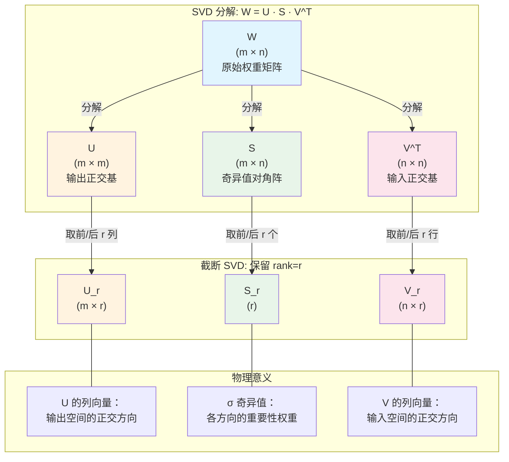
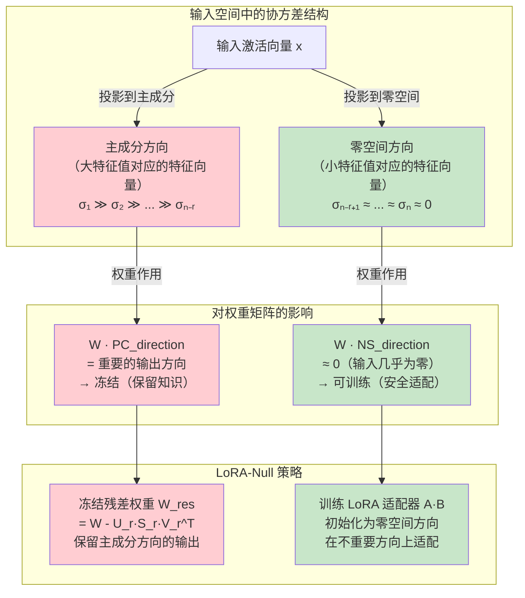
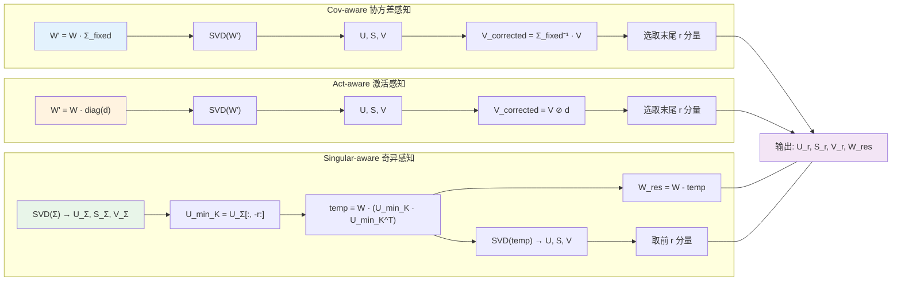
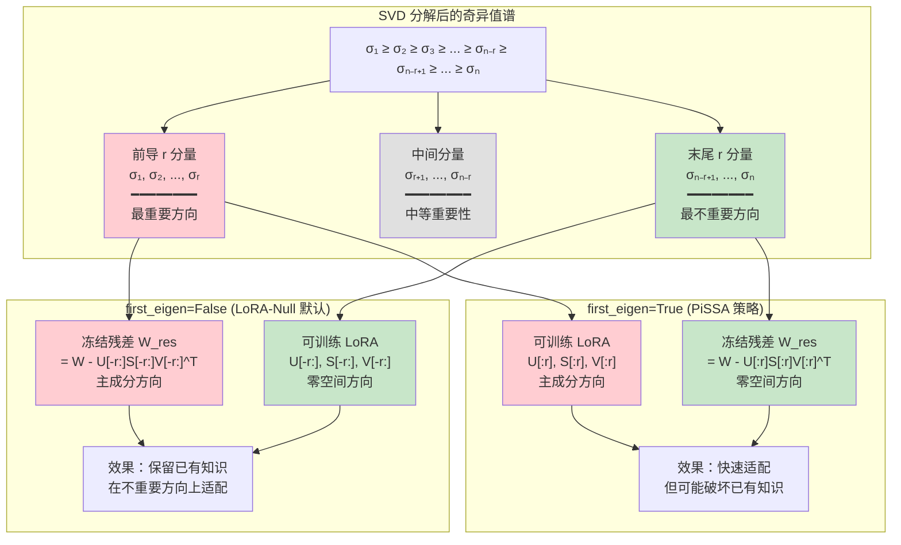

# 核心算法：SVD 分解与零空间原理

> 本文档深入剖析 LoRA-Null 项目中的核心算法——SVD（奇异值分解）与零空间（Null Space）原理。从数学基础出发，逐步推导三种感知模式的具体实现，最终回归到整体设计哲学的统一理解。

---

## 总览：LoRA-Null 的算法哲学

LoRA-Null 的核心思想可以用一句话概括：**在预训练权重矩阵的"不重要方向"上注入可训练参数，而在"重要方向"上冻结原始知识**。这一思想建立在三个关键洞察之上：

1. **SVD 分解**将权重矩阵分解为正交方向及其重要性排序
2. **协方差矩阵**的零空间刻画了对当前任务"不重要"的输入方向
3. **残差冻结**确保原始知识在训练过程中不被破坏

整个算法流程可以概括为：

$$
W \xrightarrow{\text{感知模式}} W' \xrightarrow{\text{SVD}} U, S, V \xrightarrow{\text{选取末尾/前导分量}} U_r, S_r, V_r \xrightarrow{\text{残差计算}} W_{\text{res}} \xrightarrow{\text{Sigma 融合}} A, B
$$

下面，我们将从 SVD 的数学基础开始，逐层展开。

---

## 一、SVD 分解的数学基础

### 1.1 完整 SVD 分解

对于任意实矩阵 $W \in \mathbb{R}^{m \times n}$，奇异值分解（Singular Value Decomposition）将其分解为三个矩阵的乘积：

$$
W = U \cdot S \cdot V^T
$$

其中：

| 矩阵 | 维度 | 性质 | 含义 |
|------|------|------|------|
| $U$ | $m \times m$ | 正交矩阵：$U^T U = U U^T = I_m$ | 输出空间的正交基 |
| $S$ | $m \times n$ | 对角矩阵，对角元素 $\sigma_1 \geq \sigma_2 \geq \cdots \geq \sigma_{\min(m,n)} \geq 0$ | 各方向的奇异值（重要性） |
| $V^T$ | $n \times n$ | 正交矩阵：$V^T V = V V^T = I_n$ | 输入空间的正交基 |

奇异值 $\sigma_i$ 非负且按降序排列，反映了矩阵在对应方向上的"能量"或"重要性"。

### 1.2 截断 SVD（Truncated SVD）

在实际应用中，我们通常只保留前 $r$ 个（或后 $r$ 个）分量，即截断 SVD：

$$
W \approx U_r \cdot \text{diag}(S_r) \cdot V_r^T
$$

其中 $U_r \in \mathbb{R}^{m \times r}$，$S_r \in \mathbb{R}^{r}$，$V_r \in \mathbb{R}^{n \times r}$。

截断 SVD 的误差由被截断的奇异值之和决定：

$$
\|W - U_r \text{diag}(S_r) V_r^T\|_F^2 = \sum_{i=r+1}^{\min(m,n)} \sigma_i^2
$$

### 1.3 SVD 分解可视化



**图解说明**：SVD 将权重矩阵 $W$ 分解为三个因子的乘积。$U$ 和 $V$ 分别是输出空间和输入空间的正交基，$S$ 中的奇异值按降序排列，量化了每个方向的重要性。截断 SVD 只保留最重要的 $r$ 个分量（或最不重要的 $r$ 个分量），实现降维与信息筛选。

---

## 二、零空间概念与 LoRA-Null 的核心思想

### 2.1 协方差矩阵的构建

在 LoRA-Null 中，协方差矩阵 $\Sigma$ 通过校准数据集上的输入激活值计算得到（参见 `act_aware_utils.py` 第 101–166 行的 `calib_cov_distribution` 函数）：

$$
\Sigma = \frac{1}{N} \sum_{i=1}^{N} x_i \cdot x_i^T
$$

其中 $x_i \in \mathbb{R}^{n}$ 是线性层输入激活向量（经过归一化），$N$ 是校准样本数。代码中的实现为：

```python
# act_aware_utils.py, line 133
covariance = input.t().matmul(input)
```

### 2.2 协方差矩阵的特征分解

对协方差矩阵进行 SVD 分解（等价于特征分解，因为 $\Sigma$ 是对称半正定矩阵）：

$$
\Sigma = U_\Sigma \cdot \text{diag}(S_\Sigma) \cdot V_\Sigma^T
$$

其中 $S_\Sigma = [\sigma_1^\Sigma, \sigma_2^\Sigma, \ldots, \sigma_n^\Sigma]$，且 $\sigma_1^\Sigma \geq \sigma_2^\Sigma \geq \cdots \geq \sigma_n^\Sigma \geq 0$。

### 2.3 零空间的定义与直觉

**零空间（Null Space）** 的严格定义：对于矩阵 $A$，其零空间为 $\text{Null}(A) = \{x : Ax = 0\}$。

在 LoRA-Null 的语境下，"零空间"是一个**近似概念**：

$$
\text{Null}_{\text{approx}}(\Sigma) = \text{span}\{u_{\Sigma}^{(n-r+1)}, \ldots, u_{\Sigma}^{(n)}\}
$$

即协方差矩阵的最后 $r$ 个特征向量所张成的子空间。这些方向对应于**最小特征值**，意味着：

- 输入数据在这些方向上的方差极小（接近零）
- 这些方向对当前校准任务的输出影响极小
- 在这些方向上修改权重，对模型已有知识的破坏最小

### 2.4 LoRA-Null 的核心直觉

```
重要方向（大特征值） → 输入数据在这些方向上活跃 → 修改权重会严重影响输出 → 冻结！
不重要方向（小特征值）→ 输入数据在这些方向上沉默 → 修改权重对输出影响小 → 可训练！
```

这就是 LoRA-Null 名字的由来：**在 LoRA 适配器中注入零空间方向**，使得微调过程不会干扰模型已有的重要知识。

### 2.5 零空间投影的几何解释



**图解说明**：左上方展示输入空间中协方差的结构——主成分方向（红色）承载了大部分输入方差，零空间方向（绿色）几乎不承载方差。右上方展示权重矩阵对这两类方向的不同作用：主成分方向产生重要输出，零空间方向产生可忽略的输出。下方展示 LoRA-Null 的策略：冻结残差权重以保留主成分方向的输出，训练 LoRA 适配器以在零空间方向上进行安全适配。

---

## 三、三种感知模式的数学推导

LoRA-Null 提供了三种"感知模式"来指导 SVD 分解，每种模式对"什么方向重要"有不同的理解方式。核心思想是：**在 SVD 分解之前，先用感知信息对权重矩阵进行变换，使 SVD 能够"感知"到输入分布的结构；分解之后再对右奇异向量进行校正，恢复原始空间中的表示**。

### 3.1 Covariance-Aware（协方差感知，Cov-aware）

#### 3.1.1 核心思想

协方差感知模式认为：**输入特征之间存在相关性，SVD 分解应该考虑这种相关性**。如果两个输入特征高度相关，那么在分解时应该将它们视为一个"组合方向"。

#### 3.1.2 数学推导

**步骤一：协方差矩阵的正则化**

原始协方差矩阵 $\Sigma$ 可能不是满秩的（不可逆），需要添加阻尼项：

$$
\Sigma_{\text{fixed}} = \Sigma + \text{damp} \cdot \text{mean}(\text{diag}(\Sigma)) \cdot I_n
$$

代码实现（`decomposition.py` 第 108–120 行）：

```python
damp = 0.01
while True:
    compensate = torch.diag(
        torch.ones(covariance_matrix.size(0)).to(covariance_matrix.device)
        * torch.mean(torch.diag(covariance_matrix)) * damp
    )
    fix_covariance_matrix = covariance_matrix + compensate
    cov_inv = torch.linalg.inv(fix_covariance_matrix)
    inv_error = torch.dist(fix_covariance_matrix @ cov_inv, torch.eye(n).cuda())
    if inv_error.data < 0.05:
        break
    else:
        damp = damp * 2
```

阻尼系数 `damp` 从 0.01 开始，逐步翻倍，直到 $\Sigma_{\text{fixed}} \cdot \Sigma_{\text{fixed}}^{-1} \approx I$（误差 < 0.05）。

**步骤二：变换权重矩阵**

$$
W' = W \cdot \Sigma_{\text{fixed}}
$$

这一步将权重矩阵右乘协方差矩阵，使得 SVD 分解能够感知输入特征之间的相关性。

**步骤三：对变换后的矩阵进行 SVD**

$$
U, S, V = \text{SVD}(W')
$$

注意：这里的 $V$ 是在"协方差变换后空间"中的右奇异向量，需要校正回原始空间。

**步骤四：校正右奇异向量**

$$
V_{\text{corrected}} = (V^T \cdot \Sigma_{\text{fixed}}^{-1})^T = \Sigma_{\text{fixed}}^{-T} \cdot V = \Sigma_{\text{fixed}}^{-1} \cdot V
$$

代码实现（`decomposition.py` 第 132 行）：

```python
V = (V.t() @ cov_inv).transpose(0, 1)
```

**推导**：设 $W' = W \cdot \Sigma_{\text{fixed}} = U \cdot S \cdot V^T$，则：

$$
W = W' \cdot \Sigma_{\text{fixed}}^{-1} = U \cdot S \cdot V^T \cdot \Sigma_{\text{fixed}}^{-1} = U \cdot S \cdot (V^T \cdot \Sigma_{\text{fixed}}^{-1})
$$

令 $\tilde{V}^T = V^T \cdot \Sigma_{\text{fixed}}^{-1}$，则 $\tilde{V} = (\Sigma_{\text{fixed}}^{-1})^T \cdot V = \Sigma_{\text{fixed}}^{-1} \cdot V$（因为 $\Sigma_{\text{fixed}}$ 是对称矩阵）。

#### 3.1.3 直觉理解

Cov-aware 模式等价于在"白化"后的输入空间中进行 SVD 分解。通过右乘 $\Sigma_{\text{fixed}}$，我们将输入空间变换为各方向不相关且方差归一化的空间，在此空间中 SVD 分解更准确地反映各方向的"真实重要性"。

---

### 3.2 Activation-Aware（激活感知，Act-aware）

#### 3.2.1 核心思想

激活感知模式使用**对角近似**来代替完整的协方差矩阵，认为输入特征之间的相关性可以忽略，只需考虑各特征的方差（或绝对均值/最大值）。这是一种计算效率更高的近似方法。

#### 3.2.2 数学推导

**步骤一：构建缩放对角矩阵**

$$
d = \text{scaling\_diag\_matrix}^\alpha \odot \text{fisher\_info}^\alpha
$$

其中 $\odot$ 表示逐元素乘法，$\alpha$ 是超参数（默认 0.5）。`scaling_diag_matrix` 可以是输入激活的绝对均值（`abs_mean`）或绝对最大值（`abs_max`），`fisher_info` 是 Fisher 信息的平方根。

代码实现（`decomposition.py` 第 169–180 行）：

```python
scaling_diag_matrix = 1
if hasattr(linear, "scaling_diag_matrix"):
    scaling_diag_matrix *= linear.scaling_diag_matrix ** alpha
if hasattr(linear, "fisher_info"):
    scaling_diag_matrix *= linear.fisher_info ** alpha
scaling_diag_matrix += 1e-6  # 避免除零
```

**步骤二：变换权重矩阵**

$$
W' = W \cdot \text{diag}(d)
$$

即对权重矩阵的每一列乘以对应的缩放系数。

代码实现（`decomposition.py` 第 180 行）：

```python
w = pretrained_w * scaling_diag_matrix.view(1, -1)
```

**步骤三：对变换后的矩阵进行 SVD**

$$
U, S, V = \text{SVD}(W')
$$

**步骤四：校正右奇异向量**

$$
V_{\text{corrected}} = V \oslash d
$$

其中 $\oslash$ 表示逐元素除法（每行除以 $d$ 的对应元素）。

代码实现（`decomposition.py` 第 215 行）：

```python
V = V / scaling_diag_matrix.view(-1, 1)
```

**推导**：设 $W' = W \cdot \text{diag}(d) = U \cdot S \cdot V^T$，则：

$$
W = W' \cdot \text{diag}(d)^{-1} = U \cdot S \cdot V^T \cdot \text{diag}(d)^{-1} = U \cdot S \cdot (V \oslash d)^T
$$

#### 3.2.3 与 Cov-aware 的关系

Act-aware 可以看作 Cov-aware 的对角近似版本：

| 方面 | Cov-aware | Act-aware |
|------|-----------|-----------|
| 输入分布建模 | 完整协方差矩阵 $\Sigma \in \mathbb{R}^{n \times n}$ | 对角缩放矩阵 $d \in \mathbb{R}^{n}$ |
| 特征相关性 | 考虑 | 忽略 |
| 计算复杂度 | $O(n^3)$（矩阵求逆） | $O(n)$（逐元素运算） |
| 内存开销 | $O(n^2)$ | $O(n)$ |
| 变换方式 | $W' = W \cdot \Sigma_{\text{fixed}}$ | $W' = W \cdot \text{diag}(d)$ |
| 校正方式 | $V_{\text{corrected}} = \Sigma_{\text{fixed}}^{-1} \cdot V$ | $V_{\text{corrected}} = V \oslash d$ |

---

### 3.3 Singular-Aware（奇异感知）

#### 3.3.1 核心思想

奇异感知模式**直接利用协方差矩阵的零空间**，而非间接地通过变换权重矩阵来感知输入分布。它先对协方差矩阵做 SVD，取出零空间方向，然后将权重矩阵投影到零空间上再做 SVD。

#### 3.3.2 数学推导

**步骤一：对协方差矩阵进行 SVD**

$$
U_\Sigma, S_\Sigma, V_\Sigma = \text{SVD}(\Sigma)
$$

代码实现（`decomposition.py` 第 438 行）：

```python
U_, S_, V_ = torch.linalg.svd(covariance_matrix)
```

**步骤二：选取零空间方向**

$$
U_{\min K} = U_\Sigma[:, -r:]
$$

即取协方差矩阵最后 $r$ 个左奇异向量（对应最小的 $r$ 个奇异值）。

代码实现（`decomposition.py` 第 443 行）：

```python
U_min_K = U_[:, -r:]
```

**步骤三：将权重矩阵投影到零空间**

$$
\text{temp} = W \cdot (U_{\min K} \cdot U_{\min K}^T)
$$

这里 $U_{\min K} \cdot U_{\min K}^T$ 是零空间的投影矩阵，$W \cdot (U_{\min K} \cdot U_{\min K}^T)$ 将权重矩阵的每一行投影到输入空间的零空间方向上。

代码实现（`decomposition.py` 第 444 行）：

```python
temp = pretrained_w @ (U_min_K @ U_min_K.t())
```

**步骤四：计算残差权重**

$$
W_{\text{res}} = W - \text{temp} = W - W \cdot (U_{\min K} \cdot U_{\min K}^T)
$$

残差权重等于原始权重减去零空间投影部分，即**主成分方向上的权重分量**。

代码实现（`decomposition.py` 第 445 行）：

```python
weight_residual = pretrained_w - temp
```

**步骤五：对投影后的权重进行 SVD**

$$
U, S, V = \text{SVD}(\text{temp})
$$

取前 $r$ 个分量：$U = U[:, :r]$，$S = S[:r]$，$V = V[:, :r]$。

代码实现（`decomposition.py` 第 446–447 行）：

```python
U, S, V = torch.svd(temp)
U, S, V = U[:, :r], S[:r], V[:, :r]
```

#### 3.3.3 与 Cov-aware 的本质区别

| 方面 | Cov-aware | Singular-aware |
|------|-----------|----------------|
| 零空间利用方式 | 间接：通过变换 $W$ 让 SVD "感知"协方差 | 直接：先找零空间，再投影 |
| SVD 分解对象 | $W \cdot \Sigma_{\text{fixed}}$ | $W \cdot (U_{\min K} U_{\min K}^T)$ |
| 残差计算 | $W - U_r S_r V_r^T$（通用公式） | $W - W \cdot (U_{\min K} U_{\min K}^T)$（零空间投影） |
| 物理意义 | 在协方差加权空间中找最不重要的方向 | 直接在零空间中分解权重 |

---

### 3.4 三种感知模式对比图



**图解说明**：三种感知模式的核心区别在于如何将输入分布信息融入 SVD 分解。Cov-aware 通过右乘完整协方差矩阵并校正 $V$；Act-aware 通过右乘对角缩放矩阵并校正 $V$（对角近似版本）；Singular-aware 则直接从协方差矩阵的 SVD 中提取零空间方向，将权重投影到零空间后再做 SVD。三种方法最终都输出 $U_r, S_r, V_r$ 和残差权重 $W_{\text{res}}$。

---

## 四、末尾 r vs 前导 r 特征向量选择

### 4.1 两种选择策略

SVD 分解后，奇异值按降序排列：$\sigma_1 \geq \sigma_2 \geq \cdots \geq \sigma_{\min(m,n)}$。LoRA-Null 提供了两种选择策略：

| 策略 | 参数设置 | 选取分量 | 物理意义 | 对标方法 |
|------|---------|---------|---------|---------|
| **末尾 r**（默认） | `first_eigen=False` | $U[:, -r:]$, $S[-r:]$, $V[:, -r:]$ | 最不重要的方向（零空间） | **LoRA-Null** |
| **前导 r** | `first_eigen=True` | $U[:, :r]$, $S[:r]$, $V[:, :r]$ | 最重要的方向（主成分） | **PiSSA** |

代码实现（`decomposition.py` 第 226–234 行）：

```python
## Use the last r principle components
if not first_eigen:
    U = U[:, -r:]   ## m, r
    S = S[-r:]       ## r
    V = V[:, -r:]    ## n, r
## Use the first r principle components following PiSSA !!!
elif first_eigen:
    U = U[:, :r]    ## m, r
    S = S[:r]        ## r
    V = V[:, :r]     ## n, r
```

### 4.2 两种策略的理论分析

#### 末尾 r 分量（LoRA-Null 默认）

$$
W_{\text{adapter}} = U_{[-r:]} \cdot \text{diag}(S_{[-r:]}) \cdot V_{[-r:]}^T
$$

- **可训练部分**：最不重要的 $r$ 个方向
- **冻结残差**：$W_{\text{res}} = W - W_{\text{adapter}}$，包含最重要的方向
- **优势**：训练不会破坏已有知识，因为可训练方向对原始输出贡献极小
- **直觉**：在"安静"的方向上学习新任务

#### 前导 r 分量（PiSSA 策略）

$$
W_{\text{adapter}} = U_{[:r]} \cdot \text{diag}(S_{[:r]}) \cdot V_{[:r]}^T
$$

- **可训练部分**：最重要的 $r$ 个方向
- **冻结残差**：$W_{\text{res}} = W - W_{\text{adapter}}$，包含最不重要的方向
- **优势**：可训练部分承载了最大的信息量，微调效率高
- **风险**：训练可能破坏最重要的预训练知识

### 4.3 特征向量选择示意图



**图解说明**：上方展示 SVD 分解后的奇异值谱，红色为前导分量（重要），绿色为末尾分量（不重要），灰色为中间分量。下方左右两侧分别展示两种选择策略：LoRA-Null（左）选择末尾 r 分量作为可训练 LoRA，冻结主成分方向的残差；PiSSA（右）选择前导 r 分量作为可训练 LoRA，冻结零空间方向的残差。

---

## 五、残差权重计算

### 5.1 计算公式

无论采用哪种感知模式和特征向量选择策略，残差权重的计算公式统一为：

$$
W_{\text{res}} = W - U_r \cdot \text{diag}(S_r) \cdot V_r^T
$$

代码实现（`decomposition.py` 第 237 行）：

```python
weight_residual = pretrained_w - U @ torch.diag(S) @ V.transpose(0, 1)
```

### 5.2 残差权重的性质

残差权重满足以下关键性质：

1. **冻结性**：`requires_grad=False`，训练过程中不更新

```python
# decomposition.py, line 15
self.weight_residual.requires_grad = False
```

2. **恒等性**：训练开始时，LoRA 适配器的输出加上残差权重等于原始权重：

$$
W = U_r \cdot \text{diag}(S_r) \cdot V_r^T + W_{\text{res}}
$$

3. **低秩性**：当选取前导 r 分量时，$\|W_{\text{res}}\|_F^2 = \sum_{i=r+1}^{\min(m,n)} \sigma_i^2$，残差是低能量的。

### 5.3 前向传播中的残差融合

在 `CorDA_adapter` 的前向传播中（`decomposition.py` 第 34–38 行）：

```python
def forward(self, inp):
    y = self.BLinear(inp)           # B: n → r
    y = self.ALinear(y) + F.linear(inp, self.weight_residual)  # A: r → m, 加上残差
    return y
```

等价于：

$$
y = A(B(x)) + W_{\text{res}} \cdot x = (A \cdot B + W_{\text{res}}) \cdot x
$$

训练开始时 $A \cdot B = U_r \cdot \text{diag}(S_r) \cdot V_r^T$（经 Sigma 融合后），因此 $A \cdot B + W_{\text{res}} = W$，保证了初始化时的恒等性。

---

## 六、Sigma 融合策略

### 6.1 问题背景

SVD 分解得到 $U_r \cdot \text{diag}(S_r) \cdot V_r^T$，需要将其分配到 LoRA 的两个线性层 $A$（降维）和 $B$（升维）中。奇异值 $S_r$ 可以分配给 $A$、$B$ 或两者平分，形成三种融合策略。

### 6.2 三种策略的数学定义

#### UV 融合（默认，平衡分配）

$$
A.\text{weight} = U_r \cdot \text{diag}(\sqrt{S_r}), \quad B.\text{weight} = V_r^T \cdot \text{diag}(\sqrt{S_r})
$$

验证：

$$
A \cdot B = U_r \cdot \text{diag}(\sqrt{S_r}) \cdot \text{diag}(\sqrt{S_r}) \cdot V_r^T = U_r \cdot \text{diag}(S_r) \cdot V_r^T \checkmark
$$

代码实现（`decomposition.py` 第 24–26 行）：

```python
if sigma_fuse == 'UV':
    self.ALinear.weight.data = U.mul(S.sqrt()).contiguous()
    self.BLinear.weight.data = V.t().mul(S.sqrt().view(-1, 1)).contiguous()
```

#### U 融合（全部分配给 A）

$$
A.\text{weight} = U_r \cdot \text{diag}(S_r), \quad B.\text{weight} = V_r^T
$$

验证：

$$
A \cdot B = U_r \cdot \text{diag}(S_r) \cdot V_r^T \checkmark
$$

代码实现（`decomposition.py` 第 27–28 行）：

```python
elif sigma_fuse == 'U':
    self.ALinear.weight.data = U.mul(S).contiguous()
    self.BLinear.weight.data = V.t().contiguous()
```

#### V 融合（全部分配给 B）

$$
A.\text{weight} = U_r, \quad B.\text{weight} = V_r^T \cdot \text{diag}(S_r)
$$

验证：

$$
A \cdot B = U_r \cdot \text{diag}(S_r) \cdot V_r^T \checkmark
$$

代码实现（`decomposition.py` 第 29–31 行）：

```python
elif sigma_fuse == 'V':
    self.ALinear.weight.data = U.contiguous()
    self.BLinear.weight.data = V.t().mul(S.view(-1, 1)).contiguous()
```

### 6.3 三种策略的对比分析

| 策略 | A 的初始化 | B 的初始化 | A 的梯度尺度 | B 的梯度尺度 | 适用场景 |
|------|-----------|-----------|-------------|-------------|---------|
| **UV** | $U\sqrt{S}$ | $V^T\sqrt{S}$ | 中等 | 中等 | 通用场景（推荐） |
| **U** | $US$ | $V^T$ | 大（与 $S$ 成正比） | 小 | 希望 A 学得更快 |
| **V** | $U$ | $V^T S$ | 小 | 大（与 $S$ 成正比） | 希望 B 学得更快 |

**直觉理解**：在标准 LoRA 中，$A$ 初始化为高斯随机矩阵，$B$ 初始化为零矩阵，训练开始时 $A \cdot B = 0$。而在 LoRA-Null 中，$A \cdot B$ 初始化为 $U_r S_r V_r^T$（零空间分量），非零但能量很小。Sigma 融合策略决定了这个非零初始化如何在 $A$ 和 $B$ 之间分配，进而影响梯度流动和训练动态。

---

## 七、完整算法流程总结

### 7.1 算法总流程

将上述所有组件组合在一起，LoRA-Null 的完整算法流程如下：

```
输入：预训练权重 W，校准数据 D，秩 r，感知模式 mode，Sigma 融合策略 fuse

1. 校准阶段：用校准数据 D 收集输入分布信息
   - Cov-aware: 计算协方差矩阵 Σ
   - Act-aware: 计算缩放对角矩阵 d 和 Fisher 信息
   - Singular-aware: 计算协方差矩阵 Σ

2. 感知变换：根据 mode 变换权重矩阵
   - Cov-aware: W' = W · Σ_fixed, 计算 Σ_fixed⁻¹
   - Act-aware: W' = W · diag(d)
   - Singular-aware: SVD(Σ) → U_min_K, temp = W · (U_min_K · U_min_K^T)

3. SVD 分解：
   - Cov/Act-aware: U, S, V = SVD(W')
   - Singular-aware: U, S, V = SVD(temp), 取前 r 分量

4. 校正右奇异向量：
   - Cov-aware: V = Σ_fixed⁻¹ · V
   - Act-aware: V = V ⊘ d
   - Singular-aware: 无需校正

5. 选取分量：
   - first_eigen=False: U, S, V = U[:,-r:], S[-r:], V[:,-r:]
   - first_eigen=True:  U, S, V = U[:,:r],  S[:r],  V[:,:r]

6. 计算残差：W_res = W - U · diag(S) · V^T

7. Sigma 融合：
   - UV: A = U·√S, B = V^T·√S
   - U:  A = U·S,  B = V^T
   - V:  A = U,    B = V^T·S

输出：CorDA_adapter(A, B, W_res)
```

### 7.2 前向传播

$$
y = A(B(x)) + W_{\text{res}} \cdot x
$$

训练开始时：$A \cdot B + W_{\text{res}} = U_r S_r V_r^T + (W - U_r S_r V_r^T) = W$，保证恒等初始化。

训练过程中：$A$ 和 $B$ 的参数更新，$W_{\text{res}}$ 冻结不变。

---

## 八、源码参考索引

| 功能 | 函数名 | 文件位置 | 行号 |
|------|--------|---------|------|
| 完整分解（丢弃末尾分量） | `full_decompose()` | `decomposition.py` | 81–152 |
| 适配器分解（Cov/Act-aware） | `decompose_to_adapter()` | `decomposition.py` | 155–257 |
| 适配器分解 v2（支持 Singular-aware） | `decompose_to_adapter2()` | `decomposition.py` | 324–546 |
| 适配器分解 v3（支持 Twin-aware） | `decompose_to_adapter3()` | `decomposition.py` | 552–708 |
| CorDA 适配器模块 | `CorDA_adapter` | `decomposition.py` | 8–39 |
| CorDA 适配器 v2（Twin-aware） | `CorDA_adapter2` | `decomposition.py` | 42–78 |
| 协方差矩阵校准 | `calib_cov_distribution()` | `act_aware_utils.py` | 101–166 |
| 激活分布校准 | `calib_input_distribution()` | `act_aware_utils.py` | 48–97 |
| Fisher 信息校准 | `calib_fisher_info()` | `act_aware_utils.py` | 8–44 |
| 模型构建入口 | `build_model()` / `build_model2()` / `build_model3()` | `decomposition.py` | 260–843 |

---

## 九、回归总览：设计哲学的统一理解

回顾全文，LoRA-Null 的算法设计遵循一个统一的哲学：**知识保护与任务适配的分离**。

1. **SVD 分解**提供了将权重矩阵分解为"重要"与"不重要"方向的数学工具
2. **零空间原理**提供了从输入分布中识别"不重要"方向的理论依据
3. **三种感知模式**提供了不同精度和效率的"重要性"评估方法：
   - Cov-aware：最精确，考虑完整相关性，但计算昂贵
   - Act-aware：对角近似，忽略相关性，计算高效
   - Singular-aware：直接操作零空间，几何意义最清晰
4. **末尾 r 分量选择**确保可训练参数位于"安全"的方向上
5. **残差冻结**确保主成分方向的输出在训练中不变
6. **Sigma 融合**提供了灵活的初始化策略，影响训练动态

这六个组件环环相扣，共同实现了 LoRA-Null 的核心目标：**在不破坏预训练知识的前提下，高效地适配下游任务**。
