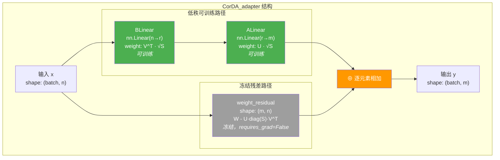
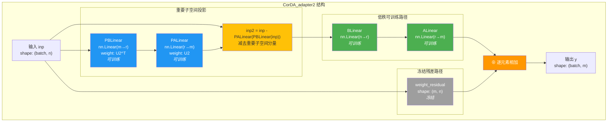
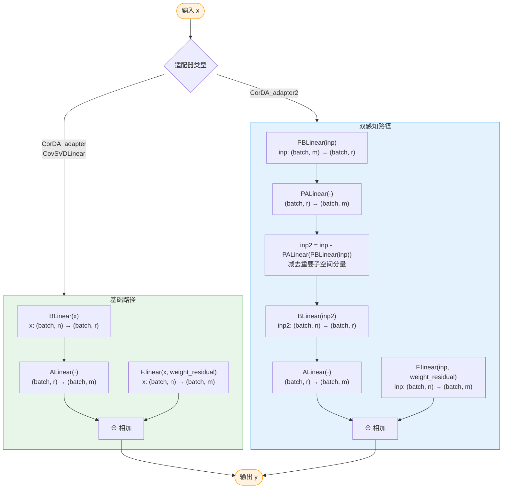
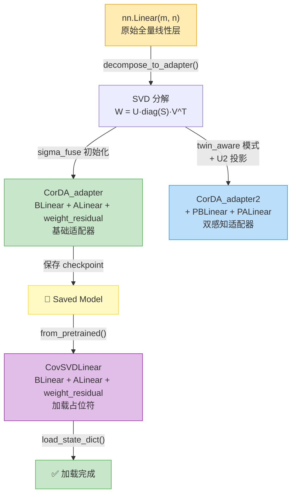

# CorDA 适配器架构设计与实现

## 总览：适配器架构的设计哲学

在 LoRA-Null 项目中，适配器（Adapter）架构是整个参数高效微调范式的核心载体。其设计灵感源于对预训练权重矩阵的奇异值分解（SVD），将一个稠密的线性变换拆解为**低秩可训练路径**与**冻结残差路径**的并行组合。这一架构使得模型在微调时仅需训练极少量参数，即可逼近甚至超越全量微调的效果。

项目中共有三个适配器类，它们共享相同的核心思想，但在具体结构和应用场景上各有侧重：

| 类名 | 所在文件 | 核心特征 | 典型场景 |
|------|---------|---------|---------|
| `CorDA_adapter` | `adapterlib/decomposition.py` | 基础版：BLinear + ALinear + weight_residual | 构建 adapter 时的默认选择 |
| `CorDA_adapter2` | `adapterlib/decomposition.py` | 扩展版：增加 PBLinear + PALinear 投影层 | twin_aware 模式，保护重要子空间 |
| `CovSVDLinear` | `mapping/modeling_oursvd_llama.py` | 精简版：结构同 CorDA_adapter，随机初始化 | 从 HuggingFace 加载模型时的占位符 |

下面，我们将逐一深入剖析每个类的结构与实现细节。

---

## 分述一：CorDA_adapter —— 基础适配器

### 1.1 类结构总览

`CorDA_adapter` 是最基础的适配器实现，它将原始的 `nn.Linear(m, n)` 层分解为三条路径的并行计算：

1. **BLinear**：`nn.Linear(n, r)` —— 将输入从原始维度 n 映射到低秩维度 r
2. **ALinear**：`nn.Linear(r, m)` —— 将低秩表示从 r 映射回输出维度 m
3. **weight_residual**：`nn.Parameter(m, n)` —— 冻结的残差权重，保留被 SVD 截断的信息



**图解说明**：绿色节点表示可训练参数，灰色节点表示冻结参数。输入 x 同时经过两条路径——低秩路径（BLinear → ALinear）和残差路径（weight_residual），最终相加得到输出。这保证了在初始化时，适配器的输出与原始线性层完全等价。

### 1.2 构造函数详解

```python
def __init__(self, adapter_U, adapter_S, adapter_V, weight_residual, bias=None, sigma_fuse='UV'):
```

**参数说明**：

| 参数 | 形状 | 含义 |
|------|------|------|
| `adapter_U` | `(m, r)` | SVD 左奇异矩阵的截取部分，m 为输出维度，r 为秩 |
| `adapter_S` | `(r,)` | SVD 奇异值的截取部分 |
| `adapter_V` | `(n, r)` | SVD 右奇异矩阵的截取部分，n 为输入维度 |
| `weight_residual` | `(m, n)` | 残差权重 = 原始权重 W - U·diag(S)·V^T |
| `bias` | `(m,)` 或 `None` | 原始线性层的偏置（若有） |
| `sigma_fuse` | 字符串 | 奇异值融合策略，可选 `'UV'`、`'U'`、`'V'` |

**构造流程**：

1. **创建 weight_residual**：初始化为全零 `(m, n)`，然后用传入的 `weight_residual` 覆盖，并设置 `requires_grad=False` 冻结
2. **创建 ALinear**：`nn.Linear(r, m)`，若存在偏置则将原始偏置赋给 ALinear
3. **创建 BLinear**：`nn.Linear(n, r)`，无偏置
4. **根据 sigma_fuse 策略分配权重**（详见下节）

### 1.3 Sigma 融合策略

奇异值 S 可以以不同方式融合到 U 和 V 中，这决定了 ALinear 和 BLinear 的初始化权重。三种策略的数学表达与代码对应如下：

#### 策略一：`sigma_fuse='UV'`（默认，均衡分配）

将 √S 均匀分配到 U 和 V 两侧：

$$A_{\text{weight}} = U \cdot \sqrt{S}, \quad B_{\text{weight}} = V^T \cdot \sqrt{S}$$

```python
self.ALinear.weight.data = U.mul(S.sqrt()).contiguous()       # (m, r) · √S 逐元素
self.BLinear.weight.data = V.t().mul(S.sqrt().view(-1, 1)).contiguous()  # (r, n) · √S 逐行
```

**设计动机**：均衡分配使得 ALinear 和 BLinear 的权重尺度相近，有利于训练稳定性。这是最常用的策略。

#### 策略二：`sigma_fuse='U'`（全部归入 A 侧）

将 S 全部融合到 U 中：

$$A_{\text{weight}} = U \cdot S, \quad B_{\text{weight}} = V^T$$

```python
self.ALinear.weight.data = U.mul(S).contiguous()              # (m, r) · S 逐元素
self.BLinear.weight.data = V.t().contiguous()                  # (r, n) 纯 V^T
```

**设计动机**：BLinear 仅保留正交投影 V^T，所有尺度信息集中在 ALinear。适用于希望 B 侧仅做正交变换的场景。

#### 策略三：`sigma_fuse='V'`（全部归入 B 侧）

将 S 全部融合到 V 中：

$$A_{\text{weight}} = U, \quad B_{\text{weight}} = V^T \cdot S$$

```python
self.ALinear.weight.data = U.contiguous()                      # (m, r) 纯 U
self.BLinear.weight.data = V.t().mul(S.view(-1, 1)).contiguous()  # (r, n) · S 逐行
```

**设计动机**：ALinear 仅保留正交投影 U，所有尺度信息集中在 BLinear。

> **关键不变量**：无论采用哪种融合策略，低秩路径的等效权重始终满足：
> $$A_{\text{weight}} \cdot B_{\text{weight}} = U \cdot \text{diag}(S) \cdot V^T$$
> 即三种策略在初始化时数学等价，差异仅在于梯度更新的动力学不同。

### 1.4 前向传播

```python
def forward(self, inp):
    y = self.BLinear(inp)
    y = self.ALinear(y) + F.linear(inp, self.weight_residual)
    return y
```

数学表达：

$$y = A_{\text{weight}} \cdot (B_{\text{weight}} \cdot x) + W_{\text{residual}} \cdot x + b$$

展开后：

$$y = \underbrace{U \cdot \text{diag}(S) \cdot V^T \cdot x}_{\text{低秩路径（可训练）}} + \underbrace{(W - U \cdot \text{diag}(S) \cdot V^T) \cdot x}_{\text{残差路径（冻结）}} + b = W \cdot x + b$$

**初始化等价性**：在训练开始时，适配器的输出与原始 `nn.Linear` 层完全一致，这确保了微调从预训练模型的精确状态出发，不会引入初始化偏差。

---

## 分述二：CorDA_adapter2 —— 双感知适配器

### 2.1 设计动机

在 twin_aware 模式下，模型同时拥有两组协方差矩阵（`covariance_matrix` 和 `covariance_matrix2`），分别对应两种不同任务或数据分布的激活统计。其中 `covariance_matrix2` 对应的子空间被认为是**"重要的"**——即在微调过程中不应被破坏的子空间。

`CorDA_adapter2` 在 `CorDA_adapter` 的基础上增加了**投影层对**（PBLinear + PALinear），其作用是在低秩路径处理之前，先将输入中属于"重要子空间"的成分投影出去，确保低秩路径只处理"非重要"成分，从而保护重要知识不被覆盖。

### 2.2 类结构总览



**图解说明**：蓝色节点为投影层（PBLinear/PALinear），绿色节点为低秩路径，灰色为冻结残差。黄色节点 `inp2` 是关键——通过减去重要子空间分量，确保低秩路径只处理"安全"的成分。

### 2.3 构造函数详解

```python
def __init__(self, adapter_U, adapter_S, adapter_V, adapter_U2, weight_residual, bias=None, sigma_fuse='UV'):
```

与 `CorDA_adapter` 相比，新增参数：

| 参数 | 形状 | 含义 |
|------|------|------|
| `adapter_U2` | `(m, r)` | 第二组协方差矩阵 SVD 得到的左奇异矩阵，对应"重要子空间" |

**新增层的初始化**：

```python
self.PBLinear = nn.Linear(adapter_U2.size(0), adapter_U2.size(1), bias=False)  # m → r
self.PALinear = nn.Linear(adapter_U2.size(1), adapter_U2.size(0), bias=False)  # r → m
self.PBLinear.weight.data = U2.t().contiguous()   # (r, m)
self.PALinear.weight.data = U2.contiguous()        # (m, r)
```

PBLinear 和 PALinear 构成一个**自编码器式**的投影对：
- `PBLinear`：将 m 维输入投影到 r 维子空间（提取重要分量）
- `PALinear`：将 r 维子空间重建回 m 维（恢复重要分量）

两者权重互为转置，因此 `PALinear(PBLinear(x))` 计算的是 x 在 U2 列空间上的正交投影：$U_2 U_2^T x$。

### 2.4 前向传播

```python
def forward(self, inp):
    inp2 = inp - self.PALinear(self.PBLinear(inp))
    y = self.BLinear(inp2)
    y = self.ALinear(y) + F.linear(inp, self.weight_residual)
    return y
```

数学表达：

$$\text{inp2} = x - U_2 U_2^T x = (I - U_2 U_2^T) x$$

$$y = A_{\text{weight}} \cdot (B_{\text{weight}} \cdot \text{inp2}) + W_{\text{residual}} \cdot x + b$$

**关键洞察**：

1. **低秩路径处理的是"去重要"后的输入** `inp2`，而非原始输入 `inp`。这意味着低秩路径的梯度更新不会直接影响重要子空间中的信息。
2. **残差路径仍然使用原始输入** `inp`，这确保了冻结的残差权重对完整输入的响应不变。
3. 投影操作 $(I - U_2 U_2^T)$ 是一个正交投影，它将输入投影到 U2 列空间的正交补空间中，不改变向量的范数性质。

### 2.5 与 decompose_to_adapter3 的关系

`CorDA_adapter2` 专为由 `decompose_to_adapter3()` 函数在 `twin_aware=True` 模式下创建。在该模式下：

1. 对 `covariance_matrix` 做 SVD 得到 U_, S_, V_，取最后 r 个特征向量得到 `U_min_K`
2. 对 `covariance_matrix2` 做 SVD 得到 U2_, S2_, V2_，取前 r 个特征向量得到 `U2`（重要子空间）
3. 计算投影矩阵 $P = I - U_2 U_2^T$
4. 计算 `temp = W @ (U_min_K @ U_min_K^T)`（在协方差最小子空间上的投影权重）
5. 残差 `weight_residual = W - temp @ P`（扣除投影到非重要子空间的部分）
6. 对 `temp` 做 SVD 得到 U, S, V
7. 用 U, S, V, U2 构造 `CorDA_adapter2`

---

## 分述三：CovSVDLinear —— 模型加载占位符

### 3.1 设计动机

当从 HuggingFace 加载已保存的 CorDA 微调模型时，原始的 `nn.Linear` 层已被替换为适配器结构。但 HuggingFace 的 `from_pretrained` 机制需要先创建模型骨架，再加载权重。`CovSVDLinear` 就是为此设计的**占位符类**——它具有与 `CorDA_adapter` 完全相同的计算结构，但权重以随机值初始化，实际权重在加载 checkpoint 时被覆盖。

### 3.2 类结构

```python
class CovSVDLinear(nn.Module):
    def __init__(self, in_features, out_features, rank, bias=True):
        super().__init__()
        self.BLinear = nn.Linear(in_features, rank, bias=False)      # n → r
        self.ALinear = nn.Linear(rank, out_features, bias=bias)      # r → m
        self.weight_residual = nn.Parameter(torch.zeros(out_features, in_features))  # (m, n)
        self.weight_residual.requires_grad = False

    def forward(self, input):
        y = self.BLinear(input)
        y = self.ALinear(y) + F.linear(input, self.weight_residual)
        return y
```

### 3.3 与 CorDA_adapter 的对比

| 特性 | CorDA_adapter | CovSVDLinear |
|------|--------------|--------------|
| **构造参数** | SVD 分解结果 (U, S, V) + weight_residual | 维度信息 (in_features, out_features, rank) |
| **权重初始化** | 由 SVD 结果精确初始化 | 随机初始化（weight_residual 为零） |
| **sigma_fuse 支持** | 支持 UV/U/V 三种策略 | 不支持（无需，权重从 checkpoint 加载） |
| **前向传播** | 完全相同 | 完全相同 |
| **使用场景** | build_adapter.py 中构建适配器 | modeling_oursvd_llama.py 中加载模型 |
| **所属模块** | adapterlib.decomposition | mapping.modeling_oursvd_llama |

### 3.4 在 CovSVDLlamaForCausalLM 中的使用

```python
class CovSVDLlamaForCausalLM(LlamaForCausalLM):
    config_class = CovSVDLlamaConfig
    def __init__(self, config):
        super().__init__(config)
        self.lora_r = config.lora_r
        # ... 遍历所有 nn.Linear 层 ...
        for name, module in self.named_modules():
            if "lm_head" not in name and isinstance(module, nn.Linear):
                info = linear_info[module]
                new_layer = CovSVDLinear(
                    module.in_features, module.out_features,
                    self.lora_r, bias=module.bias is not None
                )
                setattr(info["father"], info["name"], new_layer)
```

**关键细节**：
- `lm_head` 层不被替换（保持原始 `nn.Linear`）
- 替换时保留原始层的偏置设置（`bias=module.bias is not None`）
- `lora_r` 从配置类 `CovSVDLlamaConfig` 中读取

---

## 分述四：前向传播数据流详解

### 4.1 统一数据流图

下面的 Mermaid 图展示了三种适配器类的前向传播数据流，以及它们之间的差异：



**图解说明**：
- 绿色区域为基础路径（CorDA_adapter / CovSVDLinear），数据流简洁：x 同时进入 BLinear→ALinear 和 weight_residual 两条路径
- 蓝色区域为双感知路径（CorDA_adapter2），额外增加了 PBLinear→PALinear 投影步骤，先去除重要子空间分量再进入低秩路径

### 4.2 维度变换追踪

以一个注意力投影层（`n=m=4096, r=128`）为例，追踪数据在各层的维度变化：

**CorDA_adapter / CovSVDLinear**：

| 步骤 | 操作 | 输入维度 | 输出维度 |
|------|------|---------|---------|
| 1 | BLinear(x) | (batch, 4096) | (batch, 128) |
| 2 | ALinear(·) | (batch, 128) | (batch, 4096) |
| 3 | F.linear(x, W_res) | (batch, 4096) | (batch, 4096) |
| 4 | 相加 | (batch, 4096) | (batch, 4096) |

**CorDA_adapter2**（额外步骤）：

| 步骤 | 操作 | 输入维度 | 输出维度 |
|------|------|---------|---------|
| 0a | PBLinear(inp) | (batch, 4096) | (batch, 128) |
| 0b | PALinear(·) | (batch, 128) | (batch, 4096) |
| 0c | inp2 = inp - · | (batch, 4096) | (batch, 4096) |
| 1 | BLinear(inp2) | (batch, 4096) | (batch, 128) |
| 2-4 | 同上 | — | — |

---

## 分述五：参数量分析

### 5.1 理论推导

对于原始的 `nn.Linear(m, n)` 层和秩为 r 的适配器：

**原始层参数量**：

$$P_{\text{original}} = m \times n + \begin{cases} m & \text{若有偏置} \\ 0 & \text{若无偏置} \end{cases}$$

**CorDA_adapter 参数量**：

| 组件 | 形状 | 参数量 | 是否可训练 |
|------|------|--------|-----------|
| BLinear.weight | (r, n) | r × n | ✅ |
| ALinear.weight | (m, r) | m × r | ✅ |
| ALinear.bias | (m,) | m | ✅（若有） |
| weight_residual | (m, n) | m × n | ❌ 冻结 |

$$P_{\text{total}} = r \times n + m \times r + m \times n = r(m + n) + mn$$

$$P_{\text{trainable}} = r \times n + m \times r = r(m + n) \quad \text{（+ m 若有偏置）}$$

**CorDA_adapter2 额外参数**：

| 组件 | 形状 | 参数量 | 是否可训练 |
|------|------|--------|-----------|
| PBLinear.weight | (r, m) | r × m | ✅ |
| PALinear.weight | (m, r) | m × r | ✅ |

$$P_{\text{trainable}}^{\text{adapter2}} = r(m + n) + 2mr = r(m + n + 2m) = r(3m + n)$$

### 5.2 LLaMA-2-7B 实例计算

LLaMA-2-7B 的隐藏维度 `hidden_size=4096`，每个注意力层包含四个投影矩阵（q_proj, k_proj, v_proj, o_proj），均为 4096×4096。

**单个投影层（m=n=4096, r=128）**：

| 指标 | 原始 nn.Linear | CorDA_adapter | CorDA_adapter2 |
|------|---------------|--------------|----------------|
| 总参数 | 16,777,216 | 17,825,792 | 18,874,368 |
| 可训练参数 | 16,777,216 | **1,048,576** | **2,097,152** |
| 冻结参数 | 0 | 16,777,216 | 16,777,216 |
| 可训练占比 | 100% | **6.25%** | **11.11%** |

**计算过程**：
- 可训练参数（CorDA_adapter）：128 × (4096 + 4096) = 128 × 8192 = **1,048,576**
- 压缩比：1,048,576 / 16,777,216 ≈ **6.25%**

### 5.3 参数量对比图

```mermaid
graph LR
    subgraph 参数量对比 "单个 4096×4096 线性层, r=128"
        direction TB

        Orig["🔧 原始 nn.Linear<br/>可训练: 16,777,216<br/>冻结: 0<br/>总计: 16,777,216"]

        CA["✅ CorDA_adapter<br/>可训练: 1,048,576<br/>冻结: 16,777,216<br/>总计: 17,825,792"]

        CA2["🔵 CorDA_adapter2<br/>可训练: 2,097,152<br/>冻结: 16,777,216<br/>总计: 18,874,368"]
    end

    style Orig fill:#FFCDD2,stroke:#F44336,color:#333
    style CA fill:#C8E6C9,stroke:#4CAF50,color:#333
    style CA2 fill:#BBDEFB,stroke:#2196F3,color:#333
```

### 5.4 全模型参数量估算

LLaMA-2-7B 共有 32 个 Transformer 层，每层包含：
- 注意力：q_proj, k_proj, v_proj, o_proj（4 × 4096×4096）
- MLP：gate_proj, up_proj, down_proj（4096×11008, 4096×11008, 11008×4096）

以 CorDA_adapter（r=128）为例，仅计算可训练参数：

| 层类型 | 单层参数 | 层数 | 小计 |
|--------|---------|------|------|
| 注意力投影 (4096×4096) | 128×8192 = 1,048,576 | 4×32 = 128 | 134,217,728 |
| gate_proj (4096×11008) | 128×(4096+11008) = 1,934,848 | 32 | 61,915,136 |
| up_proj (4096×11008) | 1,934,848 | 32 | 61,915,136 |
| down_proj (11008×4096) | 128×(11008+4096) = 1,934,848 | 32 | 61,915,136 |
| **总计** | | | **≈ 319.96M** |

原始 LLaMA-2-7B 约 6.7B 参数，可训练参数占比约 **4.78%**。

---

## 总述：三类适配器的关系与设计统一性

### 6.1 演化关系图



**图解说明**：该图展示了从原始线性层到三种适配器的演化路径，以及从适配器到保存/加载的完整生命周期。

### 6.2 核心设计统一性

尽管三个类在构造方式和应用场景上有所不同，它们共享以下核心设计原则：

1. **双路径并行架构**：所有适配器都采用"低秩可训练路径 + 冻结残差路径"的并行结构。低秩路径捕获微调所需的变化，残差路径保留预训练知识。

2. **初始化等价性**：在训练开始时，适配器的输出与原始线性层完全一致（$y = Wx + b$），这保证了微调从预训练模型的精确状态出发。

3. **SVD 驱动的初始化**：`CorDA_adapter` 和 `CorDA_adapter2` 的权重由 SVD 分解结果精确初始化，而非随机初始化。这使得低秩路径从一开始就编码了最有（或最不）重要的权重成分。

4. **冻结残差的必要性**：`weight_residual` 保存了被 SVD 截断的权重信息。如果没有它，低秩路径只能近似原始权重（$U_r S_r V_r^T \approx W$），引入截断误差。冻结残差确保了精确等价。

5. **统一的前向接口**：三个类的前向传播签名一致（输入张量 → 输出张量），可以无缝替换 `nn.Linear` 而不改变模型的其他部分。

### 6.3 差异化设计要点

| 维度 | CorDA_adapter | CorDA_adapter2 | CovSVDLinear |
|------|--------------|----------------|--------------|
| **构造输入** | SVD 分解结果 | SVD + U2 投影矩阵 | 维度信息 |
| **初始化方式** | 精确（SVD 驱动） | 精确（SVD + 投影驱动） | 随机（后由 checkpoint 覆盖） |
| **子空间保护** | 无 | 有（PBLinear/PALinear） | 无 |
| **sigma_fuse** | 支持 | 支持 | 不需要 |
| **创建时机** | build_adapter 阶段 | build_adapter 阶段（twin_aware） | 模型加载阶段 |
| **额外参数开销** | 0 | +2mr | 0 |

### 6.4 设计启示

CorDA 适配器架构的精妙之处在于，它将 SVD 分解从**分析工具**提升为**构造工具**——不仅用 SVD 来理解权重矩阵的结构，更直接用分解结果来构建可训练的参数化形式。这种"分解即构造"的范式使得：

- **初始化即最优**：低秩路径在初始化时就编码了最关键的权重成分，无需从随机状态学习
- **残差即保险**：冻结残差确保了即使低秩路径在微调中偏离，原始权重信息也不会丢失
- **投影即保护**：CorDA_adapter2 的投影层进一步确保微调不会破坏已知的重要子空间

这三个层次的设计——初始化、残差、投影——共同构成了一个渐进式的知识保护体系，使得 CorDA 能够在极低参数量下实现高效的微调。
