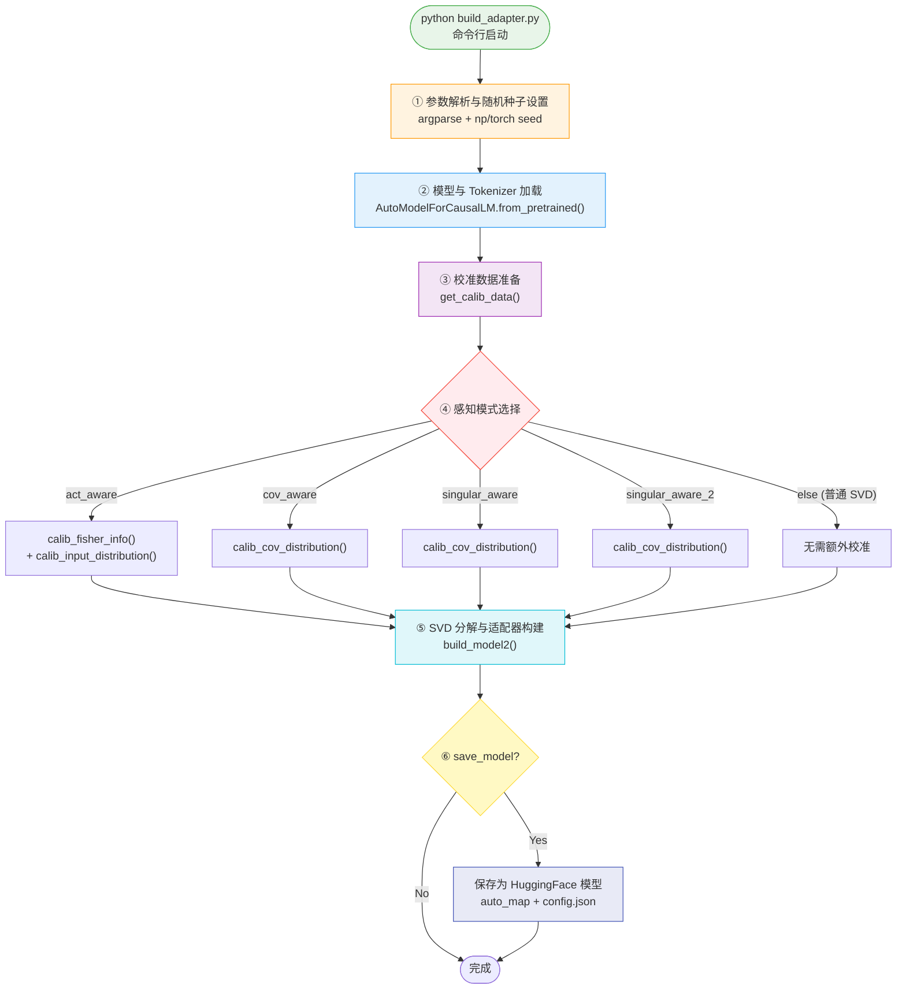
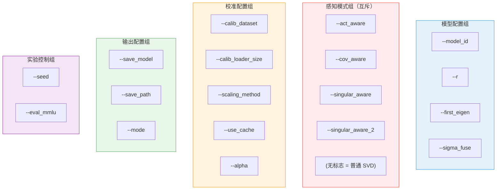
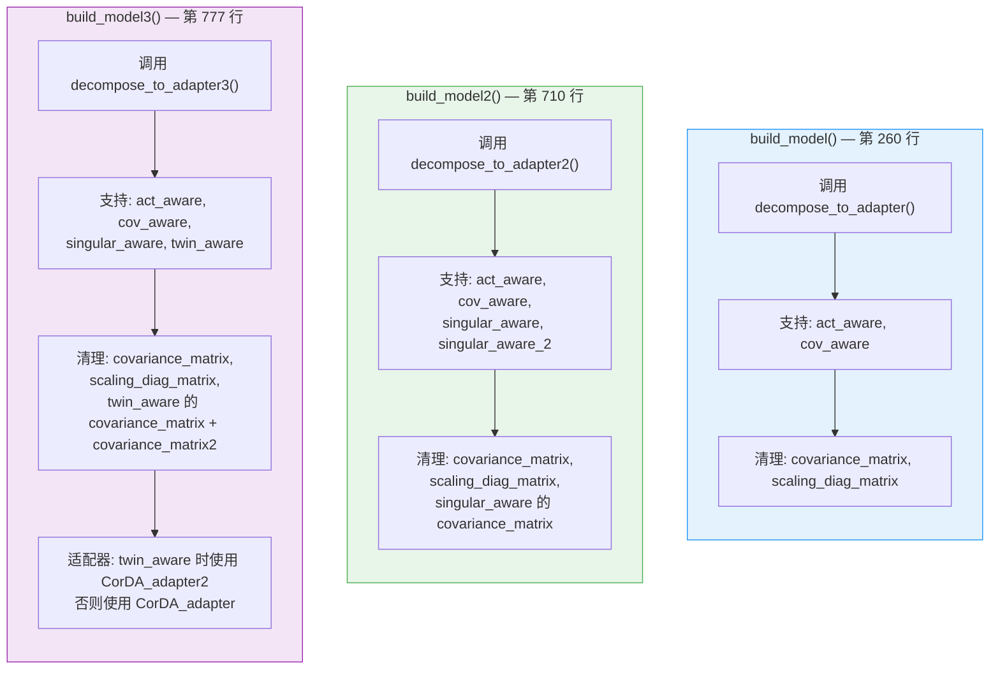
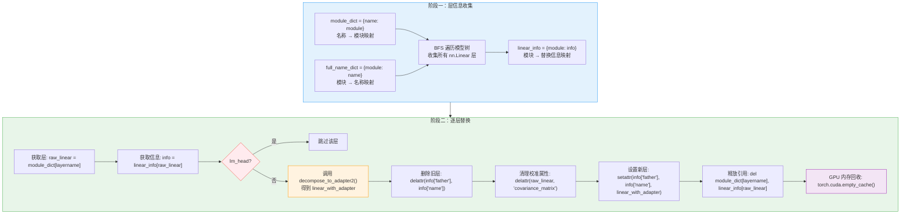
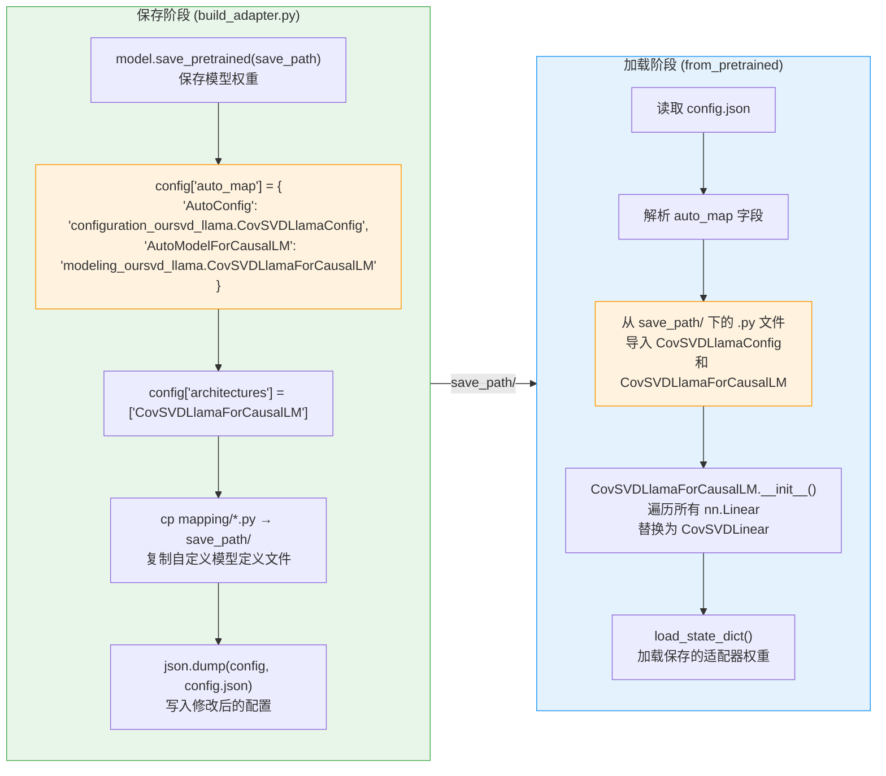

# 模型构建与适配器初始化流程

> 本文档以分-总-分的写作风格，深入剖析 LoRA-Null 项目中 `build_adapter.py` 的完整执行流程——从命令行参数解析、模型加载、校准数据准备、感知模式选择、SVD 分解到 HuggingFace 模型保存。我们将先从宏观流程入手，再逐层展开每个环节的实现细节，最终回归到整体设计哲学的统一理解。

---

## 总览：build_adapter.py 的全局视角

`build_adapter.py` 是 LoRA-Null 五步流水线中 **Step1** 的主入口脚本，负责将预训练的 LLaMA 模型转化为带有零空间适配器的分解模型。整个流程可以用一句话概括：**加载模型 → 收集校准统计量 → 按感知模式分解权重 → 替换线性层为适配器 → 保存为 HuggingFace 模型**。



**图 1：build_adapter.py 执行流程图**

**流程说明**：

1. **参数解析与随机种子**：确保实验可复现性
2. **模型加载**：以 float16 精度加载预训练模型，使用 `device_map="auto"` 自动分配设备
3. **校准数据准备**：根据指定的数据集和样本数加载校准数据
4. **感知模式选择**：根据命令行参数决定收集何种统计量（Fisher 信息、激活分布、协方差矩阵等）
5. **SVD 分解与适配器构建**：遍历模型所有线性层，执行分解并替换为适配器模块
6. **保存模型**：将分解后的模型保存为 HuggingFace 格式，配置 `auto_map` 实现自定义模型类的自动加载

下面，我们将逐一深入每个环节。

---

## 分述一：参数解析与随机种子设置

### 1.1 命令行参数完整参考

`build_adapter.py` 使用 Python 标准库 `argparse` 解析命令行参数。以下是所有参数的完整参考：

| 参数 | 类型 | 默认值 | 说明 |
|------|------|--------|------|
| `--model_id` | `str` | `"meta-llama/Llama-2-7b-hf"` | 预训练模型 ID 或本地路径 |
| `--act_aware` | `store_true` | `False` | 启用激活感知 SVD（ASVD 模式） |
| `--cov_aware` | `store_true` | `False` | 启用协方差感知 SVD（CovSVD 模式） |
| `--singular_aware` | `store_true` | `False` | 启用奇异感知模式（LoRA-Null 核心模式） |
| `--singular_aware_2` | `store_true` | `False` | 启用奇异感知模式 v2 |
| `--alpha` | `float` | `0.5` | ASVD 的超参数，控制缩放矩阵的指数 |
| `--calib_loader_size` | `int` | `256` | 校准样本数量 |
| `--calib_dataset` | `str` | `"wikitext2"` | 校准数据集，可选：wikitext2/c4/ptb/nqopen/alpaca/MetaMATH/codefeedback/WizLMinstruct |
| `--scaling_method` | `str` | `"abs_mean"` | 缩放方法，可选：abs_mean/abs_max/fisher/fisher_abs_mean |
| `--use_cache` | `store_true` | `False` | 使用缓存的校准结果 |
| `--r` | `int` | `None` | 低秩值（适配器秩），None 表示不截断 |
| `--first_eigen` | `store_true` | `False` | 使用前 r 个特征向量（PiSSA 模式），默认使用末尾 r 个（LoRA-Null 模式） |
| `--save_model` | `store_true` | `False` | 是否保存分解后的模型 |
| `--save_path` | `str` | `None` | 模型保存路径 |
| `--mode` | `str` | `"build_adapters"` | 运行模式，可选：full_decompose / build_adapters |
| `--sigma_fuse` | `str` | `"UV"` | 奇异值融合方式，可选：U/V/UV |
| `--seed` | `int` | `233` | 随机种子 |
| `--eval_mmlu` | `store_true` | `False` | 是否评估 MMLU |

**参数分组逻辑**：



### 1.2 随机种子设置

在 `main()` 函数开头，通过四行代码设置全局随机种子，确保实验可复现：

```python
# build_adapter.py, line 12-15
np.random.seed(args.seed)                          # NumPy 随机种子
torch.manual_seed(args.seed)                       # PyTorch CPU 随机种子
torch.cuda.manual_seed_all(args.seed)              # PyTorch 所有 GPU 随机种子
torch.backends.cudnn.deterministic = True           # cuDNN 确定性模式
```

**设计考量**：

- `np.random.seed`：影响校准数据的随机采样（`datautils.py` 中的 `random.randint`）
- `torch.manual_seed`：影响 PyTorch 的随机数生成（如权重初始化）
- `torch.cuda.manual_seed_all`：确保多 GPU 环境下的一致性
- `cudnn.deterministic = True`：牺牲少量性能换取卷积操作的确定性

默认种子 `233` 是一个硬编码值，可通过 `--seed` 参数覆盖。

### 1.3 典型启动命令

**LoRA-Null 标准模式**（singular_aware，推荐）：

```bash
python build_adapter.py \
    --model_id "meta-llama/Llama-2-7b-hf" \
    --singular_aware \
    --use_cache \
    --r 128 \
    --calib_dataset "nqopen" \
    --calib_loader_size 256 \
    --save_model \
    --save_path save_LoRA_Null_adapter_llama2_PT_128
```

**PiSSA 对比模式**（first_eigen）：

```bash
python build_adapter.py \
    --model_id "meta-llama/Llama-2-7b-hf" \
    --singular_aware \
    --first_eigen \
    --r 128 \
    --save_model \
    --save_path save_PiSSA_adapter_llama2_PT_128
```

**ASVD 模式**（act_aware）：

```bash
python build_adapter.py \
    --model_id "meta-llama/Llama-2-7b-hf" \
    --act_aware \
    --scaling_method fisher_abs_mean \
    --alpha 0.5 \
    --r 128 \
    --save_model \
    --save_path save_ASVD_adapter_llama2_PT_128
```

---

## 分述二：模型与 Tokenizer 加载

### 2.1 加载流程

```python
# build_adapter.py, line 18-23
model_id = args.model_id
tokenizer = AutoTokenizer.from_pretrained(model_id, trust_remote_code=True)

model = AutoModelForCausalLM.from_pretrained(
    model_id, device_map="auto", torch_dtype=torch.float16, trust_remote_code=True
)
```

**关键参数解析**：

| 参数 | 值 | 说明 |
|------|-----|------|
| `model_id` | 命令行指定 | HuggingFace 模型 ID 或本地路径 |
| `device_map` | `"auto"` | 自动将模型层分配到可用设备（GPU/CPU），支持大模型的多卡分布 |
| `torch_dtype` | `torch.float16` | 半精度加载，减少显存占用（7B 模型约需 14GB 显存） |
| `trust_remote_code` | `True` | 允许执行模型仓库中的自定义代码 |

### 2.2 加载后的模型结构

以 LLaMA-2-7B 为例，加载后的模型包含以下线性层（`nn.Linear`）：

| 层名 | 形状 | 出现次数 |
|------|------|---------|
| `model.layers.*.self_attn.q_proj` | (4096, 4096) | 32 |
| `model.layers.*.self_attn.k_proj` | (4096, 4096) | 32 |
| `model.layers.*.self_attn.v_proj` | (4096, 4096) | 32 |
| `model.layers.*.self_attn.o_proj` | (4096, 4096) | 32 |
| `model.layers.*.mlp.gate_proj` | (11008, 4096) | 32 |
| `model.layers.*.mlp.up_proj` | (11008, 4096) | 32 |
| `model.layers.*.mlp.down_proj` | (4096, 11008) | 32 |
| `lm_head` | (32000, 4096) | 1 |

**总计**：32 × 7 + 1 = **225** 个线性层，其中 `lm_head` 在后续分解时会被跳过。

---

## 分述三：校准数据准备

### 3.1 get_calib_data 函数

```python
# build_adapter.py, line 26
calib_loader = get_calib_data(
    args.calib_dataset, tokenizer, model_id,
    args.calib_loader_size, seed=args.seed
)
```

`get_calib_data()` 函数（`adapterlib/datautils.py` 第 110–240 行）根据指定的数据集名称加载校准数据，返回一个列表，每个元素是一个字典 `{"input_ids": tensor, "attention_mask": tensor}`。

### 3.2 支持的校准数据集

| 数据集 | 数据格式 | 采样方式 | 推荐场景 |
|--------|---------|---------|---------|
| `wikitext2` | 纯文本 | 随机截取 2048 token 片段 | 通用协方差收集 |
| `c4` | 纯文本 | 随机截取 2048 token 片段 | 通用协方差收集 |
| `ptb` | 纯文本 | 随机截取 2048 token 片段 | 通用协方差收集 |
| `nqopen` | 问答 | 随机截取 2048 token 片段 | **LoRA-Null 推荐使用** |
| `alpaca` | 指令-回复 | LLaMA Chat 模板包装 | 指令微调场景 |
| `MetaMATH` | 数学问答 | LLaMA Chat 模板包装 | 数学微调场景 |
| `codefeedback` | 代码问答 | LLaMA Chat 模板包装 | 代码微调场景 |
| `WizLMinstruct` | 指令 | LLaMA Chat 模板包装 | 指令微调场景 |

### 3.3 缓存机制

校准数据支持本地缓存，避免重复加载和预处理：

```python
# datautils.py, line 112-122
cache_file = f"cache/{name}_{model_id.replace('/','_')}_{nsamples}_{seqlen}_{seed}.pt"
if os.path.exists(cache_file):
    print(f"found data file: {cache_file}")
    traindataset = torch.load(cache_file)
    return traindataset
```

缓存文件名编码了数据集名称、模型 ID、样本数、序列长度和随机种子，确保不同配置的缓存互不冲突。

### 3.4 指令类数据的 Chat 模板

对于 `alpaca`、`MetaMATH`、`codefeedback`、`WizLMinstruct` 等指令类数据集，使用 LLaMA Chat 格式模板包装：

```python
# datautils.py, line 89-94
llama_chat_format = """<s>[INST] <<SYS>>
"Below is an instruction that describes a task. Write a response that appropriately completes the request."
<</SYS>>

{instruction} [/INST] {response} </s>
"""
```

这种包装确保校准数据的分布与实际微调时的输入分布一致，从而收集到更有针对性的统计量。

---

## 分述四：感知模式选择与校准统计量收集

### 4.1 模式分支逻辑

`build_adapter.py` 的第 29–56 行实现了感知模式的分支选择，这是整个流程中最关键的决策点：

```python
# build_adapter.py, line 29-56
if args.act_aware:
    print('Collect activation-aware data for ASVD ...')
    if "fisher" in args.scaling_method:
        calib_fisher_info(model, calib_loader, args.use_cache)
    if "abs" in args.scaling_method:
        calib_input_distribution(model, calib_loader, args.scaling_method, args.use_cache)
elif args.cov_aware:
    print('Collecting covariance data for CovSVD ...')
    calib_cov_distribution(model, calib_loader, args.use_cache,
                           args.calib_dataset, args.calib_loader_size, seed=args.seed)
elif args.singular_aware:
    print('Collecting covariance data for Singular_aware ...')
    calib_cov_distribution(model, calib_loader, args.use_cache,
                           args.calib_dataset, args.calib_loader_size, seed=args.seed)
elif args.singular_aware_2:
    print('Collecting covariance data for Singular_aware ...')
    calib_cov_distribution(model, calib_loader, args.use_cache,
                           args.calib_dataset, args.calib_loader_size, seed=args.seed)
else:
    print('Use the normal SVD ...')
```

### 4.2 各模式对应的校准函数

| 模式 | 校准函数 | 收集的统计量 | 存储位置 |
|------|---------|------------|---------|
| `act_aware` | `calib_fisher_info()` + `calib_input_distribution()` | Fisher 信息 + 缩放对角矩阵 | `module.fisher_info` + `module.scaling_diag_matrix` |
| `cov_aware` | `calib_cov_distribution()` | 协方差矩阵 | `module.covariance_matrix` |
| `singular_aware` | `calib_cov_distribution()` | 协方差矩阵 | `module.covariance_matrix` |
| `singular_aware_2` | `calib_cov_distribution()` | 协方差矩阵 | `module.covariance_matrix` |
| 无标志 | 无 | 无 | — |

**注意**：`cov_aware`、`singular_aware`、`singular_aware_2` 三种模式在校准阶段调用的是同一个函数 `calib_cov_distribution()`，收集的都是协方差矩阵。它们的区别体现在后续的 SVD 分解阶段（`decompose_to_adapter2()` 函数中）。

### 4.3 act_aware 模式的复合校准

`act_aware` 模式支持两种缩放方法的组合使用，由 `--scaling_method` 参数控制：

| `scaling_method` 值 | 调用的校准函数 | 收集的统计量 |
|---------------------|--------------|------------|
| `abs_mean` | `calib_input_distribution()` | 输入激活绝对值均值 |
| `abs_max` | `calib_input_distribution()` | 输入激活绝对值最大值 |
| `fisher` | `calib_fisher_info()` | Fisher 信息矩阵对角近似 |
| `fisher_abs_mean` | 两者都调用 | Fisher 信息 × 绝对值均值 |

代码中的判断逻辑：

```python
if "fisher" in args.scaling_method:    # 匹配 "fisher" 和 "fisher_abs_mean"
    calib_fisher_info(model, calib_loader, args.use_cache)
if "abs" in args.scaling_method:       # 匹配 "abs_mean" 和 "fisher_abs_mean"
    calib_input_distribution(model, calib_loader, args.scaling_method, args.use_cache)
```

这种基于子串匹配的设计使得 `fisher_abs_mean` 可以同时触发两种校准，实现复合缩放。

### 4.4 calib_cov_distribution 的 Hook 机制

`calib_cov_distribution()` 函数（`act_aware_utils.py` 第 101–166 行）通过 PyTorch 的 `register_forward_hook` 机制收集协方差矩阵：

```python
# act_aware_utils.py, line 119-141
def hook(module, input, output):
    input = input[0].detach().squeeze(0).data    # (2048, dim)
    input = input / torch.max(input).abs()        # 归一化
    covariance = input.t().matmul(input)           # x^T · x → (dim, dim)
    module.covariance_matrix += covariance / 256   # 累加并除以 256
    del covariance, input
```

**关键细节**：

1. **输入归一化**：`input / torch.max(input).abs()` 将每个样本的输入归一化到 [-1, 1] 范围，防止数值溢出
2. **协方差计算**：`input.t().matmul(input)` 计算外积矩阵 $x^T x$，维度为 $(dim, dim)$
3. **累加除以 256**：每个样本的协方差除以 256 后累加到 `module.covariance_matrix`
4. **NaN/Inf 检查**：每步都检查输入和协方差是否包含 NaN 或 Inf，确保数值稳定性

校准完成后，所有 hook 被清除：

```python
# act_aware_utils.py, line 156
module._forward_hooks.clear()
```

### 4.5 校准统计量的缓存

`calib_cov_distribution()` 支持缓存机制，缓存文件名编码了所有影响结果的参数：

```python
# act_aware_utils.py, line 103-105
cache_file = (
    f"cache/{model_id.replace('/','_')}_covariance_matrices_from_{calib_dataset}"
    f"_size_{calib_size}_seed_{seed}.pt"
)
```

**注意**：在当前代码中，协方差矩阵的缓存保存被注释掉了（`act_aware_utils.py` 第 165 行 `#torch.save(all_covariance_matrix, cache_file)`），因为协方差矩阵文件可能非常大。但缓存读取逻辑仍然保留，意味着如果手动提供缓存文件，仍可使用。

---

## 分述五：SVD 分解与适配器构建

### 5.1 first_eigen 模式提示

在进入分解之前，代码打印了特征向量选择策略的提示：

```python
# build_adapter.py, line 59-62
if args.first_eigen:
    print("\n --- use the first r eigen vecs as adapters --- \n")
else:
    print("\n --- use the last r eigen vecs as adapters --- \n")
```

这对应两种核心策略：
- **末尾 r 个特征向量**（默认，LoRA-Null）：零空间方向，保护预训练知识
- **前 r 个特征向量**（`first_eigen=True`，PiSSA）：主成分方向，快速收敛但可能损害知识

### 5.2 build_model2 函数调用

```python
# build_adapter.py, line 63
build_model2(model, args)
```

当前 `build_adapter.py` 调用的是 `build_model2()`，这是三个 `build_model` 版本中最常用的一个。三个版本的区别将在后文详细对比。

---

## 分述六：三个 build_model 版本对比

### 6.1 版本概览

| 版本 | 所在行号 | 调用的分解函数 | 支持的感知模式 | 使用的适配器类 |
|------|---------|--------------|--------------|--------------|
| `build_model()` | 第 260 行 | `decompose_to_adapter()` | act_aware, cov_aware | `CorDA_adapter` |
| `build_model2()` | 第 710 行 | `decompose_to_adapter2()` | act_aware, cov_aware, singular_aware, singular_aware_2 | `CorDA_adapter` |
| `build_model3()` | 第 777 行 | `decompose_to_adapter3()` | act_aware, cov_aware, singular_aware, twin_aware | `CorDA_adapter` / `CorDA_adapter2` |

### 6.2 共同的执行模式

三个版本共享完全相同的执行骨架：

```python
# 1. 构建模块字典和线性层信息
module_dict = {name: module for name, module in model.named_modules()}
full_name_dict = {module: name for name, module in model.named_modules()}
linear_info = {}

# 2. 遍历模型树，收集所有 Linear 层的父子关系
modules = [model]
while len(modules) > 0:
    submodule = modules.pop()
    for name, raw_linear in submodule.named_children():
        if isinstance(raw_linear, nn.Linear):
            full_name = full_name_dict[raw_linear]
            linear_info[raw_linear] = {
                "father": submodule,
                "name": name,
                "full_name": full_name,
            }
        else:
            modules.append(raw_linear)

# 3. 收集所有 Linear 层的名称
my_layers_keys = [name for name, module in model.named_modules()
                  if isinstance(module, nn.Linear)]

# 4. 逐层处理
for layername in tqdm(my_layers_keys):
    raw_linear = module_dict[layername]
    info = linear_info[raw_linear]
    with torch.no_grad():
        if args.mode == "full_decompose":
            full_decompose(raw_linear, ...)
        if args.mode == "build_adapters":
            if "lm_head" in layername:
                continue  # 跳过 lm_head
            linear_with_adapter = decompose_fn(raw_linear, ...)
            # 替换层
            delattr(info["father"], info["name"])
            # 清理校准属性
            if args.cov_aware: delattr(raw_linear, "covariance_matrix")
            if args.act_aware: delattr(raw_linear, "scaling_diag_matrix")
            setattr(info["father"], info["name"], linear_with_adapter)
            # 内存清理
            del module_dict[layername], linear_info[raw_linear]
            del raw_linear, info
            torch.cuda.empty_cache()
```

### 6.3 版本差异对比图



**图 2：三个 build_model 版本对比图**

### 6.4 关键差异详解

#### 差异一：支持的感知模式

| 感知模式 | build_model | build_model2 | build_model3 |
|---------|-------------|--------------|--------------|
| `act_aware` | ✅ | ✅ | ✅ |
| `cov_aware` | ✅ | ✅ | ✅ |
| `singular_aware` | ❌ | ✅ | ✅ |
| `singular_aware_2` | ❌ | ✅ | ❌ |
| `twin_aware` | ❌ | ❌ | ✅ |

#### 差异二：属性清理

每个版本在替换层后，需要清理之前在校准阶段附加到模块上的临时属性：

**build_model**（第 313–314 行）：
```python
if args.cov_aware: delattr(raw_linear, "covariance_matrix")
if args.act_aware: delattr(raw_linear, "scaling_diag_matrix")
```

**build_model2**（第 766–768 行）：
```python
if args.cov_aware: delattr(raw_linear, "covariance_matrix")
if args.act_aware: delattr(raw_linear, "scaling_diag_matrix")
if args.singular_aware: delattr(raw_linear, "covariance_matrix")
```

**build_model3**（第 832–837 行）：
```python
if args.cov_aware: delattr(raw_linear, "covariance_matrix")
if args.act_aware: delattr(raw_linear, "scaling_diag_matrix")
if args.singular_aware: delattr(raw_linear, "covariance_matrix")
if args.twin_aware:
    delattr(raw_linear, "covariance_matrix")
    delattr(raw_linear, "covariance_matrix2")
```

**注意**：`build_model2` 中缺少对 `singular_aware_2` 模式下 `covariance_matrix` 的清理（可能是一个遗漏），而 `build_model3` 中 `twin_aware` 会清理两个协方差矩阵。

#### 差异三：适配器类选择

`build_model3` 是唯一会根据模式选择不同适配器类的版本：

```python
# decomposition.py, line 693-696
if twin_aware:
    linear_with_adapter = CorDA_adapter2(U, S, V, U2, weight_residual, bias, sigma_fuse)
else:
    linear_with_adapter = CorDA_adapter(U, S, V, weight_residual, bias, sigma_fuse)
```

`CorDA_adapter2` 额外包含 `PBLinear` 和 `PALinear` 投影层，用于在 twin_aware 模式下保护重要子空间。

---

## 分述七：模型层遍历与替换机制

### 7.1 层信息收集

三个 `build_model` 版本都使用相同的模式收集模型中所有 `nn.Linear` 层的信息：

```python
# decomposition.py, line 711-726 (build_model2 为例)
module_dict = {name: module for name, module in model.named_modules()}
full_name_dict = {module: name for name, module in model.named_modules()}
linear_info = {}
modules = [model]
while len(modules) > 0:
    submodule = modules.pop()
    for name, raw_linear in submodule.named_children():
        if isinstance(raw_linear, nn.Linear):
            full_name = full_name_dict[raw_linear]
            linear_info[raw_linear] = {
                "father": submodule,   # 父模块
                "name": name,          # 属性名
                "full_name": full_name, # 完整路径名
            }
        else:
            modules.append(raw_linear)
```

**两个关键字典**：

| 字典 | 键 | 值 | 用途 |
|------|-----|-----|------|
| `module_dict` | 层名称（str） | 模块对象（nn.Module） | 通过名称查找模块 |
| `full_name_dict` | 模块对象（nn.Module） | 层名称（str） | 通过模块对象查找名称 |
| `linear_info` | 模块对象（nn.Linear） | {father, name, full_name} | 记录每个 Linear 层的替换信息 |

### 7.2 层替换流程图



**图 3：模型层遍历与替换流程图**

### 7.3 替换操作详解

层替换的核心是 Python 的 `delattr` + `setattr` 操作组合：

**步骤一：删除旧层**

```python
delattr(info["father"], info["name"])
```

等价于：

```python
del model.model.layers[0].self_attn.q_proj  # 以 q_proj 为例
```

这会将父模块上的 `q_proj` 属性删除，解除对该 `nn.Linear` 对象的引用。

**步骤二：设置新层**

```python
setattr(info["father"], info["name"], linear_with_adapter)
```

等价于：

```python
model.model.layers[0].self_attn.q_proj = linear_with_adapter
```

这会将新创建的 `CorDA_adapter` 对象设置到父模块的对应属性上。

**步骤三：清理引用**

```python
del module_dict[layername], linear_info[raw_linear]
del raw_linear, info
torch.cuda.empty_cache()
```

- 删除 `module_dict` 和 `linear_info` 中的条目，避免重复处理
- 删除局部变量 `raw_linear` 和 `info`，释放引用
- 调用 `torch.cuda.empty_cache()` 回收 GPU 内存

### 7.4 lm_head 跳过机制

```python
if "lm_head" in layername:
    continue
```

`lm_head` 是语言模型的输出头，将隐藏状态映射到词表空间（形状为 `(vocab_size, hidden_size)`）。跳过它的原因：

1. **维度特殊**：`lm_head` 的输出维度是词表大小（如 32000），远大于隐藏维度（4096），对其进行低秩分解的收益不大
2. **语义重要性**：`lm_head` 直接决定模型的词表概率分布，修改它可能严重影响生成质量
3. **实践验证**：在 LoRA 微调中，`lm_head` 通常不被修改

### 7.5 内存管理策略

分解过程是内存密集型的，因为需要同时保存原始权重、SVD 分解结果和适配器权重。代码采用了以下内存管理策略：

1. **逐层处理**：一次只处理一个线性层，处理完立即释放
2. **显式删除**：`del pretrained_w, U, S, V, weight_residual, linear`（在 `decompose_to_adapter2` 第 543 行）
3. **GPU 缓存回收**：每处理完一层就调用 `torch.cuda.empty_cache()`
4. **torch.no_grad()**：整个分解过程在 `torch.no_grad()` 上下文中执行，避免构建计算图

---

## 分述八：decompose_to_adapter2 的 singular_aware 分解逻辑

### 8.1 singular_aware 模式（LoRA-Null 核心）

这是 LoRA-Null 方法的核心分解逻辑（`decomposition.py` 第 435–451 行）：

```python
if singular_aware:
    covariance_matrix = linear.covariance_matrix.float()
    U_, S_, V_ = torch.linalg.svd(covariance_matrix)
    print((S_ > 0.1).sum())
    if first_eigen:
        U_min_K = U_[:, :r]           # 前 r 个（主成分方向）
    else:
        U_min_K = U_[:, -r:]          # 后 r 个（零空间方向）
        temp = pretrained_w @ (U_min_K @ U_min_K.t())   # 投影到零空间
        weight_residual = pretrained_w - temp             # 残差 = 原始 - 零空间投影
        U, S, V = torch.svd(temp)                         # 对零空间投影做 SVD
        U, S, V = U[:, :r], S[:r], V[:, :r]              # 取前 r 分量
```

**数学表达**：

1. 对协方差矩阵 $\Sigma$ 做 SVD：$\Sigma = U_\Sigma S_\Sigma V_\Sigma^T$
2. 取零空间方向：$U_{\min K} = U_\Sigma[:, -r:]$
3. 零空间投影：$\text{temp} = W \cdot (U_{\min K} \cdot U_{\min K}^T)$
4. 残差权重：$W_{\text{res}} = W - \text{temp}$
5. 对投影权重做 SVD：$\text{temp} = U \cdot S \cdot V^T$，取前 $r$ 分量

**关键洞察**：这里对 `temp` 做 SVD 后取的是**前 r 个分量**（`U[:, :r]`），而不是末尾 r 个。这是因为 `temp` 本身已经是零空间投影后的结果，其"前 r 个分量"就是零空间中最重要的方向——与直接对原始权重做 SVD 取末尾 r 个分量是不同的操作路径，但目标一致：找到零空间方向。

### 8.2 singular_aware_2 模式

`singular_aware_2` 模式（`decomposition.py` 第 470–491 行）与 `singular_aware` 的区别在于残差计算和适配器初始化：

```python
if singular_aware_2:
    covariance_matrix = linear.covariance_matrix.float()
    U_, S_, V_ = torch.linalg.svd(covariance_matrix)
    if first_eigen:
        U_min_K = U_[:, :r]
    else:
        U_min_K = U_[:, -r:]
    temp = pretrained_w @ (U_min_K @ U_min_K.t())
    weight_residual = pretrained_w          # 残差 = 完整原始权重！
    U, S, V = torch.svd(temp)
    U, S, V = U[:, :r], S[:r], V[:, :r]
    V = U_min_K                            # V 直接使用零空间方向
    U.zero_()                              # U 清零
    S.fill_(1.)                            # S 设为 1
```

**与 singular_aware 的关键区别**：

| 方面 | singular_aware | singular_aware_2 |
|------|---------------|------------------|
| 残差权重 | `pretrained_w - temp`（扣除零空间投影） | `pretrained_w`（保留完整权重） |
| V 的来源 | `torch.svd(temp)` 的右奇异向量 | 直接使用 `U_min_K`（零空间方向） |
| U 的初始化 | `torch.svd(temp)` 的左奇异向量 | 全零 |
| S 的初始化 | `torch.svd(temp)` 的奇异值 | 全 1 |

**设计动机**：`singular_aware_2` 模式将 BLinear 的权重直接固定为零空间方向 $U_{\min K}$，ALinear 初始化为零，训练时只更新 ALinear。这使得 BLinear 成为固定的正交投影，ALinear 从零开始学习，类似于标准 LoRA 中 B=0 的初始化策略，但 B 的方向由零空间决定而非随机。

---

## 分述九：HuggingFace auto_map 配置机制

### 9.1 保存流程

当 `--save_model` 标志被设置时，`build_adapter.py` 执行以下保存操作（第 66–89 行）：

```python
if args.save_model:
    assert args.save_path is not None
    save_path = args.save_path

    # 1. 保存 Tokenizer 和模型
    tokenizer.save_pretrained(save_path)
    model.save_pretrained(save_path)

    # 2. 修改配置
    config = model.config.to_dict()
    config["lora_r"] = args.r
    config["auto_map"] = {
        "AutoConfig": "configuration_oursvd_llama.CovSVDLlamaConfig",
        "AutoModelForCausalLM": "modeling_oursvd_llama.CovSVDLlamaForCausalLM",
    }
    config["architectures"] = ["CovSVDLlamaForCausalLM"]

    # 3. 复制映射文件
    os.system(
        "cp ./mapping/configuration_oursvd_llama.py ./mapping/modeling_oursvd_llama.py ./"
        + save_path
    )

    # 4. 写入配置
    import json
    json.dump(config, open(save_path + "/config.json", "w"), indent=2)
```

### 9.2 auto_map 机制详解

HuggingFace 的 `auto_map` 是一种自定义模型注册机制，允许在不修改 Transformers 库源码的情况下，指定自定义的 Config 类和 Model 类：



**图 4：HuggingFace auto_map 注册机制图**

### 9.3 config.json 结构

保存后的 `config.json` 包含以下关键字段：

```json
{
  "architectures": ["CovSVDLlamaForCausalLM"],
  "model_type": "llama",
  "lora_r": 128,
  "auto_map": {
    "AutoConfig": "configuration_oursvd_llama.CovSVDLlamaConfig",
    "AutoModelForCausalLM": "modeling_oursvd_llama.CovSVDLlamaForCausalLM"
  },
  "hidden_size": 4096,
  "intermediate_size": 11096,
  "num_hidden_layers": 32,
  ...
}
```

**字段说明**：

| 字段 | 值 | 作用 |
|------|-----|------|
| `architectures` | `["CovSVDLlamaForCausalLM"]` | 指定模型类名，HuggingFace 据此选择模型类 |
| `auto_map.AutoConfig` | `"configuration_oursvd_llama.CovSVDLlamaConfig"` | 指定自定义 Config 类的导入路径 |
| `auto_map.AutoModelForCausalLM` | `"modeling_oursvd_llama.CovSVDLlamaForCausalLM"` | 指定自定义 Model 类的导入路径 |
| `lora_r` | `128` | 适配器秩，CovSVDLlamaForCausalLM 初始化时读取 |

### 9.4 CovSVDLlamaForCausalLM 的加载逻辑

当使用 `AutoModelForCausalLM.from_pretrained(save_path)` 加载模型时，HuggingFace 的自动类会：

1. 读取 `config.json` 中的 `auto_map` 字段
2. 从 `save_path/modeling_oursvd_llama.py` 导入 `CovSVDLlamaForCausalLM`
3. 调用 `CovSVDLlamaForCausalLM(config)` 创建模型骨架
4. 用 `load_state_dict()` 加载保存的权重

`CovSVDLlamaForCausalLM` 的 `__init__` 方法（`mapping/modeling_oursvd_llama.py` 第 22–49 行）在创建骨架时，会将所有 `nn.Linear`（除 `lm_head`）替换为 `CovSVDLinear`：

```python
class CovSVDLlamaForCausalLM(LlamaForCausalLM):
    config_class = CovSVDLlamaConfig
    def __init__(self, config: CovSVDLlamaConfig):
        super().__init__(config)
        self.lora_r = config.lora_r

        # 收集线性层信息（与 build_model 相同的遍历逻辑）
        full_name_dict = {module: name for name, module in self.named_modules()}
        linear_info = {}
        modules = [self]
        while len(modules) > 0:
            submodule = modules.pop()
            for name, raw_linear in submodule.named_children():
                if isinstance(raw_linear, nn.Linear):
                    full_name = full_name_dict[raw_linear]
                    linear_info[raw_linear] = {
                        "father": submodule, "name": name, "full_name": full_name,
                    }
                else:
                    modules.append(raw_linear)

        # 替换所有非 lm_head 的 Linear 层
        for name, module in self.named_modules():
            if "lm_head" not in name and isinstance(module, nn.Linear):
                info = linear_info[module]
                new_layer = CovSVDLinear(
                    module.in_features, module.out_features,
                    self.lora_r, bias=module.bias is not None
                )
                setattr(info["father"], info["name"], new_layer)
```

### 9.5 CovSVDLinear 与 CorDA_adapter 的关系

`CovSVDLinear` 是 `CorDA_adapter` 的"骨架版"——结构完全相同，但权重以默认值初始化（`weight_residual` 为零矩阵），实际权重在 `load_state_dict()` 时被覆盖：

```python
# mapping/modeling_oursvd_llama.py, line 7-19
class CovSVDLinear(nn.Module):
    def __init__(self, in_features, out_features, rank, bias=True):
        super().__init__()
        self.BLinear = nn.Linear(in_features, rank, bias=False)
        self.ALinear = nn.Linear(rank, out_features, bias=bias)
        self.weight_residual = nn.Parameter(torch.zeros(out_features, in_features))
        self.weight_residual.requires_grad = False

    def forward(self, input):
        y = self.BLinear(input)
        y = self.ALinear(y) + F.linear(input, self.weight_residual)
        return y
```

两者的前向传播逻辑完全一致，确保了保存/加载的透明性。

### 9.6 文件复制操作

```python
os.system(
    "cp ./mapping/configuration_oursvd_llama.py ./mapping/modeling_oursvd_llama.py ./"
    + save_path
)
```

这行代码将 `mapping/` 目录下的两个 Python 文件复制到模型保存目录，使得 `auto_map` 中指定的导入路径能够正确解析。这是 HuggingFace 自定义模型加载的必要步骤——`from_pretrained` 会在模型目录中查找这些文件。

---

## 分述十：完整执行示例追踪

以 LoRA-Null 标准模式为例，追踪完整的执行过程：

```bash
python build_adapter.py \
    --model_id "meta-llama/Llama-2-7b-hf" \
    --singular_aware \
    --use_cache \
    --r 128 \
    --calib_dataset "nqopen" \
    --calib_loader_size 256 \
    --save_model \
    --save_path save_LoRA_Null_adapter_llama2_PT_128
```

**执行时间线**：

| 步骤 | 操作 | 预期输出 | 耗时估计 |
|------|------|---------|---------|
| 1 | 种子设置 | 无输出 | <1s |
| 2 | 加载模型 | 模型加载日志 | ~30s |
| 3 | 加载校准数据 | `"found data file: cache/..."` 或数据下载日志 | ~10s |
| 4 | 协方差收集 | `"Collecting covariance data for Singular_aware ..."` + 进度条 | ~5min |
| 5 | 特征向量提示 | `"--- use the last r eigen vecs as adapters ---"` | <1s |
| 6 | SVD 分解 | `"--- model before svd ---"` + 进度条 + `"--- model after svd ---"` | ~10min |
| 7 | 保存模型 | `"Done building huggingface model in save_..."` | ~2min |

**步骤 6 的详细过程**（以第 0 层 `q_proj` 为例）：

1. `layername = "model.layers.0.self_attn.q_proj"`
2. `raw_linear = module_dict["model.layers.0.self_attn.q_proj"]` → `nn.Linear(4096, 4096)`
3. `"lm_head" not in layername` → 不跳过
4. 调用 `decompose_to_adapter2(raw_linear, singular_aware=True, r=128)`
   - 读取 `raw_linear.covariance_matrix`（4096×4096）
   - 对协方差矩阵做 SVD：`U_, S_, V_ = torch.linalg.svd(covariance_matrix)`
   - 取末尾 128 个特征向量：`U_min_K = U_[:, -128:]`
   - 零空间投影：`temp = pretrained_w @ (U_min_K @ U_min_K.t())`
   - 残差：`weight_residual = pretrained_w - temp`
   - 对 temp 做 SVD：`U, S, V = torch.svd(temp)`，取前 128 分量
   - 构造 `CorDA_adapter(U, S, V, weight_residual, sigma_fuse='UV')`
5. `delattr(model.model.layers[0].self_attn, "q_proj")` — 删除原始层
6. `delattr(raw_linear, "covariance_matrix")` — 清理校准属性
7. `setattr(model.model.layers[0].self_attn, "q_proj", linear_with_adapter)` — 设置适配器
8. `del module_dict[...], linear_info[...]` — 释放引用
9. `torch.cuda.empty_cache()` — 回收 GPU 内存

---

## 总述：设计哲学与整体理解

### 回顾：从入口到出口的完整链路

`build_adapter.py` 的设计体现了 LoRA-Null 项目的核心哲学——**将"在哪里学习"的决策建立在"哪里最安全"的数学分析之上**。整个流程可以抽象为三层决策：

```
第一层：感知模式选择 → 决定"如何理解输入分布"
    ├── act_aware: 对角近似（高效但粗糙）
    ├── cov_aware: 完整协方差（精确但昂贵）
    ├── singular_aware: 直接操作零空间（几何意义最清晰）
    └── normal SVD: 不感知输入分布

第二层：特征向量选择 → 决定"学习哪个方向"
    ├── 末尾 r 个（LoRA-Null）：零空间方向，最安全
    └── 前 r 个（PiSSA）：主成分方向，最有效

第三层：Sigma 融合策略 → 决定"如何分配学习信号"
    ├── UV: 均衡分配（推荐）
    ├── U: 全部给 A
    └── V: 全部给 B
```

### 关键设计决策总结

1. **校准与分解分离**：校准统计量的收集（`act_aware_utils.py`）与 SVD 分解（`decomposition.py`）在代码层面分离，使得同一套校准数据可以服务于不同的分解策略

2. **模块化感知模式**：通过命令行参数而非代码修改来切换感知模式，使得实验对比极为方便

3. **逐层替换策略**：使用 `delattr` + `setattr` 的组合实现原地替换，避免了模型深拷贝的内存开销

4. **内存管理优先**：每处理一层就释放引用并回收 GPU 缓存，确保大模型（7B+）也能在有限显存下完成分解

5. **HuggingFace 生态兼容**：通过 `auto_map` 机制，分解后的模型可以像普通 HuggingFace 模型一样加载和使用，无需额外代码

6. **lm_head 保护**：始终跳过 `lm_head` 的分解，保护模型最敏感的输出层

7. **版本迭代策略**：三个 `build_model` 版本并存，`build_model2` 是当前主入口，`build_model3` 支持 twin_aware 扩展，体现了功能的渐进式演进

### 源码参考索引

| 功能 | 函数/类 | 文件 | 行号 |
|------|--------|------|------|
| 主入口 | `main()` | `build_adapter.py` | 10–92 |
| 参数解析 | `argparse.ArgumentParser()` | `build_adapter.py` | 95–188 |
| 模型构建 v1 | `build_model()` | `decomposition.py` | 260–320 |
| 模型构建 v2 | `build_model2()` | `decomposition.py` | 710–774 |
| 模型构建 v3 | `build_model3()` | `decomposition.py` | 777–843 |
| 适配器分解 v1 | `decompose_to_adapter()` | `decomposition.py` | 155–257 |
| 适配器分解 v2 | `decompose_to_adapter2()` | `decomposition.py` | 324–546 |
| 适配器分解 v3 | `decompose_to_adapter3()` | `decomposition.py` | 552–708 |
| 协方差校准 | `calib_cov_distribution()` | `act_aware_utils.py` | 101–166 |
| 激活分布校准 | `calib_input_distribution()` | `act_aware_utils.py` | 48–97 |
| Fisher 信息校准 | `calib_fisher_info()` | `act_aware_utils.py` | 8–44 |
| 校准数据加载 | `get_calib_data()` | `datautils.py` | 110–240 |
| 自定义配置类 | `CovSVDLlamaConfig` | `configuration_oursvd_llama.py` | 29–221 |
| 自定义模型类 | `CovSVDLlamaForCausalLM` | `modeling_oursvd_llama.py` | 22–49 |
| 自定义线性层 | `CovSVDLinear` | `modeling_oursvd_llama.py` | 7–19 |
| CorDA 适配器 | `CorDA_adapter` | `decomposition.py` | 8–39 |
| CorDA 适配器 v2 | `CorDA_adapter2` | `decomposition.py` | 42–78 |
