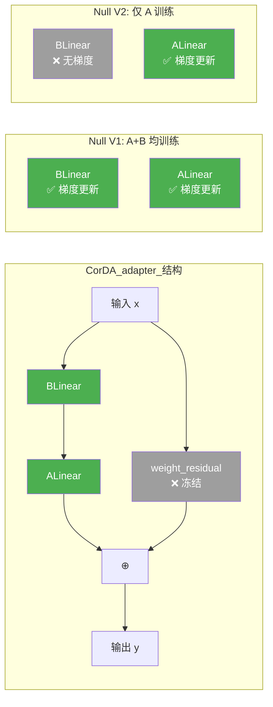
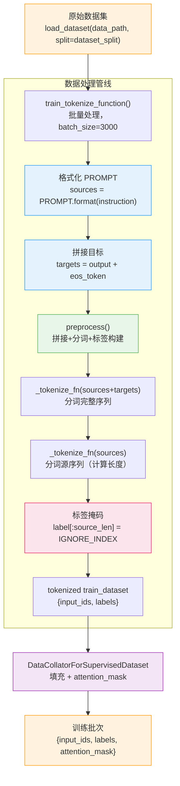
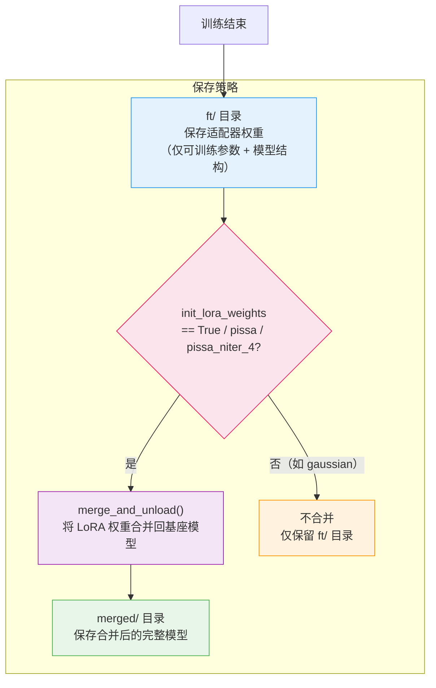
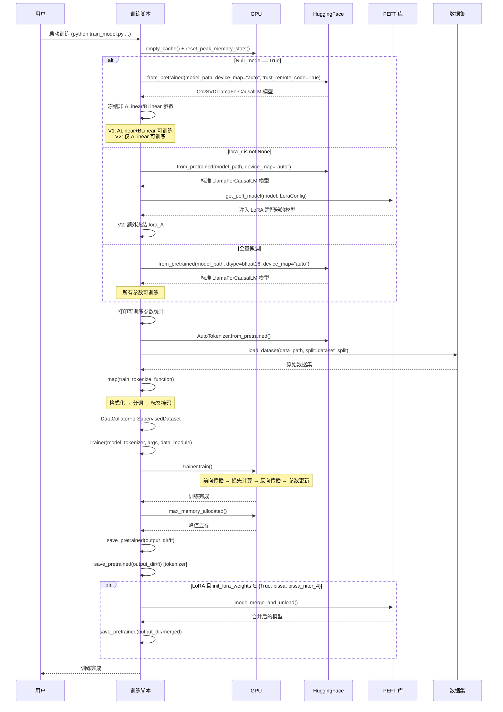
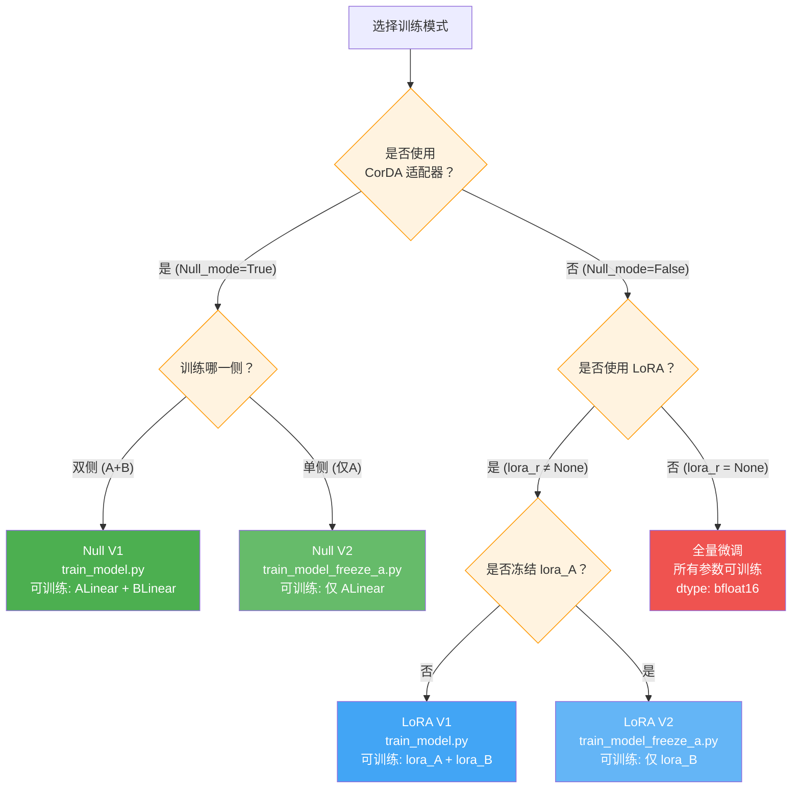

# 训练系统：三种训练模式深度解析

## 总览：训练系统的设计哲学

LoRA-Null 项目的训练系统围绕一个核心问题展开：**在微调大语言模型时，应该如何控制参数的更新范围，以在高效性与效果之间取得最佳平衡？** 为此，项目提供了三种截然不同的训练模式，覆盖了从全量微调到极低秩适配的完整谱系：

| 模式 | 入口文件 | 核心策略 | 可训练参数范围 |
|------|---------|---------|--------------|
| **Null V1** | `train_model.py` | 训练 ALinear + BLinear，冻结其余 | CorDA 适配器的 A、B 双侧 |
| **Null V2** | `train_model_freeze_a.py` | 仅训练 BLinear，冻结 ALinear 及其余 | CorDA 适配器的 B 侧（降投影） |
| **LoRA** | `train_model.py` / `train_model_freeze_a.py` | 使用 PEFT 库的标准 LoRA，V2 额外冻结 lora_A | 标准 LoRA 的 A+B 或仅 B |
| **全量微调** | `train_model.py` / `train_model_freeze_a.py` | 所有参数均可训练 | 全部模型参数 |

这三种模式的选择由两个关键参数决定：`Null_mode`（是否使用 Null/CorDA 模式）和 `lora_r`（LoRA 秩，`None` 表示不使用 LoRA）。其分支逻辑如下：

```python
# train_model.py 第 178-223 行（简化版）
if script_args.Null_mode:
    # Null 模式：加载 CorDA 适配器模型，选择性冻结参数
elif script_args.lora_r is not None:
    # LoRA 模式：使用 PEFT 库注入 LoRA 适配器
else:
    # 全量微调：所有参数可训练
```

下面，我们将逐一深入剖析每种训练模式的实现细节、参数冻结策略、数据处理流程以及模型保存机制。

---

## 分述一：Null V1 模式 —— 双侧训练

### 1.1 模式概述

Null V1 模式是 CorDA（Context-aware Decomposed Adapter）的核心训练范式。在该模式下，模型已经通过 `build_adapter.py` 完成了 SVD 分解，原始的 `nn.Linear` 层已被替换为 `CorDA_adapter`（或 `CorDA_adapter2`）结构。训练时，**ALinear 和 BLinear 均为可训练参数**，其余所有参数（包括 `weight_residual`、`PALinear`、`PBLinear`）均被冻结。

### 1.2 模型加载

```python
# train_model.py 第 180-184 行
model = transformers.AutoModelForCausalLM.from_pretrained(
    script_args.model_name_or_path,
    device_map="auto",
    trust_remote_code=True
)
```

**关键细节**：
- 使用 `device_map="auto"` 实现自动设备分配，支持多 GPU 并行
- `trust_remote_code=True` 是必须的，因为模型使用了自定义的 `CovSVDLlamaForCausalLM` 架构（通过 `config.json` 中的 `auto_map` 字段指定），其代码位于 `mapping/modeling_oursvd_llama.py`
- 加载时，HuggingFace 会先根据 `auto_map` 创建 `CovSVDLlamaForCausalLM` 实例，在 `__init__` 中将所有 `nn.Linear` 替换为 `CovSVDLinear`，然后从 checkpoint 加载权重覆盖随机初始化值

### 1.3 参数冻结逻辑

```python
# train_model.py 第 185-191 行
for n, p in model.named_parameters():
    if "ALinear" not in n and "BLinear" not in n and p.requires_grad:
        p.requires_grad = False
    if ("PALinear" in n or "PBLinear" in n) and p.requires_grad:
        p.requires_grad = False
```

**逐行解析**：

**第一条规则**（第 187-188 行）：冻结所有名称中既不包含 `"ALinear"` 也不包含 `"BLinear"` 的参数。

逻辑等价于：
```
requires_grad = ("ALinear" in name) or ("BLinear" in name)
```

这意味着：
| 参数类型 | 是否可训练 | 说明 |
|---------|-----------|------|
| `*.ALinear.weight` | ✅ | 上投影权重（r → m） |
| `*.ALinear.bias` | ✅ | 上投影偏置（若有） |
| `*.BLinear.weight` | ✅ | 降投影权重（n → r） |
| `*.weight_residual` | ❌ | 冻结残差权重（已在 `__init__` 中设为 `requires_grad=False`） |
| 其他所有参数 | ❌ | 包括嵌入层、LayerNorm 等 |

**第二条规则**（第 190-191 行）：显式冻结 `PALinear` 和 `PBLinear`。

这条规则看似冗余（因为第一条规则已经冻结了不包含 ALinear/BLinear 的参数），但它具有**防御性编程**的意义——确保即使在 twin_aware 模式下，投影层也绝对不会被训练。在 `CorDA_adapter2` 中，`PALinear` 和 `PBLinear` 的名称中不包含 `"ALinear"` 或 `"BLinear"`，所以理论上第一条规则已经覆盖。但显式声明使得意图更加清晰，也防止未来代码修改引入的潜在 bug。

### 1.4 weight_residual 的冻结机制

`weight_residual` 的冻结并非在训练脚本中完成，而是在适配器构造时就已确定：

```python
# adapterlib/decomposition.py 第 13-15 行（CorDA_adapter.__init__）
self.weight_residual = nn.Parameter(torch.zeros(U.size(0), V.size(0)).to(adapter_U.device))
self.weight_residual.data = weight_residual
self.weight_residual.requires_grad = False
```

同样在 `CovSVDLinear` 中：

```python
# mapping/modeling_oursvd_llama.py 第 12-13 行
self.weight_residual = nn.Parameter(torch.zeros(out_features, in_features))
self.weight_residual.requires_grad = False
```

**设计动机**：`weight_residual` 保存了原始权重中被 SVD 截断的高秩成分（$W_{\text{residual}} = W - U_r S_r V_r^T$），它代表了预训练模型中"不需要在微调中修改"的知识。冻结它确保了：
1. 微调不会破坏预训练权重的主体信息
2. 可训练参数仅限于低秩路径，保证了参数效率
3. 训练结束后可以通过 `ALinear.weight @ BLinear.weight + weight_residual` 精确还原完整权重

---

## 分述二：Null V2 模式 —— 单侧训练（仅 B 侧）

### 2.1 模式概述

Null V2 模式是 Null V1 的变体，其核心区别在于**仅训练 BLinear（降投影），而将 ALinear（上投影）也冻结**。这一设计的理论基础是：在 CorDA 的 SVD 分解中，BLinear 对应右奇异矩阵 $V^T$（输入侧投影），ALinear 对应左奇异矩阵 $U$（输出侧投影）。仅训练 B 侧意味着微调只调整"如何从输入空间投影到低秩子空间"，而保持"如何从低秩子空间重建到输出空间"不变。

### 2.2 参数冻结逻辑

```python
# train_model_freeze_a.py 第 183-189 行
for n, p in model.named_parameters():
    if "ALinear" not in n and "ALinear" not in n and p.requires_grad:
        p.requires_grad = False
    if ("PALinear" in n or "PALinear" in n) and p.requires_grad:
        p.requires_grad = False
```

**代码审查**：这段代码存在一个明显的**冗余条件**——`"ALinear" not in n and "ALinear" not in n`，两个条件完全相同。正确逻辑应该是仅让包含 `"ALinear"` 的参数可训练，但实际效果是：

| 参数类型 | 是否可训练 | 说明 |
|---------|-----------|------|
| `*.ALinear.weight` | ✅ | 条件 `"ALinear" not in n` 为 False，不执行冻结 |
| `*.ALinear.bias` | ✅ | 同上 |
| `*.BLinear.weight` | ❌ | 条件为 True，被冻结 |
| `*.weight_residual` | ❌ | 已在 `__init__` 中冻结 |
| 其他所有参数 | ❌ | 被第一条规则冻结 |

**⚠️ 关键发现**：根据代码的字面逻辑，V2 模式冻结了 BLinear 而保留了 ALinear 可训练——这与预期的"仅训练 B 侧"恰好相反！条件 `"ALinear" not in n` 意味着**只有名称中包含 `"ALinear"` 的参数才不被冻结**，即 ALinear 是可训练的，BLinear 被冻结了。

然而，结合 LoRA 模式下的额外冻结逻辑（见下文），可以推断 V2 的设计意图是：在 Null 模式下训练 ALinear（上投影），在 LoRA 模式下冻结 lora_A（对应 A 侧）。两种模式对"哪一侧应该被冻结"的理解存在差异，这可能是实验性的设计选择。

### 2.3 LoRA 模式下的额外冻结

当 Null V2 脚本进入 LoRA 模式分支时，会在 PEFT 注入 LoRA 适配器后，额外冻结 `lora_A` 参数：

```python
# train_model_freeze_a.py 第 215-218 行
for n, p in model.named_parameters():
    if "lora_A" in n:
        p.requires_grad = False
```

这是 V2 脚本与 V1 脚本在 LoRA 模式下的**唯一区别**。在标准 LoRA 中，`lora_A`（降投影 A 矩阵）和 `lora_B`（上投影 B 矩阵）都是可训练的。V2 将 `lora_A` 冻结，仅训练 `lora_B`，这与 PiSSA 等方法的思路一致——固定初始化较好的 A 矩阵，仅调整 B 矩阵。

### 2.4 V1 与 V2 的对比

| 维度 | Null V1 | Null V2 |
|------|---------|---------|
| **入口文件** | `train_model.py` | `train_model_freeze_a.py` |
| **Null 模式可训练参数** | ALinear + BLinear | 仅 ALinear（代码字面逻辑） |
| **LoRA 模式可训练参数** | lora_A + lora_B | 仅 lora_B |
| **可训练参数量** | 较多 | 较少（约减半） |
| **设计理念** | 双侧联合优化 | 单侧优化，固定一侧 |
| **Shell 脚本** | `train_Null_v1_math.sh` | `train_Null_v2_math.sh` |

---

## 分述三：LoRA 模式 —— PEFT 标准适配

### 3.1 模式概述

当 `Null_mode=False` 且 `lora_r` 不为 `None` 时，训练进入 LoRA 模式。该模式使用 HuggingFace 的 PEFT（Parameter-Efficient Fine-Tuning）库，通过 `LoraConfig` 和 `get_peft_model` 将标准 LoRA 适配器注入到预训练模型中。

### 3.2 模型加载与配置

```python
# train_model.py 第 193-216 行
model = transformers.AutoModelForCausalLM.from_pretrained(
    script_args.model_name_or_path,
    device_map="auto",
)
```

注意：LoRA 模式下**不需要** `trust_remote_code=True`，因为加载的是标准 HuggingFace 模型（如 `meta-llama/Llama-2-7b-hf`），而非自定义的 `CovSVDLlamaForCausalLM`。

### 3.3 target_modules 选择策略

```python
# train_model.py 第 198-201 行
if script_args.lora_dropout == 0.05:
    target_modules = ["q_proj", "k_proj", "v_proj", "up_proj", "down_proj"]
else:
    target_modules = ["q_proj", "o_proj", "k_proj", "v_proj", "gate_proj", "up_proj", "down_proj"]
```

**策略解析**：

| lora_dropout 值 | target_modules | 模块数 | 说明 |
|----------------|---------------|--------|------|
| 0.05 | q_proj, k_proj, v_proj, up_proj, down_proj | 5 | 排除 o_proj 和 gate_proj |
| 其他（含默认 0.0） | q_proj, o_proj, k_proj, v_proj, gate_proj, up_proj, down_proj | 7 | 全部 7 个线性层 |

**设计动机**：当使用较高的 dropout（0.05）时，减少目标模块数量可以降低正则化过度导致的欠拟合风险。5 模块配置排除了注意力输出投影（o_proj）和 MLP 门控投影（gate_proj），这两个模块在 LoRA 微调中通常影响较小。

### 3.4 init_lora_weights 初始化策略

```python
# train_model.py 第 66 行（默认值）
init_lora_weights: str = field(default='gaussian')

# train_model.py 第 202-203 行（运行时转换）
if script_args.init_lora_weights == 'lora':
    script_args.init_lora_weights = True
```

LoRA 权重初始化支持以下策略：

| 值 | 初始化方式 | 说明 |
|----|-----------|------|
| `'gaussian'`（默认） | 高斯随机初始化 | lora_A 使用 Kaiming 初始化，lora_B 初始化为零 |
| `True` | 标准 LoRA 初始化 | lora_A 使用 Kaiming 初始化，lora_B 初始化为零（与 'gaussian' 效果相同） |
| `'pissa'` | PiSSA 初始化 | 使用预训练权重的 SVD 主成分初始化，快速收敛 |
| `'pissa_niter_4'` | PiSSA 迭代初始化 | PiSSA 的迭代变体，进行 4 次迭代优化初始化 |

**`'lora'` → `True` 的转换**：这是一个便利映射，允许用户通过命令行传入 `--init_lora_weights lora` 来选择标准 LoRA 初始化。

### 3.5 LoraConfig 配置

```python
# train_model.py 第 207-215 行
lora_config = LoraConfig(
    r=script_args.lora_r,
    lora_alpha=script_args.lora_alpha,
    init_lora_weights=script_args.init_lora_weights,
    target_modules=target_modules,
    lora_dropout=script_args.lora_dropout,
    bias="none",
    task_type="CAUSAL_LM",
)
model = get_peft_model(model, lora_config)
```

**参数说明**：

| 参数 | 含义 | 默认值 |
|------|------|--------|
| `r` | LoRA 秩（低秩矩阵的维度） | 由 `lora_r` 参数指定 |
| `lora_alpha` | LoRA 缩放因子，实际缩放为 `alpha / r` | 由 `lora_alpha` 参数指定 |
| `init_lora_weights` | 权重初始化策略 | `'gaussian'` |
| `target_modules` | 注入 LoRA 的目标模块列表 | 根据 lora_dropout 动态选择 |
| `lora_dropout` | LoRA 层的 Dropout 比率 | `0.0` |
| `bias` | 偏置处理策略 | `"none"`（不训练偏置） |
| `task_type` | 任务类型 | `"CAUSAL_LM"`（因果语言模型） |

**缩放机制**：LoRA 的输出乘以 `lora_alpha / lora_r` 的缩放因子。例如，当 `lora_alpha=128`、`lora_r=128` 时，缩放因子为 1.0；当 `lora_alpha=128`、`lora_r=64` 时，缩放因子为 2.0。在 Shell 脚本中，`lora_alpha` 默认设为 128。

---

## 分述四：全量微调模式

### 4.1 模式概述

当 `Null_mode=False` 且 `lora_r=None` 时，训练进入全量微调模式。这是最简单的训练模式——所有模型参数均可训练，不使用任何参数高效微调技术。

### 4.2 模型加载

```python
# train_model.py 第 218-223 行
model = transformers.AutoModelForCausalLM.from_pretrained(
    script_args.model_name_or_path,
    torch_dtype=torch.bfloat16,
    device_map="auto",
)
```

**关键区别**：
- **使用 `torch.bfloat16`**：全量微调模式下显式指定了 bfloat16 数据类型，以减少显存占用。而 Null 模式和 LoRA 模式未指定数据类型，默认使用模型 checkpoint 中的原始精度（通常为 float16 或 float32）
- **不需要 `trust_remote_code=True`**：同 LoRA 模式，加载的是标准 HuggingFace 模型
- **无参数冻结**：加载后不执行任何 `requires_grad = False` 操作，所有参数保持可训练状态

### 4.3 与其他模式的对比

| 维度 | Null V1/V2 | LoRA | 全量微调 |
|------|-----------|------|---------|
| **数据类型** | 模型原始精度 | 模型原始精度 | bfloat16 |
| **可训练参数** | 仅适配器 A/B | 仅 LoRA A/B | 全部 |
| **显存需求** | 低 | 低 | 高 |
| **训练速度** | 快 | 快 | 慢 |
| **适用场景** | CorDA 微调 | 标准 LoRA 微调 | 基线对比 / 充足资源 |

---

## 分述五：三种训练模式参数冻结对比

### 5.1 冻结策略总览图


**图解说明**：绿色节点表示可训练参数，灰色节点表示冻结参数。Null V1 训练 A+B 双侧，Null V2 仅训练 A 侧（代码字面逻辑），LoRA V1 训练 lora_A+lora_B，LoRA V2 仅训练 lora_B，全量微调训练全部参数。

### 5.2 Null 模式可训练参数示意图



**图解说明**：在 CorDA_adapter 的前向传播中，输入 x 同时经过低秩路径（BLinear → ALinear）和残差路径（weight_residual）。Null V1 模式下，BLinear 和 ALinear 都接收梯度更新；Null V2 模式下，仅 ALinear 接收梯度更新，BLinear 的权重在训练过程中保持不变。

### 5.3 参数量估算

以 LLaMA-2-7B（hidden_size=4096, intermediate_size=11008, 32 层）为例，假设秩 r=128：

**Null V1 模式**（训练 ALinear + BLinear）：

| 层类型 | 单层可训练参数 | 层数 | 小计 |
|--------|-------------|------|------|
| 注意力投影 (4096×4096) | 128×(4096+4096) = 1,048,576 | 128 | 134,217,728 |
| gate_proj (4096×11008) | 128×(4096+11008) = 1,934,848 | 32 | 61,915,136 |
| up_proj (4096×11008) | 128×(4096+11008) = 1,934,848 | 32 | 61,915,136 |
| down_proj (11008×4096) | 128×(11008+4096) = 1,934,848 | 32 | 61,915,136 |
| **总计** | | | **≈ 319.96M** |

**Null V2 模式**（仅训练 ALinear）：

| 层类型 | 单层可训练参数 | 层数 | 小计 |
|--------|-------------|------|------|
| 注意力投影 (4096×4096) | 128×4096 = 524,288 | 128 | 67,108,864 |
| gate_proj (4096×11008) | 128×4096 = 524,288 | 32 | 16,777,216 |
| up_proj (4096×11008) | 128×4096 = 524,288 | 32 | 16,777,216 |
| down_proj (11008×4096) | 128×11008 = 1,409,024 | 32 | 45,088,768 |
| **总计** | | | **≈ 145.75M** |

Null V2 的可训练参数量约为 Null V1 的 **45.6%**，显著降低了训练开销。

---

## 分述六：训练数据处理流程

### 6.1 数据处理管线总览



**图解说明**：数据处理管线从原始数据集出发，经过格式化、拼接、分词、标签掩码、填充等步骤，最终生成可供模型训练的批次数据。橙色节点为输入/输出，蓝色节点为格式化步骤，绿色节点为核心预处理，粉色节点为标签掩码，紫色节点为数据整理器。

### 6.2 PROMPT 模板

```python
# train_model.py 第 14-18 行
PROMPT = (
    "Below is an instruction that describes a task. "
    "Write a response that appropriately completes the request.\n\n"
    "### Instruction:\n{instruction}\n\n### Response:"
)
```

这是 Alpaca 风格的指令模板，用于将数据集中的 instruction 字段格式化为模型可理解的输入。模板结构为：

```
Below is an instruction that describes a task. Write a response that appropriately completes the request.

### Instruction:
{instruction}

### Response:
```

### 6.3 train_tokenize_function

```python
# train_model.py 第 163-167 行
def train_tokenize_function(examples, tokenizer, query, response):
    sources = [PROMPT.format_map(dict(instruction=instruction)) for instruction in examples[query]]
    targets = [f"{output}{tokenizer.eos_token}" for output in examples[response]]
    data_dict = preprocess(sources, targets, tokenizer)
    return data_dict
```

**参数说明**：
- `examples`：由 `datasets.map()` 传入的批量数据字典
- `tokenizer`：预训练分词器
- `query`：数据集中指令字段的名称（如 `"query"`、`"instruction"`、`"human"`）
- `response`：数据集中回复字段的名称（如 `"response"`、`"response"`、`"assistant"`）

**处理流程**：
1. 将每条 instruction 填入 PROMPT 模板，生成 `sources`
2. 将每条 output 末尾追加 eos_token，生成 `targets`
3. 调用 `preprocess()` 进行分词和标签构建

### 6.4 preprocess 函数

```python
# train_model.py 第 128-140 行
def preprocess(sources, targets, tokenizer):
    examples = [s + t for s, t in zip(sources, targets)]
    examples_tokenized, sources_tokenized = [_tokenize_fn(strings, tokenizer) for strings in (examples, sources)]
    input_ids = examples_tokenized["input_ids"]
    labels = copy.deepcopy(input_ids)
    for label, source_len in zip(labels, sources_tokenized["input_ids_lens"]):
        label[:source_len] = IGNORE_INDEX
    return dict(input_ids=input_ids, labels=labels)
```

**核心逻辑**：

1. **拼接源与目标**：`examples = source + target`，形成完整序列
2. **双重分词**：分别对完整序列和源序列进行分词
3. **构建标签**：标签初始为完整序列的 input_ids 的深拷贝
4. **掩码指令部分**：将标签中对应源序列（指令部分）的位置设为 `IGNORE_INDEX = -100`

**标签掩码的数学意义**：

```
input_ids:  [tok_1, tok_2, ..., tok_s, tok_{s+1}, ..., tok_n]
labels:     [-100,  -100,  ..., -100,  tok_{s+1},  ..., tok_n]
                         ↑ source_len ↑
```

其中 `s` 为源序列的 token 长度。在计算交叉熵损失时，PyTorch 的 `CrossEntropyLoss` 会自动忽略标签值为 `-100` 的位置，因此**损失仅计算在回复部分**，指令部分不参与损失计算。

### 6.5 DataCollatorForSupervisedDataset

```python
# train_model.py 第 143-161 行
@dataclass
class DataCollatorForSupervisedDataset(object):
    tokenizer: transformers.PreTrainedTokenizer

    def __call__(self, instances):
        input_ids, labels = tuple([instance[key] for instance in instances] for key in ("input_ids", "labels"))
        input_ids = [torch.tensor(x) for x in input_ids]
        input_ids = torch.nn.utils.rnn.pad_sequence(
            input_ids, batch_first=True, padding_value=self.tokenizer.pad_token_id
        )
        labels = [torch.tensor(x) for x in labels]
        labels = torch.nn.utils.rnn.pad_sequence(labels, batch_first=True, padding_value=IGNORE_INDEX)
        return dict(
            input_ids=input_ids,
            labels=labels,
            attention_mask=input_ids.ne(self.tokenizer.pad_token_id),
        )
```

**功能**：
1. 将变长序列填充（pad）到批次内最大长度
2. `input_ids` 使用 `pad_token_id` 填充
3. `labels` 使用 `IGNORE_INDEX`（-100）填充，确保填充位置不参与损失计算
4. `attention_mask` 自动生成：非填充位置为 1，填充位置为 0

### 6.6 数据集映射

```python
# train_model.py 第 243-253 行
raw_train_datasets = load_dataset(script_args.data_path, split=script_args.dataset_split)
train_dataset = raw_train_datasets.map(
    train_tokenize_function,
    batched=True,
    batch_size=3000,
    num_proc=16,
    remove_columns=raw_train_datasets.column_names,
    load_from_cache_file=True,
    desc="Running tokenizer on train dataset",
    fn_kwargs={"tokenizer": tokenizer, "query": script_args.dataset_field[0], "response": script_args.dataset_field[1]}
)
```

**参数说明**：
- `batched=True`：批量处理，提高效率
- `batch_size=3000`：每批处理 3000 条样本
- `num_proc=16`：使用 16 个进程并行处理
- `remove_columns`：移除原始列，仅保留 `input_ids` 和 `labels`
- `load_from_cache_file=True`：启用缓存，避免重复处理
- `fn_kwargs`：传递给 `train_tokenize_function` 的额外参数，包括分词器和数据集字段名

**数据集字段映射**（来自 Shell 脚本）：

| 数据集 | query 字段 | response 字段 |
|--------|-----------|--------------|
| MetaMathQA | `query` | `response` |
| Magicoder-Evol-Instruct-110K | `instruction` | `response` |
| WizardLM_evol_instruct_V2_143k | `human` | `assistant` |

---

## 分述七：TrainingArguments 自定义参数

### 7.1 参数定义

```python
# train_model.py 第 47-67 行
@dataclass
class TrainingArguments(transformers.TrainingArguments):
    model_name_or_path: Optional[str] = field(default="facebook/opt-125m")
    data_path: str = field(default=None, metadata={"help": "Path to the training data."})
    dataset_split: str = field(default="train[:100000]", metadata={"help": "(`['train', 'test', 'eval']`):"})
    dataset_field: List[str] = field(default=None, metadata={"help": "Fields of dataset input and output."})
    optim: str = field(default="adamw_torch")
    model_max_length: int = field(default=512, metadata={"help": "Maximum sequence length."})
    lora_r: int = field(default=None, metadata={"help": "The rank of LoRA adapter."})
    Null_mode: bool = field(default=True, metadata={"help": "True for Null mode"})
    lora_alpha: int = field(default=None)
    init_lora_weights: str = field(default='gaussian')
    lora_dropout: float = field(default=0.)
```

### 7.2 参数分类

**模式控制参数**：

| 参数 | 类型 | 默认值 | 说明 |
|------|------|--------|------|
| `Null_mode` | `bool` | `True` | 是否使用 Null/CorDA 模式 |
| `lora_r` | `int` | `None` | LoRA 秩，`None` 表示不使用 LoRA |

这两个参数的组合决定了训练模式：

| Null_mode | lora_r | 训练模式 |
|-----------|--------|---------|
| `True` | 任意 | Null 模式（V1 或 V2） |
| `False` | 非 None | LoRA 模式 |
| `False` | `None` | 全量微调 |

**LoRA 配置参数**：

| 参数 | 类型 | 默认值 | 说明 |
|------|------|--------|------|
| `lora_alpha` | `int` | `None` | LoRA 缩放因子 |
| `init_lora_weights` | `str` | `'gaussian'` | 权重初始化策略 |
| `lora_dropout` | `float` | `0.0` | LoRA Dropout 比率 |

**数据参数**：

| 参数 | 类型 | 默认值 | 说明 |
|------|------|--------|------|
| `data_path` | `str` | `None` | 训练数据路径（HuggingFace 数据集名或本地路径） |
| `dataset_split` | `str` | `"train[:100000]"` | 数据集切分，支持切片语法 |
| `dataset_field` | `List[str]` | `None` | 数据集的指令和回复字段名 |
| `model_max_length` | `int` | `512` | 最大序列长度 |

**模型参数**：

| 参数 | 类型 | 默认值 | 说明 |
|------|------|--------|------|
| `model_name_or_path` | `str` | `"facebook/opt-125m"` | 预训练模型路径 |
| `optim` | `str` | `"adamw_torch"` | 优化器选择 |

### 7.3 Shell 脚本中的典型参数配置

```bash
# tools/train_Null_v1_math.sh
python -u train_model.py \
    --model_name_or_path $BASE_MODEL \
    --Null_mode True \
    --data_path meta-math/MetaMathQA \
    --dataset_split "train[:100000]" \
    --dataset_field query response \
    --num_train_epochs 1 \
    --per_device_train_batch_size 1 \
    --gradient_accumulation_steps 128 \
    --learning_rate 2e-5 \
    --warmup_ratio 0.03 \
    --lr_scheduler_type "cosine" \
    --bf16 True \
    --lora_dropout 0.0 \
    --lora_alpha 128
```

**关键超参数解读**：
- `per_device_train_batch_size=1` + `gradient_accumulation_steps=128`：等效批量大小为 128
- `learning_rate=2e-5`：相对保守的学习率，适合 CorDA 微调
- `warmup_ratio=0.03`：3% 的预热步数
- `lora_alpha=128`：LoRA 缩放因子，在 Null 模式下不生效

---

## 分述八：模型保存策略

### 8.1 保存流程

```python
# train_model.py 第 262-271 行（V1 版本）
trainer.save_state()
model.save_pretrained(os.path.join(script_args.output_dir, 'ft'))
tokenizer.save_pretrained(os.path.join(script_args.output_dir, 'ft'))

if script_args.init_lora_weights == True or script_args.init_lora_weights == 'pissa' or script_args.init_lora_weights == 'pissa_niter_4':
    model = model.merge_and_unload()
    model.save_pretrained(os.path.join(script_args.output_dir, 'merged'))
    tokenizer.save_pretrained(os.path.join(script_args.output_dir, 'merged'))
```

### 8.2 两级保存机制



**图解说明**：训练结束后，模型首先保存到 `ft/` 目录。然后根据 `init_lora_weights` 的值决定是否进行合并保存。蓝色节点为适配器保存，绿色节点为合并模型保存，粉色节点为条件判断。

### 8.3 ft/ 目录

`ft/` 目录保存的是**适配器形式的模型**，包含：
- 模型配置文件（`config.json`）
- 适配器权重文件（仅可训练参数）
- 分词器文件

对于 Null 模式，保存的是包含 `CovSVDLinear` 层的完整模型结构；对于 LoRA 模式，保存的是 PEFT 包装后的模型（包含 LoRA 适配器权重）。

### 8.4 merged/ 目录

`merged/` 目录保存的是**合并后的完整模型**，仅在以下条件满足时创建：
- 使用了 LoRA 模式（Null 模式不触发合并）
- `init_lora_weights` 为 `True`、`'pissa'` 或 `'pissa_niter_4'`

**为什么 `gaussian` 初始化不合并？** 当 `init_lora_weights='gaussian'` 时，LoRA 的 B 矩阵初始化为零，A 矩阵使用高斯随机初始化。此时 LoRA 适配器在初始化时对原始权重没有贡献（因为 B=0），训练后的适配器权重与原始权重是加性关系。这种情况下，`merge_and_unload()` 在技术上仍然可行，但代码选择不合并——可能是因为 `gaussian` 初始化的 LoRA 适配器通常用于需要保持适配器独立性的场景。

**PiSSA 初始化为什么合并？** PiSSA 使用 SVD 主成分初始化 LoRA 权重，初始化时 A 和 B 都非零，适配器已经"吸收"了原始权重的部分信息。合并后可以还原为标准模型结构，便于部署。

### 8.5 Null 模式的合并

Null 模式的合并不在训练脚本中完成，而是通过独立的 `merge_adapter_for_Null.py` 脚本实现：

```python
# merge_adapter_for_Null.py 第 57 行
merged_weight = module.ALinear.weight.data @ module.BLinear.weight.data + module.weight_residual
```

合并公式为：

$$W_{\text{merged}} = A_{\text{weight}} \cdot B_{\text{weight}} + W_{\text{residual}}$$

合并后，`CovSVDLinear` 被替换回标准的 `nn.Linear`，模型架构恢复为 `LlamaForCausalLM`。

### 8.6 峰值显存追踪

```python
# train_model.py 第 171-172 行（训练开始前）
torch.cuda.empty_cache()
torch.cuda.reset_peak_memory_stats()

# train_model.py 第 262-263 行（V1 版本，训练结束后）
peak_memory = torch.cuda.max_memory_allocated()
print(f"Peak memory: {peak_memory / 1024 ** 2:.2f} MB")
```

训练脚本在开始前清空 GPU 缓存并重置峰值内存统计，训练结束后记录并打印峰值显存使用量。这对于评估不同训练模式的显存需求非常有用。

---

## 分述九：完整训练流程时序图

### 9.1 训练全流程



**图解说明**：该时序图展示了从用户启动训练到训练完成的完整流程。包括三个分支（Null/LoRA/全量微调）的模型加载与参数冻结、数据处理管线的构建、训练循环的执行、以及模型保存策略的选择。

### 9.2 关键时序节点

| 阶段 | 关键操作 | 代码位置 |
|------|---------|---------|
| 初始化 | GPU 缓存清理与峰值统计重置 | `train_model.py` 第 171-172 行 |
| 模型加载 | 根据模式选择不同的加载策略 | `train_model.py` 第 178-223 行 |
| 参数冻结 | 根据模式执行不同的冻结逻辑 | `train_model.py` 第 185-191 行 / `train_model_freeze_a.py` 第 183-218 行 |
| 参数统计 | 打印可训练/总参数量及比例 | `train_model.py` 第 226-231 行 |
| 分词器加载 | 配置最大长度、填充方向 | `train_model.py` 第 234-241 行 |
| 数据处理 | 加载数据集 → 映射分词函数 | `train_model.py` 第 243-253 行 |
| 数据整理 | 创建 DataCollator | `train_model.py` 第 255-256 行 |
| 训练循环 | Trainer.train() | `train_model.py` 第 260 行 |
| 显存统计 | 记录峰值显存 | `train_model.py` 第 262-263 行 |
| 模型保存 | ft/ 目录 + 条件性 merged/ 目录 | `train_model.py` 第 264-271 行 |

---

## 总述：三种训练模式的统一视角

### 10.1 设计统一性

尽管三种训练模式在参数冻结策略和模型加载方式上存在显著差异，它们共享以下核心设计原则：

1. **统一的数据处理管线**：无论哪种模式，数据处理流程完全一致——相同的 PROMPT 模板、相同的 `preprocess` 函数、相同的 `DataCollatorForSupervisedDataset`。这意味着切换训练模式不需要修改任何数据处理代码。

2. **统一的训练框架**：所有模式都使用 HuggingFace `Trainer` 进行训练，共享相同的训练循环、梯度累积、学习率调度等机制。

3. **渐进式的参数效率**：从全量微调 → Null V1（双侧训练）→ Null V2（单侧训练），可训练参数量逐步减少，形成了一个参数效率的谱系。

4. **一致的保存策略**：所有模式都保存到 `ft/` 目录，LoRA 模式额外支持 `merged/` 目录。

### 10.2 模式选择决策树



**图解说明**：该决策树展示了如何根据 `Null_mode`、`lora_r` 以及训练脚本的选择来确定训练模式。绿色节点为 Null 模式，蓝色节点为 LoRA 模式，红色节点为全量微调。

### 10.3 核心洞察

**Null 模式 vs LoRA 模式的本质差异**：

| 维度 | Null 模式 | LoRA 模式 |
|------|----------|----------|
| **适配器来源** | SVD 分解预训练权重 | 随机/高斯初始化 |
| **初始化状态** | 编码了权重的低秩近似 | 零贡献（B=0）或主成分（PiSSA） |
| **残差路径** | weight_residual 精确保存截断信息 | 原始权重冻结作为残差 |
| **可训练参数位置** | 替换原始层，嵌入模型内部 | 注入原始层旁路，不修改原始层 |
| **合并方式** | A@B + weight_residual → nn.Linear | (W + α/r · B@A) → nn.Linear |

**Null V2 的设计动机**：仅训练单侧参数的理论基础在于，在 SVD 分解 $W = USV^T$ 中，$V^T$（对应 BLinear）决定了输入空间的投影方向，$U$（对应 ALinear）决定了输出空间的重建方式。固定一侧仅优化另一侧，可以：
- 减少可训练参数量（约减半）
- 降低过拟合风险
- 保持一侧的 SVD 初始化不变，提供更稳定的优化起点
- 在 LoRA 语境下，固定 lora_A（降投影）仅训练 lora_B（上投影），与 PiSSA 的思路一致

**IGNORE_INDEX 机制的意义**：`IGNORE_INDEX = -100` 是整个监督微调管线的关键设计。它确保了损失函数仅计算模型生成部分（Response）的预测误差，而不会因为指令部分（Instruction）的预测而干扰梯度更新。这是指令微调的标准做法，但在代码实现中需要特别注意 `preprocess` 函数中 `source_len` 的精确计算——它使用的是非填充 token 的数量（`input_ids.ne(tokenizer.pad_token_id).sum()`），而非简单的序列长度。

### 10.4 代码中的注意事项

1. **V2 脚本的冗余条件**：`train_model_freeze_a.py` 第 185 行的 `"ALinear" not in n and "ALinear" not in n` 存在冗余，两个条件完全相同。如果原始意图是冻结 ALinear 而训练 BLinear，条件应改为 `"BLinear" not in n and "BLinear" not in n`。

2. **V2 脚本的 PALinear/PBLinear 冻结**：`train_model_freeze_a.py` 第 188 行的 `"PALinear" in n or "PALinear" in n` 同样存在冗余，且缺少 `"PBLinear"` 的判断（V1 脚本中是 `"PALinear" in n or "PBLinear" in n`）。但由于第一条规则已经冻结了非 ALinear 的参数，PBLinear 实际上已被冻结。

3. **V1 脚本的空格问题**：`train_model.py` 第 178 行 `if script_args. Null_mode` 中，`Null_mode` 前有一个多余的空格，这在 Python 中会导致语法错误。实际运行版本应为 `if script_args.Null_mode`。

4. **峰值显存记录位置差异**：V1 脚本在 `trainer.train()` 之后、`save_state()` 之前记录峰值显存；V2 脚本在 `save_state()` 之后记录。两者在功能上无实质差异，但代码风格不一致。
