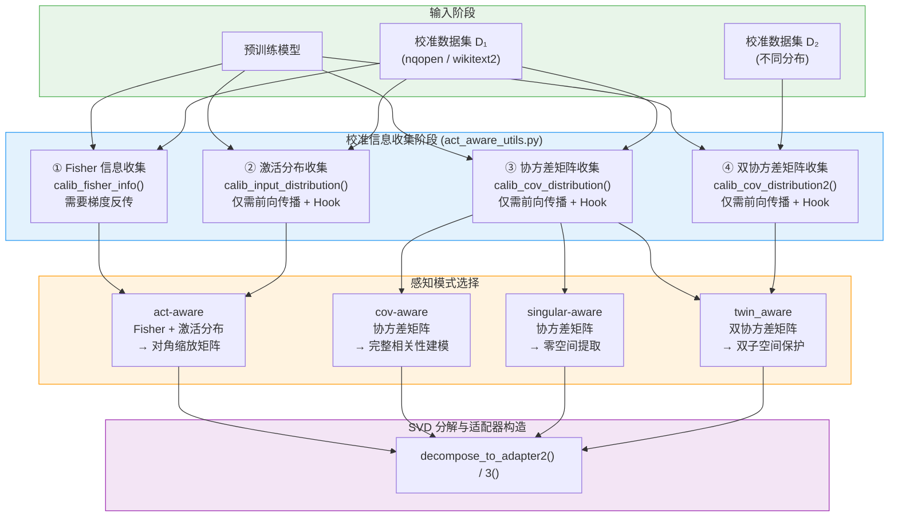
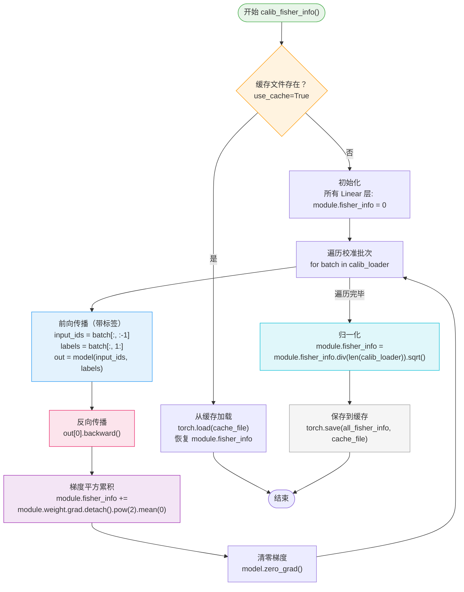
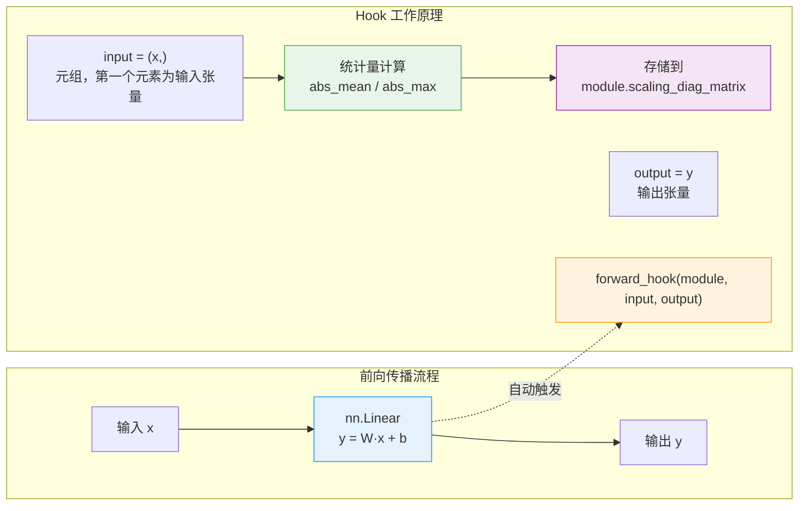
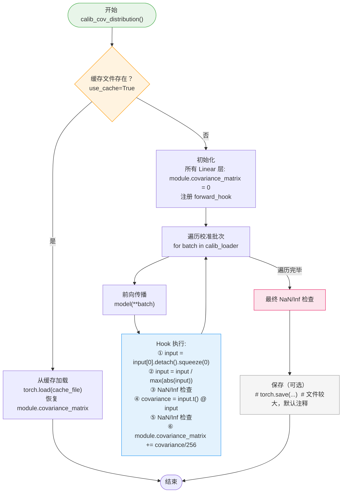
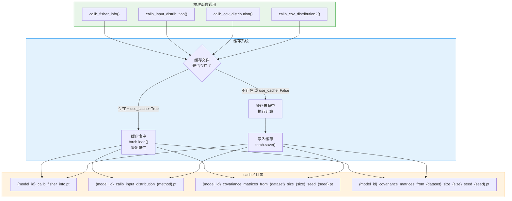
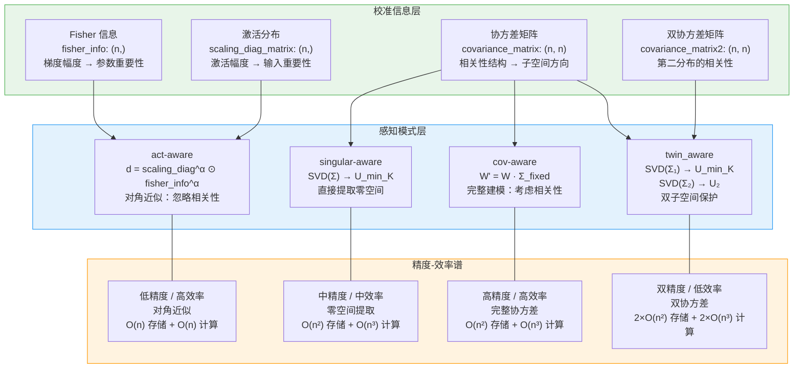

# 协方差与激活感知：校准信息收集

> 本文档深入剖析 LoRA-Null 项目中校准信息收集的完整机制。校准信息是所有感知模式（cov-aware、act-aware、singular-aware、twin_aware）的数据基石——没有准确的校准信息，SVD 分解就无法"感知"输入分布的结构，零空间方向也就无从谈起。我们将从整体设计哲学出发，逐一详解四类校准信息的收集算法，最终回归到缓存系统与数值稳定性的统一设计。

---

## 总览：校准信息收集的设计哲学

### 为什么需要校准信息？

LoRA-Null 的核心思想是**在预训练权重矩阵的"不重要方向"上注入可训练参数**。而"重要性"的判断并非来自权重矩阵本身，而是来自**输入数据的分布结构**：哪些方向上输入活跃（方差大），哪些方向上输入沉默（方差小）。这些分布信息无法从预训练权重中直接获取，必须通过校准数据集（Calibration Dataset）上的前向传播来收集。

整个校准信息收集体系可以用一句话概括：**用少量校准数据"探测"模型各线性层的输入分布，将分布统计量注入 SVD 分解过程，引导分解关注正确的方向**。

### 四类校准信息的定位

项目中共有四类校准信息，它们分别服务于不同的感知模式：

| 校准信息 | 收集函数 | 服务模式 | 统计量维度 | 核心问题 |
|---------|---------|---------|-----------|---------|
| Fisher 信息 | `calib_fisher_info` | act-aware | `(n,)` 向量 | 每个输入维度对损失的"重要性"是多少？ |
| 激活分布 | `calib_input_distribution` | act-aware | `(n,)` 向量 | 每个输入维度的激活幅度有多大？ |
| 协方差矩阵 | `calib_cov_distribution` | cov-aware / singular-aware | `(n, n)` 矩阵 | 输入维度之间的相关性结构是什么？ |
| 双协方差矩阵 | `calib_cov_distribution2` | twin_aware | `(n, n)` 矩阵 | 另一种数据分布下的相关性结构是什么？ |

### 校准信息在整体流程中的位置



**图解说明**：校准信息收集是连接"预训练模型 + 校准数据"与"SVD 分解"的桥梁。四类校准信息分别服务于四种感知模式，最终汇聚到分解函数中，指导适配器的初始化方向。注意 Fisher 信息收集是唯一需要梯度反传的校准方式，其余三类仅需前向传播。

---

## 分述一：Fisher 信息收集

### 1.1 目的与动机

Fisher 信息矩阵（Fisher Information Matrix）是统计学中度量参数重要性的经典工具。其对角近似衡量了每个参数对模型输出的敏感程度：**梯度越大的参数，对损失函数的影响越显著，因此越"重要"**。

在 LoRA-Null 的 act-aware 模式中，Fisher 信息与激活分布结合，构成对角缩放矩阵：

$$d = \text{scaling\_diag\_matrix}^\alpha \odot \text{fisher\_info}^\alpha$$

其中 `fisher_info` 的每个元素反映了对应输入维度对损失的敏感度，用于在 SVD 分解前对权重矩阵的列进行重要性加权。

### 1.2 算法详解

Fisher 信息的收集需要**梯度反传**，这是它与其它三类校准信息的本质区别。完整算法流程如下：



**图解说明**：Fisher 信息收集的核心循环是"前向→反向→梯度累积→清零"。注意与其它校准方式不同，此处需要带标签的前向传播（`model(input_ids, labels)`），因为梯度必须从损失函数反传。归一化步骤将累积值除以批次数的平方根，得到每个输入维度的平均梯度幅度。

### 1.3 逐行代码解析

#### 缓存检查（第 9–16 行）

```python
model_id = model.config._name_or_path
cache_file = f"cache/{model_id.replace('/','_')}_calib_fisher_info.pt"
if os.path.exists(cache_file) and use_cache:
    all_fisher_info = torch.load(cache_file, map_location="cpu")
    for name, module in model.named_modules():
        if isinstance(module, nn.Linear):
            module.fisher_info = all_fisher_info[name].to(module.weight.device)
    return
```

缓存文件路径格式为 `cache/{model_id}_calib_fisher_info.pt`，其中 `model_id` 的斜杠替换为下划线（如 `meta-llama_Llama-2-7b-hf_calib_fisher_info.pt`）。若缓存存在且 `use_cache=True`，直接加载并恢复到各层，跳过计算。

#### 初始化（第 19–21 行）

```python
for name, module in model.named_modules():
    if isinstance(module, nn.Linear):
        module.fisher_info = 0
```

为模型中所有 `nn.Linear` 层初始化 `fisher_info` 属性为 0。这里用标量 0 初始化，后续通过 `+=` 累加会自动广播为与 `weight.grad` 相同形状的张量。

#### 梯度累积循环（第 24–32 行）

```python
for batch in tqdm(calib_loader):
    input_ids = batch["input_ids"][:, :-1].to(model.device)
    labels = batch["input_ids"][:, 1:].to(model.device)
    out = model(input_ids=input_ids, labels=labels)
    out[0].backward()
    for name, module in model.named_modules():
        if isinstance(module, nn.Linear):
            module.fisher_info += module.weight.grad.detach().pow(2).mean(0)
    model.zero_grad()
```

**关键细节**：

1. **输入标签构造**：`input_ids` 取 `[:, :-1]`（去掉最后一个 token），`labels` 取 `[:, 1:]`（去掉第一个 token），实现自回归的 next-token 预测
2. **带标签前向传播**：`model(input_ids=input_ids, labels=labels)` 返回 `(loss, logits)` 元组，`out[0]` 即为交叉熵损失
3. **梯度平方均值**：`module.weight.grad.detach().pow(2).mean(0)` 对权重梯度的平方沿输出维度（第 0 维）取均值，得到每个输入维度的重要性分数，形状为 `(n,)`
4. **detach 分离**：`.detach()` 确保梯度张量与计算图分离，避免内存泄漏
5. **梯度清零**：`model.zero_grad()` 在每个批次结束后清零梯度，为下一批次做准备

#### 归一化与保存（第 34–44 行）

```python
for name, module in model.named_modules():
    if isinstance(module, nn.Linear):
        module.fisher_info = module.fisher_info.div(len(calib_loader)).sqrt()

all_fisher_info = {}
for name, module in model.named_modules():
    if isinstance(module, nn.Linear):
        module._forward_hooks.clear()
        all_fisher_info[name] = module.fisher_info
torch.save(all_fisher_info, cache_file)
```

**归一化公式**：

$$\text{fisher\_info} = \frac{\sum_{b=1}^{B} \text{grad}^2_b / B_{\text{out}}}{\sqrt{N_{\text{batch}}}}$$

其中 $B$ 为批次数，$B_{\text{out}}$ 为输出维度（`mean(0)` 的分母），$N_{\text{batch}}$ 为 `len(calib_loader)`。除以批次数的平方根而非批次数本身，是因为梯度平方的累积已经除以了输出维度（`mean(0)`），此处再除以 $\sqrt{N}$ 使得 Fisher 信息的尺度与校准数据量解耦。

**清理与保存**：`module._forward_hooks.clear()` 清除可能残留的前向钩子（虽然 Fisher 信息收集不使用 hook，但作为防御性编程），然后将所有层的 `fisher_info` 收集到字典中保存。

### 1.4 结果形态

对于形状为 `(m, n)` 的 `nn.Linear` 权重矩阵，`fisher_info` 的形状为 `(n,)`，即每个输入维度对应一个重要性分数：

```
Linear 层权重: weight.grad.shape = (m, n)
梯度平方均值:  weight.grad.pow(2).mean(0).shape = (n,)
Fisher 信息:   fisher_info.shape = (n,)
```

这个 `(n,)` 向量在 act-aware 模式中与 `scaling_diag_matrix` 逐元素相乘，构成对角缩放矩阵 $d \in \mathbb{R}^n$，用于对权重矩阵的列进行重要性加权。

---

## 分述二：激活分布收集

### 2.1 目的与动机

激活分布收集的目的是捕获每个 Linear 层输入激活的**幅度统计量**——各输入维度的绝对均值或绝对最大值。这些统计量反映了输入特征在推理时的"活跃程度"，用于 act-aware 模式中构建对角缩放矩阵。

与 Fisher 信息不同，激活分布仅关注输入的**幅度**（magnitude），不涉及梯度或损失函数。它回答的问题是：**每个输入维度在正常推理时有多"活跃"？**

### 2.2 Hook 机制详解

激活分布收集的核心技术是 PyTorch 的 `register_forward_hook` 机制。这一机制允许在不修改模型代码的前提下，在前向传播过程中"拦截"每一层的输入和输出。



**图解说明**：当模型进行前向传播时，每个注册了 hook 的 Linear 层在计算完输出后，PyTorch 会自动调用 hook 函数，传入 `(module, input, output)` 三个参数。hook 函数从 `input[0]` 中提取输入张量，计算统计量，并存储到模块的自定义属性中。整个过程对模型的前向传播逻辑完全透明。

### 2.3 两种统计方法

`calib_input_distribution` 支持 `abs_mean` 和 `abs_max` 两种统计方法：

#### abs_mean 方法

```python
if "abs_mean" in method:
    abs_mean = input[0].abs().mean(dim=-2).detach().view(-1)
    module.scaling_diag_matrix += abs_mean
```

**维度变换**：

```
input[0]: (batch, seq_len, dim)
→ .abs(): (batch, seq_len, dim)        # 取绝对值
→ .mean(dim=-2): (batch, dim)          # 沿 seq_len 维度取均值
→ .detach().view(-1): (dim,)           # 展平为一维向量
```

**累积方式**：`+=` 逐元素累加，最终结果为所有校准批次上的绝对均值之和。

#### abs_max 方法

```python
elif "abs_max" in method:
    abs_max = input[0].abs().amax(dim=-2).detach().view(-1)
    module.scaling_diag_matrix = torch.where(
        abs_max > module.scaling_diag_matrix,
        abs_max,
        module.scaling_diag_matrix,
    )
```

**维度变换**：

```
input[0]: (batch, seq_len, dim)
→ .abs(): (batch, seq_len, dim)        # 取绝对值
→ .amax(dim=-2): (batch, dim)          # 沿 seq_len 维度取最大值
→ .detach().view(-1): (dim,)           # 展平为一维向量
```

**累积方式**：`torch.where` 逐元素取最大值，维护所有校准批次上的绝对最大值记录。

#### 两种方法的对比

| 方面 | abs_mean | abs_max |
|------|----------|---------|
| 统计量 | 绝对值均值 | 绝对值最大值 |
| 累积方式 | `+=` 求和 | `torch.where` 取最大 |
| 鲁棒性 | 对异常值不敏感 | 对异常值敏感 |
| 代表性 | 反映平均激活水平 | 反映峰值激活水平 |
| 适用场景 | 通用场景 | 需要考虑极端激活的场景 |

### 2.4 完整算法流程

```python
@torch.no_grad()
def calib_input_distribution(model, calib_loader, method, use_cache=True):
```

注意 `@torch.no_grad()` 装饰器——与 Fisher 信息收集不同，激活分布收集**不需要梯度计算**，因此可以关闭自动求导以节省内存。

**完整流程**：

1. **缓存检查**：若 `cache/{model_id}_calib_input_distribution_{method}.pt` 存在且 `use_cache=True`，直接加载返回
2. **设置模型为评估模式**：`model.eval()`
3. **注册 Hook**：为每个 `nn.Linear` 层注册 `forward_hook`，初始化 `module.scaling_diag_matrix = 0`
4. **遍历校准数据**：对每个批次执行 `model(**batch)`，hook 自动收集统计量
5. **清理与保存**：清除所有 hook，将 `scaling_diag_matrix` 收集到字典中保存

**关键代码（第 76–97 行）**：

```python
for name, module in model.named_modules():
    if isinstance(module, nn.Linear):
        module.scaling_diag_matrix = 0
        module.register_forward_hook(hook)

for batch in tqdm(calib_loader):
    batch = {k: v.to(model.device) for k, v in batch.items()}
    model(**batch)

all_scaling_diag_matrix = {}
for name, module in model.named_modules():
    if isinstance(module, nn.Linear):
        module._forward_hooks.clear()
        all_scaling_diag_matrix[name] = module.scaling_diag_matrix
torch.save(all_scaling_diag_matrix, cache_file)
```

### 2.5 结果形态

对于输入维度为 `n` 的 Linear 层，`scaling_diag_matrix` 的形状为 `(n,)`：

```
Linear 层输入: input[0].shape = (batch, seq_len, n)
统计量:        scaling_diag_matrix.shape = (n,)
```

在 act-aware 模式中，`scaling_diag_matrix` 与 `fisher_info` 结合：

$$d = (\text{scaling\_diag\_matrix})^\alpha \odot (\text{fisher\_info})^\alpha + \epsilon$$

其中 $\alpha$ 默认为 0.5，$\epsilon = 10^{-6}$ 防止除零。$d$ 作为对角缩放矩阵，在 SVD 分解前对权重矩阵的列进行重要性加权。

---

## 分述三：协方差矩阵收集

### 3.1 目的与动机

协方差矩阵是最完整的输入分布建模方式。与激活分布的对角近似不同，协方差矩阵捕获了输入维度之间的**相关性结构**——不仅知道每个维度自身的方差，还知道维度之间的协方差。

在 LoRA-Null 中，协方差矩阵服务于两种感知模式：

1. **cov-aware**：通过 $\Sigma_{\text{fixed}}$ 变换权重矩阵，使 SVD 感知输入相关性
2. **singular-aware**：直接对 $\Sigma$ 做 SVD，提取零空间方向

### 3.2 算法详解



**图解说明**：协方差矩阵收集的核心在 Hook 函数中。与激活分布收集不同，此处需要对输入进行归一化（除以最大绝对值）以防止数值溢出，并在多个位置进行 NaN/Inf 检查。注意最终保存步骤被注释掉了——协方差矩阵文件通常非常大（$n^2$ 个浮点数），因此默认不写入磁盘。

### 3.3 Hook 函数逐行解析

Hook 函数是协方差矩阵收集的核心，位于第 119–142 行：

```python
def hook(module, input, output):
    input = input[0].detach().squeeze(0).data   ## (seq_len, dim)

    input = input / torch.max(input).abs()

    if torch.isnan(input).any():
        print("nan detected")
        raise Exception("nan in input, break")
    if torch.isinf(input).any():
        print("inf detected")
        raise Exception("inf in input, break")

    covariance = input.t().matmul(input)

    if torch.isnan(covariance).any():
        print("nan detected")
        raise Exception("nan in covariance, break")
    if torch.isinf(covariance).any():
        print("inf detected")
        raise Exception("inf in covariance, break")
    module.covariance_matrix += covariance/256
    del covariance, input
```

**逐步解析**：

#### 步骤一：输入提取与降维

```python
input = input[0].detach().squeeze(0).data   ## (seq_len, dim)
```

- `input[0]`：从 hook 的 input 元组中提取第一个元素，形状为 `(batch, seq_len, dim)`
- `.detach()`：与计算图分离
- `.squeeze(0)`：去掉 batch 维度（校准时 batch_size=1），得到 `(seq_len, dim)`
- `.data`：获取底层张量数据

#### 步骤二：归一化

```python
input = input / torch.max(input).abs()
```

将输入除以其最大绝对值，使所有元素的范围在 $[-1, 1]$ 之间。这一步是**数值稳定性的关键**——未经归一化的输入可能在 `input.t() @ input` 时产生极大的数值，导致浮点溢出。

#### 步骤三：NaN/Inf 检查（输入）

```python
if torch.isnan(input).any():
    print("nan detected")
    raise Exception("nan in input, break")
if torch.isinf(input).any():
    print("inf detected")
    raise Exception("inf in input, break")
```

在归一化后立即检查输入是否包含 NaN 或 Inf。如果归一化时 `max(abs(input))` 为 0（全零输入），则除法会产生 NaN，此处检查可以及早发现此类异常。

#### 步骤四：协方差计算

```python
covariance = input.t().matmul(input)
```

计算外积协方差矩阵：

$$\Sigma = X^T X \in \mathbb{R}^{n \times n}$$

其中 $X \in \mathbb{R}^{\text{seq\_len} \times n}$。注意这里没有除以序列长度——协方差矩阵的绝对尺度不影响后续 SVD 分解的特征向量方向。

#### 步骤五：NaN/Inf 检查（协方差）

```python
if torch.isnan(covariance).any():
    print("nan detected")
    raise Exception("nan in covariance, break")
if torch.isinf(covariance).any():
    print("inf detected")
    raise Exception("inf in covariance, break")
```

在协方差计算后再次检查，防止矩阵乘法过程中产生的数值问题。

#### 步骤六：累积

```python
module.covariance_matrix += covariance/256
```

将当前批次的协方差矩阵除以 256 后累加。除以 256 是一种**缩放策略**，防止多批次累积时数值过大。注意这里 256 是硬编码值，与 `calib_loader_size` 默认值相同，但并非严格对应——其目的是控制数值范围，而非精确归一化。

#### 步骤七：内存释放

```python
del covariance, input
```

显式删除临时变量，释放 GPU 内存。在处理大模型时，协方差矩阵 $(n \times n)$ 可能占用大量显存，及时释放至关重要。

### 3.4 最终检查与保存

```python
all_covariance_matrix = {}
for name, module in model.named_modules():
    if isinstance(module, nn.Linear):
        module._forward_hooks.clear()
        if torch.isnan(module.covariance_matrix).any():
            print("nan detected")
            raise Exception("nan in covariance")
        if torch.isinf(module.covariance_matrix).any():
            print("inf detected")
            raise Exception("inf in covariance")
        module.covariance_matrix = module.covariance_matrix     #/ 256
        all_covariance_matrix[name] = module.covariance_matrix
#torch.save(all_covariance_matrix, cache_file)  # this file would be large
```

**关键细节**：

1. **第三次 NaN/Inf 检查**：在所有批次累积完毕后，对最终结果进行检查，确保协方差矩阵的数值有效性
2. **注释掉的缩放**：`module.covariance_matrix = module.covariance_matrix` 原本可能是 `/ 256`，但被注释掉了——因为 Hook 中已经除以了 256
3. **注释掉的保存**：`torch.save(...)` 被注释掉，原因是协方差矩阵文件非常大。以 LLaMA-2-7B 为例，每个 Linear 层的协方差矩阵为 $4096 \times 4096$（约 67MB），全模型 224 个 Linear 层总计约 15GB

### 3.5 结果形态

对于输入维度为 `n` 的 Linear 层，`covariance_matrix` 的形状为 `(n, n)`：

```
Linear 层输入: input.shape = (seq_len, n)
协方差矩阵:   covariance_matrix.shape = (n, n)
```

在 singular-aware 模式中，对 $\Sigma$ 做 SVD 得到 $U_\Sigma$，取最后 $r$ 列 $U_{\min K}$ 作为零空间方向；在 cov-aware 模式中，$\Sigma$ 经过正则化后用于变换权重矩阵。

### 3.6 缓存文件命名

协方差矩阵的缓存文件名包含更多参数信息：

```python
cache_file = (
    f"cache/{model_id.replace('/','_')}_covariance_matrices_from_{calib_dataset}_size_{calib_size}_seed_{seed}.pt"
)
```

格式为 `cache/{model_id}_covariance_matrices_from_{dataset}_size_{size}_seed_{seed}.pt`，例如：

```
cache/meta-llama_Llama-2-7b-hf_covariance_matrices_from_nqopen_size_256_seed_42.pt
```

这种命名方式确保不同校准配置（数据集、样本量、随机种子）的协方差矩阵不会混淆。

---

## 分述四：双协方差矩阵收集

### 4.1 目的与动机

双协方差矩阵收集服务于 **twin_aware 模式**。该模式的核心思想是：**使用两组不同分布的校准数据，分别定义两个子空间——一个"重要"子空间（来自微调任务分布，应被保护）和一个"不重要"子空间（来自通用分布，可用于适配）**。

`calib_cov_distribution2` 与 `calib_cov_distribution` 的算法完全相同，唯一的区别是：

1. 统计量存储在 `module.covariance_matrix2` 而非 `module.covariance_matrix`
2. 使用不同的校准数据集

### 4.2 与 calib_cov_distribution 的对比

| 方面 | `calib_cov_distribution` | `calib_cov_distribution2` |
|------|--------------------------|---------------------------|
| 存储属性 | `module.covariance_matrix` | `module.covariance_matrix2` |
| 服务模式 | cov-aware / singular-aware | twin_aware |
| 校准数据 | 通用分布（如 wikitext2） | 微调任务分布（如 MetaMathQA） |
| SVD 使用方式 | 取最后 r 列（零空间） | 取前 r 列（主成分=重要子空间） |
| 物理含义 | "不重要"方向的协方差 | "重要"方向的协方差 |

### 4.3 Hook 函数差异

`calib_cov_distribution2` 的 Hook 函数（第 285–306 行）与 `calib_cov_distribution` 几乎完全相同，唯一区别在累积步骤：

```python
# calib_cov_distribution (line 141)
module.covariance_matrix += covariance/256

# calib_cov_distribution2 (line 305)
module.covariance_matrix2 += covariance/256
```

以及初始化步骤：

```python
# calib_cov_distribution (line 146)
module.covariance_matrix = 0

# calib_cov_distribution2 (line 311)
module.covariance_matrix2 = 0
```

### 4.4 在 twin_aware 模式中的使用

在 `decompose_to_adapter3()` 函数中，双协方差矩阵的使用方式如下：

1. 对 `covariance_matrix`（通用分布）做 SVD，取最后 $r$ 个特征向量 $U_{\min K}$（零空间方向）
2. 对 `covariance_matrix2`（微调分布）做 SVD，取前 $r$ 个特征向量 $U_2$（重要子空间方向）
3. 计算投影矩阵 $P = I - U_2 U_2^T$（去除重要子空间）
4. 计算零空间投影权重 `temp = W @ (U_min_K @ U_min_K^T)`
5. 残差 `weight_residual = W - temp @ P`
6. 构造 `CorDA_adapter2`，其中 PBLinear/PALinear 用于在低秩路径前去除重要子空间分量

**双子空间的几何直觉**：

```
通用分布的零空间方向 (U_min_K)：在这些方向上，通用输入不活跃 → 安全适配
微调分布的主成分方向 (U_2)：    在这些方向上，微调输入活跃   → 必须保护
```

twin_aware 模式同时利用了这两组信息，在"安全适配"和"知识保护"之间取得了更精细的平衡。

---

## 分述五：缓存系统设计

### 5.1 设计动机

校准信息的计算是**计算密集型**的——需要对整个模型进行多次前向传播（甚至反向传播），对于 7B 参数的模型，单次校准可能需要数十分钟。缓存系统通过将计算结果持久化到磁盘，避免重复计算。

### 5.2 缓存架构图



**图解说明**：所有校准函数共享相同的缓存逻辑——先检查缓存文件是否存在，若存在且 `use_cache=True` 则直接加载，否则执行计算并保存。缓存文件存储在 `cache/` 目录下，文件名包含模型 ID 和校准参数，确保不同配置的结果不会混淆。注意协方差矩阵的缓存保存默认被注释掉（文件过大）。

### 5.3 文件命名规范

缓存文件的命名遵循统一规范，将所有影响校准结果的参数编码到文件名中：

| 校准类型 | 命名模板 | 示例 |
|---------|---------|------|
| Fisher 信息 | `{model_id}_calib_fisher_info.pt` | `meta-llama_Llama-2-7b-hf_calib_fisher_info.pt` |
| 激活分布 | `{model_id}_calib_input_distribution_{method}.pt` | `meta-llama_Llama-2-7b-hf_calib_input_distribution_abs_mean.pt` |
| 协方差矩阵 | `{model_id}_covariance_matrices_from_{dataset}_size_{size}_seed_{seed}.pt` | `meta-llama_Llama-2-7b-hf_covariance_matrices_from_nqopen_size_256_seed_42.pt` |
| 双协方差 | 同协方差矩阵 | 同上（使用不同数据集参数） |

**model_id 处理**：`model_id.replace('/', '_')` 将路径中的斜杠替换为下划线，例如 `meta-llama/Llama-2-7b-hf` → `meta-llama_Llama-2-7b-hf`，避免被误解为目录层级。

### 5.4 缓存失效机制

缓存系统采用**参数编码式失效**——任何影响校准结果的参数变化都会生成不同的文件名，从而自动使旧缓存失效：

| 参数变化 | 影响的缓存类型 | 失效方式 |
|---------|-------------|---------|
| 更换模型 | 所有类型 | `model_id` 变化 → 文件名变化 |
| 更换校准数据集 | 协方差 / 双协方差 | `dataset` 变化 → 文件名变化 |
| 更换校准样本量 | 协方差 / 双协方差 | `size` 变化 → 文件名变化 |
| 更换随机种子 | 协方差 / 双协方差 | `seed` 变化 → 文件名变化 |
| 更换统计方法 | 激活分布 | `method` 变化 → 文件名变化 |

**注意**：Fisher 信息的缓存文件名不包含数据集和样本量参数，这意味着更换校准数据后若 `model_id` 不变，Fisher 信息缓存不会自动失效。这可能是一个设计上的疏忽，使用时需注意。

### 5.5 缓存加载流程

缓存命中时的加载流程（以 Fisher 信息为例）：

```python
all_fisher_info = torch.load(cache_file, map_location="cpu")
for name, module in model.named_modules():
    if isinstance(module, nn.Linear):
        module.fisher_info = all_fisher_info[name].to(module.weight.device)
```

**关键细节**：

1. **`map_location="cpu"`**：缓存文件在 CPU 上加载，避免 GPU 内存压力
2. **`.to(module.weight.device)`**：加载后移动到对应参数所在的设备（CPU 或 GPU）
3. **按名称匹配**：通过 `name` 键将缓存中的张量与模型中的模块一一对应

### 5.6 协方差矩阵的特殊处理

协方差矩阵的缓存保存默认被注释掉：

```python
#torch.save(all_covariance_matrix, cache_file)  # this file would be large
```

原因是以 LLaMA-2-7B 为例的存储开销估算：

| 层类型 | 输入维度 n | 单层协方差大小 | 层数 | 小计 |
|--------|-----------|-------------|------|------|
| 注意力投影 | 4096 | 4096² × 4B ≈ 67MB | 128 | ≈ 8.4GB |
| MLP (gate/up) | 4096 | 67MB | 64 | ≈ 4.2GB |
| MLP (down) | 11008 | 11008² × 4B ≈ 485MB | 64 | ≈ 30.1GB |
| **总计** | | | | **≈ 42.7GB** |

如此大的文件不仅占用磁盘空间，加载时间也非常可观。因此协方差矩阵通常在每次需要时重新计算，或由用户手动决定是否保存。

---

## 分述六：数值稳定性设计

### 6.1 数值稳定性挑战

校准信息收集面临三类数值稳定性挑战：

1. **浮点溢出**：协方差矩阵计算 $X^T X$ 时，未经归一化的输入可能导致乘积超出 float32 的表示范围（约 $3.4 \times 10^{38}$）
2. **除零问题**：当输入全为零时，归一化除法会产生 NaN
3. **累积误差**：多批次累加时，数值误差可能逐步放大

### 6.2 防御机制一览

项目在多个层面部署了数值稳定性防御机制：

| 防御机制 | 位置 | 针对的问题 | 实现方式 |
|---------|------|-----------|---------|
| 最大值归一化 | 协方差 Hook（第 124 行） | 浮点溢出 | `input = input / torch.max(input).abs()` |
| NaN/Inf 检查（输入） | 协方差 Hook（第 126–131 行） | 除零 / 溢出 | `torch.isnan(input).any()` / `torch.isinf(input).any()` |
| NaN/Inf 检查（协方差） | 协方差 Hook（第 135–140 行） | 矩阵乘法溢出 | `torch.isnan(covariance).any()` / `torch.isinf(covariance).any()` |
| NaN/Inf 检查（最终） | 协方差收集结束（第 157–162 行） | 累积误差 | 同上 |
| 缩放因子 1/256 | 协方差 Hook（第 141 行） | 累积溢出 | `module.covariance_matrix += covariance/256` |
| Epsilon 防除零 | act-aware 分解（decomposition.py 第 182 行） | 零缩放系数 | `scaling_diag_matrix += 1e-6` |
| 正则化阻尼 | cov-aware 分解（decomposition.py 第 108–120 行） | 协方差矩阵不可逆 | `Σ_fixed = Σ + damp · mean(diag(Σ)) · I` |

### 6.3 归一化的数学分析

协方差收集中的归一化步骤：

```python
input = input / torch.max(input).abs()
```

其效果是确保输入矩阵 $X$ 的最大元素绝对值为 1。设原始输入为 $\tilde{X}$，归一化后为 $X = \tilde{X} / \max|\tilde{X}|$，则：

$$\Sigma = X^T X = \frac{\tilde{X}^T \tilde{X}}{(\max|\tilde{X}|)^2}$$

归一化后的协方差矩阵是原始协方差矩阵的缩放版本，缩放因子为 $(\max|\tilde{X}|)^2$。由于后续 SVD 分解只关心特征向量的方向（不关心特征值的绝对大小），这种缩放不影响最终结果。

**边界情况**：当 $\max|\tilde{X}| = 0$（全零输入）时，除法产生 NaN。此时 NaN/Inf 检查会捕获异常并终止程序，避免错误结果静默传播。

### 6.4 正则化阻尼机制

在 cov-aware 模式中，协方差矩阵需要求逆：

$$\Sigma_{\text{fixed}}^{-1} = (\Sigma + \text{damp} \cdot \text{mean}(\text{diag}(\Sigma)) \cdot I)^{-1}$$

当 $\Sigma$ 不是满秩矩阵时（某些特征值为零），直接求逆会失败。阻尼机制通过在对角线上添加一个小量，确保矩阵正定可逆：

```python
damp = 0.01
while True:
    compensate = torch.diag(
        torch.ones(covariance_matrix.size(0)).to(covariance_matrix.device)
        * torch.mean(torch.diag(covariance_matrix)) * damp
    )
    fix_covariance_matrix = covariance_matrix + compensate
    cov_inv = torch.linalg.inv(fix_covariance_matrix)
    inv_error = torch.dist(fix_covariance_matrix @ cov_inv, torch.eye(n).cuda())
    if inv_error.data < 0.05:
        break
    else:
        damp = damp * 2
```

**阻尼系数的自适应调整**：

1. 初始 `damp = 0.01`，即补偿量为对角均值的 1%
2. 计算逆矩阵后验证 $\Sigma_{\text{fixed}} \cdot \Sigma_{\text{fixed}}^{-1} \approx I$
3. 若误差 ≥ 0.05，将 `damp` 翻倍（0.01 → 0.02 → 0.04 → ...）
4. 重复直到逆矩阵足够精确

这种指数增长的阻尼策略确保了在有限步内找到合适的补偿量，同时不会过度扰动原始协方差矩阵。

### 6.5 Epsilon 防除零

在 act-aware 模式中，对角缩放矩阵用于校正右奇异向量：

$$V_{\text{corrected}} = V \oslash d$$

若 $d$ 的某个元素为零，除法会产生 NaN。因此代码在缩放矩阵上添加了极小值：

```python
scaling_diag_matrix += 1e-6  # 避免除零
```

这个 $10^{-6}$ 的 epsilon 值足够小，不会显著影响非零元素的值，但能有效防止除零错误。

---

## 总述：校准信息收集的统一设计

### 设计统一性

回顾四类校准信息的收集机制，它们共享以下设计原则：

1. **Hook 驱动的非侵入式收集**（除 Fisher 信息外）：通过 `register_forward_hook` 在前向传播中收集统计量，无需修改模型代码。这使得校准逻辑与模型逻辑完全解耦。

2. **属性注入的存储方式**：校准结果直接存储在模块的自定义属性上（`module.fisher_info`、`module.scaling_diag_matrix`、`module.covariance_matrix`），而非维护独立的数据结构。这种设计使得后续的分解函数可以通过 `hasattr(linear, "fisher_info")` 等方式灵活地检测可用的校准信息。

3. **统一的缓存策略**：所有校准函数都遵循"检查缓存→加载/计算→保存"的三段式逻辑，缓存文件名编码了所有影响结果的参数。

4. **多层级的数值防护**：从输入归一化到 NaN/Inf 检查，从缩放因子到正则化阻尼，项目在多个层面保障了数值稳定性。

### 四类信息的协作关系



**图解说明**：四类校准信息与四种感知模式形成多对多的映射关系。act-aware 需要 Fisher 信息和激活分布的协同；cov-aware 和 singular-aware 共享协方差矩阵但使用方式不同；twin_aware 则需要两组协方差矩阵。从精度-效率谱来看，act-aware 最轻量（对角近似），twin_aware 最重量（双协方差），用户可根据场景选择。

### 核心洞察

校准信息收集的精髓在于：**用少量数据"采样"模型在推理时的输入分布，将分布统计量转化为 SVD 分解的先验知识**。这一过程将"数据驱动的分布信息"与"矩阵分解的数学结构"桥接起来，使得 SVD 分解不再是盲目的——它知道哪些方向重要、哪些方向不重要，从而在正确的方向上分解权重矩阵。

这种"校准引导分解"的范式，是 LoRA-Null 区别于传统 LoRA 和 PiSSA 的关键创新之一，也是其能够在保留世界知识的同时高效适配下游任务的根本保障。

---

## 源码参考索引

| 功能 | 函数名 | 文件位置 | 行号 |
|------|--------|---------|------|
| Fisher 信息收集 | `calib_fisher_info()` | `act_aware_utils.py` | 8–44, 171–207 |
| 激活分布收集 | `calib_input_distribution()` | `act_aware_utils.py` | 47–97, 210–262 |
| 协方差矩阵收集 | `calib_cov_distribution()` | `act_aware_utils.py` | 100–166 |
| 双协方差矩阵收集 | `calib_cov_distribution2()` | `act_aware_utils.py` | 265–332 |
| 正则化阻尼机制 | `decompose_to_adapter2()` 内 | `decomposition.py` | 108–120 |
| Epsilon 防除零 | `decompose_to_adapter2()` 内 | `decomposition.py` | 182 |
| act-aware 对角缩放 | `decompose_to_adapter2()` 内 | `decomposition.py` | 169–180 |
| cov-aware 协方差变换 | `decompose_to_adapter2()` 内 | `decomposition.py` | 104–152 |
| singular-aware 零空间提取 | `decompose_to_adapter2()` 内 | `decomposition.py` | 436–447 |
| twin-aware 双子空间 | `decompose_to_adapter3()` 内 | `decomposition.py` | 552–708 |
