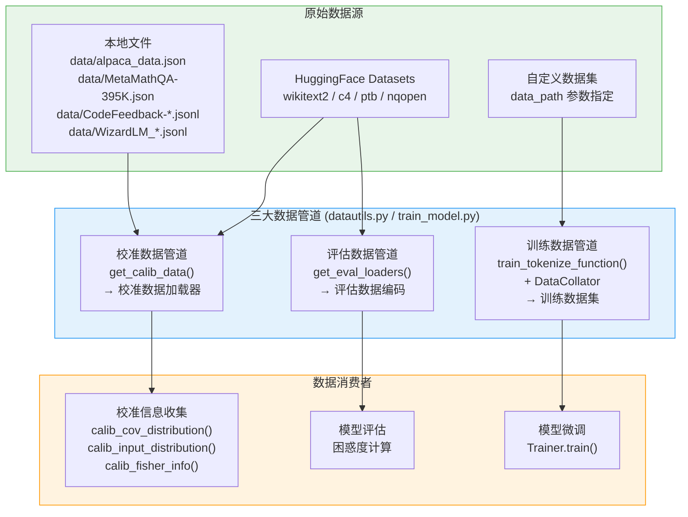
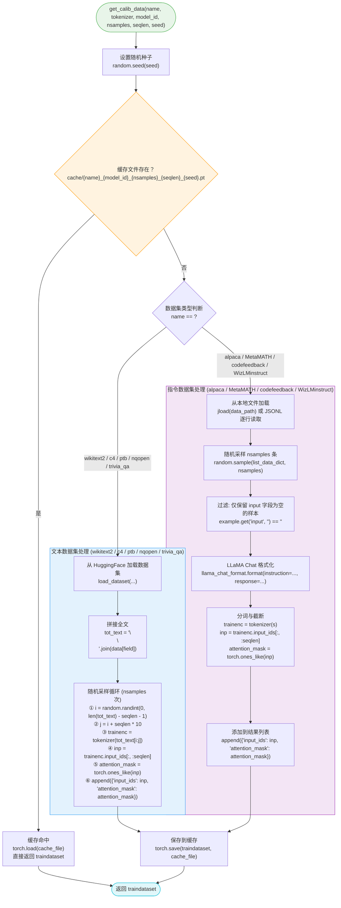
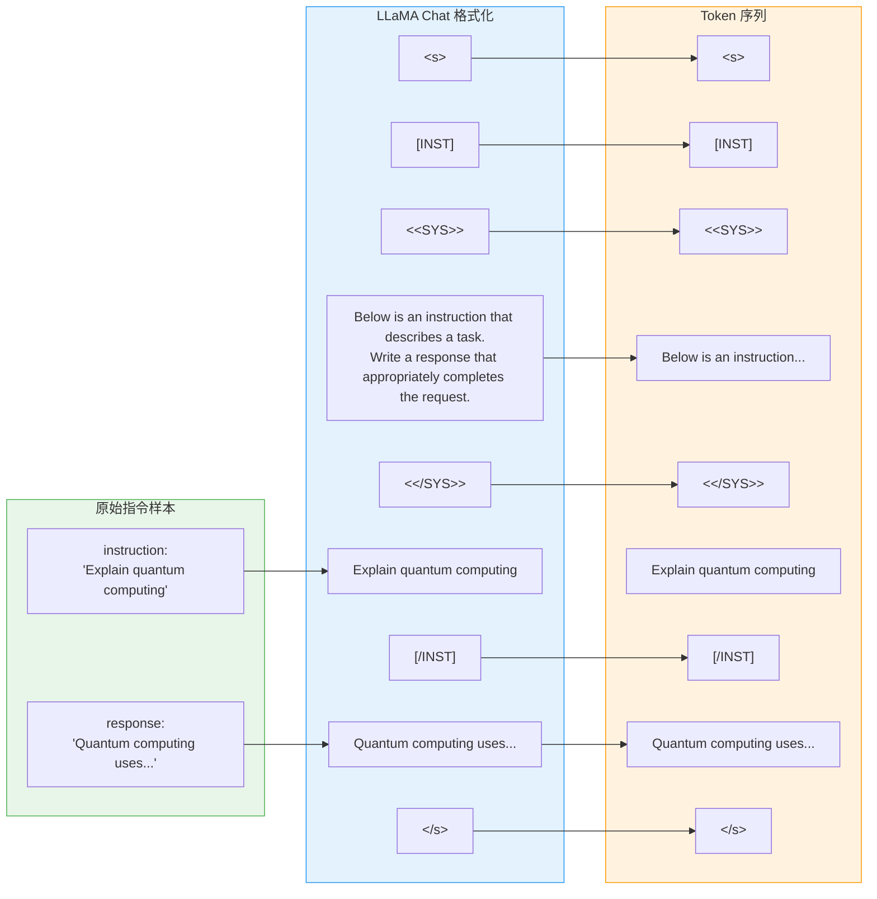
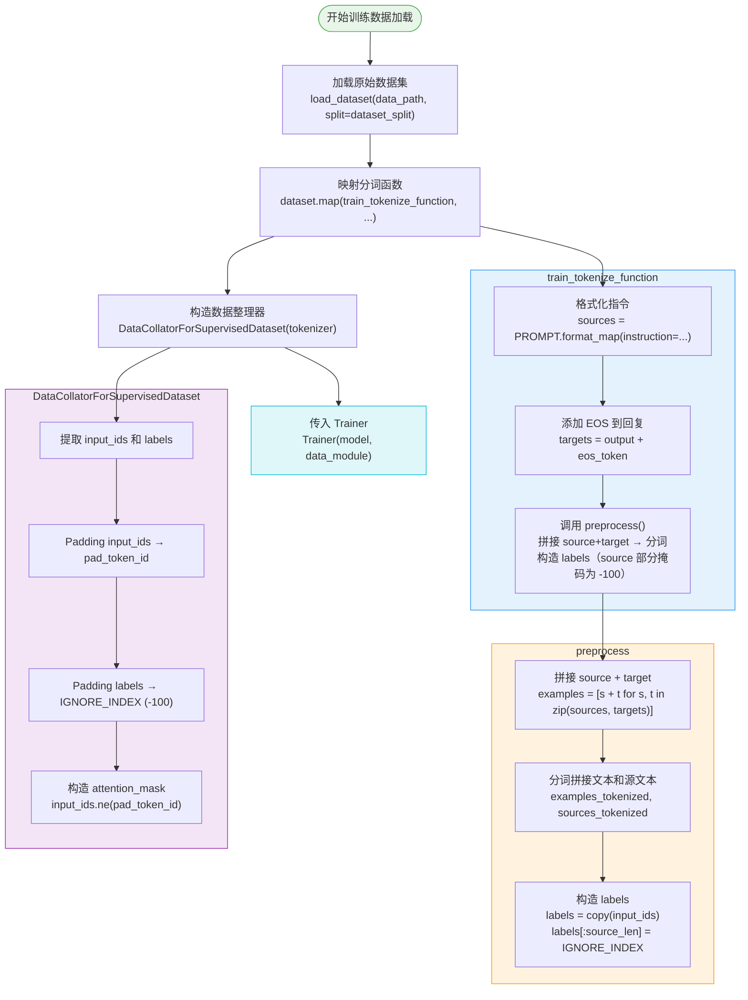
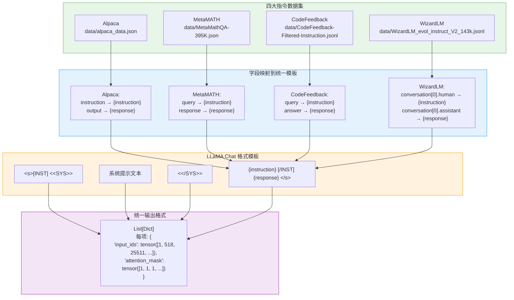
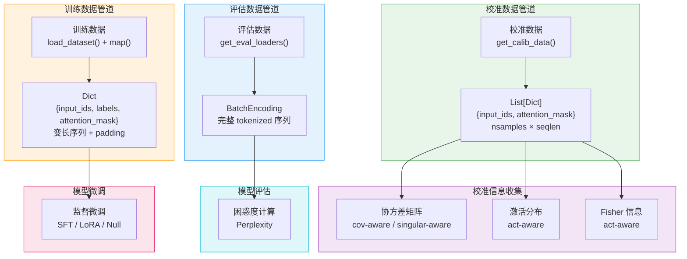

# 数据管道：校准数据与训练数据

> 本文档深入剖析 LoRA-Null 项目中数据管道的完整机制。数据管道是连接"原始数据"与"模型训练/校准"的桥梁——校准数据为 SVD 分解提供输入分布信息，训练数据为微调提供监督信号，评估数据为性能度量提供基准。我们将从整体架构出发，逐一详解校准数据加载、评估数据加载、训练数据处理三大子系统，最终回归到数据格式与缓存系统的统一设计。

---

## 总览：数据管道的设计哲学

### 为什么需要三套数据管道？

LoRA-Null 项目中存在三套独立的数据管道，它们服务于截然不同的目的：

| 数据管道 | 核心函数 | 服务阶段 | 数据用途 | 输出格式 |
|---------|---------|---------|---------|---------|
| 校准数据加载 | `get_calib_data()` | 模型初始化（SVD 分解前） | 探测模型各线性层的输入分布 | `List[Dict]`，每项含 `input_ids` 和 `attention_mask` |
| 评估数据加载 | `get_eval_loaders()` | 模型评估（训练后） | 度量模型困惑度等指标 | `BatchEncoding`，含完整 tokenized 序列 |
| 训练数据处理 | `train_tokenize_function()` + `DataCollator` | 模型微调（训练中） | 提供监督微调的输入-标签对 | `Dict`，含 `input_ids`、`labels`、`attention_mask` |

三套管道的**根本差异**在于：校准数据只需"喂给模型做前向传播"来收集统计量，不需要标签；训练数据需要"指令-回复"配对来构造监督信号；评估数据需要完整的文本序列来计算困惑度。

### 数据管道在整体流程中的位置



**图解说明**：三大数据管道分别从 HuggingFace 远程数据集和本地文件中加载数据，经过不同的预处理流程后，供给校准信息收集、模型评估和模型微调三个下游消费者。校准数据和评估数据共享部分数据源（如 wikitext2、c4、ptb），但处理方式不同；训练数据使用独立的 HuggingFace 数据集加载机制。

---

## 分述一：校准数据加载

### 1.1 函数签名与默认参数

```python
def get_calib_data(name, tokenizer, model_id, nsamples, seqlen=2048, seed=3):
```

| 参数 | 类型 | 默认值 | 说明 |
|------|------|--------|------|
| `name` | `str` | — | 数据集名称，决定加载逻辑分支 |
| `tokenizer` | `PreTrainedTokenizer` | — | 分词器，用于将文本转为 token |
| `model_id` | `str` | — | 模型标识符，用于缓存文件命名 |
| `nsamples` | `int` | — | 采样数量 |
| `seqlen` | `int` | `2048` | 序列长度（token 数） |
| `seed` | `int` | `3` | 随机种子，保证可复现性 |

### 1.2 支持的数据集总览

`get_calib_data` 支持 8 种数据集，按处理逻辑可分为两大类：

| 类别 | 数据集 | 数据来源 | 文本字段 | 采样方式 |
|------|--------|---------|---------|---------|
| **文本数据集** | wikitext2 | HuggingFace: `wikitext/wikitext-2-raw-v1` | `text` | 随机起始位置截取 |
| | c4 | HuggingFace: `allenai/c4` | `text` | 随机起始位置截取 |
| | ptb | HuggingFace: `ptb_text_only/penn_treebank` | `sentence` | 随机起始位置截取 |
| | nqopen | HuggingFace: `nq_open` | `question` | 随机起始位置截取 |
| | trivia_qa | HuggingFace: `trivia_qa/rc` | `question` | 随机起始位置截取 |
| **指令数据集** | alpaca | 本地: `data/alpaca_data.json` | `instruction` / `output` | 随机采样完整样本 |
| | MetaMATH | 本地: `data/MetaMathQA-395K.json` | `query` / `response` | 随机采样完整样本 |
| | codefeedback | 本地: `data/CodeFeedback-Filtered-Instruction.jsonl` | `query` / `answer` | 随机采样完整样本 |
| | WizLMinstruct | 本地: `data/WizardLM_evol_instruct_V2_143k.jsonl` | `conversation[0].human` / `conversation[0].assistant` | 随机采样完整样本 |

### 1.3 校准数据加载流程图



**图解说明**：校准数据加载的核心逻辑分为两条路径——文本类数据集从 HuggingFace 加载全文后随机截取子序列，指令类数据集从本地文件加载后随机采样完整样本并套用 LLaMA Chat 模板。两条路径最终都输出统一格式 `List[Dict]`，每项包含 `input_ids` 和 `attention_mask` 两个张量。缓存机制在入口处拦截，避免重复计算。

### 1.4 文本数据集的加载与采样

#### 加载与拼接

文本类数据集的加载逻辑位于第 123–146 行。核心模式是：从 HuggingFace 加载指定 split，然后将所有文本条目用 `"\n\n"` 拼接为一个超长字符串 `tot_text`。

```python
# wikitext2（第 131–133 行）
traindata = load_dataset("wikitext", "wikitext-2-raw-v1", split="train")
tot_text = "\n\n".join(traindata["text"])

# c4（第 123–130 行）
traindata = load_dataset(
    "allenai/c4", "allenai--c4",
    data_files={"train": "en/c4-train.00000-of-01024.json.gz"},
    split="train",
)
tot_text = "\n\n".join(traindata["text"])

# ptb（第 134–140 行）
traindata = load_dataset("ptb_text_only", "penn_treebank", split="train")
tot_text = "\n\n".join(traindata["sentence"])

# nqopen（第 145–146 行）
traindata = load_dataset("nq_open", split="train")
tot_text = "\n\n".join(traindata["question"])

# trivia_qa（第 141–143 行）
traindata = load_dataset("trivia_qa", "rc", split="train")
tot_text = "\n\n".join(traindata["question"])
```

**关键细节**：

1. **c4 仅加载一个分片**：`data_files={"train": "en/c4-train.00000-of-01024.json.gz"}`，C4 数据集有 1024 个分片，此处只加载第 0 个分片，避免下载过多数据
2. **不同数据集使用不同字段**：wikitext2 和 c4 使用 `text` 字段，ptb 使用 `sentence` 字段，nqopen 和 trivia_qa 使用 `question` 字段
3. **用 `"\n\n"` 拼接**：双换行符作为段落分隔符，保持文本的自然分段结构

#### 随机采样策略

拼接完成后，通过随机采样从 `tot_text` 中截取 `nsamples` 个子序列，每个子序列长度为 `seqlen` 个 token：

```python
# 第 231–238 行
traindataset = []
for _ in range(nsamples):
    i = random.randint(0, len(tot_text) - seqlen - 1)
    j = i + seqlen * 10
    trainenc = tokenizer(tot_text[i:j], return_tensors="pt")
    inp = trainenc.input_ids[:, :seqlen]
    attention_mask = torch.ones_like(inp)
    traindataset.append({"input_ids": inp, "attention_mask": attention_mask})
```

**采样策略的数学分析**：

1. **起始位置**：`i = random.randint(0, len(tot_text) - seqlen - 1)`，确保起始位置不会太靠近文本末尾
2. **截取字符数**：`j = i + seqlen * 10`，截取 `seqlen * 10` 个字符。乘以 10 是因为一个 token 平均约对应 4 个字符，10 倍的余量确保截取的文本经分词后至少有 `seqlen` 个 token
3. **截断到 seqlen**：`inp = trainenc.input_ids[:, :seqlen]`，只取前 `seqlen` 个 token
4. **attention_mask 全 1**：`torch.ones_like(inp)`，因为截取的序列没有 padding，所有位置都是有效的

**与旧版 `sample_train_loaders` 的差异**：

旧版函数 `sample_train_loaders`（第 16–44 行）使用了不同的截取策略：

```python
# 旧版（第 38–43 行）
i = random.randint(0, len(traindata) - seqlen * 2 - 1)
j = i + seqlen * 2
trainenc = tokenizer(traindata[i:j], return_tensors="pt")
inp = trainenc.input_ids[:, :seqlen]
trainloader.append(inp)
```

| 差异点 | 旧版 `sample_train_loaders` | 新版 `get_calib_data` |
|--------|---------------------------|----------------------|
| 截取字符数 | `seqlen * 2` | `seqlen * 10` |
| 返回格式 | 仅 `input_ids` 张量 | `{"input_ids": ..., "attention_mask": ...}` |
| 支持数据集 | wikitext2, c4 | 8 种数据集 |
| 缓存机制 | 无 | 有 |

新版使用 `seqlen * 10` 提供了更大的余量，避免因分词后 token 数不足 `seqlen` 而导致序列过短。

### 1.5 指令数据集的加载与格式化

#### LLaMA Chat 格式模板

所有指令数据集都使用 LLaMA Chat 格式进行格式化，模板定义在第 89–94 行：

```python
llama_chat_format = """<s>[INST] <<SYS>>
"Below is an instruction that describes a task. Write a response that appropriately completes the request."
<</SYS>>

{instruction} [/INST] {response} </s>
"""
```

#### LLaMA Chat 格式模板示例



**图解说明**：LLaMA Chat 格式将指令和回复包裹在特定的标记中。`<s>` 是序列起始标记，`[INST]...[/INST]` 包裹指令部分，`<<SYS>>...<</SYS>>` 包裹系统提示，`</s>` 是序列结束标记。这种格式是 LLaMA 2 Chat 模型的标准对话格式，确保校准数据的分布与模型训练时的输入分布一致。

#### 各指令数据集的字段映射

不同指令数据集使用不同的字段名存储指令和回复，但都通过 `llama_chat_format.format(instruction=..., response=...)` 映射到统一模板：

| 数据集 | instruction 来源 | response 来源 | 加载方式 | 文件格式 |
|--------|-----------------|-------------|---------|---------|
| alpaca | `example["instruction"]` | `example["output"]` | `jload()` | JSON |
| MetaMATH | `example["query"]` | `example["response"]` | `jload()` | JSON |
| codefeedback | `example["query"]` | `example["answer"]` | JSONL 逐行读取 | JSONL |
| WizLMinstruct | `example["conversation"][0]["human"]` | `example["conversation"][0]["assistant"]` | JSONL 逐行读取 | JSONL |

#### 输入字段过滤

所有指令数据集都有一个过滤条件：**仅保留 `input` 字段为空的样本**。

```python
if example.get("input", "") == "":
    # 处理该样本
```

这一过滤的目的是排除多轮对话或带有额外上下文输入的样本，只保留"纯指令-回复"对。因为 LLaMA Chat 模板中没有为 `input` 字段预留位置，包含额外输入的样本无法正确格式化。

#### JSON 与 JSONL 的加载差异

**JSON 格式**（alpaca、MetaMATH）使用 `jload` 函数一次性加载整个文件：

```python
# alpaca（第 149–150 行）
data_path = "data/alpaca_data.json"
list_data_dict = jload(data_path)

# MetaMATH（第 166–167 行）
data_path = "data/MetaMathQA-395K.json"
list_data_dict = jload(data_path)
```

**JSONL 格式**（codefeedback、WizLMinstruct）需要逐行读取并解析：

```python
# codefeedback（第 181–189 行）
data_path = "data/CodeFeedback-Filtered-Instruction.jsonl"
with open(data_path, 'r') as json_file:
    json_list = list(json_file)
list_data_dict = []
for item in json_list:
    dict_item = json.loads(item)
    list_data_dict.append(dict_item)
    assert isinstance(dict_item, dict)
```

JSONL（JSON Lines）格式每行是一个独立的 JSON 对象，不能直接用 `json.load` 加载，必须逐行解析。

#### 采样方式差异

大多数数据集使用 `random.sample` 进行无放回采样：

```python
selected_data_dict = random.sample(list_data_dict, nsamples)
```

但 `codefeedback` 使用了 `numpy.random.choice`：

```python
random_indices = np.random.choice(len(list_data_dict), nsamples, replace=False)
selected_data_dict = [list_data_dict[i] for i in random_indices]
```

两者功能等价（都是无放回随机采样），但实现方式不同。`random.sample` 更 Pythonic，`np.random.choice` 更灵活（支持有放回采样、概率加权等）。

### 1.6 缓存机制

#### 缓存文件命名

缓存文件路径由数据集名称、模型 ID、采样数量、序列长度和随机种子共同决定：

```python
cache_file = f"cache/{name}_{model_id.replace('/','_')}_{nsamples}_{seqlen}_{seed}.pt"
```

**命名示例**：

```
cache/wikitext2_meta-llama_Llama-2-7b-hf_256_2048_3.pt
cache/MetaMATH_meta-llama_Llama-2-7b-hf_128_2048_42.pt
cache/alpaca_meta-llama_Llama-2-7b-chat-hf_256_2048_3.pt
```

**model_id 处理**：`model_id.replace('/', '_')` 将路径中的斜杠替换为下划线，例如 `meta-llama/Llama-2-7b-hf` → `meta-llama_Llama-2-7b-hf`，避免被误解为目录层级。

#### 缓存命中逻辑

```python
# 第 115–122 行
if not os.path.exists("cache"):
    os.makedirs("cache")
if os.path.exists(cache_file):
    print(f"found data file: {cache_file}")
    traindataset = torch.load(cache_file)
    print("loaded ...")
    return traindataset
```

缓存命中的判断非常简单：**文件存在即命中**。不检查文件内容的完整性或版本兼容性。这意味着如果缓存文件损坏，`torch.load` 可能抛出异常。

#### 缓存保存时机

文本类数据集在采样循环结束后统一保存：

```python
# 第 239–240 行
torch.save(traindataset, cache_file)
return traindataset
```

指令类数据集在各自的处理分支末尾保存：

```python
# 以 alpaca 为例（第 163–164 行）
torch.save(traindataset, cache_file)
return traindataset
```

**注意**：指令类数据集的保存和返回在各自的 `elif` 分支中，而文本类数据集的保存在所有文本分支的公共出口处。这是代码结构上的差异——指令类数据集需要提前返回（因为格式化逻辑不同），而文本类数据集共享采样逻辑。

#### 缓存失效分析

缓存文件名编码了所有影响校准数据内容的参数：

| 参数变化 | 是否导致缓存失效 | 原因 |
|---------|----------------|------|
| 更换数据集 (`name`) | 是 | 文件名包含 `name` |
| 更换模型 (`model_id`) | 是 | 文件名包含 `model_id`（不同模型的分词器不同） |
| 更换采样数 (`nsamples`) | 是 | 文件名包含 `nsamples` |
| 更换序列长度 (`seqlen`) | 是 | 文件名包含 `seqlen` |
| 更换随机种子 (`seed`) | 是 | 文件名包含 `seed` |
| 本地数据文件内容变化 | **否** | 文件名不包含数据文件的哈希或修改时间 |

**潜在问题**：如果本地数据文件（如 `data/alpaca_data.json`）被更新，缓存不会自动失效，可能返回过时的校准数据。使用时需注意手动清除缓存。

---

## 分述二：评估数据加载

### 2.1 函数签名

```python
def get_eval_loaders(name, tokenizer):
```

评估数据加载函数的接口比校准数据简单得多——不需要采样参数，因为它加载的是**完整的评估集**。

### 2.2 支持的数据集

| 数据集 | HuggingFace 路径 | 使用 split | 文本字段 |
|--------|-----------------|-----------|---------|
| wikitext2 | `wikitext/wikitext-2-raw-v1` | `test` | `text` |
| ptb | `ptb_text_only/penn_treebank` | `validation` | `sentence` |
| c4 | `allenai/c4/allenai--c4` | `validation` | `text` |

### 2.3 逐数据集解析

#### wikitext2

```python
# 第 244–251 行
testdata = load_dataset("wikitext", "wikitext-2-raw-v1", split="test")
testenc = tokenizer("\n\n".join(testdata["text"]), return_tensors="pt")
return testenc
```

使用 **test split**，将所有文本条目用 `"\n\n"` 拼接后整体分词。返回的 `testenc` 是一个 `BatchEncoding` 对象，包含完整的 tokenized 序列。

#### ptb

```python
# 第 252–259 行
valdata = load_dataset("ptb_text_only", "penn_treebank", split="validation")
testenc = tokenizer("\n\n".join(valdata["sentence"]), return_tensors="pt")
return testenc
```

使用 **validation split**（PTB 数据集的惯例），将所有句子用 `"\n\n"` 拼接后整体分词。注意字段名是 `sentence` 而非 `text`。

#### c4

```python
# 第 260–268 行
testdata = load_dataset(
    "allenai/c4", "allenai--c4",
    data_files={"validation": "en/c4-validation.00000-of-00008.json.gz"},
    split="validation",
)
testenc = tokenizer("\n\n".join(testdata["text"]), return_tensors="pt")
return testenc
```

使用 **validation split**，仅加载 C4 验证集的第一个分片（共 8 个分片）。

### 2.4 与校准数据的关键差异

| 方面 | 校准数据 `get_calib_data` | 评估数据 `get_eval_loaders` |
|------|--------------------------|---------------------------|
| 数据 split | train | test / validation |
| 采样方式 | 随机采样 nsamples 个子序列 | 不采样，加载完整文本 |
| 返回格式 | `List[Dict]`（多个短序列） | `BatchEncoding`（一个长序列） |
| 缓存机制 | 有 | 无 |
| attention_mask | 显式构造（全 1） | 由 tokenizer 自动生成 |
| 用途 | 前向传播收集统计量 | 困惑度评估（逐段计算） |

评估数据不需要采样，因为困惑度评估需要对完整文本进行逐段预测。典型的评估流程是将长序列按 `seqlen` 切分为多个片段，逐片段计算损失后取平均。

---

## 分述三：训练数据处理

### 3.1 训练数据加载流程

训练数据的处理来自 `train_model.py`，使用了 HuggingFace 的标准数据加载管线，但增加了自定义的分词函数和数据整理器。



**图解说明**：训练数据处理管线由三个核心组件构成——`train_tokenize_function` 负责将原始数据格式化为指令-回复对并分词，`preprocess` 负责构造带有源部分掩码的标签，`DataCollatorForSupervisedDataset` 负责将变长序列 padding 到统一长度。三者协同工作，将原始数据集转化为模型可直接消费的训练批次。

### 3.2 原始数据加载

```python
# train_model.py 第 243 行
raw_train_datasets = load_dataset(script_args.data_path, split=script_args.dataset_split)
```

使用 HuggingFace 的 `load_dataset` 加载原始数据集。关键参数：

| 参数 | 默认值 | 说明 |
|------|--------|------|
| `data_path` | `None`（必填） | HuggingFace 数据集路径或本地路径 |
| `dataset_split` | `"train[:100000]"` | 数据集 split 及切片，默认取前 10 万条 |
| `dataset_field` | `None`（必填） | `[query_field, response_field]`，指定指令和回复的字段名 |

**`dataset_split` 的切片语法**：`"train[:100000]"` 表示取 train split 的前 100,000 条数据。HuggingFace 支持类似 Python 切片的语法，如 `"train[:50%]"`、`"train[10000:20000]"` 等。

**`dataset_field` 的作用**：不同数据集使用不同的字段名存储指令和回复，`dataset_field` 参数允许用户指定映射关系：

```python
# train_model.py 第 252 行
fn_kwargs={
    "tokenizer": tokenizer,
    "query": script_args.dataset_field[0],    # 指令字段名
    "response": script_args.dataset_field[1],  # 回复字段名
}
```

### 3.3 train_tokenize_function 详解

```python
# train_model.py 第 163–167 行
def train_tokenize_function(examples, tokenizer, query, response):
    sources = [PROMPT.format_map(dict(instruction=instruction)) for instruction in examples[query]]
    targets = [f"{output}{tokenizer.eos_token}" for output in examples[response]]
    data_dict = preprocess(sources, targets, tokenizer)
    return data_dict
```

**逐步解析**：

1. **格式化指令**：使用 `PROMPT` 模板将每条指令包装为标准格式
2. **添加 EOS**：在每个回复末尾添加 `tokenizer.eos_token`（如 `</s>`），标记回复的结束
3. **调用 preprocess**：将格式化后的指令和回复传入预处理函数

### 3.4 PROMPT 模板

```python
# train_model.py 第 14–18 行
PROMPT = (
    "Below is an instruction that describes a task. "
    "Write a response that appropriately completes the request.\n\n"
    "### Instruction:\n{instruction}\n\n### Response:"
)
```

这是 **Alpaca 格式**的指令模板，与校准数据中使用的 **LLaMA Chat 格式**不同。两者的对比：

| 方面 | Alpaca 格式（训练用） | LLaMA Chat 格式（校准用） |
|------|---------------------|------------------------|
| 系统提示 | 内嵌在模板中 | 包裹在 `<<SYS>>...<</SYS>>` 中 |
| 指令标记 | `### Instruction:` | `[INST]...[/INST]` |
| 回复标记 | `### Response:` | `[/INST]` |
| 特殊 token | 无 BOS/EOS 标记 | `<s>` 和 `</s>` |
| 适用场景 | 监督微调（SFT） | 校准数据格式化 |
| 模板来源 | Alpaca 项目 | LLaMA 2 Chat 项目 |

**填充示例**：

Alpaca 格式：
```
Below is an instruction that describes a task. Write a response that appropriately completes the request.

### Instruction:
Explain quantum computing

### Response:
```

LLaMA Chat 格式：
```
<s>[INST] <<SYS>>
"Below is an instruction that describes a task. Write a response that appropriately completes the request."
<</SYS>>

Explain quantum computing [/INST] Quantum computing uses... </s>
```

### 3.5 preprocess 函数详解

```python
# train_model.py 第 128–140 行
def preprocess(sources, targets, tokenizer):
    examples = [s + t for s, t in zip(sources, targets)]
    examples_tokenized, sources_tokenized = [
        _tokenize_fn(strings, tokenizer) for strings in (examples, sources)
    ]
    input_ids = examples_tokenized["input_ids"]
    labels = copy.deepcopy(input_ids)
    for label, source_len in zip(labels, sources_tokenized["input_ids_lens"]):
        label[:source_len] = IGNORE_INDEX
    return dict(input_ids=input_ids, labels=labels)
```

**核心逻辑**：

1. **拼接 source + target**：将指令模板和回复拼接为一个完整文本
2. **分别分词**：对拼接文本和纯指令文本分别分词，获取各自的 token 长度
3. **构造 labels**：深拷贝 `input_ids` 作为 `labels`，然后将指令部分（前 `source_len` 个 token）掩码为 `IGNORE_INDEX`（-100）

**掩码机制的意义**：

在计算交叉熵损失时，PyTorch 的 `CrossEntropyLoss` 默认忽略标签值为 -100 的位置。这意味着：

- **指令部分**（`label[:source_len] = -100`）：不参与损失计算，模型不会被惩罚对指令的预测
- **回复部分**（`label[source_len:]` 保持原值）：参与损失计算，模型学习生成正确的回复

这种设计确保模型只学习"如何回复"，而不是"如何复述指令"。

### 3.6 _tokenize_fn 辅助函数

```python
# train_model.py 第 104–125 行
def _tokenize_fn(strings, tokenizer):
    tokenized_list = [
        tokenizer(
            text,
            return_tensors="pt",
            padding="longest",
            max_length=tokenizer.model_max_length,
            truncation=True,
        )
        for text in strings
    ]
    input_ids = labels = [tokenized.input_ids[0] for tokenized in tokenized_list]
    input_ids_lens = labels_lens = [
        tokenized.input_ids.ne(tokenizer.pad_token_id).sum().item()
        for tokenized in tokenized_list
    ]
    return dict(
        input_ids=input_ids,
        labels=labels,
        input_ids_lens=input_ids_lens,
        labels_lens=labels_lens,
    )
```

**关键细节**：

1. **逐文本分词**：对每个文本单独分词，而非批量分词，确保每个样本的 token 对齐正确
2. **padding="longest"**：在单文本分词时无实际效果（只有一个序列），但保持接口一致性
3. **长度计算**：`input_ids.ne(tokenizer.pad_token_id).sum()` 通过统计非 padding token 的数量来计算有效长度，而非直接使用 `len(input_ids[0])`，因为 padding 后的序列长度可能大于有效 token 数

### 3.7 DataCollatorForSupervisedDataset 详解

```python
# train_model.py 第 143–161 行
@dataclass
class DataCollatorForSupervisedDataset(object):
    tokenizer: transformers.PreTrainedTokenizer

    def __call__(self, instances: Sequence[Dict]) -> Dict[str, torch.Tensor]:
        input_ids, labels = tuple(
            [instance[key] for instance in instances] for key in ("input_ids", "labels")
        )
        input_ids = [torch.tensor(x) for x in input_ids]
        input_ids = torch.nn.utils.rnn.pad_sequence(
            input_ids, batch_first=True, padding_value=self.tokenizer.pad_token_id
        )
        labels = [torch.tensor(x) for x in labels]
        labels = torch.nn.utils.rnn.pad_sequence(
            labels, batch_first=True, padding_value=IGNORE_INDEX
        )
        return dict(
            input_ids=input_ids,
            labels=labels,
            attention_mask=input_ids.ne(self.tokenizer.pad_token_id),
        )
```

**逐步解析**：

1. **提取字段**：从每个实例中提取 `input_ids` 和 `labels`
2. **Padding input_ids**：使用 `pad_sequence` 将变长序列填充到同一长度，padding 值为 `pad_token_id`
3. **Padding labels**：同样使用 `pad_sequence`，但 padding 值为 `IGNORE_INDEX`（-100），确保 padding 位置不参与损失计算
4. **构造 attention_mask**：`input_ids.ne(pad_token_id)` 生成注意力掩码——非 padding 位置为 `True`，padding 位置为 `False`

**三种填充值的对比**：

| 字段 | 填充值 | 含义 |
|------|--------|------|
| `input_ids` | `pad_token_id` | 模型识别的 padding token |
| `labels` | `IGNORE_INDEX` (-100) | 损失函数忽略的位置 |
| `attention_mask` | 自动生成（`False`） | 注意力机制忽略的位置 |

三者协同确保：模型不会关注 padding 位置（attention_mask），也不会因 padding 位置产生梯度（labels 中的 -100），同时 padding token 不会与真实 token 混淆（input_ids 中的 pad_token_id）。

### 3.8 数据集映射与批处理

```python
# train_model.py 第 244–253 行
train_dataset = raw_train_datasets.map(
    train_tokenize_function,
    batched=True,
    batch_size=3000,
    num_proc=16,
    remove_columns=raw_train_datasets.column_names,
    load_from_cache_file=True,
    desc="Running tokenizer on train dataset",
    fn_kwargs={"tokenizer": tokenizer, "query": script_args.dataset_field[0], "response": script_args.dataset_field[1]}
)
```

| 参数 | 值 | 说明 |
|------|-----|------|
| `batched` | `True` | 批量处理，`train_tokenize_function` 接收的是一批样本而非单个样本 |
| `batch_size` | `3000` | 每批处理 3000 个样本 |
| `num_proc` | `16` | 使用 16 个进程并行处理 |
| `remove_columns` | 原始列名 | 移除原始列，只保留分词后的 `input_ids` 和 `labels` |
| `load_from_cache_file` | `True` | 启用 HuggingFace 的 Arrow 缓存 |
| `fn_kwargs` | 字段映射 | 传递给 `train_tokenize_function` 的额外参数 |

---

## 分述四：数据格式详解

### 4.1 两种指令格式的对比

LoRA-Null 项目中存在两种指令格式，分别用于不同阶段：

#### Alpaca 格式（训练阶段）

```
Below is an instruction that describes a task. Write a response that appropriately completes the request.

### Instruction:
{instruction}

### Response:
{response}</s>
```

- 系统提示直接嵌入文本
- 使用 `###` 标记分段
- 无特殊 BOS/EOS 标记（由 tokenizer 自动处理）
- 回复部分参与损失计算

#### LLaMA Chat 格式（校准阶段）

```
<s>[INST] <<SYS>>
"Below is an instruction that describes a task. Write a response that appropriately completes the request."
<</SYS>>

{instruction} [/INST] {response} </s>
```

- 使用 LLaMA 2 的对话标记（`[INST]`、`<<SYS>>` 等）
- 系统提示包裹在 `<<SYS>>...<</SYS>>` 中
- 显式包含 `<s>` 和 `</s>` 标记
- 整个序列作为校准输入，无需区分指令和回复

#### 为什么使用不同格式？

这并非设计疏忽，而是有意为之：

1. **校准阶段**使用 LLaMA Chat 格式，是因为校准数据需要模拟模型在推理时的真实输入分布。如果目标模型是 LLaMA 2 Chat，那么推理时的输入就是 LLaMA Chat 格式，校准数据应该与之匹配
2. **训练阶段**使用 Alpaca 格式，是因为训练数据需要与 Alpaca 风格的指令数据集兼容，且训练时需要明确区分指令部分（不计算损失）和回复部分（计算损失），Alpaca 格式的 `### Response:` 标记更便于这种区分

### 4.2 数据集格式对比图



**图解说明**：四种指令数据集虽然使用不同的字段名存储指令和回复，但都通过字段映射统一到 LLaMA Chat 格式模板的 `{instruction}` 和 `{response}` 占位符。最终所有数据集都输出统一的 `List[Dict]` 格式，每个字典包含 `input_ids` 和 `attention_mask` 两个张量。这种"多源一汇"的设计使得校准系统可以无缝切换不同数据集。

### 4.3 各数据集原始格式示例

#### Alpaca

```json
{
    "instruction": "Describe the structure of an atom.",
    "input": "",
    "output": "An atom is made up of three types of particles..."
}
```

#### MetaMATH

```json
{
    "query": "What is the sum of the first 100 positive integers?",
    "response": "Using the formula S = n(n+1)/2, we get S = 100×101/2 = 5050.",
    "type": "GSM_Ans"
}
```

#### CodeFeedback

```json
{
    "query": "Write a Python function to reverse a linked list.",
    "answer": "def reverse_linked_list(head):\n    prev = None\n    ...",
    "input": ""
}
```

#### WizardLM

```json
{
    "conversation": [
        {"human": "Explain the difference between TCP and UDP.", "assistant": "TCP is connection-oriented..."}
    ]
}
```

**注意**：WizardLM 的数据格式最为特殊——指令和回复嵌套在 `conversation` 数组的第一个元素中，需要通过 `example["conversation"][0]["human"]` 和 `example["conversation"][0]["assistant"]` 访问。这种格式支持多轮对话，但校准时只取第一轮。

---

## 分述五：辅助函数

### 5.1 set_seed

```python
# datautils.py 第 11–13 行
def set_seed(seed):
    np.random.seed(seed)
    torch.random.manual_seed(seed)
```

设置 NumPy 和 PyTorch 的随机种子，确保实验可复现。注意此函数仅设置了 NumPy 和 PyTorch 的种子，未设置 Python 内置 `random` 模块的种子——而 `get_calib_data` 中使用的是 `random.seed(seed)`（Python 内置），两者互不影响。

**潜在问题**：`set_seed` 和 `get_calib_data` 使用了不同的随机数生成器。如果需要全局一致的随机行为，应同时设置 `random.seed()`、`np.random.seed()` 和 `torch.manual_seed()`。

### 5.2 sample_train_loaders（旧版）

```python
# datautils.py 第 16–44 行
def sample_train_loaders(name, tokenizer, nsamples=128, seed=0, seqlen=2048):
    set_seed(seed)
    if "wikitext2" in name:
        traindata = load_dataset("wikitext", "wikitext-2-raw-v1", split="train")
        traindata = "\n\n".join(traindata["text"])
    elif "c4" in name:
        traindata = load_dataset(
            "allenai/c4", "allenai--c4",
            data_files={"train": "en/c4-train.00000-of-01024.json.gz"},
            split="train",
        )
        traindata = "\n\n".join(traindata["text"])
    else:
        raise NotImplementedError

    trainloader = []
    for _ in range(nsamples):
        i = random.randint(0, len(traindata) - seqlen * 2 - 1)
        j = i + seqlen * 2
        trainenc = tokenizer(traindata[i:j], return_tensors="pt")
        inp = trainenc.input_ids[:, :seqlen]
        trainloader.append(inp)
    return trainloader
```

这是 `get_calib_data` 的前身，仅支持 wikitext2 和 c4 两种数据集。与新版的主要差异：

| 差异点 | `sample_train_loaders` | `get_calib_data` |
|--------|----------------------|-----------------|
| 支持数据集 | wikitext2, c4 | 8 种 |
| 截取字符数 | `seqlen * 2` | `seqlen * 10` |
| 返回格式 | `List[Tensor]`（仅 input_ids） | `List[Dict]`（input_ids + attention_mask） |
| 缓存机制 | 无 | 有 |
| 默认参数 | nsamples=128, seed=0 | nsamples 由调用方指定, seed=3 |

### 5.3 get_redpajama_train

```python
# datautils.py 第 47–60 行
def get_redpajama_train(tokenizer, percent=10, seed=3, batch_size=128, max_length=2048):
    def tokenization(example):
        return tokenizer(example["text"], truncation=True, max_length=max_length)

    if percent != 100:
        split = f"train[:{int(850000*percent/100)}]"
    else:
        split = "train"
    dataset = load_dataset("togethercomputer/RedPajama-Data-1T-Sample", split=split)

    processed_dataset = dataset.map(
        tokenization, batched=True, batch_size=batch_size, num_proc=os.cpu_count()
    )
    return processed_dataset
```

加载 RedPajama 数据集，支持按百分比采样。关键设计：

1. **百分比采样**：`percent=10` 表示取训练集的前 10%（约 85,000 条），通过 HuggingFace 的切片语法实现
2. **批量分词**：使用 `dataset.map` 进行批量分词，`num_proc=os.cpu_count()` 充分利用 CPU 并行
3. **截断**：`truncation=True, max_length=2048` 确保序列不超过最大长度

### 5.4 get_english_quote

```python
# datautils.py 第 63–66 行
def get_english_quote(dataset_name, tokenizer):
    data = load_dataset(dataset_name)
    data = data.map(lambda samples: tokenizer(samples["quote"]), batched=True)
    return data["train"]
```

加载英文引语数据集（如 `Abirate/english_quotes`），对 `quote` 字段进行分词。这是一个简单的辅助函数，用于 QAT（Quantization-Aware Training）数据加载。

### 5.5 get_qat_dataset

```python
# datautils.py 第 69–78 行
def get_qat_dataset(name, tokenizer, data_percent):
    if name == "red_pajama":
        data = get_redpajama_train(tokenizer, data_percent)
    elif name == "Abirate/english_quotes":
        data = get_english_quote(name, tokenizer)
    else:
        raise NotImplementedError
    data = data.shuffle()
    return data
```

统一的 QAT 数据集加载器，根据名称分发到具体的加载函数，最后对数据进行随机打乱。

### 5.6 jload

```python
# datautils.py 第 97–108 行
def _make_r_io_base(f, mode: str):
    if not isinstance(f, io.IOBase):
        f = open(f, mode=mode)
    return f

def jload(f, mode="r"):
    """Load a .json file into a dictionary."""
    f = _make_r_io_base(f, mode)
    jdict = json.load(f)
    f.close()
    return jdict
```

JSON 文件加载工具函数。`_make_r_io_base` 是一个适配器，接受文件路径或已打开的文件对象；`jload` 在加载后显式关闭文件。这个函数用于加载 alpaca 和 MetaMATH 的 JSON 数据文件。

---

## 总述：数据管道的统一设计

### 设计统一性

回顾三大数据管道和辅助函数，它们共享以下设计原则：

1. **数据驱动的分布感知**：校准数据管道的核心目标是"用数据探测模型输入分布"，这与 LoRA-Null 的"感知式分解"哲学一脉相承——SVD 分解不再是盲目的，而是由数据分布引导的

2. **多源一汇的格式统一**：8 种校准数据集、3 种评估数据集、任意 HuggingFace 训练数据集，最终都汇聚为模型可消费的张量格式。不同数据集的字段名差异被字段映射抽象掉，不同文件格式（JSON/JSONL）被加载函数封装

3. **缓存优先的性能策略**：校准数据管道的缓存机制避免了重复的下载和分词开销，文件名编码了所有影响结果的参数，实现了自动化的缓存失效

4. **掩码驱动的监督信号**：训练数据管道通过 `IGNORE_INDEX` 掩码实现了"只对回复部分计算损失"的监督机制，这是指令微调的标准做法

### 三大管道的协作关系



**图解说明**：三大管道各自服务于不同的下游消费者。校准数据管道的输出被三类校准信息收集函数消费，为 SVD 分解提供分布先验；评估数据管道的输出用于计算模型困惑度，量化模型的语言建模能力；训练数据管道的输出直接传入 HuggingFace Trainer，驱动模型微调。三条管道虽然处理逻辑不同，但都遵循"加载→预处理→格式化"的基本范式。

### 核心洞察

数据管道的设计精髓在于**格式的选择与一致性**：

1. **校准数据选择 LLaMA Chat 格式**，是因为校准的目标是模拟模型在真实推理场景下的输入分布。对于 LLaMA 2 Chat 模型，推理时的输入就是 LLaMA Chat 格式，校准数据必须与之匹配，否则收集到的分布统计量会有偏差

2. **训练数据选择 Alpaca 格式**，是因为训练需要明确区分"指令部分"和"回复部分"，以便对回复部分计算损失。Alpaca 格式的 `### Response:` 标记天然地划分了这一边界

3. **评估数据不使用任何指令格式**，是因为评估的是基础语言建模能力（困惑度），而非指令遵循能力。纯文本序列直接分词即可

这种"不同阶段使用不同格式"的设计，看似不一致，实则是对各阶段需求的精确响应——校准需要真实分布匹配，训练需要监督信号构造，评估需要纯净的语言建模度量。

---

## 源码参考索引

| 功能 | 函数名 | 文件位置 | 行号 |
|------|--------|---------|------|
| 设置随机种子 | `set_seed()` | `adapterlib/datautils.py` | 11–13 |
| 旧版校准数据加载 | `sample_train_loaders()` | `adapterlib/datautils.py` | 16–44 |
| RedPajama 数据加载 | `get_redpajama_train()` | `adapterlib/datautils.py` | 47–60 |
| 英文引语加载 | `get_english_quote()` | `adapterlib/datautils.py` | 63–66 |
| QAT 数据集加载 | `get_qat_dataset()` | `adapterlib/datautils.py` | 69–78 |
| LLaMA Chat 格式模板 | `llama_chat_format` | `adapterlib/datautils.py` | 89–94 |
| JSON 文件加载 | `jload()` | `adapterlib/datautils.py` | 103–108 |
| 校准数据加载 | `get_calib_data()` | `adapterlib/datautils.py` | 110–240 |
| 评估数据加载 | `get_eval_loaders()` | `adapterlib/datautils.py` | 243–269 |
| Alpaca 格式模板 | `PROMPT` | `train_model.py` | 14–18 |
| 分词辅助函数 | `_tokenize_fn()` | `train_model.py` | 104–125 |
| 训练数据预处理 | `preprocess()` | `train_model.py` | 128–140 |
| 监督数据整理器 | `DataCollatorForSupervisedDataset` | `train_model.py` | 143–161 |
| 训练分词函数 | `train_tokenize_function()` | `train_model.py` | 163–167 |
| 训练主函数 | `train()` | `train_model.py` | 169–271 |
