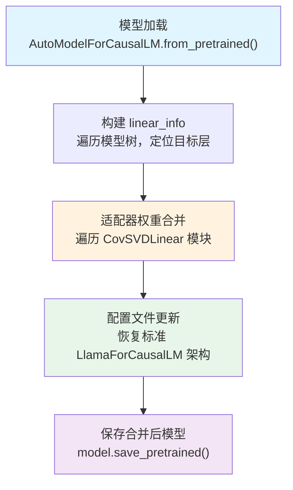
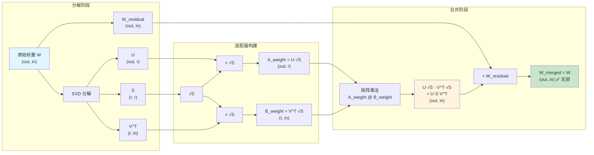
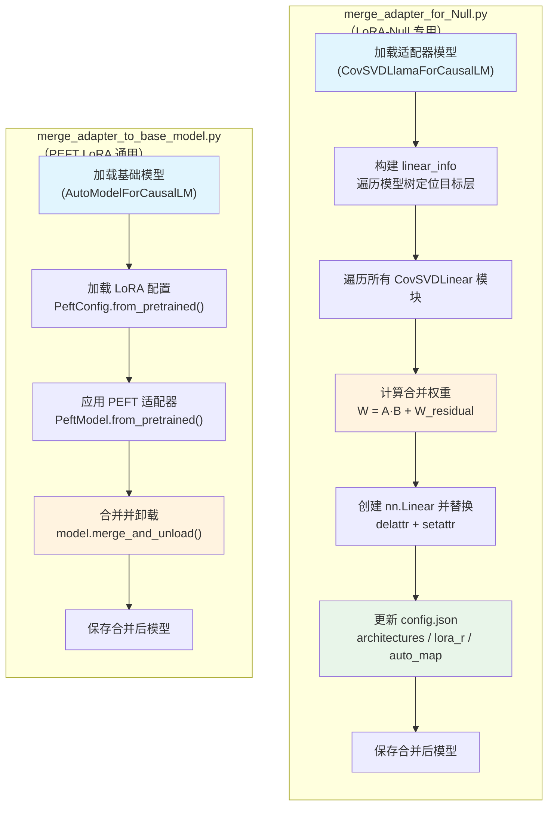
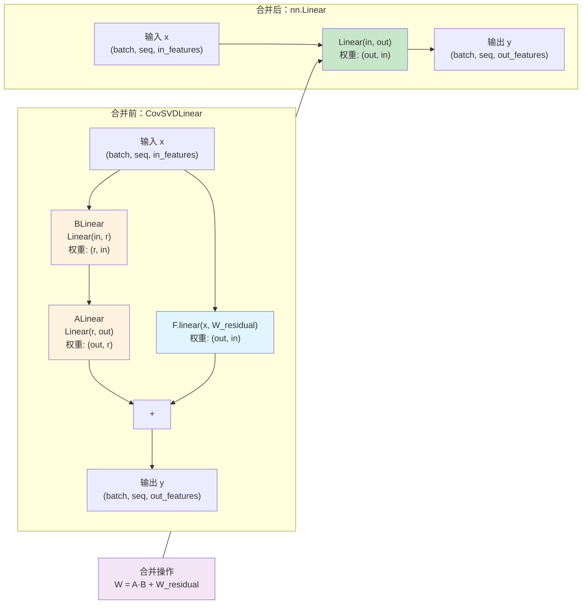
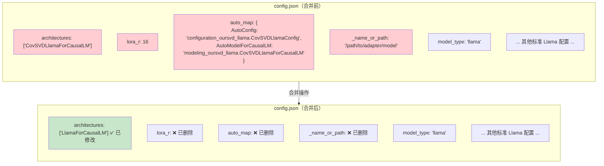

# 08 适配器合并：权重融合机制

## 总览：适配器合并的核心思想

在 LoRA-Null 项目中，模型在训练阶段使用自定义的 `CovSVDLinear` 适配器层替代标准的 `nn.Linear` 层，以实现参数高效微调。然而，在推理部署阶段，适配器层会引入额外的计算开销（低秩分解带来的两次矩阵乘法）。**适配器合并（Adapter Merging）** 的核心目标，就是将训练好的低秩适配器权重无损地融合回原始权重矩阵，使模型恢复为标准的 `nn.Linear` 结构，从而在推理时消除任何额外计算代价。

这一过程的关键在于数学上的**无损性**——合并后的权重矩阵与原始权重矩阵完全等价，不存在任何精度损失（在相同数值精度下）。LoRA-Null 项目提供了两种合并方法，分别针对不同的适配器实现方式。

---

## 分述一：merge_adapter_for_Null.py——LoRA-Null 主合并方法

### 1.1 整体流程概览

`merge_adapter_for_Null.py` 是 LoRA-Null 项目的核心合并脚本，专门用于合并基于 `CovSVDLinear` 结构的适配器。其整体流程可分为四个阶段：**模型加载 → 线性层信息构建 → 适配器权重合并 → 配置文件更新与保存**。



### 1.2 第一阶段：模型加载

合并脚本首先加载待合并的适配器模型，使用 HuggingFace Transformers 的标准接口：

```python
model = AutoModelForCausalLM.from_pretrained(
    model_id, device_map="auto", torch_dtype=torch.float16, trust_remote_code=True
)
tokenizer = AutoTokenizer.from_pretrained(model_id, trust_remote_code=True)
```

关键参数说明：

| 参数 | 值 | 说明 |
|------|-----|------|
| `device_map` | `"auto"` | 自动分配模型到可用 GPU，支持多卡推理 |
| `torch_dtype` | `torch.float16` | 使用半精度加载，减少显存占用 |
| `trust_remote_code` | `True` | 允许加载自定义模型代码（`CovSVDLlamaForCausalLM`） |

由于模型使用了自定义的 `CovSVDLlamaForCausalLM` 架构（通过 `config.json` 中的 `auto_map` 字段映射），必须设置 `trust_remote_code=True` 才能正确加载。

### 1.3 第二阶段：构建 linear_info 字典

合并操作需要精确定位模型中每一个待合并的适配器层，并记录其父模块和属性名，以便后续替换。这一过程通过遍历模型树实现：

```python
full_name_dict = {module: name for name, module in model.named_modules()}
linear_info = {}
modules = [model]
while len(modules) > 0:
    submodule = modules.pop()
    for name, raw_linear in submodule.named_children():
        if name in ["q_proj", "k_proj", "v_proj", "o_proj",
                     "gate_proj", "up_proj", "down_proj"]:
            full_name = full_name_dict[raw_linear]
            linear_info[raw_linear] = {
                "father": submodule,
                "name": name,
                "full_name": full_name,
            }
        else:
            modules.append(raw_linear)
```

**遍历策略解析**：

该代码采用**广度优先**的树遍历方式，逐层深入模型结构。对于每个子模块：

- **目标层**：如果子模块名属于注意力投影层（`q_proj`/`k_proj`/`v_proj`/`o_proj`）或 MLP 投影层（`gate_proj`/`up_proj`/`down_proj`），则记录其信息到 `linear_info` 字典中。
- **非目标层**：如果子模块名不匹配，则将其压入待遍历栈，继续深入搜索。

`linear_info` 字典的键为模块对象本身，值为包含三个字段的字典：

| 字段 | 类型 | 说明 |
|------|------|------|
| `father` | `nn.Module` | 该层的父模块引用，用于后续 `delattr`/`setattr` 替换 |
| `name` | `str` | 该层在父模块中的属性名（如 `"q_proj"`） |
| `full_name` | `str` | 该层在完整模型中的路径名（如 `"model.layers.0.self_attn.q_proj"`） |

> **注意**：此处筛选条件基于**层名称**而非类型，这是因为模型加载后这些位置已被 `CovSVDLinear` 替代，但名称保持不变。

### 1.4 第三阶段：适配器权重合并

这是整个合并流程的核心步骤。代码遍历模型中的所有模块，找到 `CovSVDLinear` 类型的模块，执行权重融合和层替换：

```python
module_dict = {module: name for name, module in model.named_modules()}
for module in module_dict.keys():
    if type(module).__name__ == "CovSVDLinear":
        info = linear_info[module]
        in_features = module.BLinear.in_features
        out_features = module.ALinear.out_features
        new_linear = nn.Linear(in_features, out_features, bias=False)
        merged_weight = module.ALinear.weight.data @ module.BLinear.weight.data + module.weight_residual
        new_linear.weight.data = merged_weight
        delattr(info["father"], info["name"])
        setattr(info["father"], info["name"], new_linear)
```

**合并公式详解**：

$$W_{\text{merged}} = A_{\text{weight}} \cdot B_{\text{weight}} + W_{\text{residual}}$$

其中各矩阵的维度关系如下：

| 矩阵 | 形状 | 来源 |
|------|------|------|
| $A_{\text{weight}}$（ALinear.weight） | $(out\_features, r)$ | 高秩投影矩阵 |
| $B_{\text{weight}}$（BLinear.weight） | $(r, in\_features)$ | 低秩投影矩阵 |
| $W_{\text{residual}}$（weight_residual） | $(out\_features, in\_features)$ | 残差权重矩阵 |
| $W_{\text{merged}}$ | $(out\_features, in\_features)$ | 合并后的完整权重 |

**维度推导**：

$$
\underbrace{(out\_features, r)}_{A} \times \underbrace{(r, in\_features)}_{B} = \underbrace{(out\_features, in\_features)}_{AB}
$$

$$
\underbrace{(out\_features, in\_features)}_{AB} + \underbrace{(out\_features, in\_features)}_{W_{residual}} = \underbrace{(out\_features, in\_features)}_{W_{merged}}
$$

**层替换过程**：

合并后的权重被赋值给新创建的标准 `nn.Linear` 层，然后通过 Python 的 `delattr` + `setattr` 组合操作完成替换：

1. `delattr(info["father"], info["name"])`：从父模块中删除旧的 `CovSVDLinear` 层
2. `setattr(info["father"], info["name"], new_linear)`：在父模块中设置新的 `nn.Linear` 层

这种方式确保了模型结构在原地更新，无需重建整个模型。

### 1.5 第四阶段：配置文件更新

合并完成后，模型已从自定义的 `CovSVDLlamaForCausalLM` 架构恢复为标准的 `LlamaForCausalLM` 架构。配置文件也需要相应更新，以反映这一变化：

```python
config = model.config.to_dict()
config["architectures"] = ["LlamaForCausalLM"]
del config["lora_r"]
del config["auto_map"]
del config["_name_or_path"]
json.dump(config, open(save_path + "/config.json", "w"), indent=2)
```

**配置变更详情**：

| 操作 | 字段 | 原值 | 新值 | 原因 |
|------|------|------|------|------|
| 修改 | `architectures` | `["CovSVDLlamaForCausalLM"]` | `["LlamaForCausalLM"]` | 恢复标准架构标识 |
| 删除 | `lora_r` | 整数值（如 16） | — | 不再需要低秩参数 |
| 删除 | `auto_map` | 自定义类映射字典 | — | 不再使用自定义模型代码 |
| 删除 | `_name_or_path` | 模型路径字符串 | — | 清除原始路径信息 |

### 1.6 命令行参数

| 参数 | 类型 | 默认值 | 说明 |
|------|------|--------|------|
| `--model_id` | `str` | `None` | 待合并的适配器模型路径或 HuggingFace ID |
| `--save_model` | - | `True` | 是否保存合并后的模型 |
| `--save_path` | `str` | `None` | 合并后模型的保存路径（`save_model=True` 时必填） |

---

## 分述二：merge_adapter_to_base_model.py——PEFT LoRA 合并方法

### 2.1 整体流程概览

`merge_adapter_to_base_model.py` 是针对标准 PEFT LoRA 适配器的合并脚本，利用 HuggingFace PEFT 库的内置合并功能，流程更为简洁：

```python
# 1. 加载基础模型
model = AutoModelForCausalLM.from_pretrained(args.base_model, torch_dtype=torch.bfloat16, device_map='auto')

# 2. 加载 LoRA 配置
lora_config = PeftConfig.from_pretrained(args.adapter)
lora_config.init_lora_weights = True

# 3. 应用 PEFT 适配器
model = PeftModel.from_pretrained(model, args.adapter, config=lora_config)

# 4. 合并并卸载适配器
model = model.merge_and_unload()

# 5. 保存合并后模型
model.save_pretrained(args.output_path)
tokenizer.save_pretrained(args.output_path)
```

### 2.2 各步骤详解

**步骤一：加载基础模型**

```python
model = AutoModelForCausalLM.from_pretrained(args.base_model, torch_dtype=torch.bfloat16, device_map='auto')
```

与 `merge_adapter_for_Null.py` 不同，此处加载的是**原始基础模型**（未经过适配器修改的版本），使用 `bfloat16` 精度。

**步骤二：加载并配置 LoRA**

```python
lora_config = PeftConfig.from_pretrained(args.adapter)
lora_config.init_lora_weights = True
```

从适配器目录读取 LoRA 配置，并设置 `init_lora_weights=True`，确保适配器权重正确初始化。

**步骤三：应用适配器**

```python
model = PeftModel.from_pretrained(model, args.adapter, config=lora_config)
```

将 LoRA 适配器叠加到基础模型上，生成 `PeftModel` 实例。

**步骤四：合并并卸载**

```python
model = model.merge_and_unload()
```

调用 PEFT 库的 `merge_and_unload()` 方法，该方法内部自动完成：
- 将 LoRA 的 A、B 矩阵按缩放因子融合进基础权重
- 移除所有适配器相关的钩子和模块
- 返回标准的 `AutoModelForCausalLM` 模型

**步骤五：保存**

```python
model.save_pretrained(args.output_path)
tokenizer.save_pretrained(args.output_path)
```

### 2.3 命令行参数

| 参数 | 类型 | 说明 |
|------|------|------|
| `--base_model` | `str` | 基础模型路径或 HuggingFace ID |
| `--adapter` | `str` | PEFT LoRA 适配器路径 |
| `--output_path` | `str` | 合并后模型的保存路径 |

---

## 分述三：合并的数学验证——无损性证明

### 3.1 SVD 分解与适配器构建

在 LoRA-Null 中，原始权重矩阵 $W$ 首先经过 SVD 分解：

$$W = U \cdot S \cdot V^T + W_{\text{residual}}$$

其中：
- $U$：左奇异向量矩阵，形状 $(out, r)$
- $S$：奇异值对角矩阵，形状 $(r, r)$
- $V^T$：右奇异向量矩阵的转置，形状 $(r, in)$
- $W_{\text{residual}}$：残差权重，形状 $(out, in)$，表示被截断的低能量分量

### 3.2 UV 融合策略

在 `CovSVDLinear` 的构建过程中，采用 **UV 融合**（`sigma_fuse='UV'`）策略将奇异值分配到 A 和 B 两个矩阵中：

$$A_{\text{weight}} = U \cdot \sqrt{S}$$

$$B_{\text{weight}} = V^T \cdot \sqrt{S}$$

具体实现为：

```python
# sigma_fuse == 'UV' 时
self.ALinear.weight.data = U.mul(S.sqrt()).contiguous()    # A = U * √S
self.BLinear.weight.data = V.t().mul(S.sqrt().view(-1, 1)).contiguous()  # B = V^T * √S
```

> **为什么选择 UV 融合？** 将奇异值均匀分配到 A 和 B 两个矩阵中，可以避免单个矩阵的数值范围过大，有利于训练稳定性。相比之下，`sigma_fuse='U'` 将全部奇异值放入 A 矩阵，`sigma_fuse='V'` 将全部奇异值放入 B 矩阵，都可能导致数值不平衡。

### 3.3 无损合并的数学证明

**目标**：证明 $A_{\text{weight}} \cdot B_{\text{weight}} + W_{\text{residual}} = W$

**证明**：

$$
\begin{aligned}
A_{\text{weight}} \cdot B_{\text{weight}}
&= (U \cdot \sqrt{S}) \cdot (V^T \cdot \sqrt{S}) \\
&= U \cdot \sqrt{S} \cdot \sqrt{S} \cdot V^T \\
&= U \cdot S \cdot V^T
\end{aligned}
$$

因此：

$$
\begin{aligned}
W_{\text{merged}}
&= A_{\text{weight}} \cdot B_{\text{weight}} + W_{\text{residual}} \\
&= U \cdot S \cdot V^T + W_{\text{residual}} \\
&= W
\end{aligned}
$$

**证毕**：合并后的权重矩阵与原始权重矩阵完全等价，合并过程是无损的。



> **上图解读**：整个流程展示了从原始权重 $W$ 出发，经过 SVD 分解、UV 融合构建适配器、再通过矩阵乘法合并回原始权重的完整过程。关键在于 $\sqrt{S} \cdot \sqrt{S} = S$，使得中间的低秩表示可以无损还原。

### 3.4 前向传播等价性验证

除了权重的数学等价性，我们还可以验证前向传播的等价性。

**合并前**（CovSVDLinear 的 forward）：

$$y = A_{\text{weight}} \cdot (B_{\text{weight}} \cdot x) + W_{\text{residual}} \cdot x$$

**合并后**（标准 nn.Linear 的 forward）：

$$y = W_{\text{merged}} \cdot x = (A_{\text{weight}} \cdot B_{\text{weight}} + W_{\text{residual}}) \cdot x$$

由矩阵乘法的分配律：

$$
(A_{\text{weight}} \cdot B_{\text{weight}} + W_{\text{residual}}) \cdot x = A_{\text{weight}} \cdot B_{\text{weight}} \cdot x + W_{\text{residual}} \cdot x
$$

两者完全等价，因此合并前后模型的推理结果完全一致。

---

## 分述四：两种合并方法对比

### 4.1 核心差异

| 对比维度 | merge_adapter_for_Null.py | merge_adapter_to_base_model.py |
|----------|---------------------------|-------------------------------|
| **目标适配器** | CorDA_adapter / CovSVDLinear | PEFT LoRA |
| **合并方式** | 手动矩阵乘法 + 残差加法 | 库函数 `merge_and_unload()` |
| **模型加载** | 直接加载适配器模型 | 分别加载基础模型和适配器 |
| **数据精度** | float16 | bfloat16 |
| **配置更新** | 手动修改 config.json | 自动处理 |
| **架构还原** | CovSVDLlamaForCausalLM → LlamaForCausalLM | PeftModel → AutoModelForCausalLM |
| **权重公式** | $W = A \cdot B + W_{residual}$ | $W = W_{base} + \frac{\alpha}{r} \cdot A \cdot B$ |
| **无损性** | 完全无损（数学证明） | 完全无损（PEFT 保证） |
| **复杂度** | 较高（需手动遍历、替换、更新配置） | 较低（库函数封装） |

### 4.2 流程对比图



> **上图解读**：方法一需要手动完成模型遍历、权重计算、层替换和配置更新四个核心步骤，适用于 LoRA-Null 的自定义适配器结构。方法二则利用 PEFT 库的封装，仅需调用 `merge_and_unload()` 一行代码即可完成合并，适用于标准的 PEFT LoRA 适配器。

### 4.3 权重融合公式对比

**方法一（LoRA-Null）**：

$$W_{\text{merged}} = A_{\text{weight}} \cdot B_{\text{weight}} + W_{\text{residual}}$$

- $A_{\text{weight}}$ 和 $B_{\text{weight}}$ 包含了 SVD 分解的主成分（通过 UV 融合）
- $W_{\text{residual}}$ 保留了被截断的低能量分量，确保无损

**方法二（PEFT LoRA）**：

$$W_{\text{merged}} = W_{\text{base}} + \frac{\alpha}{r} \cdot A \cdot B$$

- $W_{\text{base}}$ 是原始基础权重
- $A \cdot B$ 是 LoRA 的低秩增量
- $\frac{\alpha}{r}$ 是缩放因子

两种方法的核心差异在于：LoRA-Null 的残差权重 $W_{\text{residual}}$ 是分解过程中分离出的低能量分量，而 PEFT LoRA 的 $W_{\text{base}}$ 是完整的基础权重，LoRA 增量 $A \cdot B$ 是额外学习到的调整量。

---

## 分述五：模型结构变化详解

### 5.1 合并前的模型结构

在合并前，模型使用 `CovSVDLlamaForCausalLM` 架构，其中所有线性层（除 `lm_head` 外）都被替换为 `CovSVDLinear`：

```
CovSVDLinear(
    BLinear = Linear(in_features, r, bias=False)     # 降维投影
    ALinear = Linear(r, out_features, bias=False)     # 升维投影
    weight_residual = Parameter(out_features, in_features)  # 残差权重
)
```

其前向传播为：

$$y = A_{\text{weight}} \cdot (B_{\text{weight}} \cdot x) + W_{\text{residual}} \cdot x$$

### 5.2 合并后的模型结构

合并后，所有 `CovSVDLinear` 层被替换为标准的 `nn.Linear`：

```
Linear(in_features, out_features, bias=False)
```

其前向传播为：

$$y = W_{\text{merged}} \cdot x$$

### 5.3 结构变化对比图



> **上图解读**：合并前，一次前向传播需要执行两次矩阵乘法（BLinear 和 ALinear）和一次残差加法。合并后，仅需一次矩阵乘法即可完成等价计算，推理效率显著提升。

### 5.4 具体层的变化示例

以 Llama 模型的第 0 层自注意力模块为例：

**合并前**：

```
model.layers.0.self_attn.q_proj: CovSVDLinear(
    BLinear: Linear(4096, 16, bias=False)      # in=4096, r=16
    ALinear: Linear(16, 4096, bias=False)       # r=16, out=4096
    weight_residual: Parameter(4096, 4096)       # 残差
)
```

**合并后**：

```
model.layers.0.self_attn.q_proj: Linear(4096, 4096, bias=False)
```

参数量变化：合并前 $4096 \times 16 + 16 \times 4096 + 4096 \times 4096 = 16,908,288$，合并后 $4096 \times 4096 = 16,777,216$。合并前多出的 $131,072$ 参数正是低秩适配器的额外参数（$2 \times r \times d$）。

### 5.5 配置文件变化图



> **上图解读**：合并操作对配置文件做了三类变更：(1) 将 `architectures` 从自定义的 `CovSVDLlamaForCausalLM` 恢复为标准的 `LlamaForCausalLM`；(2) 删除了适配器特有的 `lora_r` 参数；(3) 删除了自定义模型映射 `auto_map` 和原始路径 `_name_or_path`。这些变更确保合并后的模型可以被标准的 HuggingFace Transformers 直接加载，无需任何自定义代码。

---

## 总结：适配器合并机制的核心要点

### 核心原理

适配器合并的本质是**将低秩分解的权重表示无损还原为完整的权重矩阵**。在 LoRA-Null 中，这通过简单的矩阵乘法和加法实现：

$$W = A \cdot B + W_{\text{residual}}$$

这一公式的无损性由 SVD 分解的数学性质和 UV 融合策略共同保证。

### 实践意义

1. **推理加速**：合并后每次前向传播从两次矩阵乘法降为一次，推理速度显著提升
2. **部署简化**：合并后的模型恢复为标准 `LlamaForCausalLM` 架构，无需自定义代码，可直接使用 HuggingFace Transformers 加载
3. **无损保证**：数学证明合并前后模型输出完全一致，不存在任何精度损失
4. **灵活性**：两种合并方法分别覆盖 LoRA-Null 自定义适配器和标准 PEFT LoRA，满足不同场景需求

### 关键设计决策

- **UV 融合策略**：将奇异值均匀分配到 A 和 B 矩阵，既保证了合并的无损性，又有利于训练稳定性
- **残差权重**：$W_{\text{residual}}$ 保留了 SVD 截断的低能量分量，使得低秩适配器只需学习主成分方向
- **配置还原**：合并后清理所有自定义配置字段，确保模型可以被标准工具链无缝使用

适配器合并是 LoRA-Null 从训练到部署的关键桥梁，它将参数高效微调的优势（训练时低显存、低参数量）与标准模型推理的高效性完美结合，实现了"训练时轻量、推理时无损"的设计目标。
