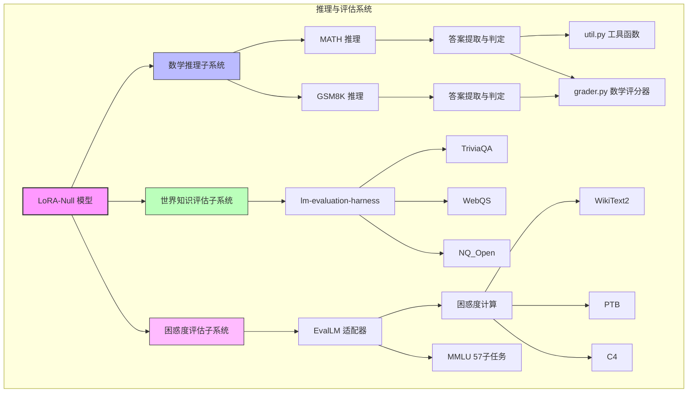
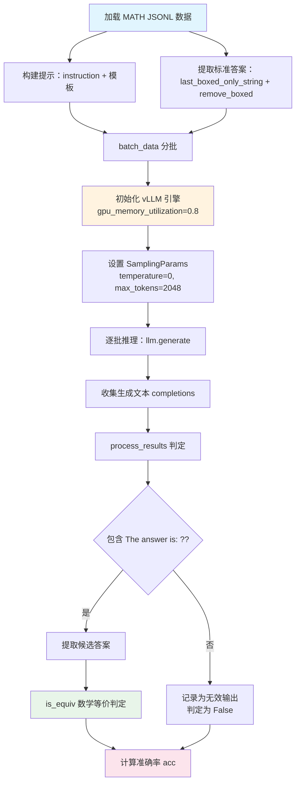
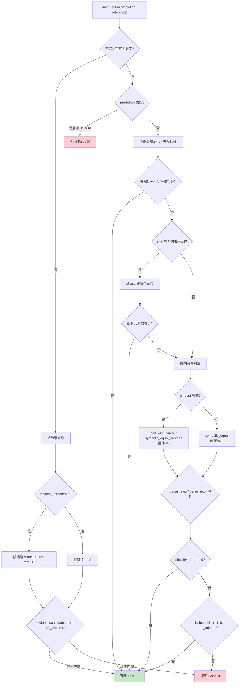
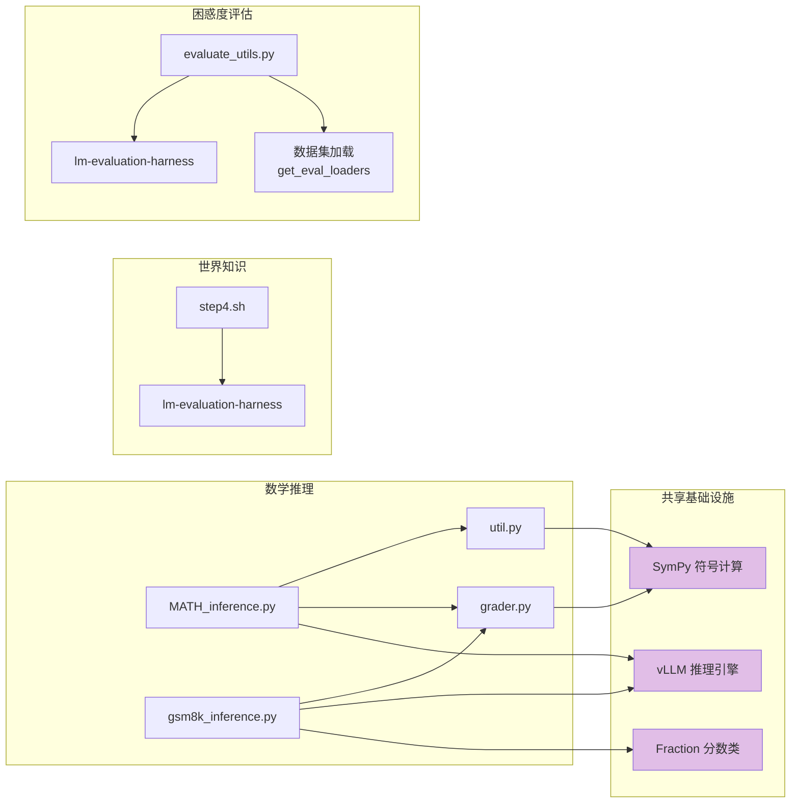

# 09 推理与评估系统

## 总论：推理与评估的整体架构

LoRA-Null 项目的推理与评估系统是衡量模型量化与适配效果的核心环节。该系统涵盖了从模型推理、答案提取、等价性判定到多维度评估的完整链路，旨在全面验证模型在数学推理（MATH、GSM8K）、世界知识（TriviaQA、WebQS、NQ_Open）以及语言建模能力（困惑度评估）等维度的表现。

整体而言，推理与评估系统可以分为三大子系统：

1. **数学推理子系统**：基于 vLLM 的高性能批量推理引擎，分别针对 MATH 和 GSM8K 两个数据集进行推理与评估，采用不同的答案提取与判定策略。
2. **世界知识评估子系统**：基于 EleutherAI/lm-evaluation-harness 框架，对模型在开放域问答任务上的表现进行标准化评估。
3. **困惑度评估子系统**：通过自定义的 `EvalLM` 适配器，将模型接入 lm-eval-harness 框架，计算模型在 WikiText2、PTB、C4 等语料上的困惑度，并支持 MMLU 等 57 个子任务的多任务评估。

以下架构图展示了整个推理与评估系统的组成与关系：



下面将分别对每个子系统进行深入剖析。

---

## 分论一：MATH 推理系统

### 1.1 系统概述

MATH 推理系统（`MATH_inference.py`）是针对 MATH 数据集的批量推理与评估流程。MATH 数据集包含高难度数学竞赛题，其答案以 LaTeX 格式的 `\boxed{}` 包裹，因此需要专门的答案提取与等价性判定机制。该系统利用 vLLM 引擎进行高效批量推理，采用贪心解码策略（temperature=0）确保推理结果的确定性。

### 1.2 vLLM 推理引擎配置

系统使用 vLLM 作为推理后端，充分发挥其 PagedAttention 和连续批处理的优势：

```python
llm = LLM(
    model=model,
    tensor_parallel_size=tensor_parallel_size,
    gpu_memory_utilization=0.8,
    trust_remote_code=True
)
```

关键配置参数：

| 参数 | 值 | 说明 |
|------|------|------|
| `model` | 命令行指定 | 模型路径，指向合并后的 LoRA-Null 模型 |
| `tensor_parallel_size` | 默认 1 | 张量并行度，支持多 GPU 推理 |
| `gpu_memory_utilization` | 0.8 | GPU 显存利用率，预留 20% 避免OOM |
| `trust_remote_code` | True | 信任远程代码（如自定义模型结构） |

采样参数配置：

```python
sampling_params = SamplingParams(
    temperature=0,
    top_p=1,
    max_tokens=2048,
    stop=["Instruction:", "Instruction", "Response:", "Response"]
)
```

| 参数 | 值 | 说明 |
|------|------|------|
| `temperature` | 0 | 贪心解码，确保结果可复现 |
| `top_p` | 1 | 不做核采样过滤 |
| `max_tokens` | 2048 | MATH 题目推理链较长，需较大 token 限制 |
| `stop` | 4 个停止标记 | 防止模型生成重复的指令/响应头 |

### 1.3 提示模板

MATH 推理采用统一的指令式提示模板，引导模型进行链式思维推理：

```
Below is an instruction that describes a task. Write a response that appropriately completes the request.

### Instruction:
{instruction}

### Response: Let's think step by step.
```

其中 `{instruction}` 为数据集中的题目文本，`Let's think step by step.` 是经典的链式思维（Chain-of-Thought）触发语，引导模型逐步推理。

### 1.4 数据加载与答案提取

MATH 数据集以 JSONL 格式存储，每条数据包含 `instruction`（题目）和 `output`（标准答案，LaTeX 格式）两个字段。标准答案的提取流程如下：

1. 从 `output` 字段中找到最后一个 `\boxed{}` 或 `\fbox{}`（由 `last_boxed_only_string()` 实现）
2. 使用 `remove_boxed()` 去除 `\boxed{` 前缀和 `}` 后缀，提取内部内容

```python
solution = item['output']
temp_ans = remove_boxed(util.last_boxed_only_string(solution))
```

`remove_boxed()` 函数逻辑简洁：验证字符串以 `\boxed{` 开头且以 `}` 结尾，然后截取中间内容：

```python
def remove_boxed(s):
    left = "\\boxed{"
    assert s[:len(left)] == left
    assert s[-1] == "}"
    return s[len(left):-1]
```

### 1.5 结果判定：process_results

模型生成结果与标准答案的比对由 `process_results()` 函数完成：

```python
def process_results(doc, completion, answer):
    split_ans = completion.split('The answer is: ')
    if len(split_ans) > 1:
        ans = split_ans[-1]
        extract_ans_temp = ans.split('.\n')[0]
        extract_ans_temp = extract_ans_temp.strip()
        if len(extract_ans_temp) > 0 and extract_ans_temp[-1] == '.':
            extract_ans = extract_ans_temp[0:-1]
        else:
            extract_ans = extract_ans_temp
        extract_ans = extract_ans.strip()
        if util.is_equiv(extract_ans, answer):
            return True
        else:
            return False
    else:
        invalid_outputs.append(temp)
        return False
```

判定流程：
1. 以 `"The answer is: "` 为分隔符分割模型输出
2. 取最后一段作为候选答案
3. 去除句号和多余空白
4. 调用 `util.is_equiv()` 进行数学等价性判定

若模型输出中不包含 `"The answer is: "` 标记，则视为无效输出并记录。

### 1.6 批量处理

`batch_data()` 函数将数据列表按 `batch_size` 分割为多个批次，最后一个批次包含剩余所有数据：

```python
def batch_data(data_list, batch_size=1):
    n = len(data_list) // batch_size
    batch_data = []
    for i in range(n-1):
        start = i * batch_size
        end = (i+1) * batch_size
        batch_data.append(data_list[start:end])
    last_start = (n-1) * batch_size
    last_end = MAX_INT
    batch_data.append(data_list[last_start:last_end])
    return batch_data
```

### 1.7 MATH 推理流程图



### 1.8 命令行参数

| 参数 | 类型 | 默认值 | 说明 |
|------|------|--------|------|
| `--model` | str | 必需 | 模型路径 |
| `--data_file` | str | `data/MATH_test.jsonl` | 数据文件路径 |
| `--start` | int | 0 | 起始索引 |
| `--end` | int | MAX_INT | 结束索引 |
| `--batch_size` | int | 50 | 批量大小 |
| `--tensor_parallel_size` | int | 1 | 张量并行度 |

---

## 分论二：GSM8K 推理系统

### 2.1 系统概述

GSM8K 推理系统（`gsm8k_inference.py`）针对 GSM8K（Grade School Math 8K）数据集进行推理与评估。GSM8K 数据集由小学数学应用题组成，答案为整数或简单小数，因此其答案提取策略与 MATH 系统有显著差异——不使用 LaTeX 解析，而是采用正则表达式与分数处理相结合的数值提取方式。

### 2.2 vLLM 推理引擎配置

GSM8K 的 vLLM 配置与 MATH 类似，但 `max_tokens` 设为 1024（GSM8K 推理链相对较短）：

```python
sampling_params = SamplingParams(
    temperature=0,
    top_p=1,
    max_tokens=1024,
    stop=["Instruction:", "Instruction", "Response:", "Response"]
)

llm = LLM(
    model=model,
    tensor_parallel_size=tensor_parallel_size,
    gpu_memory_utilization=0.8,
    trust_remote_code=True
)
```

### 2.3 数据加载与答案提取

GSM8K 数据集的答案格式为 `"#### number"`，通过 `"#### "` 分割后取第二部分即可获得数值答案：

```python
temp_ans = item['answer'].split('#### ')[1]
temp_ans = int(temp_ans.replace(',', ''))
```

注意：GSM8K 的标准答案为整数，因此直接 `int()` 转换，并去除千分位逗号。

### 2.4 模型输出答案提取：extract_answer_number

`extract_answer_number()` 是 GSM8K 推理系统的核心函数，负责从模型生成文本中提取数值答案：

```python
def extract_answer_number(completion):
    text = completion.split('The answer is: ')
    if len(text) > 1:
        extract_ans = text[-1].strip()
        match = re.search(r'[\-+]?\d*[\.,/]?\d+', extract_ans)
        if match:
            if '/' in match.group():
                # 分数处理：使用 Fraction 类
                denominator = match.group().split('/')[1]
                numerator = match.group().split('/')[0]
                if is_number(denominator) and is_number(numerator):
                    if denominator == '0':
                        return round(float(numerator.replace(',', '')))
                    else:
                        frac = Fraction(match.group().replace(',', ''))
                        return round(float(frac.numerator / frac.denominator))
                else:
                    return None
            else:
                # 整数或小数处理
                if float(match.group().replace(',', '')) == float('inf'):
                    return None
                return round(float(match.group().replace(',', '')))
        else:
            return None
    else:
        return None
```

该函数的处理逻辑涵盖三种数值格式：

1. **整数**：如 `42`，直接 `round(float(...))` 转换
2. **分数**：如 `3/4`，使用 `Fraction` 类精确计算后取浮点值
3. **小数**：如 `3.14`，直接浮点转换

特殊情况处理：
- 分母为 0 时，返回分子的浮点值
- 数值为 `inf` 时，返回 `None`
- 非数字的分子/分母，返回 `None`

### 2.5 结果判定

GSM8K 的结果判定采用双重策略——数值相等判定与数学等价判定：

```python
y_pred = extract_answer_number(completion)
if y_pred is not None:
    result.append(float(y_pred) == float(prompt_answer) or math_equal(y_pred, prompt_answer))
else:
    result.append(False)
```

判定优先级：
1. 首先进行浮点数精确相等比较
2. 若不精确相等，再调用 `math_equal()` 进行更宽松的等价性判定（支持近似相等、符号等价等）
3. 若无法提取答案（`y_pred is None`），直接判定为 `False`

### 2.6 GSM8K 答案提取流程图

```mermaid
flowchart TD
    A[模型生成文本 completion] --> B{包含 'The answer is: ' ?}
    B -->|否| C[返回 None → 判定为 False]
    B -->|是| D[取最后一段文本]
    D --> E[正则匹配 r=⁻+]d*.,/?d+]
    E --> F{匹配成功?}
    F -->|否| G[返回 None → 判定为 False]
    F -->|是| H{包含 / ?}
    H -->|是| I[分数处理]
    H -->|否| J{值为 inf?}
    I --> I1{分子分母均为数字?}
    I1 -->|否| I2[返回 None]
    I1 -->|是| I3{分母为 0?}
    I3 -->|是| I4[返回 round=float=numerator]
    I3 -->|否| I5[Fraction 精确计算<br/>round=float=num/den]
    J -->|是| K[返回 None]
    J -->|否| L[round=float=匹配值)]
    I4 --> M[数值相等 or math_equal 判定]
    I5 --> M
    L --> M
    M --> N{判定结果}
    N -->|True| O[正确]
    N -->|False| P[错误]

    style A fill:#e1f5fe
    style I fill:#fff3e0
    style M fill:#e8f5e9
    style C fill:#ffcdd2
    style G fill:#ffcdd2
    style I2 fill:#ffcdd2
    style K fill:#ffcdd2
```

### 2.7 命令行参数

| 参数 | 类型 | 默认值 | 说明 |
|------|------|--------|------|
| `--model` | str | 必需 | 模型路径 |
| `--data_file` | str | `data/gsm8k_test.jsonl` | 数据文件路径 |
| `--start` | int | 0 | 起始索引 |
| `--end` | int | MAX_INT | 结束索引 |
| `--batch_size` | int | 60 | 批量大小 |
| `--tensor_parallel_size` | int | 1 | 张量并行度 |

### 2.8 MATH 与 GSM8K 推理系统对比

| 特性 | MATH | GSM8K |
|------|------|-------|
| 数据集难度 | 数学竞赛级 | 小学数学级 |
| 答案格式 | LaTeX（`\boxed{}`） | 数值（`#### number`） |
| max_tokens | 2048 | 1024 |
| 默认 batch_size | 50 | 60 |
| 答案提取 | `last_boxed_only_string` + `remove_boxed` | `extract_answer_number`（正则+Fraction） |
| 等价判定 | `is_equiv`（strip_string + math_equal） | 浮点相等 + `math_equal` |
| 分数处理 | LaTeX `\frac{}{}` | Python `Fraction` 类 |

---

## 分论三：世界知识评估

### 3.1 评估框架

世界知识评估（`step4.sh`）使用 EleutherAI/lm-evaluation-harness 框架，这是大语言模型评估的事实标准工具。该框架提供了标准化的任务定义、评估协议和指标计算，确保评估结果的可比性和可复现性。

### 3.2 评估命令详解

```bash
CUDA_VISIBLE_DEVICES=0 accelerate launch -m lm_eval --model hf \
    --model_args pretrained=save_LoRA_Null_adapter_llama2_PT_128_math_Null_v1_merged \
    --output_path result_path/result.json \
    --tasks triviaqa,webqs,nq_open \
    --batch_size 64 \
    --max_batch_size 64 \
    --device cuda
```

参数解析：

| 参数 | 值 | 说明 |
|------|------|------|
| `CUDA_VISIBLE_DEVICES` | 0 | 指定使用的 GPU |
| `accelerate launch` | - | 使用 HuggingFace Accelerate 启动分布式推理 |
| `--model hf` | - | 使用 HuggingFace 模型加载器 |
| `--model_args` | `pretrained=模型路径` | 指定预训练模型路径 |
| `--tasks` | `triviaqa,webqs,nq_open` | 评估任务列表 |
| `--batch_size` | 64 | 推理批量大小 |
| `--max_batch_size` | 64 | 最大批量大小 |
| `--device` | cuda | 使用 GPU 推理 |

### 3.3 评估任务说明

| 任务 | 全称 | 说明 |
|------|------|------|
| `triviaqa` | Trivia Question Answering | 大规模 trivia 问答数据集，测试世界知识广度 |
| `webqs` | WebQuestions | 基于 Freebase 的自然语言问答，测试结构化知识 |
| `nq_open` | Natural Questions Open | 基于 Google 搜索查询的开放域问答 |

这三个任务共同覆盖了从事实性知识（TriviaQA）到结构化知识（WebQS）再到真实搜索场景（NQ_Open）的多维度世界知识评估。

---

## 分论四：困惑度评估系统

### 4.1 EvalLM 适配器类

`EvalLM` 类（`evaluate_utils.py`）继承自 `lm_eval.base.BaseLM`，是将 LoRA-Null 模型接入 lm-evaluation-harness 框架的适配器。该类封装了模型和分词器，实现了框架要求的接口：

```python
class EvalLM(BaseLM):
    def __init__(self, model, tokenizer, batch_size=1):
        super().__init__()
        self._device = model.device
        self.model = model
        self.model.eval()
        self.tokenizer = tokenizer
        self.vocab_size = self.tokenizer.vocab_size
        self.batch_size_per_gpu = batch_size
        self.seqlen = 2048
```

#### 核心属性

| 属性 | 实现 | 说明 |
|------|------|------|
| `eot_token_id` | `tokenizer.eos_token_id` | 文本结束标记 ID |
| `max_length` | `model.config.n_ctx` 或 `max_position_embeddings` | 模型最大序列长度 |
| `max_gen_toks` | 256 | 最大生成 token 数 |
| `batch_size` | `batch_size_per_gpu` | 每批次样本数 |
| `device` | `model.device` | 模型所在设备 |

#### 核心方法

**`tok_encode`**：将字符串编码为 token ID 列表（不添加特殊标记）：

```python
def tok_encode(self, string: str):
    return self.tokenizer.encode(string, add_special_tokens=False)
```

**`tok_decode`**：将 token ID 列表解码为字符串：

```python
def tok_decode(self, tokens):
    return self.tokenizer.decode(tokens)
```

**`_model_call`**：前向推理，返回 logits（截断至 vocab_size=50257，兼容 GPT-2 词表）：

```python
def _model_call(self, inps):
    with torch.no_grad():
        return self.model(inps)[0][:, :, :50257]
```

**`_model_generate`**：自回归生成（贪心解码）：

```python
def _model_generate(self, context, max_length, eos_token_id):
    return self.model.generate(
        context, max_length=max_length,
        eos_token_id=eos_token_id, do_sample=False
    )
```

### 4.2 困惑度计算：evaluate_perplexity

`evaluate_perplexity()` 函数实现了滑动窗口式的困惑度计算：

```python
@torch.no_grad()
def evaluate_perplexity(model, dataset, limit):
    nsamples, seqlen = dataset.size()
    nlls = []
    for i in range(nsamples):
        if i == limit:
            break
        input_ids = dataset[i:i+1, :-1].to(model.device)
        labels = dataset[i:i+1, 1:].contiguous()
        logits = model(input_ids=input_ids)[0]
        shift_logits = logits[:, :, :]
        shift_labels = labels.to(model.device)
        loss_fct = nn.CrossEntropyLoss()
        loss = loss_fct(
            shift_logits.view(-1, shift_logits.size(-1)),
            shift_labels.view(-1),
        )
        neg_log_likelihood = loss.float() * seqlen
        nlls.append(neg_log_likelihood)
    ppl = torch.exp(torch.stack(nlls).sum() / (len(nlls) * seqlen))
    return ppl.item()
```

计算原理：

1. **输入构造**：`input_ids = dataset[i:i+1, :-1]`（去掉最后一个 token），`labels = dataset[i:i+1, 1:]`（去掉第一个 token），实现 logits 与 labels 的错位对齐（shifted）
2. **交叉熵损失**：使用 `CrossEntropyLoss` 计算每个位置的预测损失
3. **负对数似然累积**：`NLL = loss × seqlen`，还原为序列级负对数似然
4. **困惑度计算**：`PPL = exp(Σ(NLL) / (N × seqlen))`，即所有 token 的平均负对数似然的指数

数学公式：

$$\text{PPL} = \exp\left(\frac{\sum_{i=1}^{N} \text{NLL}_i}{N \times L}\right)$$

其中 $N$ 为样本数，$L$ 为序列长度，$\text{NLL}_i$ 为第 $i$ 个样本的负对数似然。

### 4.3 多任务评估：evaluate_model

`evaluate_model()` 函数是评估的统一入口，支持困惑度评估和生成式评估两种模式：

```python
@torch.no_grad()
def evaluate_model(model, tokenizer, model_name, tasks, eval_ppl="",
                   num_fewshot=0, limit=-1, batch_size=1):
```

#### 困惑度评估模式

当 `eval_ppl` 非空时，对指定数据集计算困惑度。支持的数据集包括 `wikitext2`、`ptb`、`c4`。

困惑度评估的详细流程：

1. **数据加载**：通过 `get_eval_loaders()` 加载测试数据，支持缓存（`/tmp/{dataset}_testloader_{model_name}.cache`）
2. **序列切分**：将测试语料按 `seqlen=2048` 切分为多个固定长度序列
3. **逐段推理**：对每个序列段进行前向推理，计算交叉熵损失
4. **困惑度汇总**：指数化平均负对数似然得到 PPL

```python
for i in tqdm(range(nsamples)):
    batch = testenc[:, (i * lm.seqlen):((i + 1) * lm.seqlen)].to(lm.device)
    outputs = lm.model.model(batch)
    hidden_states = outputs[0]
    logits = lm.model.lm_head(hidden_states)
    shift_logits = logits[:, :-1, :]
    shift_labels = testenc[:, (i * lm.seqlen):((i + 1) * lm.seqlen)][:, 1:].to(lm.device)
    loss_fct = nn.CrossEntropyLoss()
    loss = loss_fct(shift_logits.view(-1, shift_logits.size(-1)), shift_labels.view(-1))
    neg_log_likelihood = loss.float() * lm.seqlen
    nlls.append(neg_log_likelihood)
```

注意：此处与 `evaluate_perplexity` 的区别在于，`evaluate_model` 直接调用 `model.model`（底层 Transformer）和 `model.lm_head`（语言模型头），而非 `model` 整体，这是为了适配 LoRA-Null 的模型包装结构。

#### 生成式评估模式

当 `tasks` 指定为 `mmlu` 或 `llmqat` 时，展开为具体子任务：

- **MMLU**：展开为 57 个子任务，涵盖 STEM、人文、社科等领域
- **LLM-QAT**：展开为 `lambada_openai, openbookqa`

MMLU 的 57 个子任务包括：abstract_algebra, anatomy, astronomy, business_ethics, clinical_knowledge, college_biology, college_chemistry, college_computer_science, college_mathematics, college_medicine, college_physics, computer_security, conceptual_physics, econometrics, electrical_engineering, elementary_mathematics, formal_logic, global_facts, high_school_biology, high_school_chemistry, high_school_computer_science, high_school_european_history, high_school_geography, high_school_government_and_politics, high_school_macroeconomics, high_school_mathematics, high_school_microeconomics, high_school_physics, high_school_psychology, high_school_statistics, high_school_us_history, high_school_world_history, human_aging, human_sexuality, international_law, jurisprudence, logical_fallacies, machine_learning, management, marketing, medical_genetics, miscellaneous, moral_disputes, moral_scenarios, nutrition, philosophy, prehistory, professional_accounting, professional_law, professional_medicine, professional_psychology, public_relations, security_studies, sociology, us_foreign_policy, virology, world_religions。

### 4.4 评估系统架构图

```mermaid
graph TB
    subgraph 评估入口
        EM[evaluate_model]
    end

    subgraph 困惑度评估
        EM --> EP{eval_ppl 非空?}
        EP -->|是| EL[加载数据集<br/>get_eval_loaders]
        EL --> WT2[WikiText2]
        EL --> PTB[PTB]
        EL --> C4[C4]
        WT2 --> PPL[滑动窗口推理<br/>CrossEntropyLoss]
        PTB --> PPL
        C4 --> PPL
        PPL --> PPLR[PPL = exp=ΣNLL / N×L)]
    end

    subgraph 生成式评估
        EM --> ET{tasks 类型}
        ET -->|mmlu| MMLU[57 个 MMLU 子任务]
        ET -->|llmqat| LLMQAT[lambada_openai<br/>openbookqa]
    end

    subgraph EvalLM 适配器
        MMLU --> ADAPTER[EvalLM]
        LLMQAT --> ADAPTER
        ADAPTER --> MC[_model_call: 前向推理]
        ADAPTER --> MG[_model_generate: 自回归生成]
        ADAPTER --> TE[tok_encode: 文本编码]
        ADAPTER --> TD[tok_decode: 文本解码]
    end

    subgraph 模型层
        MC --> TRANS[model.model: Transformer]
        MG --> TRANS
        TRANS --> LMHEAD[model.lm_head: 语言模型头]
    end

    style EM fill:#f9f,stroke:#333,stroke-width:2px
    style PPLR fill:#e8f5e9
    style ADAPTER fill:#fff3e0
```

---

## 分论五：工具函数库（util.py）

### 5.1 概述

`util.py` 提供了 MATH 推理系统所需的 LaTeX 字符串处理和数学等价性判定工具函数。这些函数构成了从模型原始输出到最终判定结果之间的关键桥梁。

### 5.2 last_boxed_only_string：定位最后一个 \boxed{}

该函数从字符串中找到最后一个 `\boxed{}` 或 `\fbox{}` 的完整内容，通过括号匹配精确定位：

```python
def last_boxed_only_string(string):
    idx = string.rfind("\\boxed")
    if idx < 0:
        idx = string.rfind("\\fbox")
        if idx < 0:
            return None
    i = idx
    num_left_braces_open = 0
    while i < len(string):
        if string[i] == "{":
            num_left_braces_open += 1
        if string[i] == "}":
            num_left_braces_open -= 1
            if num_left_braces_open == 0:
                right_brace_idx = i
                break
        i += 1
    return string[idx:right_brace_idx + 1]
```

算法要点：
1. 使用 `rfind` 从右向左搜索，确保取最后一个匹配
2. 优先搜索 `\boxed`，未找到再搜索 `\fbox`
3. 通过左大括号计数器实现嵌套括号匹配
4. 返回从 `\boxed` 开始到匹配的右大括号的完整子串

### 5.3 strip_string：LaTeX 字符串规范化

`strip_string()` 是数学等价性判定的前置处理函数，对 LaTeX 字符串进行一系列规范化操作以消除格式差异：

| 操作 | 示例 | 说明 |
|------|------|------|
| 去除换行 | `\n` → `""` | 消除换行差异 |
| 去除反空格 | `\!` → `""` | LaTeX 负间距 |
| 双反斜杠→单反斜杠 | `\\\\` → `\\` | 转义规范化 |
| tfrac/dfrac→frac | `\tfrac` → `\frac` | 分数格式统一 |
| 去除 \left \right | `\left(` → `(` | 定界符简化 |
| 去除度数标记 | `^{\circ}` → `""` | 度数符号消除 |
| 去除美元符号 | `\$` → `""` | 货币符号消除 |
| 去除右侧单位 | `\text{ m}` → 去除 | 单位文本消除 |
| 去除百分号 | `\%` → `""` | 百分号消除 |
| 补零 | `.5` → `0.5` | 小数格式规范化 |
| 去除短前缀等式 | `x = 5` → `5` | 变量赋值简化 |
| 修复 sqrt | `\sqrt3` → `\sqrt{3}` | 根号格式规范化 |
| 去除空格 | 所有空格 → `""` | 空格消除 |
| 修复分数 | `\frac12` → `\frac{1}{2}` | 分数格式规范化 |
| a/b → \frac{a}{b} | `3/4` → `\frac{3}{4}` | 简单分数转换 |
| 0.5 特殊处理 | `0.5` → `\frac{1}{2}` | 常见小数转分数 |

### 5.4 fix_fracs：修复 \frac 记法

`\frac` 后的参数若未用大括号包裹，该函数自动补全：

```python
def fix_fracs(string):
    substrs = string.split("\\frac")
    new_str = substrs[0]
    if len(substrs) > 1:
        for substr in substrs[1:]:
            new_str += "\\frac"
            if substr[0] == "{":
                new_str += substr  # 已有大括号，无需修复
            else:
                a = substr[0]      # 分子
                b = substr[1]      # 分母首字符
                if b != "{":
                    new_str += "{" + a + "}{" + b + "}" + substr[2:]
                else:
                    new_str += "{" + a + "}" + substr[1:]
    return new_str
```

转换示例：
- `\frac12` → `\frac{1}{2}`
- `\frac1{72}` → `\frac{1}{72}`
- `\frac{72}1` → 不处理（首个参数已有大括号）

### 5.5 fix_a_slash_b：简单分数转换

将 `a/b` 格式（a、b 均为整数）转换为 `\frac{a}{b}` 格式：

```python
def fix_a_slash_b(string):
    if len(string.split("/")) != 2:
        return string
    a = string.split("/")[0]
    b = string.split("/")[1]
    try:
        a = int(a)
        b = int(b)
        assert string == "{}/{}".format(a, b)
        return "\\frac{" + str(a) + "}{" + str(b) + "}"
    except:
        return string
```

注意：仅处理严格 `整数/整数` 格式，如 `3/4` → `\frac{3}{4}`，但不处理 `3.5/2` 等复杂情况。

### 5.6 is_equiv：数学等价性判定入口

`is_equiv()` 是 MATH 推理系统中答案判定的核心入口函数：

```python
def is_equiv(str1, str2, verbose=False):
    if str1 is None and str2 is None:
        return True
    if str1 is None or str2 is None:
        return False
    try:
        ss1 = strip_string(str1)
        ss2 = strip_string(str2)
        res = math_equal(ss1, ss2) or ss1 == ss2
        return res
    except Exception:
        res = math_equal(str1, str2) or str1 == str2
        return res
```

判定策略：
1. 双重 None 视为等价（警告）
2. 单侧 None 视为不等价
3. 先对两个字符串进行 `strip_string` 规范化
4. 使用 `math_equal` 进行语义等价判定，或字符串精确匹配
5. 异常时回退到原始字符串的 `math_equal` 判定

### 5.7 其他辅助函数

**`remove_right_units`**：去除 LaTeX 中的单位文本（`\text{ }` 包裹的内容）

**`fix_sqrt`**：修复 `\sqrt` 记法，如 `\sqrt3` → `\sqrt{3}`

**`_clean_numbers`**：为长数字添加千分位逗号，如 `1234` → `1,234`

**`last_boxed_only`**：对 (question, answer) 元组的 answer 部分提取最后一个 `\boxed{}`

**`only_until_first_boxed_from_tokens`**：从 token 列表中截取到第一个 `\boxed` 之前的内容

---

## 分论六：数学评分器（grader.py）

### 6.1 概述

`grader.py` 实现了 `math_equal()` 函数，这是整个推理与评估系统中数学等价性判定的核心引擎。该函数采用多层级判定策略，从数值比较到符号化简，覆盖了数学答案等价性的各种情况。

### 6.2 math_equal：多层级等价判定

```python
def math_equal(prediction, reference, include_percentage=True, is_close=True, timeout=False):
```

判定流程分为三个层级：

#### 第一层：数值等价

```python
if is_digit(prediction) and is_digit(reference):
    prediction = float(str(prediction).replace(",", ""))
    reference = float(str(reference).replace(",", ""))
    if include_percentage:
        gt_result = [reference / 100, reference, reference * 100]
    else:
        gt_result = [reference]
    for item in gt_result:
        if is_close:
            if isclose(item, prediction, rel_tol=1e-4):
                return True
        else:
            if item == prediction:
                return True
    return False
```

当两个值均可转为浮点数时：
- 若 `include_percentage=True`，同时检查 `ref/100`、`ref`、`ref*100` 三种变体（如答案 `50` 与 `0.5` 或 `5000` 均视为等价，覆盖百分数表达差异）
- 使用 `math.isclose` 进行相对容差比较（`rel_tol=1e-4`），允许微小的浮点误差

#### 第二层：列表/集合等价

```python
# 处理 [], (), {} 包裹的列表
if (prediction.startswith("[") and prediction.endswith("]") and ...) or \
   (prediction.startswith("(") and prediction.endswith(")") and ...):
    pred_str = pred_str.strip("[]()")
    ref_str = ref_str.strip("[]()")
    for s in ['{', "}", "(", ")"]:
        ref_str = ref_str.replace(s, "")
        pred_str = pred_str.replace(s, "")
    if pred_str == ref_str:
        return True

# 递归比较列表元素
if (prediction.startswith("[") and prediction.endswith("]")) and \
   (reference.startswith("[") and reference.endswith("]")):
    pred_parts = prediction[1:-1].split(",")
    ref_parts = reference[1:-1].split(",")
    if len(pred_parts) == len(ref_parts):
        if all([math_equal(pred_parts[i], ref_parts[i], ...) for i in range(len(pred_parts))]):
            return True
```

- 去除括号后进行字符串匹配
- 对于列表/元组，递归比较每个元素

#### 第三层：符号等价

```python
if timeout:
    if call_with_timeout(symbolic_equal_process, prediction, reference):
        return True
else:
    if symbolic_equal(prediction, reference):
        return True
```

### 6.3 symbolic_equal：符号化简等价

```python
def symbolic_equal(a, b):
    def _parse(s):
        for f in [parse_latex, parse_expr]:
            try:
                return f(s)
            except:
                pass
        return s
    a = _parse(a)
    b = _parse(b)
    try:
        if simplify(a - b) == 0:
            return True
    except:
        pass
    try:
        if isclose(N(a), N(b), rel_tol=1e-3):
            return True
    except:
        pass
    return False
```

符号等价判定策略：
1. **解析**：依次尝试 `parse_latex`（LaTeX 格式）和 `parse_expr`（SymPy 表达式格式）进行解析
2. **化简判定**：`simplify(a - b) == 0`，即两个表达式之差化简为零则等价
3. **数值近似**：`isclose(N(a), N(b), rel_tol=1e-3)`，化简失败时进行数值近似比较（容差 1e-3）

### 6.4 call_with_timeout：超时保护

```python
def call_with_timeout(func, *args, timeout=1, **kwargs):
    output_queue = multiprocessing.Queue()
    process_args = args + (output_queue,)
    process = multiprocessing.Process(target=func, args=process_args, kwargs=kwargs)
    process.start()
    process.join(timeout)
    if process.is_alive():
        process.terminate()
        process.join()
        return False
    return output_queue.get()
```

符号化简可能耗时很长（如复杂表达式的化简），因此提供超时保护机制：
- 在子进程中执行符号等价判定
- 超时（默认 1 秒）则终止子进程并返回 `False`
- 正常完成则从队列中获取结果

### 6.5 数学等价性判定决策树



---

## 总论：推理与评估系统的设计哲学

### 整体设计思路

LoRA-Null 的推理与评估系统体现了以下设计哲学：

1. **高性能推理**：采用 vLLM 引擎进行批量推理，通过 PagedAttention 和连续批处理技术最大化 GPU 利用率。`gpu_memory_utilization=0.8` 的设置在显存利用与稳定性之间取得平衡。

2. **多层级等价判定**：数学答案的等价性判定采用从简到繁的多层级策略——先尝试数值比较（快速、确定性），再尝试字符串规范化匹配，最后使用 SymPy 符号化简（强大但耗时）。这种分层设计兼顾了判定准确性与计算效率。

3. **鲁棒性设计**：系统在多个层面体现了鲁棒性考虑——`strip_string` 的 LaTeX 规范化处理了格式差异，`math_equal` 的百分比变体检查处理了百分数表达差异，`call_with_timeout` 的超时保护防止了符号化简的死循环，`is_equiv` 的异常回退确保了判定不会因解析失败而崩溃。

4. **评估维度全面**：从数学推理（MATH、GSM8K）到世界知识（TriviaQA、WebQS、NQ_Open）再到语言建模能力（PPL），系统覆盖了评估大语言模型的核心维度，能够全面衡量 LoRA-Null 量化与适配的效果。

5. **框架兼容性**：通过 `EvalLM` 适配器类，将自定义模型无缝接入 lm-evaluation-harness 标准评估框架，既保证了评估流程的标准化，又保留了模型定制的灵活性。

### 系统间的协作关系



如上图所示，三个评估子系统通过共享基础设施（vLLM、SymPy、Fraction）实现协作，而 `grader.py` 作为数学等价性判定的核心组件，同时服务于 MATH 和 GSM8K 两个推理系统，体现了模块化设计的复用优势。

### 关键技术总结

| 技术点 | 实现方式 | 应用场景 |
|--------|----------|----------|
| 高性能批量推理 | vLLM + PagedAttention | MATH、GSM8K 推理 |
| 链式思维提示 | `Let's think step by step.` | 数学推理引导 |
| LaTeX 答案提取 | `last_boxed_only_string` + `remove_boxed` | MATH 答案提取 |
| 数值答案提取 | 正则 + Fraction 类 | GSM8K 答案提取 |
| LaTeX 字符串规范化 | `strip_string` 多步处理 | 数学等价判定前置 |
| 数值等价判定 | `isclose(rel_tol=1e-4)` + 百分比变体 | 浮点数近似比较 |
| 符号等价判定 | SymPy `simplify` + `N()` | 复杂数学表达式 |
| 超时保护 | `multiprocessing` + `Queue` | 符号化简安全 |
| 困惑度计算 | 滑动窗口 + CrossEntropyLoss | 语言建模能力评估 |
| 评估框架适配 | `EvalLM(BaseLM)` | lm-eval-harness 兼容 |
| 标准化评估 | lm-evaluation-harness | 世界知识、MMLU 评估 |

通过以上各子系统的协同工作，LoRA-Null 的推理与评估系统能够全面、准确、高效地衡量模型在量化与适配后的各项能力指标，为模型优化提供可靠的评价依据。
