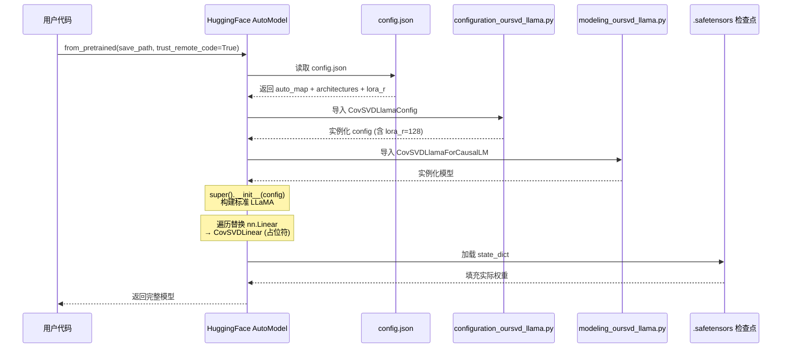
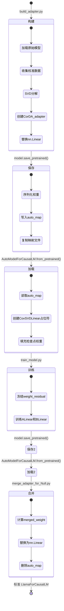
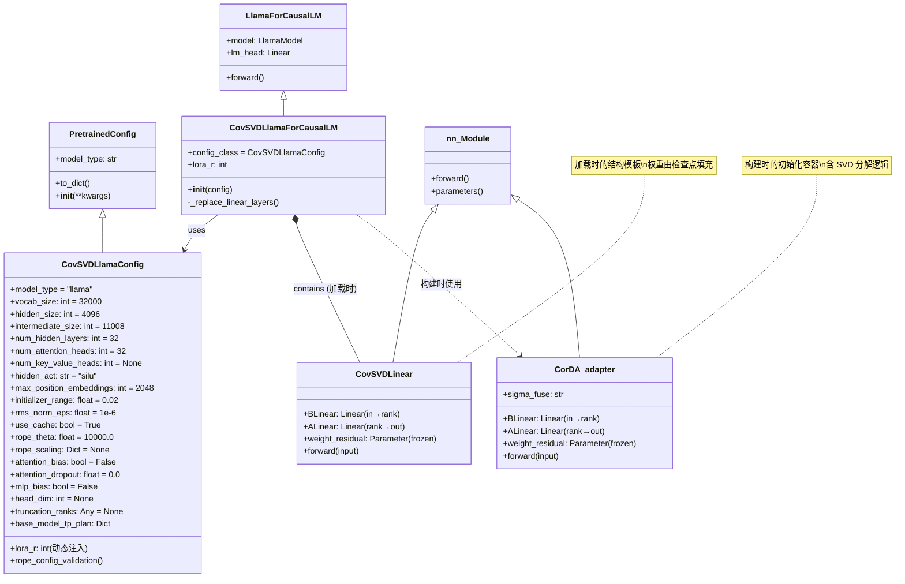
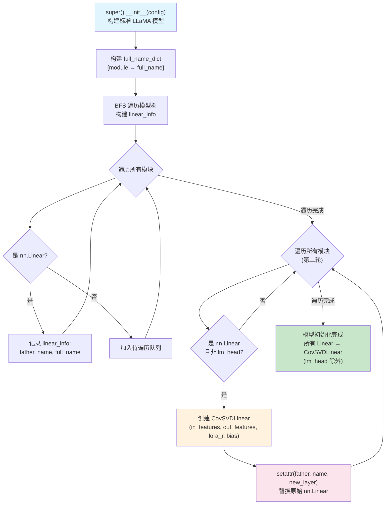
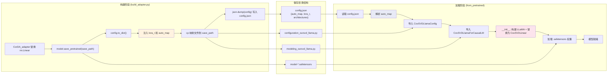
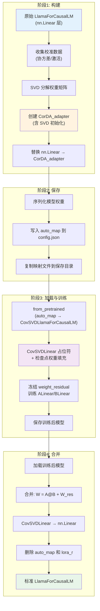

# 10. 模型配置：自定义 LLaMA 架构

## 概述

LoRA-Null 项目在 HuggingFace Transformers 标准 LLaMA 架构之上，构建了一套自定义模型体系，以支持协方差感知奇异值分解（CovSVD）适配器的加载、训练与合并。这套体系的核心在于两个映射文件——`configuration_oursvd_llama.py` 和 `modeling_oursvd_llama.py`——它们通过 HuggingFace 的 `auto_map` 机制，在不修改 Transformers 源码的前提下，将标准 LlamaForCausalLM 无缝替换为包含 CovSVDLinear 低秩分解层的自定义模型。

从整体上看，自定义 LLaMA 架构的设计遵循"占位符-填充"范式：`CovSVDLlamaForCausalLM` 在初始化时用随机权重的 `CovSVDLinear` 层替换所有 `nn.Linear` 层，构成结构模板；随后 HuggingFace 的 `from_pretrained` 机制从检查点加载实际训练好的权重，填充到这些模板层中。这种设计使得模型可以在构建阶段使用 `CorDA_adapter`（含 SVD 初始化逻辑），在保存/加载阶段使用 `CovSVDLinear`（纯结构定义），在合并阶段回归 `nn.Linear`，实现了模型生命周期各阶段的结构解耦。

下面将从配置类、模型类、线性层、自动映射机制和模型生命周期五个维度，逐一深入剖析。

---

## 一、CovSVDLlamaConfig：自定义配置类

### 1.1 类定义与继承关系

`CovSVDLlamaConfig` 定义在 `mapping/configuration_oursvd_llama.py` 中，继承自 HuggingFace 的 `PretrainedConfig`：

```python
class CovSVDLlamaConfig(PretrainedConfig):
    model_type = "llama"
    keys_to_ignore_at_inference = ["past_key_values"]
```

关键设计要点：

- **`model_type = "llama"`**：声明此配置对应 LLaMA 模型类型，使 HuggingFace 内部机制（如 tokenizer 关联、模型注册等）能正确识别。这意味着虽然配置类名不同，但在 HuggingFace 生态中它仍被识别为 LLaMA 架构。
- **`keys_to_ignore_at_inference`**：推理时忽略 `past_key_values`，避免 KV 缓存被序列化到配置中。

### 1.2 标准 LLaMA 参数

`CovSVDLlamaConfig` 完整保留了 `LlamaConfig` 的所有标准参数，默认值与 LLaMA-7B 一致：

| 参数 | 默认值 | 说明 |
|------|--------|------|
| `vocab_size` | 32000 | 词表大小 |
| `hidden_size` | 4096 | 隐藏层维度 |
| `intermediate_size` | 11008 | MLP 中间层维度 |
| `num_hidden_layers` | 32 | Transformer 解码器层数 |
| `num_attention_heads` | 32 | 注意力头数 |
| `num_key_value_heads` | None（默认等于 `num_attention_heads`） | KV 头数，支持 GQA/MQA |
| `hidden_act` | "silu" | 激活函数 |
| `max_position_embeddings` | 2048 | 最大序列长度 |
| `initializer_range` | 0.02 | 初始化标准差 |
| `rms_norm_eps` | 1e-6 | RMSNorm 的 epsilon |
| `use_cache` | True | 是否使用 KV 缓存 |
| `rope_theta` | 10000.0 | RoPE 基础周期 |
| `rope_scaling` | None | RoPE 缩放配置 |
| `attention_bias` | False | 注意力层是否使用偏置 |
| `attention_dropout` | 0.0 | 注意力 dropout 比率 |
| `mlp_bias` | False | MLP 层是否使用偏置 |
| `head_dim` | None（默认 `hidden_size // num_attention_heads`） | 注意力头维度 |

其中 `head_dim` 的计算逻辑在 `__init__` 中实现：

```python
self.head_dim = head_dim if head_dim is not None else self.hidden_size // self.num_attention_heads
```

当 `head_dim` 未显式指定时，自动由 `hidden_size` 除以 `num_attention_heads` 得到（4096 / 32 = 128）。

### 1.3 自定义参数：truncation_ranks

在标准参数之外，`CovSVDLlamaConfig` 新增了一个自定义参数：

```python
self.truncation_ranks = truncation_ranks  # 默认 None
```

`truncation_ranks` 用于 ASVD（激活感知奇异值分解）场景，允许为不同层指定不同的截断秩。当设为 `None` 时，所有层使用统一的秩 `r`。该参数在配置类中声明，但实际使用由构建阶段的分解逻辑控制。

### 1.4 lora_r：动态注入的参数

**重要说明**：`lora_r` 并非 `CovSVDLlamaConfig.__init__` 的正式参数。它是在 `build_adapter.py` 的保存阶段被动态注入到配置字典中的：

```python
# build_adapter.py 第 73-74 行
config = model.config.to_dict()
config["lora_r"] = args.r
```

这意味着 `lora_r` 不出现在配置类的签名中，而是作为额外字段写入 `config.json`。当 `CovSVDLlamaForCausalLM` 加载模型时，HuggingFace 的配置系统会将 `config.json` 中的所有字段传递给 `CovSVDLlamaConfig`，其中 `lora_r` 通过 `**kwargs` 被保存为配置属性。这种"延迟注入"设计使得秩参数可以在不修改配置类定义的情况下灵活指定。

### 1.5 张量并行策略

`base_model_tp_plan` 定义了基础模型的张量并行切分策略：

```python
base_model_tp_plan = {
    "layers.*.self_attn.q_proj": "colwise",
    "layers.*.self_attn.k_proj": "colwise",
    "layers.*.self_attn.v_proj": "colwise",
    "layers.*.self_attn.o_proj": "rowwise",
    "layers.*.mlp.gate_proj": "colwise",
    "layers.*.mlp.up_proj": "colwise",
    "layers.*.mlp.down_proj": "rowwise",
}
```

策略说明：
- **colwise（列切分）**：适用于 Q/K/V 投影和 gate/up 投影，权重矩阵沿输出维度切分到不同 GPU
- **rowwise（行切分）**：适用于 O 投影和 down 投影，权重矩阵沿输入维度切分，与 colwise 配对使用以避免通信开销

这种切分策略与标准 LlamaConfig 完全一致，确保自定义模型在多 GPU 推理时与原始 LLaMA 行为一致。

### 1.6 RoPE 参数验证

`__init__` 末尾调用了 `rope_config_validation` 进行旋转位置编码参数校验：

```python
# 向后兼容：如果 rope_scaling 中存在 'type' 字段，复制到 'rope_type'
if self.rope_scaling is not None and "type" in self.rope_scaling:
    self.rope_scaling["rope_type"] = self.rope_scaling["type"]
rope_config_validation(self)
```

这段逻辑处理了 HuggingFace Transformers 版本升级中 RoPE 配置字段名的变更（从 `type` 到 `rope_type`），确保旧格式配置文件仍能正确加载。

---

## 二、CovSVDLlamaForCausalLM：自定义因果语言模型

### 2.1 类定义与继承

`CovSVDLlamaForCausalLM` 定义在 `mapping/modeling_oursvd_llama.py` 中，继承自 `LlamaForCausalLM`：

```python
class CovSVDLlamaForCausalLM(LlamaForCausalLM):
    config_class = CovSVDLlamaConfig
```

通过 `config_class = CovSVDLlamaConfig`，声明了此模型类使用的配置类，确保 HuggingFace 在实例化模型时使用正确的配置类型。

### 2.2 __init__ 初始化流程

初始化过程分为三个阶段：

**阶段一：初始化标准 LLaMA**

```python
def __init__(self, config: CovSVDLlamaConfig):
    super().__init__(config)
```

调用 `LlamaForCausalLM.__init__`，构建完整的标准 LLaMA 模型结构，包括嵌入层、32 个 Transformer 层（每层含 self-attention 和 MLP）、最终的 RMSNorm 和 lm_head。此时所有线性层都是标准的 `nn.Linear`。

**阶段二：构建模块映射表**

```python
    self.lora_r = config.lora_r
    full_name_dict = {module: name for name, module in self.named_modules()}
    linear_info = {}
    modules = [self]
    while len(modules) > 0:
        submodule = modules.pop()
        for name, raw_linear in submodule.named_children():
            if isinstance(raw_linear, nn.Linear):
                full_name = full_name_dict[raw_linear]
                linear_info[raw_linear] = {
                    "father": submodule,
                    "name": name,
                    "full_name": full_name,
                }
            else:
                modules.append(raw_linear)
```

这段代码通过广度优先遍历（BFS）构建两个关键数据结构：
- **`full_name_dict`**：从模块实例到完整路径名的映射（如 `model.layers.0.self_attn.q_proj`）
- **`linear_info`**：从 `nn.Linear` 实例到其父模块、属性名、完整路径的映射

`linear_info` 中存储的 `father` 和 `name` 是后续替换操作的关键——通过 `setattr(father, name, new_layer)` 可以精确地将指定位置的线性层替换为新层。

**阶段三：替换线性层为 CovSVDLinear**

```python
    for name, module in self.named_modules():
        if "lm_head" not in name and isinstance(module, nn.Linear):
            info = linear_info[module]
            new_layer = CovSVDLinear(
                module.in_features, module.out_features,
                self.lora_r, bias=module.bias is not None
            )
            setattr(info["father"], info["name"], new_layer)
```

遍历所有模块，对除 `lm_head` 外的每个 `nn.Linear` 层：
1. 查找其在 `linear_info` 中的替换信息
2. 创建对应的 `CovSVDLinear` 层（保持输入/输出维度和偏置设置一致）
3. 通过 `setattr` 将父模块上的对应属性替换为新层

**为什么跳过 `lm_head`？** `lm_head` 是语言模型头，将隐藏状态映射回词表空间。它不属于 Transformer 层内部的投影矩阵，不参与低秩分解，因此保持为标准 `nn.Linear`。

### 2.3 "占位符"设计理念

`CovSVDLlamaForCausalLM` 的核心设计理念是**占位符模式**：

1. `__init__` 创建的 `CovSVDLinear` 层使用随机初始化权重（`BLinear` 和 `ALinear` 由 PyTorch 默认初始化，`weight_residual` 初始化为零张量）
2. 这些随机权重只是结构占位符，确保模型的前向传播能正常运行
3. 当 `from_pretrained` 加载检查点时，HuggingFace 会用保存的实际权重覆盖这些占位符

这种设计将**结构定义**与**权重初始化**解耦：构建阶段使用 `CorDA_adapter`（含 SVD 分解初始化逻辑），保存/加载阶段使用 `CovSVDLinear`（纯结构定义），两者结构兼容但初始化逻辑不同。

---

## 三、CovSVDLinear：低秩分解线性层

### 3.1 结构定义

`CovSVDLinear` 是整个自定义架构的核心组件，定义在 `modeling_oursvd_llama.py` 第 7-19 行：

```python
class CovSVDLinear(nn.Module):
    def __init__(self, in_features, out_features, rank, bias=True):
        super().__init__()
        self.BLinear = nn.Linear(in_features, rank, bias=False)
        self.ALinear = nn.Linear(rank, out_features, bias=bias)
        self.weight_residual = nn.Parameter(torch.zeros(out_features, in_features))
        self.weight_residual.requires_grad = False
```

三个子模块的维度关系：

| 子模块 | 形状 | 说明 |
|--------|------|------|
| `BLinear` | (in_features, rank) | 降维投影：输入维度 → 秩 |
| `ALinear` | (rank, out_features) | 升维投影：秩 → 输出维度 |
| `weight_residual` | (out_features, in_features) | 残差权重，冻结不训练 |

以 LLaMA-7B 的 `q_proj` 为例（`in_features=4096, out_features=4096, rank=128`）：
- `BLinear.weight`：(128, 4096) — 参数量 524,288
- `ALinear.weight`：(4096, 128) — 参数量 524,288
- `ALinear.bias`：(4096,) — 参数量 4,096（如有偏置）
- `weight_residual`：(4096, 4096) — 参数量 16,777,216（冻结）

### 3.2 前向传播

```python
    def forward(self, input):
        y = self.BLinear(input)
        y = self.ALinear(y) + F.linear(input, self.weight_residual)
        return y
```

数学表达：

$$y = A(B(x)) + W_{res} \cdot x$$

其中：
- $B(x)$：低秩降维，$x \in \mathbb{R}^{n} \rightarrow \mathbb{R}^{r}$
- $A(B(x))$：低秩升维，$\mathbb{R}^{r} \rightarrow \mathbb{R}^{m}$
- $W_{res} \cdot x$：残差连接，使用冻结的原始权重

这个前向传播等价于 $y = (AB + W_{res}) \cdot x$，即低秩适配器与残差权重的加权和。训练时只更新 A 和 B，`weight_residual` 始终冻结。

### 3.3 与 CorDA_adapter 的对比

| 特性 | CovSVDLinear | CorDA_adapter |
|------|-------------|---------------|
| 用途 | 加载时的结构模板 | 构建时的初始化容器 |
| 初始化方式 | PyTorch 默认随机初始化 | SVD 分解结果初始化 |
| sigma_fuse 参数 | 无 | 有（UV/U/V 三种模式） |
| weight_residual 初始值 | 全零 | 原始权重的残差部分 |
| 所在文件 | mapping/modeling_oursvd_llama.py | adapterlib/decomposition.py |

`CorDA_adapter` 的初始化逻辑（简化）：

```python
class CorDA_adapter(nn.Module):
    def __init__(self, adapter_U, adapter_S, adapter_V, weight_residual, bias=None, sigma_fuse='UV'):
        # ...
        if sigma_fuse == 'UV':
            self.ALinear.weight.data = U.mul(S.sqrt())       # 奇异值均分到 U 和 V
            self.BLinear.weight.data = V.t().mul(S.sqrt().view(-1, 1))
        elif sigma_fuse == 'U':
            self.ALinear.weight.data = U.mul(S)              # 奇异值全部融入 U
            self.BLinear.weight.data = V.t()
        elif sigma_fuse == 'V':
            self.ALinear.weight.data = U                      # 奇异值全部融入 V
            self.BLinear.weight.data = V.t().mul(S.view(-1, 1))
```

`CorDA_adapter` 通过 `sigma_fuse` 参数控制奇异值 $\Sigma$ 如何分配到 $U$ 和 $V$ 矩阵中，而 `CovSVDLinear` 不需要此参数——因为它只负责定义结构，不负责初始化。当模型保存时，`CorDA_adapter` 中已初始化好的 `ALinear.weight` 和 `BLinear.weight` 被序列化到检查点；加载时，`CovSVDLinear` 的同名参数从检查点恢复，自然获得了正确的 SVD 初始化值。

### 3.4 设计意图

`CovSVDLinear` 的极简设计是有意为之的：

1. **结构最小化**：只定义前向传播所需的三个组件，不包含任何初始化逻辑
2. **与 CorDA_adapter 结构兼容**：两者拥有相同的属性名（`ALinear`, `BLinear`, `weight_residual`），确保 `state_dict` 的键完全匹配
3. **加载即用**：作为 HuggingFace 模型注册的一部分，在 `from_pretrained` 时自动创建并填充权重

---

## 四、auto_map 机制：自定义模型的注册与加载

### 4.1 config.json 中的注册

在 `build_adapter.py` 的保存阶段，以下信息被写入 `config.json`：

```python
config["auto_map"] = {
    "AutoConfig": "configuration_oursvd_llama.CovSVDLlamaConfig",
    "AutoModelForCausalLM": "modeling_oursvd_llama.CovSVDLlamaForCausalLM",
}
config["architectures"] = ["CovSVDLlamaForCausalLM"]
```

生成的 `config.json` 关键字段如下：

```json
{
  "auto_map": {
    "AutoConfig": "configuration_oursvd_llama.CovSVDLlamaConfig",
    "AutoModelForCausalLM": "modeling_oursvd_llama.CovSVDLlamaForCausalLM"
  },
  "architectures": ["CovSVDLlamaForCausalLM"],
  "model_type": "llama",
  "lora_r": 128,
  "truncation_ranks": null,
  ...
}
```

`auto_map` 的每个键值对含义：
- **`AutoConfig`**：当使用 `AutoConfig.from_pretrained()` 时，加载 `CovSVDLlamaConfig` 而非默认的 `LlamaConfig`
- **`AutoModelForCausalLM`**：当使用 `AutoModelForCausalLM.from_pretrained()` 时，加载 `CovSVDLlamaForCausalLM` 而非默认的 `LlamaForCausalLM`

### 4.2 映射文件的复制

为了让 HuggingFace 能找到自定义类，映射文件必须存在于模型保存目录中：

```python
os.system(
    "cp ./mapping/configuration_oursvd_llama.py ./mapping/modeling_oursvd_llama.py ./"
    + save_path
)
```

执行后，保存目录结构如下：

```
save_path/
├── config.json                              # 含 auto_map 配置
├── configuration_oursvd_llama.py            # 配置类定义
├── modeling_oursvd_llama.py                 # 模型类定义
├── model-00001-of-000XX.safetensors         # 模型权重
├── tokenizer.json                           # 分词器
├── tokenizer_config.json
└── ...
```

HuggingFace 的 `from_pretrained` 方法在检测到 `auto_map` 后，会从同一目录下导入指定的 Python 文件，加载其中的类。

### 4.3 加载流程详解

当调用 `AutoModelForCausalLM.from_pretrained(save_path, trust_remote_code=True)` 时，HuggingFace 执行以下步骤：

1. **读取 config.json**：解析 `auto_map` 和 `architectures` 字段
2. **导入配置类**：从 `configuration_oursvd_llama.py` 导入 `CovSVDLlamaConfig`，用 `config.json` 中的参数实例化
3. **导入模型类**：从 `modeling_oursvd_llama.py` 导入 `CovSVDLlamaForCausalLM`
4. **实例化模型**：调用 `CovSVDLlamaForCausalLM(config)`，此时：
   - `super().__init__(config)` 构建标准 LLaMA 结构
   - 遍历并替换所有 `nn.Linear`（除 `lm_head`）为 `CovSVDLinear`
   - 所有 `CovSVDLinear` 的权重为随机/零初始化（占位符状态）
5. **加载权重**：从 `.safetensors` 文件加载 `state_dict`，覆盖占位符权重
6. **模型就绪**：此时模型包含正确的 SVD 分解权重，可进行训练或推理

**注意**：必须传入 `trust_remote_code=True`，否则 HuggingFace 会拒绝执行自定义代码。

### 4.4 auto_map 流程图



上图展示了 `from_pretrained` 的完整调用链。关键点在于步骤 4（替换线性层）和步骤 5（加载权重）的分离——先创建结构骨架，再填充实际数据。

---

## 五、模型生命周期状态转换

### 5.1 四阶段生命周期

LoRA-Null 模型经历四个阶段，每个阶段对应不同的模型结构和处理脚本：



### 5.2 各阶段详解

#### 阶段一：构建（Build）

**脚本**：`build_adapter.py`
**入口**：`step1.sh`

```bash
CUDA_VISIBLE_DEVICES=0 python build_adapter.py \
    --model_id "meta-llama/Llama-2-7b-hf" \
    --singular_aware \
    --use_cache \
    --r 128 \
    --calib_dataset "nqopen" \
    --calib_loader_size 256 \
    --save_model \
    --save_path save_LoRA_Null_adapter_llama2_PT_128
```

构建阶段的执行流程：
1. 加载原始 LLaMA 模型（标准 `LlamaForCausalLM`）
2. 使用校准数据收集协方差矩阵（`calib_cov_distribution`）
3. 对每个 `nn.Linear`（除 `lm_head`）执行 SVD 分解（`decompose_to_adapter2`）
4. 创建 `CorDA_adapter` 实例，用 SVD 结果初始化 ALinear 和 BLinear
5. 用 `CorDA_adapter` 替换原始 `nn.Linear`
6. 保存模型并写入 `auto_map` 配置

此阶段模型中的线性层类型为 `CorDA_adapter`，包含完整的 SVD 初始化信息。

#### 阶段二：保存与加载（Save & Load）

**保存操作**（在 `build_adapter.py` 中）：

```python
model.save_pretrained(save_path)
config = model.config.to_dict()
config["lora_r"] = args.r
config["auto_map"] = {
    "AutoConfig": "configuration_oursvd_llama.CovSVDLlamaConfig",
    "AutoModelForCausalLM": "modeling_oursvd_llama.CovSVDLlamaForCausalLM",
}
config["architectures"] = ["CovSVDLlamaForCausalLM"]
os.system("cp ./mapping/configuration_oursvd_llama.py ./mapping/modeling_oursvd_llama.py ./" + save_path)
json.dump(config, open(save_path + "/config.json", "w"), indent=2)
```

**加载操作**（在 `train_model.py` 中）：

```python
model = transformers.AutoModelForCausalLM.from_pretrained(
    script_args.model_name_or_path,
    device_map="auto",
    trust_remote_code=True
)
```

加载时 HuggingFace 通过 `auto_map` 找到 `CovSVDLlamaForCausalLM`，执行 `__init__` 中的线性层替换，然后从检查点填充权重。此时模型中的线性层类型为 `CovSVDLinear`。

#### 阶段三：训练（Train）

**脚本**：`train_model.py`
**入口**：`tools/train_Null_v1_math.sh`

在 Null 模式下，训练逻辑冻结所有非适配器参数：

```python
if script_args.Null_mode:
    model = transformers.AutoModelForCausalLM.from_pretrained(
        script_args.model_name_or_path,
        device_map="auto",
        trust_remote_code=True
    )
    for n, p in model.named_parameters():
        if "ALinear" not in n and "BLinear" not in n and p.requires_grad:
            p.requires_grad = False
        if ("PALinear" in n or "PBLinear" in n) and p.requires_grad:
            p.requires_grad = False
```

训练阶段的参数状态：

| 参数 | 是否可训练 | 说明 |
|------|-----------|------|
| `ALinear.weight` | ✅ | 低秩升维权重 |
| `ALinear.bias` | ✅ | 低秩升维偏置（如有） |
| `BLinear.weight` | ✅ | 低秩降维权重 |
| `weight_residual` | ❌ | 冻结的残差权重 |
| `PALinear.weight` | ❌ | 额外投影层（冻结） |
| `PBLinear.weight` | ❌ | 额外投影层（冻结） |
| 其他所有参数 | ❌ | 嵌入层、LayerNorm 等 |

训练完成后，模型保存到 `{output_dir}/ft` 目录，仍保留 `auto_map` 配置。

#### 阶段四：合并（Merge）

**脚本**：`merge_adapter_for_Null.py`
**入口**：`step3.sh`

```bash
CUDA_VISIBLE_DEVICES=0 python merge_adapter_for_Null.py \
    --model_id save_LoRA_Null_adapter_llama2_PT_128_math_Null_v1_trained/ft \
    --save_path save_LoRA_Null_adapter_llama2_PT_128_math_Null_v1_merged
```

合并阶段的核心操作：

```python
# 对每个 CovSVDLinear 层
if type(module).__name__ == "CovSVDLinear":
    in_features = module.BLinear.in_features
    out_features = module.ALinear.out_features
    new_linear = nn.Linear(in_features, out_features, bias=False)
    merged_weight = module.ALinear.weight.data @ module.BLinear.weight.data + module.weight_residual
    new_linear.weight.data = merged_weight
    delattr(info["father"], info["name"])
    setattr(info["father"], info["name"], new_linear)
```

数学上，合并操作计算：

$$W_{merged} = A \cdot B + W_{res}$$

其中 $A$ 的形状为 (out_features, rank)，$B$ 的形状为 (rank, in_features)，矩阵乘积后加上残差权重，得到完整的 (out_features, in_features) 权重矩阵。

合并后还需要清理配置：

```python
config["architectures"] = ["LlamaForCausalLM"]
del config["lora_r"]
del config["auto_map"]
del config["_name_or_path"]
```

此时模型回归为标准 `LlamaForCausalLM`，不再需要自定义映射文件，可以用任何标准 HuggingFace 推理管线加载。

---

## 六、类继承关系图



上图展示了核心类之间的继承和组合关系。`CovSVDLlamaForCausalLM` 同时与 `CovSVDLinear`（组合关系，加载时使用）和 `CorDA_adapter`（构建时使用，虚线表示间接关联）相关联，体现了"占位符-填充"的设计范式。

---

## 七、CovSVDLinear 层替换流程图



上图详细展示了 `CovSVDLlamaForCausalLM.__init__` 中的线性层替换流程。两次遍历的设计各有目的：
- **第一次遍历**：收集信息，建立模块实例到父模块/属性名的映射
- **第二次遍历**：执行替换，利用映射信息精确定位并替换每个线性层

---

## 八、auto_map 注册与加载机制图



上图展示了从构建到加载的完整数据流。核心枢纽是保存目录——它既是构建阶段的输出，也是加载阶段的输入。`auto_map` 配置和映射文件共同确保 HuggingFace 能正确找到并实例化自定义类。

---

## 九、模型生命周期状态转换图



上图以四个阶段为脉络，展示了模型从原始 LLaMA 到合并后标准 LLaMA 的完整生命周期。每个阶段的线性层类型发生明确变化：

| 阶段 | 线性层类型 | 权重来源 |
|------|-----------|---------|
| 构建 | `CorDA_adapter` | SVD 分解初始化 |
| 保存/加载 | `CovSVDLinear` | 检查点恢复 |
| 训练 | `CovSVDLinear` | 梯度更新 A/B |
| 合并 | `nn.Linear` | 矩阵乘法合并 |

---

## 十、总结

LoRA-Null 的自定义 LLaMA 架构通过精巧的分层设计，实现了模型生命周期各阶段的结构解耦：

1. **配置层**（`CovSVDLlamaConfig`）：在标准 LlamaConfig 基础上扩展 `truncation_ranks`，并通过动态注入支持 `lora_r`，保持了与 HuggingFace 生态的兼容性。

2. **模型层**（`CovSVDLlamaForCausalLM`）：继承 `LlamaForCausalLM`，在 `__init__` 中自动替换线性层为 `CovSVDLinear`，实现了"占位符-填充"的加载范式。

3. **线性层**（`CovSVDLinear`）：极简的低秩分解结构（BLinear + ALinear + weight_residual），仅定义前向传播，不包含初始化逻辑，与 `CorDA_adapter` 结构兼容但职责分离。

4. **注册机制**（`auto_map`）：利用 HuggingFace 的自定义模型注册机制，在不修改 Transformers 源码的前提下，实现了自定义配置类和模型类的透明加载。

5. **生命周期管理**：从构建（CorDA_adapter）→ 保存（auto_map 注册）→ 加载（CovSVDLinear 占位符）→ 训练（更新 A/B）→ 合并（回归 nn.Linear），每个阶段有明确的线性层类型和权重来源，形成了完整的闭环。

这种设计的核心优势在于：**构建逻辑与加载逻辑分离**。构建阶段可以使用复杂的 SVD 分解和多种 sigma_fuse 策略，而加载阶段只需要一个简单的结构模板。两者通过 HuggingFace 的 `state_dict` 序列化机制桥接，确保了模型的可移植性和可复现性。
