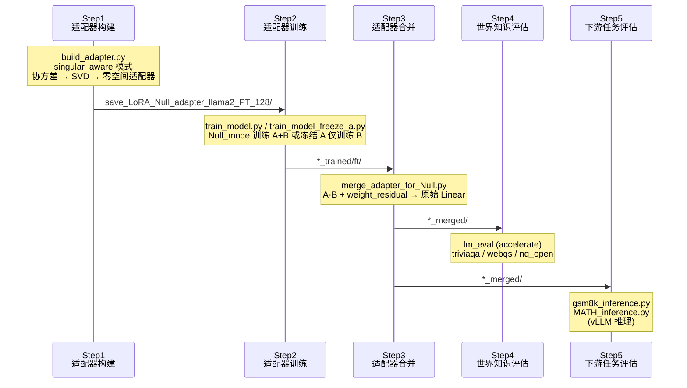
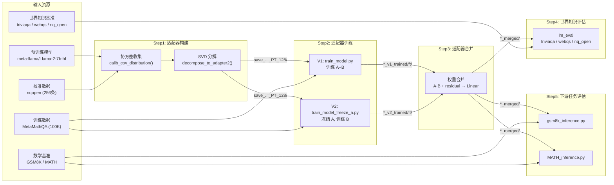
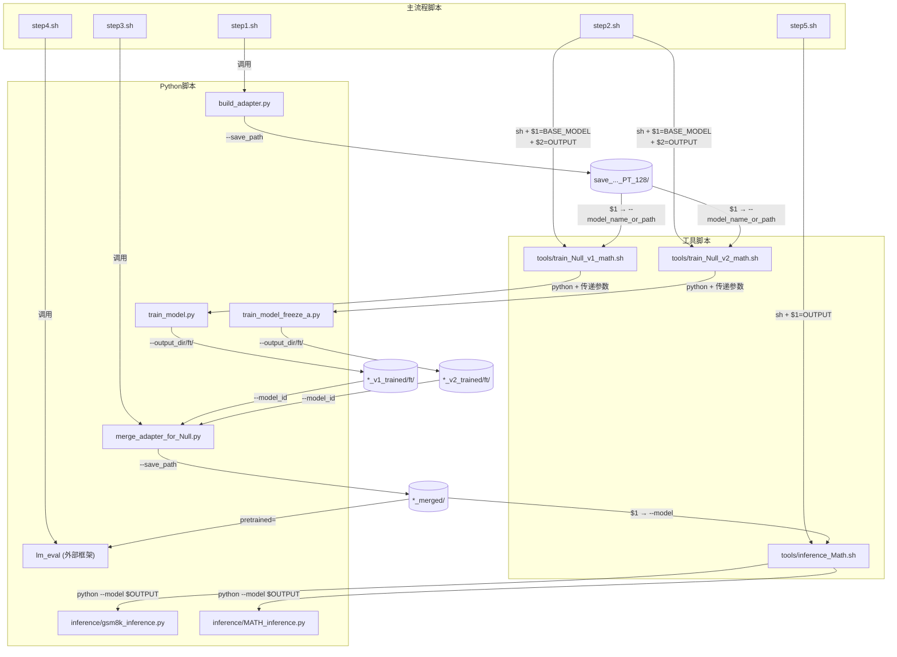
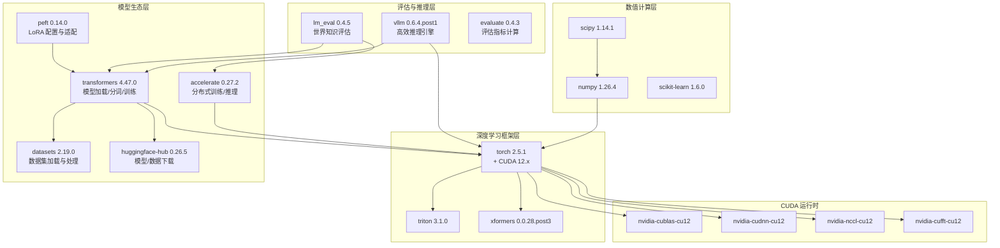

# 工具脚本与完整工作流

## 一、工作流总览

LoRA-Null 项目将"基于零空间的低秩自适应"方法落地为一套可复现的五步流水线，从预训练模型出发，经过适配器构建、训练、合并，最终在世界知识基准和下游任务上完成评估。整个流水线由七个 Shell 脚本驱动，分为主流程脚本（`step1.sh` ~ `step5.sh`）和工具脚本（`tools/` 目录下的三个脚本），各脚本之间通过文件路径参数形成严格的数据依赖链。



**图 1：五步工作流完整时序图。** Step 1 产出初始化适配器模型目录，Step 2 在其上训练，Step 3 将训练后的适配器合并回标准 LLaMA 架构，Step 4 和 Step 5 分别从不同维度评估合并后模型的性能。Step 4 与 Step 5 互相独立，可并行执行。

---

## 二、逐步详解

### 2.1 Step 1：适配器构建（step1.sh）

#### 脚本内容

```bash
CUDA_VISIBLE_DEVICES=0 python build_adapter.py \
    --model_id "meta-llama/Llama-2-7b-hf" \
    --singular_aware \
    --use_cache \
    --r  128 \
    --calib_dataset "nqopen" \
    --calib_loader_size 256 \
    --save_model \
    --save_path save_LoRA_Null_adapter_llama2_PT_128
```

#### 参数详解

| 参数 | 值 | 说明 |
|------|-----|------|
| `--model_id` | `meta-llama/Llama-2-7b-hf` | 预训练基座模型的 HuggingFace ID 或本地路径 |
| `--singular_aware` | 标志位 | 启用基于协方差矩阵零空间的分解模式，这是 LoRA-Null 的核心模式 |
| `--use_cache` | 标志位 | 复用 `cache/` 目录下已缓存的协方差矩阵，避免重复计算 |
| `--r` | `128` | LoRA 适配器的秩（rank），决定零空间特征向量的选取数量 |
| `--calib_dataset` | `nqopen` | 校准数据集，用于收集输入协方差矩阵，可选值包括 `wikitext2`、`c4`、`ptb`、`nqopen`、`MetaMATH` 等 |
| `--calib_loader_size` | `256` | 校准样本数量，从校准数据集中采样的数据条数 |
| `--save_model` | 标志位 | 将构建好的适配器模型保存到磁盘 |
| `--save_path` | `save_LoRA_Null_adapter_llama2_PT_128` | 模型保存路径 |

#### 内部执行流程

`build_adapter.py` 的执行分为三个阶段：

1. **加载模型与校准数据**：加载 LLaMA-2-7B 模型（FP16），通过 `get_calib_data()` 从 nqopen 数据集采样 256 条数据作为校准加载器。

2. **协方差矩阵收集**：当 `--singular_aware` 启用时，调用 `calib_cov_distribution()` 函数。该函数在每个 `nn.Linear` 层上注册前向钩子（forward hook），在校准数据前向传播过程中计算输入的协方差矩阵 `X^T X / 256`。协方差矩阵会被缓存到 `cache/` 目录，文件命名格式为 `{model_id}_covariance_matrices_from_{dataset}_size_{size}_seed_{seed}.pt`。

3. **SVD 分解与适配器构建**：调用 `build_model2()` 函数，遍历模型中所有 `nn.Linear` 层（跳过 `lm_head`），对每个层执行 `decompose_to_adapter2()`：
   - 对协方差矩阵执行 SVD 分解：`U_, S_, V_ = torch.linalg.svd(covariance_matrix)`
   - 取最后 r=128 个特征向量（最小特征值方向）：`U_min_K = U_[:, -r:]`
   - 计算零空间投影：`temp = W @ (U_min_K @ U_min_K^T)`
   - 计算残差权重：`weight_residual = W - temp`
   - 对 `temp` 执行 SVD 得到 `U, S, V`（各取前 r 列）
   - 构建 `CorDA_adapter` 模块，其中 `ALinear` 和 `BLinear` 分别由 `U·√S` 和 `V^T·√S` 初始化

4. **保存模型**：将替换了 `CorDA_adapter` 的模型保存为 HuggingFace 格式，同时修改 `config.json` 中的 `auto_map` 字段指向自定义的 `CovSVDLlamaConfig` 和 `CovSVDLlamaForCausalLM`，并将 `mapping/` 目录下的配置和建模文件复制到保存路径。

#### 输出产物

```
save_LoRA_Null_adapter_llama2_PT_128/
├── config.json              # 含 auto_map 指向自定义模型类
├── configuration_oursvd_llama.py   # 自定义配置类
├── modeling_oursvd_llama.py        # 自定义模型类（含 CovSVDLinear）
├── tokenizer.json / tokenizer_config.json / special_tokens_map.json
├── tokenizer.model
└── model-00001-of-000XX.safetensors  # 模型权重（含 CorDA_adapter）
```

---

### 2.2 Step 2：适配器训练（step2.sh）

#### 脚本内容

```bash
# V1: 同时训练 A 和 B
CUDA_VISIBLE_DEVICES=0 sh tools/train_Null_v1_math.sh save_LoRA_Null_adapter_llama2_PT_128 save_LoRA_Null_adapter_llama2_PT_128_math_Null_v1_trained
# V2: 冻结 A，仅训练 B
CUDA_VISIBLE_DEVICES=0 sh tools/train_Null_v2_math.sh save_LoRA_Null_adapter_llama2_PT_128 save_LoRA_Null_adapter_llama2_PT_128_math_Null_v2_trained
```

Step 2 调用 `tools/` 目录下的训练脚本，传入两个位置参数：`$1` 为 Step 1 产出的适配器模型路径（BASE_MODEL），`$2` 为训练输出路径（OUTPUT）。V1 和 V2 两种训练模式可任选其一，也可分别运行后对比效果。

---

### 2.3 tools/train_Null_v1_math.sh 详解

#### 完整脚本

```bash
BASE_MODEL=$1
OUTPUT=$2

# math
# --data_path meta-math/MetaMathQA \
# --dataset_field query response \

# code:
#--data_path ise-uiuc/Magicoder-Evol-Instruct-110K
#--dataset_field instruction response

# Inst:
#--data_path fxmeng/WizardLM_evol_instruct_V2_143k
#--dataset_field human assistant

HF_ENDPOINT=https://hf-mirror.com python -u train_model.py \
    --model_name_or_path $BASE_MODEL \
    --output_dir $OUTPUT \
    --Null_mode True \
    --data_path meta-math/MetaMathQA \
    --dataset_split "train[:100000]" \
    --dataset_field query response\
    --num_train_epochs 1 \
    --per_device_train_batch_size 1 \
    --gradient_accumulation_steps 128 \
    --save_strategy "steps" \
    --save_steps 100 \
    --save_total_limit 1 \
    --learning_rate 2e-5 \
    --weight_decay 0. \
    --warmup_ratio 0.03 \
    --lr_scheduler_type "cosine" \
    --logging_steps 1 \
    --bf16 True \
    --tf32 True \
    --report_to none\
    --lora_dropout 0.0\
    --lora_alpha 128
```

#### 参数详解

**数据参数：**

| 参数 | 值 | 说明 |
|------|-----|------|
| `--data_path` | `meta-math/MetaMathQA` | HuggingFace 数据集路径，数学推理训练数据 |
| `--dataset_split` | `train[:100000]` | 使用训练集的前 100,000 条数据 |
| `--dataset_field` | `query response` | 数据集中输入/输出对应的字段名 |

**训练超参数：**

| 参数 | 值 | 说明 |
|------|-----|------|
| `--num_train_epochs` | `1` | 训练轮数 |
| `--per_device_train_batch_size` | `1` | 单卡批大小 |
| `--gradient_accumulation_steps` | `128` | 梯度累积步数，等效批大小 = 1 × 128 = 128 |
| `--learning_rate` | `2e-5` | 学习率 |
| `--weight_decay` | `0.` | 权重衰减（无正则化） |
| `--warmup_ratio` | `0.03` | 预热步数占总步数的 3% |
| `--lr_scheduler_type` | `cosine` | 余弦学习率调度器 |
| `--bf16` | `True` | 使用 BF16 混合精度训练 |
| `--tf32` | `True` | 启用 TF32 加速（Ampere+ GPU） |

**LoRA 参数：**

| 参数 | 值 | 说明 |
|------|-----|------|
| `--Null_mode` | `True` | 启用 Null 训练模式（训练 ALinear 和 BLinear） |
| `--lora_dropout` | `0.0` | LoRA dropout 为 0，不使用 dropout |
| `--lora_alpha` | `128` | LoRA 缩放系数，等于 rank 值 |

**保存策略：**

| 参数 | 值 | 说明 |
|------|-----|------|
| `--save_strategy` | `steps` | 按步数保存检查点 |
| `--save_steps` | `100` | 每 100 步保存一次 |
| `--save_total_limit` | `1` | 最多保留 1 个检查点 |

**其他：**

| 参数 | 值 | 说明 |
|------|-----|------|
| `HF_ENDPOINT` | `https://hf-mirror.com` | HuggingFace 镜像端点，用于国内网络环境加速下载 |
| `--report_to` | `none` | 不上报训练日志到外部服务 |

#### 替代数据集配置

脚本注释中提供了两种替代数据集配置，适用于不同的下游任务场景：

| 任务类型 | 数据集 | dataset_field | 说明 |
|----------|--------|---------------|------|
| 数学推理 | `meta-math/MetaMathQA` | `query response` | 默认配置，数学问题与解答 |
| 代码生成 | `ise-uiuc/Magicoder-Evol-Instruct-110K` | `instruction response` | 代码指令与生成 |
| 指令遵循 | `fxmeng/WizardLM_evol_instruct_V2_143k` | `human assistant` | 通用指令对话 |

切换数据集时需同时修改 `--data_path` 和 `--dataset_field` 两个参数。

#### Null 模式训练逻辑

当 `--Null_mode True` 时，`train_model.py` 的训练逻辑为：

1. 使用 `trust_remote_code=True` 加载 Step 1 产出的含 `CorDA_adapter` 的模型
2. 遍历所有参数，将非 `ALinear` / `BLinear` 的参数设为 `requires_grad=False`，同时将 `PALinear` / `PBLinear`（若存在）也冻结
3. 仅 `ALinear.weight` 和 `BLinear.weight` 参与梯度更新
4. 训练完成后，模型保存到 `{output_dir}/ft/` 子目录

---

### 2.4 tools/train_Null_v2_math.sh 详解

#### 完整脚本

```bash
BASE_MODEL=$1
OUTPUT1=$2

# math
# --data_path meta-math/MetaMathQA \
# --dataset_field query response \

# code:
#--data_path ise-uiuc/Magicoder-Evol-Instruct-110K
#--dataset_field instruction response

# Inst:
#--data_path fxmeng/WizardLM_evol_instruct_V2_143k
#--dataset_field human assistant

python -u train_model_freeze_a.py \
    --model_name_or_path $BASE_MODEL \
    --output_dir $OUTPUT1 \
    --Null_mode True \
    --data_path meta-math/MetaMathQA \
    --dataset_split "train[:100000]" \
    --dataset_field query response\
    --num_train_epochs 1 \
    --per_device_train_batch_size 1 \
    --gradient_accumulation_steps 128 \
    --save_strategy "steps" \
    --save_steps 100 \
    --save_total_limit 1 \
    --learning_rate 2e-5 \
    --weight_decay 0. \
    --warmup_ratio 0.03 \
    --lr_scheduler_type "cosine" \
    --logging_steps 1 \
    --bf16 True \
    --tf32 True \
    --report_to none\
    --lora_dropout 0.0\
    --lora_alpha 128
```

#### V1 与 V2 的关键差异

| 对比维度 | V1 (`train_Null_v1_math.sh`) | V2 (`train_Null_v2_math.sh`) |
|----------|------------------------------|------------------------------|
| 训练脚本 | `train_model.py` | `train_model_freeze_a.py` |
| 可训练参数 | ALinear + BLinear | 仅 BLinear |
| ALinear 状态 | 可训练 | 冻结（`requires_grad=False`） |
| 训练自由度 | 高（A 和 B 均可更新） | 低（仅 B 可更新，A 保持零空间初始化） |
| 设计理念 | 零空间初始化作为起点，允许 A 偏离零空间 | 严格保持 A 在零空间方向，仅调整 B 的映射 |
| 输出变量名 | `$OUTPUT` | `$OUTPUT1` |

V2 的核心代码差异在 `train_model_freeze_a.py` 中：

```python
if script_args.Null_mode:
    for n, p in model.named_parameters():
        if "ALinear" not in n and "BLinear" not in n and p.requires_grad:
            p.requires_grad = False
        if ("PALinear" in n or "PBLinear" in n) and p.requires_grad:
            p.requires_grad = False
    # 额外冻结 lora_A（当使用 LoRA 模式时）
    for n, p in model.named_parameters():
        if "lora_A" in n:
            p.requires_grad = False
```

与 V1 相比，V2 的冻结逻辑将 `ALinear` 也排除在可训练参数之外，仅保留 `BLinear` 的梯度更新能力。这种设计确保了零空间投影方向（由 A 编码）在训练过程中保持不变，仅通过调整 B 来学习任务特定的映射。

#### 注意事项

- V2 脚本中**未设置** `HF_ENDPOINT` 环境变量，如果在国内网络环境下运行可能需要手动添加
- V2 脚本中输出变量名为 `$OUTPUT1` 而非 `$OUTPUT`，但功能等价

---

### 2.5 Step 3：适配器合并（step3.sh）

#### 脚本内容

```bash
CUDA_VISIBLE_DEVICES=0 python merge_adapter_for_Null.py \
    --model_id save_LoRA_Null_adapter_llama2_PT_128_math_Null_v1_trained/ft \
    --save_path save_LoRA_Null_adapter_llama2_PT_128_math_Null_v1_merged
```

#### 参数详解

| 参数 | 值 | 说明 |
|------|-----|------|
| `--model_id` | `*_trained/ft` | Step 2 训练产出的模型路径，注意指向 `ft/` 子目录 |
| `--save_path` | `*_merged` | 合并后模型的保存路径 |

#### 合并逻辑

`merge_adapter_for_Null.py` 执行以下操作：

1. 加载训练后的模型（含 `CovSVDLinear` / `CorDA_adapter` 模块）
2. 遍历所有 `CovSVDLinear` 类型的模块（即 `q_proj`、`k_proj`、`v_proj`、`o_proj`、`gate_proj`、`up_proj`、`down_proj`）
3. 对每个适配器模块执行权重合并：
   ```python
   merged_weight = ALinear.weight @ BLinear.weight + weight_residual
   ```
   其中 `ALinear.weight` 的形状为 `(out_features, r)`，`BLinear.weight` 的形状为 `(r, in_features)`，`weight_residual` 的形状为 `(out_features, in_features)`
4. 用合并后的标准 `nn.Linear` 替换 `CovSVDLinear` 模块
5. 修改 `config.json`：将 `architectures` 改回 `["LlamaForCausalLM"]`，删除 `lora_r`、`auto_map`、`_name_or_path` 字段
6. 保存为标准 HuggingFace LLaMA 模型

#### 关键细节

- **输入路径必须指向 `ft/` 子目录**：Step 2 的训练脚本将模型保存到 `{output_dir}/ft/` 下，因此 `--model_id` 需要拼接 `/ft` 后缀
- **合并后恢复标准架构**：合并后的模型不再依赖自定义的 `CovSVDLinear` 类，可被任何标准 HuggingFace 推理管线加载
- **`save_model` 默认为 True**：`merge_adapter_for_Null.py` 的 `--save_model` 参数默认值为 `True`

---

### 2.6 Step 4：世界知识评估（step4.sh）

#### 脚本内容

```bash
CUDA_VISIBLE_DEVICES=0 accelerate launch -m lm_eval --model hf \
    --model_args pretrained=save_LoRA_Null_adapter_llama2_PT_128_math_Null_v1_merged \
    --output_path result_path/result.json \
    --tasks  triviaqa,webqs,nq_open\
    --batch_size 64 \
    --max_batch_size 64 \
    --device cuda
```

#### 参数详解

| 参数 | 值 | 说明 |
|------|-----|------|
| `accelerate launch -m lm_eval` | — | 使用 accelerate 分布式启动 lm-eval 评估框架 |
| `--model hf` | — | 使用 HuggingFace 模型加载器 |
| `--model_args` | `pretrained=*_merged` | 指向 Step 3 合并后的模型路径 |
| `--output_path` | `result_path/result.json` | 评估结果保存路径 |
| `--tasks` | `triviaqa,webqs,nq_open` | 三个世界知识评估任务 |
| `--batch_size` | `64` | 推理批大小 |
| `--max_batch_size` | `64` | 最大批大小限制 |
| `--device` | `cuda` | 使用 GPU 推理 |

#### 评估任务说明

| 任务 | 全称 | 评估维度 | 说明 |
|------|------|----------|------|
| `triviaqa` | TriviaQA | 事实性问答 | 大规模阅读理解与问答数据集，测试模型的事实性知识 |
| `webqs` | WebQuestions | 知识图谱问答 | 基于 Freebase 的自然语言问答，测试结构化知识 |
| `nq_open` | Natural Questions Open | 开放域问答 | Google 搜索查询衍生的开放域问答，测试通用世界知识 |

这三个任务共同构成了对模型**世界知识保留能力**的综合评估。LoRA-Null 的核心主张之一就是：通过在零空间方向初始化适配器，微调后模型在世界知识上的性能下降最小。Step 4 的评估结果直接验证了这一主张。

---

### 2.7 Step 5：下游任务评估（step5.sh）

#### 脚本内容

```bash
sh tools/inference_Math.sh save_LoRA_Null_adapter_llama2_PT_128_math_Null_v1_merged
```

#### tools/inference_Math.sh 详解

```bash
OUTPUT=$1

CUDA_VISIBLE_DEVICES=0 python inference/gsm8k_inference.py --model $OUTPUT
CUDA_VISIBLE_DEVICES=1 python inference/MATH_inference.py --model $OUTPUT
```

该脚本接收一个位置参数 `$1`（合并后的模型路径），依次运行两个推理脚本。值得注意的是，两个推理脚本分别使用不同的 GPU（GPU 0 和 GPU 1），在多卡环境下可并行执行。

#### gsm8k_inference.py

- **数据文件**：`data/gsm8k_test.jsonl`
- **推理引擎**：vLLM（`LLM` 类，`gpu_memory_utilization=0.8`）
- **采样参数**：`temperature=0`（贪心解码），`top_p=1`，`max_tokens=1024`
- **Prompt 模板**：
  ```
  Below is an instruction that describes a task.
  Write a response that appropriately completes the request.

  ### Instruction:
  {question}

  ### Response: Let's think step by step.
  ```
- **答案提取**：从生成文本中提取 `The answer is:` 后的数值，支持整数、小数和分数
- **评估指标**：准确率（Accuracy），与标准答案数值比较

#### MATH_inference.py

- **数据文件**：`data/MATH_test.jsonl`
- **推理引擎**：vLLM（配置同上）
- **采样参数**：`temperature=0`，`top_p=1`，`max_tokens=2048`（比 GSM8K 更长）
- **Prompt 模板**：与 GSM8K 相同
- **答案提取**：从生成文本中提取 `The answer is:` 后的内容，使用 `util.is_equiv()` 进行等价性判断（支持 LaTeX 格式的数学表达式）
- **评估指标**：准确率（Accuracy）

---

## 三、数据与模型流转全景



**图 2：数据与模型流转关系图。** 实线箭头表示数据/模型的传递方向。Step 1 消耗预训练模型和校准数据产出初始化适配器；Step 2 消耗初始化适配器和训练数据产出训练后适配器；Step 3 将训练后适配器合并回标准架构；Step 4 和 Step 5 分别使用不同的评估框架和基准数据对合并模型进行评估。V1 和 V2 两条训练路径共享同一个 Step 1 产出，但产出不同的训练结果。

---

## 四、脚本参数传递关系



**图 3：脚本参数传递关系图。** 展示了从主流程脚本到工具脚本再到 Python 脚本的完整调用链，以及各步骤之间通过文件路径参数形成的数据依赖。关键路径参数传递规则如下：

| 调用方 | 被调用方 | 参数传递方式 |
|--------|----------|-------------|
| `step2.sh` → `train_Null_v1_math.sh` | `$1` = Step1 输出路径, `$2` = 训练输出路径 |
| `train_Null_v1_math.sh` → `train_model.py` | `$BASE_MODEL` → `--model_name_or_path`, `$OUTPUT` → `--output_dir` |
| `step3.sh` → `merge_adapter_for_Null.py` | `{trained_path}/ft` → `--model_id` |
| `step5.sh` → `inference_Math.sh` | `$1` = 合并模型路径 |
| `inference_Math.sh` → `gsm8k_inference.py` | `$OUTPUT` → `--model` |
| `inference_Math.sh` → `MATH_inference.py` | `$OUTPUT` → `--model` |

---

## 五、环境搭建与依赖

### 5.1 安装方式

```bash
cd LoRA_Null
pip install -r requirements.txt
```

### 5.2 核心依赖关系



**图 4：环境依赖关系图。** 展示了 LoRA-Null 项目核心依赖之间的层级关系。项目依赖可分为五层：CUDA 运行时提供底层 GPU 计算；深度学习框架层提供自动微分和 GPU 内核；模型生态层负责模型加载、训练和数据管理；评估推理层提供基准测试和高效推理；数值计算层提供矩阵运算支持。

### 5.3 关键依赖版本与用途

| 包名 | 版本 | 核心用途 |
|------|------|----------|
| `torch` | 2.5.1 | 模型训练、SVD 分解、GPU 加速 |
| `transformers` | 4.47.0 | 模型加载（AutoModelForCausalLM）、分词器、Trainer |
| `peft` | 0.14.0 | LoRA 配置（LoraConfig）、PEFT 模型包装 |
| `accelerate` | 0.27.2 | 分布式推理（accelerate launch） |
| `datasets` | 2.19.0 | 加载 HuggingFace 数据集（MetaMathQA 等） |
| `vllm` | 0.6.4.post1 | 高效批量推理（GSM8K/MATH 评估） |
| `lm_eval` | 0.4.5 | 世界知识基准评估（triviaqa/webqs/nq_open） |
| `numpy` | 1.26.4 | 数值计算、随机种子设置 |
| `scipy` | 1.14.1 | 科学计算支持 |
| `safetensors` | 0.4.5 | 安全张量序列化（模型保存格式） |
| `einops` | 0.8.0 | 张量操作简化 |
| `jsonlines` | 4.0.0 | JSONL 格式数据读取（推理评估） |

### 5.4 硬件需求

| 步骤 | 最低 GPU 内存 | 推荐 GPU | 说明 |
|------|---------------|----------|------|
| Step 1 | ~16 GB | A100 40GB / 80GB | 需加载 7B 模型 + 计算协方差矩阵 |
| Step 2 | ~20 GB | A100 40GB / 80GB | 训练时 ALinear + BLinear 的梯度占用额外显存 |
| Step 3 | ~16 GB | A100 40GB | 仅前向计算合并权重 |
| Step 4 | ~16 GB | A100 40GB | lm_eval 批量推理，batch_size=64 |
| Step 5 | ~16 GB × 2 | 2× A100 40GB | 两个推理脚本分别使用不同 GPU |

---

## 六、完整端到端工作流

### 6.1 标准执行顺序

```bash
# 0. 环境准备
cd LoRA_Null
pip install -r requirements.txt

# 1. 构建零空间适配器
sh step1.sh

# 2. 训练适配器（选择 V1 或 V2，或两者都运行）
sh step2.sh

# 3. 合并适配器到基座模型
#    注意：如果运行了 V2，需要修改 step3.sh 中的路径
sh step3.sh

# 4. 世界知识评估
sh step4.sh

# 5. 下游任务评估
sh step5.sh
```

### 6.2 路径命名约定

项目中的路径命名遵循统一规则：

```
save_LoRA_Null_adapter_{基座模型}_{模式}_{秩}_{任务}_{版本}_trained/
save_LoRA_Null_adapter_{基座模型}_{模式}_{秩}_{任务}_{版本}_merged/
```

以默认配置为例：

| 阶段 | 路径 | 含义 |
|------|------|------|
| Step 1 产出 | `save_LoRA_Null_adapter_llama2_PT_128/` | LLaMA2 预训练模型，秩 128，零空间适配器 |
| Step 2 V1 产出 | `save_..._llama2_PT_128_math_Null_v1_trained/` | 数学任务，V1 训练（A+B 均可训练） |
| Step 2 V2 产出 | `save_..._llama2_PT_128_math_Null_v2_trained/` | 数学任务，V2 训练（冻结 A，仅训练 B） |
| Step 3 产出 | `save_..._llama2_PT_128_math_Null_v1_merged/` | V1 训练后合并的标准模型 |

### 6.3 切换任务场景

若要从数学任务切换到代码任务或指令遵循任务，需要修改以下位置：

**Step 2 训练脚本（`tools/train_Null_v1_math.sh` 或 `tools/train_Null_v2_math.sh`）：**

```bash
# 代码任务
--data_path ise-uiuc/Magicoder-Evol-Instruct-110K
--dataset_field instruction response

# 指令遵循任务
--data_path fxmeng/WizardLM_evol_instruct_V2_143k
--dataset_field human assistant
```

**Step 5 评估脚本：** 需要替换为对应的评估脚本（如代码任务使用 HumanEval/MBPP 评估，指令遵循使用 MT-Bench 评估），这些评估依赖外部框架（bigcode-evaluation-harness、FastChat），不在本项目脚本范围内。

---

## 七、常见问题与排障指南

### 7.1 协方差矩阵相关问题

| 问题 | 原因 | 解决方案 |
|------|------|----------|
| `nan in input, break` | 校准数据中存在异常输入，导致前向传播产生 NaN | 检查校准数据质量；尝试减小 `calib_loader_size` |
| `nan in covariance, break` | 协方差矩阵计算过程中出现数值溢出 | 确保使用 FP16/FP32 精度；检查 GPU 内存是否充足 |
| 协方差计算耗时过长 | 7B 模型的协方差矩阵较大（4096×4096），256 条数据需多次前向 | 使用 `--use_cache` 复用已缓存的协方差矩阵 |
| 缓存文件未找到 | `cache/` 目录不存在或缓存文件被删除 | 首次运行不使用 `--use_cache`，或手动创建 `cache/` 目录 |

### 7.2 训练相关问题

| 问题 | 原因 | 解决方案 |
|------|------|----------|
| OOM（显存不足） | 7B 模型 + 适配器梯度占用过多显存 | 减小 `gradient_accumulation_steps`；使用更大显存的 GPU |
| 训练损失不下降 | 学习率或调度器配置不当 | 检查 `learning_rate=2e-5` 和 `lr_scheduler_type=cosine` |
| HuggingFace 数据集下载失败 | 网络问题 | 设置 `HF_ENDPOINT=https://hf-mirror.com` 镜像 |
| `trust_remote_code=True` 报错 | 自定义模型类路径不正确 | 确保 Step 1 产出的目录中包含 `configuration_oursvd_llama.py` 和 `modeling_oursvd_llama.py` |

### 7.3 合并与评估相关问题

| 问题 | 原因 | 解决方案 |
|------|------|----------|
| 合并时找不到 `CovSVDLinear` 类 | `--model_id` 路径缺少 `/ft` 后缀 | 确保 Step 3 的 `--model_id` 指向 `*_trained/ft/` |
| 合并后模型加载失败 | `config.json` 中残留自定义字段 | 检查合并后的 `config.json` 是否已删除 `auto_map` 和 `lora_r` |
| lm_eval 任务下载失败 | 评估数据集需要从 HuggingFace 下载 | 配置网络代理或镜像 |
| vLLM 推理 OOM | `gpu_memory_utilization=0.8` 过高 | 在推理脚本中降低 `gpu_memory_utilization` 参数 |
| GSM8K/MATH 评估结果为 0 | 模型输出格式不匹配 | 确认模型输出包含 `The answer is:` 格式 |

### 7.4 V1 与 V2 训练模式选择建议

| 场景 | 推荐模式 | 理由 |
|------|----------|------|
| 追求最佳下游任务性能 | V1（训练 A+B） | 更大的参数自由度，允许适配器偏离零空间方向 |
| 严格保持世界知识 | V2（冻结 A，训练 B） | A 编码的零空间投影方向保持不变，对预训练知识的影响最小 |
| 快速实验/消融研究 | 两者都运行 | 对比 V1 和 V2 的世界知识保留与下游任务性能差异 |
| 低资源环境 | V2 | 仅训练 B 参数量更少，训练速度略快，显存占用略低 |

---

## 八、总结

LoRA-Null 的工具脚本体系围绕五步流水线构建，形成了从"预训练模型 → 零空间适配器 → 训练 → 合并 → 评估"的完整闭环。其设计具有以下特点：

1. **模块化分工**：每个步骤由独立的 Shell 脚本驱动，步骤间仅通过文件路径耦合，便于单独调试和替换
2. **双模式训练**：V1（全量训练 A+B）和 V2（冻结 A 仅训练 B）提供了知识保留与任务性能之间的灵活权衡
3. **多维度评估**：世界知识评估（Step 4）和下游任务评估（Step 5）分别验证了 LoRA-Null 的两大核心优势——知识保留和任务学习
4. **可复现性**：所有超参数均在脚本中显式指定，协方差矩阵支持缓存复用，确保实验可复现
5. **可扩展性**：训练脚本中预置了数学、代码、指令遵循三种数据集配置，评估框架支持多种基准任务

整个工作流的核心洞察在于：**通过协方差矩阵的零空间方向初始化 LoRA 适配器，使得微调过程在"对预训练知识影响最小的方向"上进行**，从而在保留世界知识的同时有效学习下游任务。五步流水线将这一洞察系统化地落地为可执行的实验方案。
