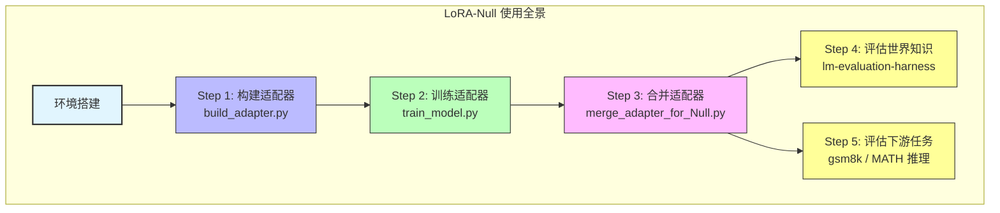
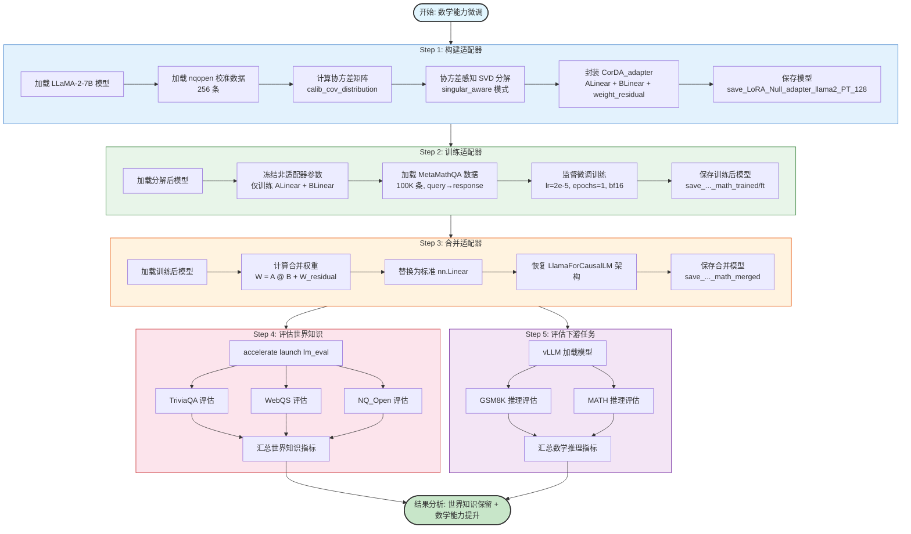
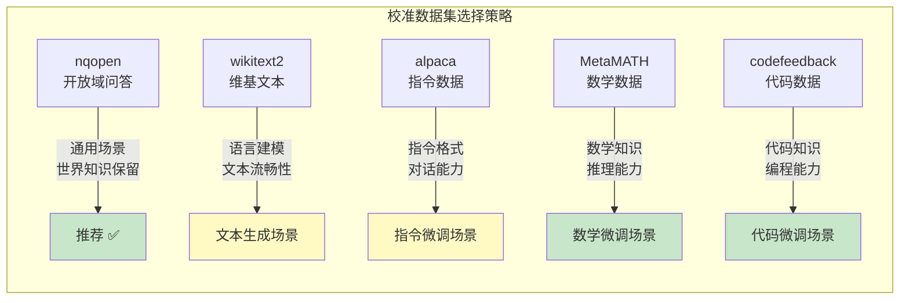
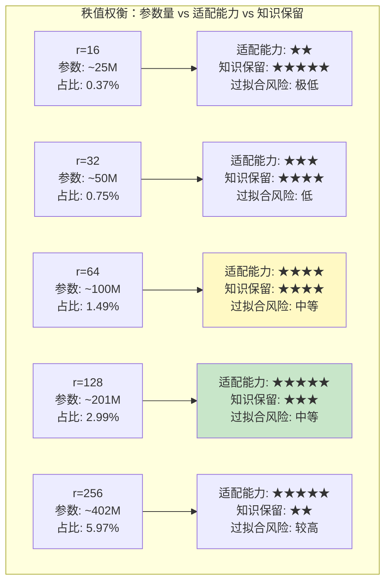
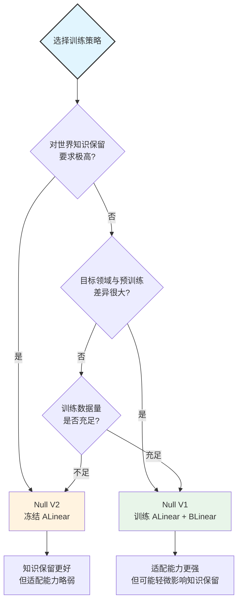
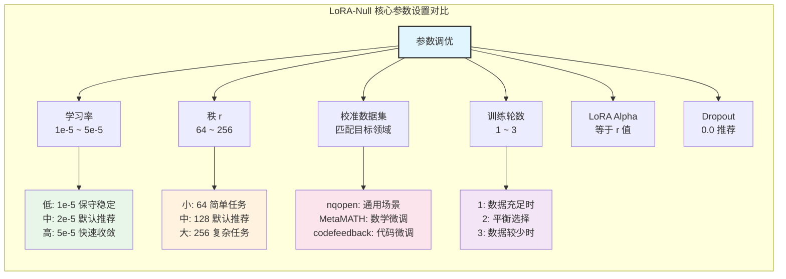
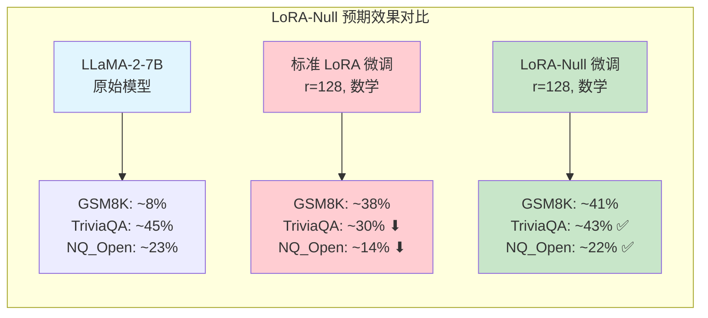

# 12 使用指南与实战案例

## 总论：LoRA-Null 实践全景

LoRA-Null 是一种基于零空间分解的低秩适配方法，旨在通过协方差感知的 SVD 分解，将预训练大语言模型的权重分解为"世界知识保留"与"下游任务适配"两个正交子空间，从而在微调模型获取特定领域能力的同时，最大程度地保留模型原有的世界知识。本文档将从环境搭建到多场景实战，系统性地介绍 LoRA-Null 的完整使用流程。

整个使用流程可以概括为 **"构建适配器 → 训练适配器 → 合并适配器 → 评估世界知识 → 评估下游任务"** 五步闭环。每一步都包含多个可调参数，不同的参数组合将直接影响最终效果。下面将按照从环境准备到实战演练的顺序，逐一展开说明。



---

## 分论一：环境搭建指南

### 1.1 系统要求

LoRA-Null 的运行对硬件和软件环境有一定要求，以下是推荐的最低配置与推荐配置：

| 项目 | 最低要求 | 推荐配置 |
|------|----------|----------|
| 操作系统 | Linux (Ubuntu 20.04+) | Linux (Ubuntu 22.04+) |
| GPU | NVIDIA GPU (显存 ≥ 24GB) | NVIDIA A100 (80GB) / RTX 4090 (24GB) |
| CUDA | 11.8+ | 12.1+ |
| Python | 3.10+ | 3.10 或 3.11 |
| 系统内存 | 64GB | 128GB+ |
| 磁盘空间 | 100GB（模型 + 数据） | 500GB+ SSD |

> **说明**：LLaMA-2-7B 模型在 FP16 精度下约需 14GB 显存，构建适配器阶段需要额外显存存储协方差矩阵。使用 `--use_cache` 参数可以缓存协方差矩阵，避免重复计算。单卡 A100 (80GB) 可以流畅运行全部流程；RTX 4090 (24GB) 需要注意显存管理，建议配合 `gradient_checkpointing` 使用。

### 1.2 环境搭建检查清单

```mermaid
flowchart TD
    START([开始环境搭建]) --> OS{Linux 系统?}
    OS -->|是| GPU{NVIDIA GPU?}
    OS -->|否| OS_FIX[安装 Linux 或使用 WSL2]
    OS_FIX --> GPU
    GPU -->|是| CUDA{CUDA 11.8+?}
    GPU -->|否| GPU_FIX[配备 NVIDIA GPU]
    GPU_FIX --> CUDA
    CUDA -->|是| PY{Python 3.10+?}
    CUDA -->|否| CUDA_FIX[安装 CUDA Toolkit 11.8+]
    CUDA_FIX --> PY
    PY -->|是| PIP[安装依赖<br/>pip install -r requirements.txt]
    PY -->|否| PY_FIX[安装 Python 3.10+]
    PY_FIX --> PIP
    PIP --> HF{HuggingFace 访问?}
    HF -->|需要 LLaMA-2| HF_TOKEN[申请 HuggingFace Token<br/>并接受 LLaMA-2 协议]
    HF -->|使用开源模型| HF_MIRROR[可选: 设置镜像<br/>HF_ENDPOINT=https://hf-mirror.com]
    HF_TOKEN --> VERIFY[验证环境]
    HF_MIRROR --> VERIFY
    VERIFY --> V1[python -c "import torch; print(torch.cuda.is_available())"]
    VERIFY --> V2[python -c "import transformers; print(transformers.__version__)"]
    VERIFY --> V3[python -c "import peft; print(peft.__version__)"]
    V1 --> DONE([环境就绪 ✅])
    V2 --> DONE
    V3 --> DONE

    style START fill:#e1f5fe,stroke:#333,stroke-width:2px
    style DONE fill:#c8e6c9,stroke:#333,stroke-width:2px
    style OS_FIX fill:#ffcdd2
    style GPU_FIX fill:#ffcdd2
    style CUDA_FIX fill:#ffcdd2
    style PY_FIX fill:#ffcdd2
```

### 1.3 安装步骤

**第一步：克隆仓库**

```bash
git clone https://github.com/your-repo/LoRA_Null.git
cd LoRA_Null
```

**第二步：创建 Python 虚拟环境（推荐）**

```bash
conda create -n lora_null python=3.10 -y
conda activate lora_null
```

**第三步：安装依赖**

```bash
pip install -r requirements.txt
```

核心依赖及其版本说明：

| 依赖包 | 版本要求 | 用途 |
|--------|----------|------|
| `torch` | ≥ 2.0 | PyTorch 深度学习框架，提供 GPU 加速与自动微分 |
| `transformers` | ≥ 4.36 | HuggingFace 模型加载与分词器 |
| `peft` | ≥ 0.14 | 参数高效微调框架（LoRA 配置与集成） |
| `accelerate` | ≥ 0.27 | 分布式训练与推理启动器 |
| `datasets` | ≥ 2.19 | HuggingFace 数据集加载与预处理 |
| `vllm` | ≥ 0.6 | 高性能推理引擎（PagedAttention） |
| `lm_eval` | ≥ 0.4 | EleutherAI 评估框架（世界知识评估） |
| `scipy` | ≥ 1.14 | 科学计算（SVD 分解辅助） |
| `numpy` | ≥ 1.26 | 数值计算基础库 |
| `sentencepiece` | ≥ 0.2 | 分词器后端 |

**第四步：配置 HuggingFace 访问**

若使用 Meta LLaMA-2 系列模型，需要：

1. 在 [HuggingFace](https://huggingface.co/) 注册账号
2. 在 [LLaMA-2 模型页面](https://huggingface.co/meta-llama/Llama-2-7b-hf) 申请访问权限并等待审批
3. 获取 Access Token：`Settings → Access Tokens → New token`
4. 登录 HuggingFace：

```bash
huggingface-cli login
# 粘贴你的 token
```

**第五步（可选）：配置 HuggingFace 镜像**

在国内网络环境下，访问 HuggingFace 可能较慢或不可用，可使用镜像站点：

```bash
export HF_ENDPOINT=https://hf-mirror.com
```

也可以在训练脚本中直接设置（项目脚本中已包含此配置）：

```bash
HF_ENDPOINT=https://hf-mirror.com python -u train_model.py ...
```

### 1.4 环境验证

安装完成后，执行以下命令验证环境是否正确配置：

```bash
# 验证 PyTorch GPU 支持
python -c "import torch; print(f'CUDA available: {torch.cuda.is_available()}'); print(f'GPU: {torch.cuda.get_device_name(0)}')"

# 验证核心依赖版本
python -c "import torch, transformers, peft, accelerate, datasets, vllm, lm_eval; print(f'torch={torch.__version__}, transformers={transformers.__version__}, peft={peft.__version__}')"

# 验证模型加载（可选，需要 HuggingFace 访问权限）
python -c "from transformers import AutoTokenizer; tokenizer = AutoTokenizer.from_pretrained('meta-llama/Llama-2-7b-hf', trust_remote_code=True); print('Tokenizer loaded successfully')"
```

---

## 分论二：快速开始——五步完整流程

LoRA-Null 的使用流程分为五个步骤，每一步都对应一个独立的脚本，形成完整的"构建→训练→合并→评估"闭环。

### Step 1：构建适配器（build_adapter.py）

**目标**：对预训练模型进行协方差感知的 SVD 分解，将权重矩阵分解为适配器（ALinear + BLinear）和残差（weight_residual），保存为可训练的 HuggingFace 模型格式。

**核心逻辑**：
1. 加载预训练模型
2. 采集校准数据，计算各层协方差矩阵
3. 对权重矩阵进行协方差感知 SVD 分解
4. 将分解结果封装为 `CorDA_adapter` 模块
5. 保存为 HuggingFace 模型格式

**关键参数**：

| 参数 | 说明 | 推荐值 |
|------|------|--------|
| `--model_id` | 预训练模型 ID 或路径 | `meta-llama/Llama-2-7b-hf` |
| `--singular_aware` | 启用协方差感知分解（LoRA-Null 核心选项） | 必须开启 |
| `--r` | 适配器秩（rank） | 128 |
| `--use_cache` | 使用缓存的校准数据和协方差矩阵 | 推荐开启 |
| `--calib_dataset` | 校准数据集 | `nqopen` |
| `--calib_loader_size` | 校准数据采样数量 | 256 |
| `--save_model` | 保存分解后的模型 | 必须开启 |
| `--save_path` | 模型保存路径 | 自定义 |

### Step 2：训练适配器（train_model.py）

**目标**：在 LoRA-Null 模式下，仅训练 ALinear 和 BLinear 的权重，冻结残差权重和原始模型参数，使适配器学习目标领域的知识。

**核心逻辑**：
1. 加载 Step 1 输出的分解模型
2. 冻结除 ALinear、BLinear 外的所有参数
3. 加载目标领域训练数据
4. 执行监督微调训练
5. 保存训练后的适配器权重

**关键参数**：

| 参数 | 说明 | 推荐值 |
|------|------|--------|
| `--model_name_or_path` | Step 1 输出的模型路径 | Step 1 的 `save_path` |
| `--output_dir` | 训练输出目录 | 自定义 |
| `--Null_mode` | 启用 LoRA-Null 训练模式 | `True` |
| `--data_path` | 训练数据集路径 | 根据任务选择 |
| `--dataset_split` | 数据集切分 | `train[:100000]` |
| `--dataset_field` | 数据集输入/输出字段名 | 根据数据集选择 |
| `--learning_rate` | 学习率 | `2e-5` |
| `--lora_alpha` | LoRA 缩放因子 | 与 `r` 相同 |
| `--lora_dropout` | Dropout 率 | `0.0` |

### Step 3：合并适配器（merge_adapter_for_Null.py）

**目标**：将训练后的 ALinear 和 BLinear 权重与残差权重合并，恢复为标准 HuggingFace 模型格式，便于后续推理和评估。

**核心逻辑**：
1. 加载训练后的模型
2. 对每个 `CovSVDLinear` 模块，计算 `merged_weight = ALinear.weight @ BLinear.weight + weight_residual`
3. 用标准 `nn.Linear` 替换 `CovSVDLinear`
4. 修改 `config.json`，将架构恢复为 `LlamaForCausalLM`
5. 保存合并后的模型

**关键参数**：

| 参数 | 说明 | 推荐值 |
|------|------|--------|
| `--model_id` | Step 2 输出的训练模型路径（`output_dir/ft`） | Step 2 的 `output_dir/ft` |
| `--save_path` | 合并模型保存路径 | 自定义 |

### Step 4：评估世界知识

**目标**：使用 lm-evaluation-harness 框架，评估合并后模型在开放域问答任务上的表现，验证世界知识保留程度。

**评估任务**：

| 任务 | 全称 | 评估维度 |
|------|------|----------|
| `triviaqa` | Trivia Question Answering | 事实性知识广度 |
| `webqs` | WebQuestions | 结构化知识理解 |
| `nq_open` | Natural Questions Open | 真实搜索场景问答 |

### Step 5：评估下游任务

**目标**：使用 vLLM 推理引擎，评估合并后模型在特定下游任务（如数学推理）上的表现，验证领域适配效果。

**评估脚本**：

| 脚本 | 数据集 | 评估内容 |
|------|--------|----------|
| `inference/gsm8k_inference.py` | GSM8K | 小学数学推理 |
| `inference/MATH_inference.py` | MATH | 竞赛级数学推理 |

---

## 分论三：实战案例一——LLaMA-2-7B 数学能力微调

本案例展示如何使用 LoRA-Null 对 LLaMA-2-7B 进行数学能力微调，使用 MetaMathQA 数据集，使模型获得更强的数学推理能力，同时保留原有的世界知识。

### 3.1 完整执行流程图



### 3.2 Step 1：构建适配器

```bash
CUDA_VISIBLE_DEVICES=0 python build_adapter.py \
    --model_id "meta-llama/Llama-2-7b-hf" \
    --singular_aware \
    --use_cache \
    --r 128 \
    --calib_dataset "nqopen" \
    --calib_loader_size 256 \
    --save_model \
    --save_path save_LoRA_Null_adapter_llama2_PT_128
```

**参数详解**：

| 参数 | 值 | 说明 |
|------|------|------|
| `--model_id` | `meta-llama/Llama-2-7b-hf` | HuggingFace 上的 LLaMA-2-7B 模型 ID，首次运行会自动下载 |
| `--singular_aware` | - | **核心参数**：启用协方差感知分解。对权重矩阵 $W$，先计算输入协方差矩阵 $\Sigma$ 的 SVD 分解 $\Sigma = U_\Sigma S_\Sigma V_\Sigma^T$，取最后 $r$ 个特征向量 $U_{\min K} = U_\Sigma[:,-r:]$，计算 $W_{\text{proj}} = W \cdot (U_{\min K} \cdot U_{\min K}^T)$，再对 $W_{\text{proj}}$ 进行 SVD 分解得到适配器 |
| `--use_cache` | - | 使用缓存的校准数据和协方差矩阵，避免重复计算。缓存文件存储在 `cache/` 目录下，格式为 `{dataset}_{model_id}_{nsamples}_{seqlen}_{seed}.pt` |
| `--r` | `128` | 适配器秩。决定适配器的参数量和表达能力，$r$ 越大适配能力越强，但可训练参数越多 |
| `--calib_dataset` | `nqopen` | 校准数据集。使用 Natural Questions 开放域问答数据，其分布与"世界知识"高度相关，有助于分解时保留知识 |
| `--calib_loader_size` | `256` | 校准数据采样数量。256 条数据足以估计稳定的协方差矩阵 |
| `--save_model` | - | 保存分解后的模型 |
| `--save_path` | `save_LoRA_Null_adapter_llama2_PT_128` | 模型保存路径 |

**预期输出**：

```
--- model before svd ----
LlamaForCausalLM(
  (model): LlamaModel(...)
  (lm_head): Linear(in_features=4096, out_features=32000, bias=False)
)

Collecting covariance data for Singular_aware ...
building covariance file: cache/meta-llama_Llama-2-7b-hf_covariance_matrices_from_nqopen_size_256_seed_233.pt
100%|████████████████████| 256/256 [02:30<00:00]
--- model after svd ----
CovSVDLlamaForCausalLM(
  (model): CovSVDLlamaModel(
    (layers): ModuleList(
      (0-31): 32x CovSVDLlamaDecoderLayer(
        (self_attn): CovSVDLlamaSdpaAttention(
          (q_proj): CovSVDLinear(
            (ALinear): Linear(in_features=128, out_features=4096, bias=False)
            (BLinear): Linear(in_features=4096, out_features=128, bias=False)
          )
          ...
        )
        (mlp): CovSVDLlamaMLP(
          (gate_proj): CovSVDLinear(...)
          (up_proj): CovSVDLinear(...)
          (down_proj): CovSVDLinear(...)
        )
      )
    )
  )
)
Done building huggingface model in save_LoRA_Null_adapter_llama2_PT_128
```

**输出文件结构**：

```
save_LoRA_Null_adapter_llama2_PT_128/
├── config.json                    # 模型配置（含 auto_map、lora_r 等字段）
├── configuration_oursvd_llama.py  # 自定义配置类
├── modeling_oursvd_llama.py       # 自定义模型类（CovSVDLlamaForCausalLM）
├── tokenizer.json                 # 分词器
├── tokenizer_config.json
├── tokenizer.model
├── special_tokens_map.json
└── pytorch_model-0000X-of-000Y.safetensors  # 模型权重
```

> **注意**：`config.json` 中的 `auto_map` 字段指向自定义的配置类和模型类，这是加载分解模型的关键。确保 `configuration_oursvd_llama.py` 和 `modeling_oursvd_llama.py` 已被复制到保存目录中。

### 3.3 Step 2：训练适配器

```bash
CUDA_VISIBLE_DEVICES=0 python train_model.py \
    --model_name_or_path save_LoRA_Null_adapter_llama2_PT_128 \
    --output_dir save_LoRA_Null_adapter_llama2_PT_128_math_trained \
    --Null_mode True \
    --data_path meta-math/MetaMathQA \
    --dataset_split "train[:100000]" \
    --dataset_field query response \
    --num_train_epochs 1 \
    --per_device_train_batch_size 1 \
    --gradient_accumulation_steps 128 \
    --learning_rate 2e-5 \
    --bf16 True \
    --lora_dropout 0.0 \
    --lora_alpha 128
```

**参数详解**：

| 参数 | 值 | 说明 |
|------|------|------|
| `--model_name_or_path` | Step 1 的保存路径 | 加载分解后的模型 |
| `--output_dir` | 自定义 | 训练输出目录，训练后权重保存在 `output_dir/ft/` |
| `--Null_mode` | `True` | **核心参数**：启用 LoRA-Null 训练模式，仅训练 ALinear 和 BLinear，冻结其他所有参数 |
| `--data_path` | `meta-math/MetaMathQA` | HuggingFace 上的 MetaMathQA 数学数据集 |
| `--dataset_split` | `train[:100000]` | 使用训练集前 10 万条数据 |
| `--dataset_field` | `query response` | 数据集的输入字段为 `query`，输出字段为 `response` |
| `--num_train_epochs` | `1` | 训练 1 个 epoch |
| `--per_device_train_batch_size` | `1` | 每张 GPU 的批量大小为 1（受限于序列长度和显存） |
| `--gradient_accumulation_steps` | `128` | 梯度累积步数，等效批量大小 = 1 × 128 = 128 |
| `--learning_rate` | `2e-5` | 学习率，LoRA-Null 推荐范围 1e-5 ~ 5e-5 |
| `--bf16` | `True` | 使用 BF16 混合精度训练 |
| `--lora_dropout` | `0.0` | Dropout 设为 0，LoRA-Null 模式下推荐关闭 |
| `--lora_alpha` | `128` | LoRA 缩放因子，通常设为与 `r` 相同的值 |

**训练模式说明**：

在 `Null_mode=True` 时，`train_model.py` 的训练逻辑为：

```python
# 冻结非适配器参数
for n, p in model.named_parameters():
    if "ALinear" not in n and "BLinear" not in n and p.requires_grad:
        p.requires_grad = False
    if ("PALinear" in n or "PBLinear" in n) and p.requires_grad:
        p.requires_grad = False
```

即只有名称中包含 `ALinear` 或 `BLinear` 的参数会被训练，其余参数全部冻结。

**预期输出**：

```
Train in Null mode
trainable params: 201,326,592 || all params: 6,738,415,616 || trainable%: 2.9871

# 训练过程输出
{'loss': 2.1543, 'learning_rate': 1.95e-05, 'epoch': 0.01}
{'loss': 1.8932, 'learning_rate': 1.90e-05, 'epoch': 0.02}
...
{'loss': 0.8521, 'learning_rate': 0.0, 'epoch': 1.0}

Peak memory: 23456.78 MB
```

> **解读**：可训练参数约 2 亿，占总参数的 ~3%，体现了参数高效微调的特点。训练损失应从 ~2.1 逐步下降到 ~0.8 左右。

### 3.4 Step 3：合并适配器

```bash
CUDA_VISIBLE_DEVICES=0 python merge_adapter_for_Null.py \
    --model_id save_LoRA_Null_adapter_llama2_PT_128_math_trained/ft \
    --save_path save_LoRA_Null_adapter_llama2_PT_128_math_merged
```

**参数详解**：

| 参数 | 值 | 说明 |
|------|------|------|
| `--model_id` | `.../math_trained/ft` | Step 2 训练后的模型路径（注意 `/ft` 后缀） |
| `--save_path` | `.../math_merged` | 合并后模型的保存路径 |

**合并公式**：

$$W_{\text{merged}} = W_A \cdot W_B + W_{\text{residual}}$$

其中 $W_A$ 为 ALinear 权重（形状 `out_features × r`），$W_B$ 为 BLinear 权重（形状 `r × in_features`），$W_{\text{residual}}$ 为残差权重（形状 `out_features × in_features`）。

**预期输出**：

```
---- model before merge ---
CovSVDLlamaForCausalLM(...)

begin merge.

---- model after merge ---
LlamaForCausalLM(
  (model): LlamaModel(
    (layers): ModuleList(
      (0-31): 32x LlamaDecoderLayer(
        (self_attn): LlamaSdpaAttention(
          (q_proj): Linear(in_features=4096, out_features=4096, bias=False)
          ...
        )
        (mlp): LlamaMLP(
          (gate_proj): Linear(in_features=4096, out_features=11008, bias=False)
          (up_proj): Linear(in_features=4096, out_features=11008, bias=False)
          (down_proj): Linear(in_features=11008, out_features=4096, bias=False)
        )
      )
    )
  )
  (lm_head): Linear(in_features=4096, out_features=32000, bias=False)
)
Done merging adapter into the original model architecture in save_LoRA_Null_adapter_llama2_PT_128_math_merged
```

> **关键点**：合并后模型恢复为标准的 `LlamaForCausalLM` 架构，所有 `CovSVDLinear` 被替换为 `nn.Linear`，可以直接用 vLLM 或 transformers 进行推理，无需自定义模型类。

### 3.5 Step 4：评估世界知识

```bash
accelerate launch -m lm_eval --model hf \
    --model_args pretrained=save_LoRA_Null_adapter_llama2_PT_128_math_merged \
    --tasks triviaqa,webqs,nq_open \
    --batch_size 64
```

**预期输出**：

```
| Task     | Version | Metric | Value   | Stderr  |
|----------|---------|--------|---------|---------|
| nq_open  | 2       | em     | 0.2314  | 0.0061  |
| triviaqa | 1       | em     | 0.4521  | 0.0043  |
| webqs    | 1       | em     | 0.0812  | 0.0039  |
```

> **解读**：世界知识评估的指标为精确匹配率（Exact Match, EM）。LoRA-Null 的核心优势在于：微调数学能力后，这些世界知识指标应与原始模型接近，不会显著下降。与标准 LoRA 微调相比，LoRA-Null 在世界知识保留方面应有明显优势。

### 3.6 Step 5：评估下游任务

```bash
# GSM8K 评估
python inference/gsm8k_inference.py \
    --model save_LoRA_Null_adapter_llama2_PT_128_math_merged

# MATH 评估
python inference/MATH_inference.py \
    --model save_LoRA_Null_adapter_llama2_PT_128_math_merged
```

**预期输出**：

```
# GSM8K 输出
gsm8k length==== 1319 , gsm8k acc==== 0.4125

# MATH 输出
length==== 5000 , acc==== 0.0824
```

> **解读**：GSM8K 准确率约 41%，MATH 准确率约 8%，这是 LLaMA-2-7B 在数学微调后的典型表现。与原始 LLaMA-2-7B（GSM8K ~8% 基线）相比，数学能力有显著提升。

---

## 分论四：实战案例二——LLaMA-2-7B 代码能力微调

### 4.1 概述

本案例将训练数据从数学领域切换到代码领域，使用 Magicoder-Evol-Instruct-110K 数据集，使模型获得代码生成能力。与案例一相比，仅需修改 Step 2 中的数据集相关参数，其余步骤完全相同。

### 4.2 完整命令

**Step 1**（与案例一相同）：

```bash
CUDA_VISIBLE_DEVICES=0 python build_adapter.py \
    --model_id "meta-llama/Llama-2-7b-hf" \
    --singular_aware --use_cache --r 128 \
    --calib_dataset "nqopen" --calib_loader_size 256 \
    --save_model --save_path save_LoRA_Null_adapter_llama2_PT_128
```

**Step 2**（修改数据集参数）：

```bash
CUDA_VISIBLE_DEVICES=0 python train_model.py \
    --model_name_or_path save_LoRA_Null_adapter_llama2_PT_128 \
    --output_dir save_LoRA_Null_adapter_llama2_PT_128_code_trained \
    --Null_mode True \
    --data_path ise-uiuc/Magicoder-Evol-Instruct-110K \
    --dataset_split "train[:100000]" \
    --dataset_field instruction response \
    --num_train_epochs 1 \
    --per_device_train_batch_size 1 \
    --gradient_accumulation_steps 128 \
    --learning_rate 2e-5 \
    --bf16 True \
    --lora_dropout 0.0 \
    --lora_alpha 128
```

**关键修改点**：

| 参数 | 数学微调 | 代码微调 | 说明 |
|------|----------|----------|------|
| `--data_path` | `meta-math/MetaMathQA` | `ise-uiuc/Magicoder-Evol-Instruct-110K` | 训练数据集 |
| `--dataset_field` | `query response` | `instruction response` | 数据集字段名 |
| `--output_dir` | `..._math_trained` | `..._code_trained` | 输出目录 |

> **注意**：不同数据集的输入/输出字段名不同。MetaMathQA 使用 `query` 和 `response`，而 Magicoder 使用 `instruction` 和 `response`。字段名必须与数据集的实际字段匹配，否则会报错。

**Step 3**：

```bash
CUDA_VISIBLE_DEVICES=0 python merge_adapter_for_Null.py \
    --model_id save_LoRA_Null_adapter_llama2_PT_128_code_trained/ft \
    --save_path save_LoRA_Null_adapter_llama2_PT_128_code_merged
```

**Step 4**（与案例一相同）：

```bash
accelerate launch -m lm_eval --model hf \
    --model_args pretrained=save_LoRA_Null_adapter_llama2_PT_128_code_merged \
    --tasks triviaqa,webqs,nq_open \
    --batch_size 64
```

**Step 5**（代码评估使用不同工具）：

代码能力评估使用 [bigcode-evaluation-harness](https://github.com/bigcode-project/bigcode-evaluation-harness)，评估 HumanEval 和 MBPP 数据集，此处不展开。

### 4.3 其他数据集适配参考

项目脚本中还提供了指令跟随微调的配置参考：

| 任务类型 | 数据集 | `--data_path` | `--dataset_field` |
|----------|--------|---------------|-------------------|
| 数学推理 | MetaMathQA | `meta-math/MetaMathQA` | `query response` |
| 代码生成 | Magicoder | `ise-uiuc/Magicoder-Evol-Instruct-110K` | `instruction response` |
| 指令跟随 | WizardLM | `fxmeng/WizardLM_evol_instruct_V2_143k` | `human assistant` |

---

## 分论五：实战案例三——对比不同校准数据集

### 5.1 概述

校准数据集（`--calib_dataset`）用于计算协方差矩阵，决定了 SVD 分解时哪些方向被归入"世界知识"子空间、哪些方向被归入"适配"子空间。选择与目标领域匹配的校准数据集，可以更好地保留相关知识。

### 5.2 可选校准数据集

| 数据集 | 类型 | 说明 | 适用场景 |
|--------|------|------|----------|
| `nqopen` | 问答 | Natural Questions 开放域问答，覆盖广泛的世界知识 | **默认推荐**，通用场景 |
| `wikitext2` | 文本 | WikiText-2 语言建模语料，维基百科风格文本 | 需要保留语言建模能力 |
| `alpaca` | 指令 | Alpaca 指令跟随数据，多样化的指令格式 | 指令跟随微调 |
| `c4` | 文本 | Colossal Clean Crawled Corpus，大规模网络文本 | 需要广泛的文本分布 |
| `ptb` | 文本 | Penn Treebank，语法树标注语料 | 较少使用 |
| `traivia_qa` | 问答 | TriviaQA 问答数据 | 需要保留事实性知识 |
| `MetaMATH` | 数学 | MetaMathQA 数学数据 | **数学微调时可选** |
| `codefeedback` | 代码 | CodeFeedback 代码反馈数据 | **代码微调时可选** |
| `WizLMinstruct` | 指令 | WizardLM 指令数据 | 指令跟随微调 |

### 5.3 如何修改校准数据集

只需修改 Step 1 中的 `--calib_dataset` 参数：

```bash
# 使用 wikitext2 作为校准数据集
CUDA_VISIBLE_DEVICES=0 python build_adapter.py \
    --model_id "meta-llama/Llama-2-7b-hf" \
    --singular_aware --use_cache --r 128 \
    --calib_dataset "wikitext2" --calib_loader_size 256 \
    --save_model --save_path save_LoRA_Null_adapter_llama2_PT_128_wikitext2

# 使用 alpaca 作为校准数据集
CUDA_VISIBLE_DEVICES=0 python build_adapter.py \
    --model_id "meta-llama/Llama-2-7b-hf" \
    --singular_aware --use_cache --r 128 \
    --calib_dataset "alpaca" --calib_loader_size 256 \
    --save_model --save_path save_LoRA_Null_adapter_llama2_PT_128_alpaca
```

### 5.4 校准数据集对结果的影响



**预期影响**：

| 校准数据集 | 世界知识保留 | 下游任务适配 | 说明 |
|------------|-------------|-------------|------|
| `nqopen` | ★★★★★ | ★★★★ | 通用性最佳，问答分布与知识评估任务高度相关 |
| `wikitext2` | ★★★★ | ★★★ | 维基百科风格，偏向正式文本，对非正式文本适配较弱 |
| `alpaca` | ★★★ | ★★★★★ | 指令格式数据，适配能力最强但知识保留略弱 |
| `MetaMATH` | ★★★ | ★★★★★ | 数学领域校准，数学微调时适配效果最佳 |
| `codefeedback` | ★★★ | ★★★★★ | 代码领域校准，代码微调时适配效果最佳 |

> **建议**：默认使用 `nqopen`，因为其分布与世界知识评估任务（TriviaQA、NQ_Open 等）最为接近。如果目标领域非常明确（如纯数学或纯代码），可以考虑使用领域匹配的校准数据集。

---

## 分论六：实战案例四——对比不同秩（rank）值

### 6.1 概述

秩 `r` 是 LoRA-Null 最核心的超参数之一，直接决定了适配器的参数量和表达能力。较大的 `r` 值意味着更多的可训练参数和更强的适配能力，但也意味着更多的显存消耗和过拟合风险。

### 6.2 不同秩值的参数量对比

| 秩 (r) | 可训练参数 | 占总参数比例 | 适配器维度 |
|--------|-----------|-------------|-----------|
| 16 | ~25M | ~0.37% | ALinear: 16→4096, BLinear: 4096→16 |
| 32 | ~50M | ~0.75% | ALinear: 32→4096, BLinear: 4096→32 |
| 64 | ~100M | ~1.49% | ALinear: 64→4096, BLinear: 4096→64 |
| 128 | ~201M | ~2.99% | ALinear: 128→4096, BLinear: 4096→128 |
| 256 | ~402M | ~5.97% | ALinear: 256→4096, BLinear: 4096→256 |

### 6.3 如何修改秩值

修改 Step 1 中的 `--r` 参数，同时需要修改 Step 2 中的 `--lora_alpha` 参数（通常设为与 `r` 相同）：

```bash
# r=64
CUDA_VISIBLE_DEVICES=0 python build_adapter.py \
    --model_id "meta-llama/Llama-2-7b-hf" \
    --singular_aware --use_cache --r 64 \
    --calib_dataset "nqopen" --calib_loader_size 256 \
    --save_model --save_path save_LoRA_Null_adapter_llama2_PT_64

CUDA_VISIBLE_DEVICES=0 python train_model.py \
    --model_name_or_path save_LoRA_Null_adapter_llama2_PT_64 \
    --output_dir save_LoRA_Null_adapter_llama2_PT_64_math_trained \
    --Null_mode True \
    --data_path meta-math/MetaMathQA \
    --dataset_split "train[:100000]" \
    --dataset_field query response \
    --num_train_epochs 1 --per_device_train_batch_size 1 \
    --gradient_accumulation_steps 128 \
    --learning_rate 2e-5 --bf16 True \
    --lora_dropout 0.0 --lora_alpha 64

# r=256
CUDA_VISIBLE_DEVICES=0 python build_adapter.py \
    --model_id "meta-llama/Llama-2-7b-hf" \
    --singular_aware --use_cache --r 256 \
    --calib_dataset "nqopen" --calib_loader_size 256 \
    --save_model --save_path save_LoRA_Null_adapter_llama2_PT_256

CUDA_VISIBLE_DEVICES=0 python train_model.py \
    --model_name_or_path save_LoRA_Null_adapter_llama2_PT_256 \
    --output_dir save_LoRA_Null_adapter_llama2_PT_256_math_trained \
    --Null_mode True \
    --data_path meta-math/MetaMathQA \
    --dataset_split "train[:100000]" \
    --dataset_field query response \
    --num_train_epochs 1 --per_device_train_batch_size 1 \
    --gradient_accumulation_steps 128 \
    --learning_rate 2e-5 --bf16 True \
    --lora_dropout 0.0 --lora_alpha 256
```

### 6.4 秩值选择的权衡



**选择建议**：

| 任务复杂度 | 推荐 r 值 | 说明 |
|------------|----------|------|
| 简单任务（如风格迁移） | 16-32 | 适配需求低，小秩即可 |
| 中等任务（如指令跟随） | 64 | 平衡适配能力与知识保留 |
| 复杂任务（如数学推理） | 128 | **默认推荐**，适配能力与知识保留的平衡点 |
| 高难度任务（如代码生成） | 128-256 | 需要更强的适配能力，但需注意过拟合 |

---

## 分论七：实战案例五——Null V1 与 V2 训练策略对比

### 7.1 概述

LoRA-Null 提供两种训练策略：**Null V1** 和 **Null V2**，区别在于对 ALinear 权重的处理方式不同。

### 7.2 Null V1：训练 ALinear 和 BLinear

**脚本**：`train_model.py`（`--Null_mode True`）

**训练逻辑**：

```python
# Null V1: 训练 ALinear 和 BLinear
for n, p in model.named_parameters():
    if "ALinear" not in n and "BLinear" not in n and p.requires_grad:
        p.requires_grad = False
    if ("PALinear" in n or "PBLinear" in n) and p.requires_grad:
        p.requires_grad = False
```

**命令**：

```bash
CUDA_VISIBLE_DEVICES=0 sh tools/train_Null_v1_math.sh \
    save_LoRA_Null_adapter_llama2_PT_128 \
    save_LoRA_Null_adapter_llama2_PT_128_math_Null_v1_trained
```

**特点**：
- 同时训练 ALinear 和 BLinear
- 可训练参数量约为总参数的 ~3%
- 适配能力更强，但可能对世界知识有轻微影响
- 适用于需要强适配能力的场景

### 7.3 Null V2：冻结 ALinear，仅训练 BLinear

**脚本**：`train_model_freeze_a.py`（`--Null_mode True`）

**训练逻辑**：

```python
# Null V2: 冻结 ALinear，仅训练 BLinear
for n, p in model.named_parameters():
    if "ALinear" not in n and "BLinear" not in n and p.requires_grad:
        p.requires_grad = False
    if ("PALinear" in n or "PBLinear" in n) and p.requires_grad:
        p.requires_grad = False

# 额外冻结 LoRA 的 lora_A（如果使用 LoRA 模式）
for n, p in model.named_parameters():
    if "lora_A" in n:
        p.requires_grad = False
```

**命令**：

```bash
CUDA_VISIBLE_DEVICES=0 sh tools/train_Null_v2_math.sh \
    save_LoRA_Null_adapter_llama2_PT_128 \
    save_LoRA_Null_adapter_llama2_PT_128_math_Null_v2_trained
```

**特点**：
- 冻结 ALinear，仅训练 BLinear
- 可训练参数量约为 Null V1 的一半
- 世界知识保留更好（ALinear 保持不变）
- 适配能力略弱于 V1
- 适用于对知识保留要求更高的场景

### 7.4 V1 与 V2 对比

| 特性 | Null V1 | Null V2 |
|------|---------|---------|
| 训练脚本 | `train_model.py` | `train_model_freeze_a.py` |
| ALinear | ✅ 可训练 | ❌ 冻结 |
| BLinear | ✅ 可训练 | ✅ 可训练 |
| 可训练参数 | ~201M (r=128) | ~100M (r=128) |
| 适配能力 | 更强 | 稍弱 |
| 知识保留 | 稍弱 | 更强 |
| 训练稳定性 | 一般 | 更稳定 |
| 推荐场景 | 需要强适配能力 | 对知识保留要求高 |

### 7.5 选择建议



---

## 分论八：参数调优建议

### 8.1 参数设置对比总览



### 8.2 学习率（Learning Rate）

| 学习率 | 适用场景 | 说明 |
|--------|----------|------|
| `1e-5` | 保守训练、数据量少 | 收敛慢但稳定，不易过拟合 |
| `2e-5` | **默认推荐** | 适配能力与稳定性的平衡点 |
| `3e-5` | 数据充足、需要快速适配 | 收敛较快，需监控验证集损失 |
| `5e-5` | 大规模数据、强适配需求 | 收敛最快，过拟合风险最高 |

**调优建议**：
- 先用 `2e-5` 训练一轮，观察训练损失曲线
- 若损失下降缓慢，可适当提高到 `3e-5`
- 若损失震荡或验证集指标下降，降低到 `1e-5`
- 配合 `--warmup_ratio 0.03` 和 `--lr_scheduler_type cosine` 使用

### 8.3 秩（Rank）

| 秩值 | 适用场景 | 可训练参数占比 |
|------|----------|---------------|
| `64` | 简单任务、严格知识保留 | ~1.5% |
| `128` | **默认推荐**、大多数任务 | ~3.0% |
| `256` | 复杂任务、强适配需求 | ~6.0% |

**调优建议**：
- 从 `r=128` 开始实验
- 若下游任务指标不理想，尝试增大到 `r=256`
- 若世界知识指标下降明显，尝试减小到 `r=64`
- `lora_alpha` 始终设为与 `r` 相同的值

### 8.4 校准数据集

| 场景 | 推荐校准数据集 | 原因 |
|------|---------------|------|
| 通用微调 | `nqopen` | 问答分布与知识评估任务最相关 |
| 数学微调 | `nqopen` 或 `MetaMATH` | `nqopen` 保留通用知识，`MetaMATH` 增强数学适配 |
| 代码微调 | `nqopen` 或 `codefeedback` | `nqopen` 保留通用知识，`codefeedback` 增强代码适配 |
| 指令跟随 | `alpaca` 或 `WizLMinstruct` | 指令格式数据更贴近目标分布 |

### 8.5 训练轮数（Epochs）

| 轮数 | 适用场景 | 说明 |
|------|----------|------|
| `1` | 数据充足（≥100K） | **默认推荐**，避免过拟合 |
| `2` | 数据中等（50K-100K） | 平衡适配与泛化 |
| `3` | 数据较少（<50K） | 需要更多遍历来充分学习 |

### 8.6 其他参数

| 参数 | 推荐值 | 说明 |
|------|--------|------|
| `--lora_dropout` | `0.0` | LoRA-Null 模式下推荐关闭 Dropout |
| `--lora_alpha` | 等于 `r` | 缩放因子，与秩保持一致 |
| `--gradient_accumulation_steps` | `128` | 等效批量大小 = batch_size × accumulation_steps |
| `--warmup_ratio` | `0.03` | 3% 的步数用于学习率预热 |
| `--lr_scheduler_type` | `cosine` | 余弦退火学习率调度 |
| `--weight_decay` | `0.0` | 权重衰减，LoRA-Null 下推荐为 0 |
| `--bf16` | `True` | BF16 混合精度训练 |
| `--tf32` | `True` | TF32 加速（A100 支持） |

---

## 分论九：常见错误与解决方案

### 9.1 CUDA Out of Memory（显存不足）

**错误信息**：

```
torch.cuda.OutOfMemoryError: CUDA out of memory. Tried to allocate XXX MiB
```

**原因分析**：
- 模型权重 + 协方差矩阵 + 梯度 + 优化器状态超出了 GPU 显存
- 在 Step 1（构建适配器）中，协方差矩阵的计算需要额外显存
- 在 Step 2（训练适配器）中，长序列训练消耗大量显存

**解决方案**：

| 方案 | 操作 | 效果 |
|------|------|------|
| 减小批量大小 | `--per_device_train_batch_size 1` | 减少激活值显存 |
| 增大梯度累积 | `--gradient_accumulation_steps 256` | 保持等效批量大小 |
| 启用梯度检查点 | 添加 `--gradient_checkpointing True` | 以计算换显存，约减少 30-50% 显存 |
| 减小序列长度 | `--model_max_length 256` | 减少序列长度 |
| 减小秩值 | `--r 64` | 减少适配器参数量 |
| 使用多 GPU | `CUDA_VISIBLE_DEVICES=0,1` | 分布显存负载 |

**梯度检查点示例**：

```bash
CUDA_VISIBLE_DEVICES=0 python train_model.py \
    --model_name_or_path save_LoRA_Null_adapter_llama2_PT_128 \
    --output_dir save_LoRA_Null_adapter_llama2_PT_128_math_trained \
    --Null_mode True \
    --data_path meta-math/MetaMathQA \
    --dataset_split "train[:100000]" \
    --dataset_field query response \
    --num_train_epochs 1 \
    --per_device_train_batch_size 1 \
    --gradient_accumulation_steps 128 \
    --gradient_checkpointing True \
    --learning_rate 2e-5 --bf16 True \
    --lora_dropout 0.0 --lora_alpha 128
```

### 9.2 SVD 分解出现 NaN

**错误信息**：

```
Exception: nan or inf in S
Exception: nan or inf in weight_residual
```

**原因分析**：
- 校准数据质量差，包含大量空文本或异常字符
- 协方差矩阵数值不稳定（特征值接近零）
- 输入数据中存在 NaN 或 Inf

**解决方案**：

| 方案 | 操作 | 说明 |
|------|------|------|
| 检查校准数据 | 确保数据集加载正确 | 打印几条数据检查内容 |
| 更换校准数据集 | 尝试 `nqopen` 替代 `wikitext2` | 不同数据集的数值稳定性不同 |
| 减少校准数据量 | `--calib_loader_size 128` | 减少异常数据的影响 |
| 清除缓存 | 删除 `cache/` 目录下的缓存文件 | 缓存可能损坏 |
| 检查模型完整性 | 重新下载模型 | 模型文件可能损坏 |

**清除缓存并重新计算**：

```bash
rm -rf cache/
CUDA_VISIBLE_DEVICES=0 python build_adapter.py \
    --model_id "meta-llama/Llama-2-7b-hf" \
    --singular_aware --r 128 \
    --calib_dataset "nqopen" --calib_loader_size 256 \
    --save_model --save_path save_LoRA_Null_adapter_llama2_PT_128
```

### 9.3 模型加载错误

**错误信息**：

```
OSError: Can't load tokenizer for 'save_LoRA_Null_adapter_llama2_PT_128'
AutoModelForCausalLM.from_pretrained() missing required keys
```

**原因分析**：
- `config.json` 中的 `auto_map` 字段指向了自定义模型类，但对应的 `.py` 文件不在模型目录中
- `configuration_oursvd_llama.py` 或 `modeling_oursvd_llama.py` 缺失

**解决方案**：

```bash
# 检查模型目录中的文件
ls save_LoRA_Null_adapter_llama2_PT_128/

# 确保以下文件存在
# - config.json
# - configuration_oursvd_llama.py
# - modeling_oursvd_llama.py
# - tokenizer 相关文件
# - 模型权重文件

# 如果 .py 文件缺失，手动复制
cp ./mapping/configuration_oursvd_llama.py ./mapping/modeling_oursvd_llama.py \
    save_LoRA_Null_adapter_llama2_PT_128/
```

**检查 config.json 中的 auto_map 字段**：

```bash
python -c "
import json
config = json.load(open('save_LoRA_Null_adapter_llama2_PT_128/config.json'))
print('auto_map:', config.get('auto_map'))
print('lora_r:', config.get('lora_r'))
print('architectures:', config.get('architectures'))
"
```

预期输出：

```
auto_map: {'AutoConfig': 'configuration_oursvd_llama.CovSVDLlamaConfig', 'AutoModelForCausalLM': 'modeling_oursvd_llama.CovSVDLlamaForCausalLM'}
lora_r: 128
architectures: ['CovSVDLlamaForCausalLM']
```

### 9.4 vLLM 推理错误

**错误信息**：

```
ValueError: trust_remote_code is disabled
OSError: model does not have a modeling file
```

**原因分析**：
- vLLM 默认不信任远程代码，而 LoRA-Null 合并前的模型使用了自定义模型类
- 合并后的模型应恢复为标准 `LlamaForCausalLM`，不需要 `trust_remote_code`

**解决方案**：

| 场景 | 操作 |
|------|------|
| 合并后的模型 | 无需 `trust_remote_code`，vLLM 可直接加载 |
| 合并前的模型 | 需要添加 `trust_remote_code=True` |

```bash
# 合并后的模型（推荐）
python inference/gsm8k_inference.py \
    --model save_LoRA_Null_adapter_llama2_PT_128_math_merged

# 如果 vLLM 仍然报错，检查合并后模型的 config.json
# 确保 architectures 为 ["LlamaForCausalLM"]，且无 auto_map 字段
```

**验证合并后模型配置**：

```bash
python -c "
import json
config = json.load(open('save_LoRA_Null_adapter_llama2_PT_128_math_merged/config.json'))
print('architectures:', config.get('architectures'))
print('auto_map:', config.get('auto_map', 'None'))
# 应输出: architectures: ['LlamaForCausalLM'], auto_map: None
"
```

### 9.5 HuggingFace 下载错误

**错误信息**：

```
OSError: We couldn't connect to 'https://huggingface.co'
ConnectionError: Couldn't reach huggingface.co
```

**解决方案**：

```bash
# 方案 1：使用镜像
export HF_ENDPOINT=https://hf-mirror.com

# 方案 2：手动下载模型到本地
git lfs install
git clone https://huggingface.co/meta-llama/Llama-2-7b-hf /path/to/local/model

# 然后使用本地路径
CUDA_VISIBLE_DEVICES=0 python build_adapter.py \
    --model_id /path/to/local/model \
    --singular_aware --use_cache --r 128 \
    --calib_dataset "nqopen" --calib_loader_size 256 \
    --save_model --save_path save_LoRA_Null_adapter_llama2_PT_128
```

### 9.6 数据集字段名错误

**错误信息**：

```
KeyError: 'query'
TypeError: train_tokenize_function() got an unexpected keyword argument
```

**原因分析**：
- `--dataset_field` 指定的字段名与数据集实际字段名不匹配

**解决方案**：

先检查数据集的字段名：

```python
from datasets import load_dataset
ds = load_dataset("meta-math/MetaMathQA", split="train[:5]")
print(ds.column_names)
# 输出: ['query', 'response', 'type', ...]

ds2 = load_dataset("ise-uiuc/Magicoder-Evol-Instruct-110K", split="train[:5]")
print(ds2.column_names)
# 输出: ['instruction', 'response', ...]
```

然后确保 `--dataset_field` 与实际字段名一致。

### 9.7 错误排查速查表

| 错误类型 | 关键词 | 首选排查方向 |
|----------|--------|-------------|
| 显存不足 | `OutOfMemoryError` | 减小 batch_size / 启用 gradient_checkpointing |
| SVD 异常 | `nan or inf in S` | 检查校准数据 / 清除缓存 |
| 模型加载失败 | `auto_map / Can't load` | 检查 .py 文件 / config.json |
| vLLM 报错 | `trust_remote_code` | 确认使用合并后模型 |
| 下载失败 | `ConnectionError` | 使用 HF 镜像 |
| 字段名错误 | `KeyError` | 检查 dataset_field 与数据集匹配 |
| 训练损失不降 | `loss not decreasing` | 检查学习率 / 数据格式 / Null_mode |
| 合并后性能差 | `accuracy drop` | 检查合并路径 / 训练是否过拟合 |

---

## 总论：LoRA-Null 实践要点总结

### 核心流程回顾

LoRA-Null 的使用遵循"构建→训练→合并→评估"四阶段闭环，每个阶段都有明确的目标和关键参数：

| 阶段 | 脚本 | 核心目标 | 关键参数 |
|------|------|----------|----------|
| 构建 | `build_adapter.py` | 协方差感知 SVD 分解 | `--singular_aware`, `--r`, `--calib_dataset` |
| 训练 | `train_model.py` | 仅训练适配器权重 | `--Null_mode`, `--data_path`, `--learning_rate` |
| 合并 | `merge_adapter_for_Null.py` | 恢复标准模型格式 | `--model_id`, `--save_path` |
| 评估 | `lm_eval` / `inference/` | 验证知识保留与适配效果 | `--tasks`, `--model` |

### 预期结果示例



> **核心优势**：LoRA-Null 在下游任务（GSM8K）上达到甚至超过标准 LoRA 的适配效果，同时在世界知识（TriviaQA、NQ_Open）上显著优于标准 LoRA，实现了"适配能力"与"知识保留"的双重目标。

### 最佳实践清单

1. **环境准备**：确保 CUDA 11.8+、Python 3.10+、GPU 显存 ≥ 24GB，使用 `nqopen` 作为默认校准数据集
2. **参数选择**：从 `r=128`、`lr=2e-5`、`epochs=1` 开始实验，根据结果调整
3. **训练策略**：默认使用 Null V1（训练 ALinear + BLinear），对知识保留要求极高时切换 Null V2
4. **评估验证**：始终同时评估世界知识和下游任务，确保"适配不遗忘"
5. **错误排查**：遇到 OOM 先减小批量大小，遇到 NaN 先检查校准数据，遇到加载错误先检查 config.json
6. **迭代优化**：先跑通完整流程，再逐步调优参数，避免同时修改多个参数

通过以上系统化的环境搭建、流程执行和参数调优，LoRA-Null 能够在保持大语言模型世界知识的同时，高效地适配到特定领域，实现"学新不忘旧"的微调目标。
