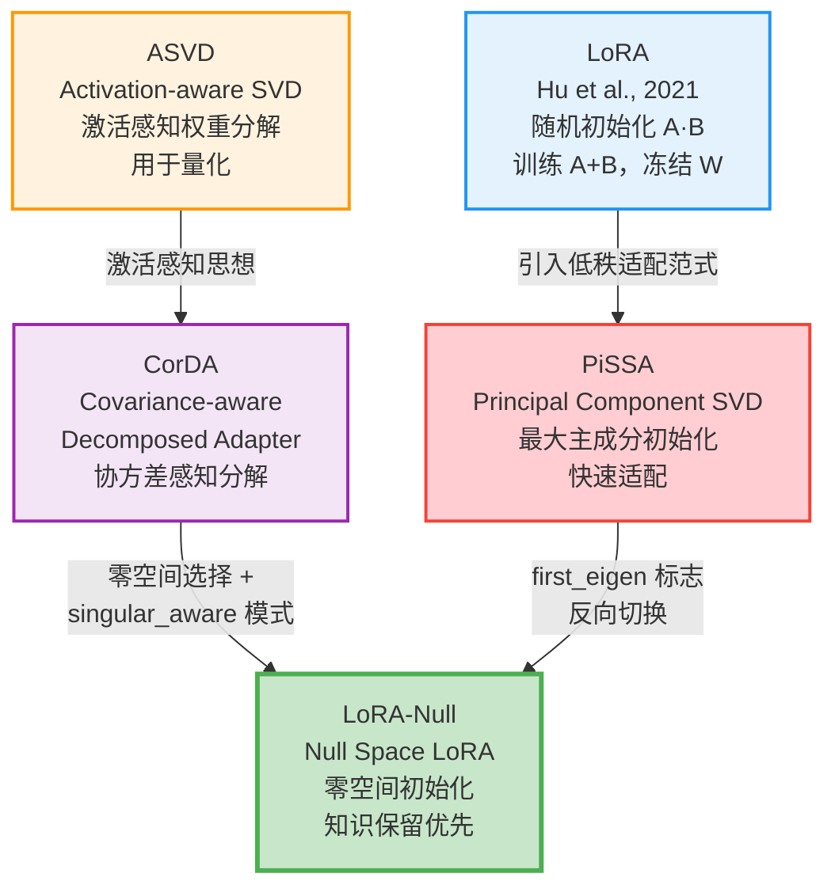
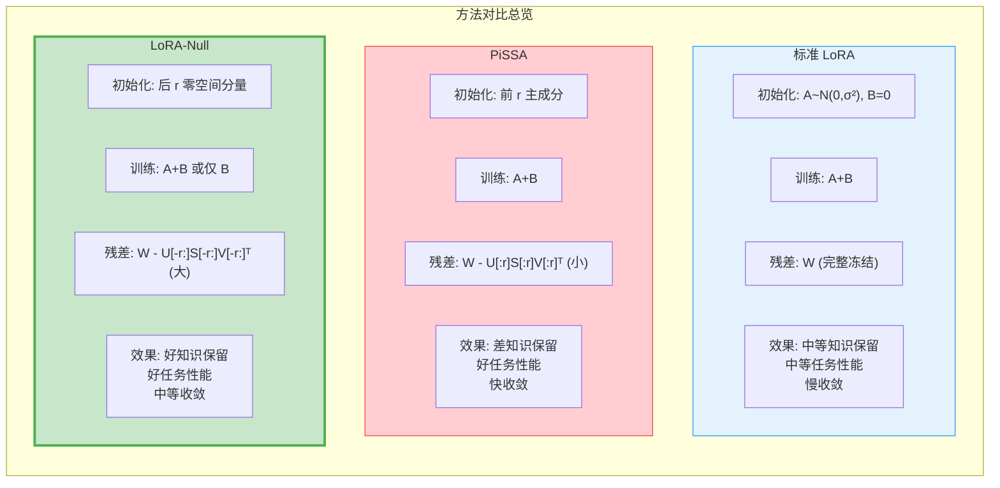
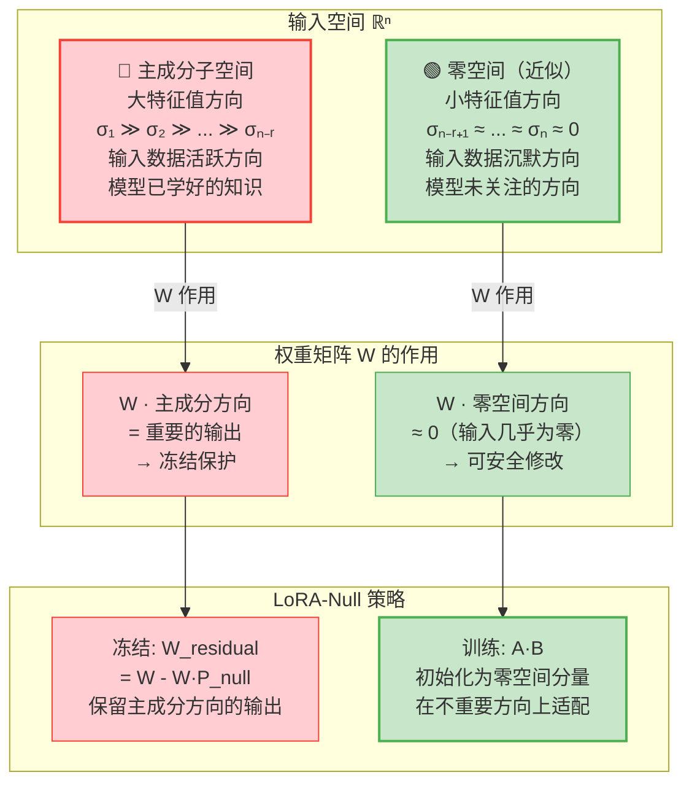
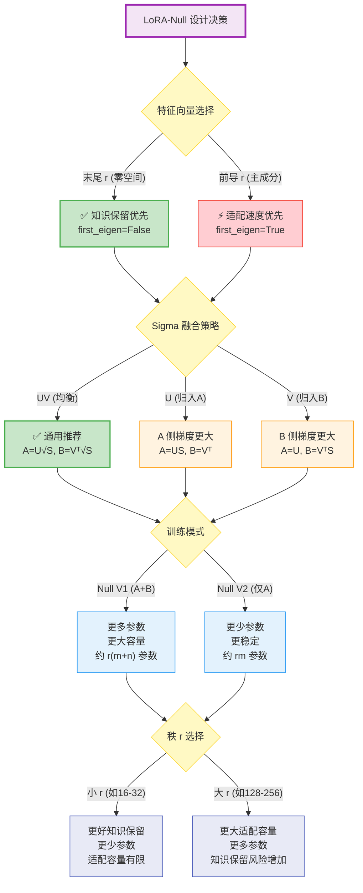
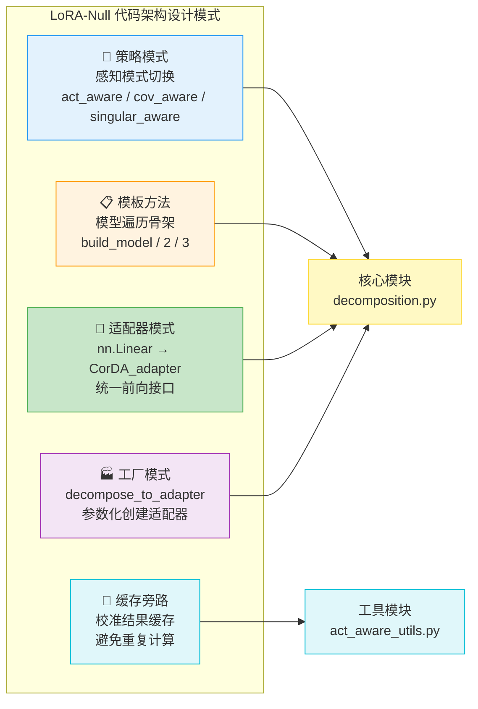

# 设计理念与原理总结

> 本文档是 LoRA-Null 项目系列深度分析的总纲性文档，以分-总-分的写作风格，从宏观设计哲学出发，逐层展开核心创新、方法对比、数学直觉、设计权衡与架构模式，最终回归到对整个项目设计统一性的升华理解。本文将前十二篇文档的洞察融会贯通，提供对 LoRA-Null 设计全貌的高层综合。

---

## 总览：LoRA-Null 的设计哲学

### 一句话概括

LoRA-Null 的核心哲学可以凝练为一句话：**不是在最重要的方向上学习，而是在最不重要的方向上学习，才能最好地保护已有的知识。**

这一看似反直觉的命题，恰恰是大语言模型参数高效微调的关键洞察——预训练模型的知识编码在权重矩阵的主成分方向上，微调时若在这些方向上修改权重，将不可避免地损害已有知识；而若在输入分布的零空间（近似零空间）方向上修改权重，则对已有输出的影响最小，从而实现知识保留与任务适配的最优平衡。

### 设计哲学的三重根基

LoRA-Null 的设计建立在三重根基之上：

1. **谱分析根基**：SVD 分解将权重矩阵分解为正交方向及其重要性排序，提供了"重要"与"不重要"的数学定义
2. **统计感知根基**：输入协方差矩阵刻画了数据分布的结构，其零空间定义了"安全"的修改方向
3. **残差冻结根基**：将权重拆分为可训练的低秩分量与冻结的残差分量，确保主成分方向的输出在训练中不变

这三重根基环环相扣，共同支撑了 LoRA-Null 的核心目标：**在不破坏预训练知识的前提下，高效地适配下游任务**。

---

## 分述一：核心创新总结

### 1.1 核心思想：零空间初始化

LoRA-Null 的核心创新在于**利用输入协方差矩阵的零空间来初始化 LoRA 适配器**。具体而言：

- **输入协方差矩阵** $\Sigma = \frac{1}{N}\sum x_i x_i^T$ 捕捉了校准数据在各线性层输入上的分布结构
- **主成分方向**（大特征值对应的特征向量）：输入数据在这些方向上活跃，是模型"已学好的知识"，应予保留
- **零空间方向**（小/零特征值对应的特征向量）：输入数据在这些方向上沉默，是模型"不太关注的方向"，可安全修改
- **适配器初始化**：将 LoRA 适配器的权重初始化为零空间方向上的分量，使得训练过程中的参数更新主要沿零空间方向进行

### 1.2 知识保留机制

LoRA-Null 的知识保留机制可以形式化表述为：

$$W = \underbrace{U_r S_r V_r^T}_{\text{零空间分量（可训练）}} + \underbrace{W_{\text{residual}}}_{\text{主成分分量（冻结）}}$$

其中：
- $U_r S_r V_r^T$ 是权重矩阵在零空间方向上的投影，作为 LoRA 适配器的初始化值
- $W_{\text{residual}} = W - U_r S_r V_r^T$ 是权重矩阵在主成分方向上的分量，冻结不更新

训练开始时，$A \cdot B + W_{\text{residual}} = W$，保证了初始化等价性。训练过程中，$A$ 和 $B$ 更新而 $W_{\text{residual}}$ 不变，模型的变化被约束在零空间方向上。

### 1.3 三种感知模式

LoRA-Null 提供了三种感知模式，以不同精度和效率捕捉输入分布信息：

| 感知模式 | 统计量 | 精度 | 计算开销 | 核心思想 |
|---------|--------|------|---------|---------|
| **Cov-aware** | 完整协方差矩阵 $\Sigma \in \mathbb{R}^{n \times n}$ | 最高 | 最高（$O(n^3)$ 矩阵求逆） | 考虑输入特征间的完整相关性 |
| **Act-aware** | 对角缩放矩阵 $d \in \mathbb{R}^{n}$ | 中等 | 最低（$O(n)$ 逐元素运算） | 忽略特征间相关性，仅考虑边际统计 |
| **Singular-aware** | 协方差矩阵的零空间方向 $U_{\min K}$ | 高 | 中等（$O(n^3)$ SVD，但无需矩阵求逆） | 直接提取零空间，几何意义最清晰 |

**Cov-aware** 通过 $W' = W \cdot \Sigma_{\text{fixed}}$ 变换权重矩阵，使 SVD "感知"输入相关性，分解后校正 $V$；**Act-aware** 是 Cov-aware 的对角近似，用 $W' = W \cdot \text{diag}(d)$ 替代；**Singular-aware** 则直接对协方差矩阵做 SVD，提取零空间方向 $U_{\min K}$，将权重投影到零空间后再做 SVD。

### 1.4 核心创新的价值定位

LoRA-Null 的核心创新价值在于：它首次将**零空间**这一线性代数概念系统性地引入 LoRA 适配器的初始化，提供了一种理论上可解释、实践中有效的知识保留方案。与 PiSSA 的"在最重要方向上适配"策略形成鲜明对比，LoRA-Null 的"在最不重要方向上适配"策略为参数高效微调开辟了一条全新的研究路径。

---

## 分述二：与相关工作的比较

### 2.1 方法演化关系图



**图解说明**：LoRA 奠定了低秩适配的基本范式；ASVD 引入了激活感知的权重分解思想；PiSSA 将 SVD 主成分用于 LoRA 初始化，追求快速适配但牺牲知识保留；CorDA 将协方差感知引入分解；LoRA-Null 在 CorDA 基础上增加了零空间选择（singular_aware 模式），并通过 `first_eigen` 标志兼容 PiSSA 策略。绿色加粗边框表示 LoRA-Null 是本项目的核心方法。

### 2.2 与标准 LoRA 的对比

| 维度 | 标准 LoRA (Hu et al.) | LoRA-Null |
|------|----------------------|-----------|
| **初始化方式** | A: 高斯随机，B: 零矩阵 | A/B: 由 SVD 零空间分量初始化 |
| **训练初期行为** | A·B = 0，适配器无贡献 | A·B = 零空间分量，适配器有微小贡献 |
| **残差权重** | 原始权重 W（完整冻结） | W - U_r S_r V_r^T（主成分冻结） |
| **知识保留** | 中等（随机初始化不直接破坏知识，但训练可能偏移） | 强（零空间方向对已有输出影响最小） |
| **收敛速度** | 较慢（从零开始学习） | 中等（零空间分量提供非零起点） |
| **代码体现** | PEFT 库 `LoraConfig` | `CorDA_adapter` + `decompose_to_adapter2()` |

**核心差异**：标准 LoRA 的适配器从零贡献开始（B=0），训练过程中逐步学习对原始权重的修正；LoRA-Null 的适配器从零空间分量开始，训练过程在零空间方向上继续优化。后者对预训练知识的保护更为系统化。

### 2.3 与 PiSSA 的对比

| 维度 | PiSSA | LoRA-Null |
|------|-------|-----------|
| **选取的 SVD 分量** | 前 r 个（最大奇异值，主成分） | 后 r 个（最小奇异值，零空间） |
| **可训练部分** | 最重要的方向 | 最不重要的方向 |
| **冻结残差** | 最不重要的方向（小残差） | 最重要的方向（大残差） |
| **收敛速度** | 快（主成分承载最大信息量） | 中等（零空间分量信息量小） |
| **知识保留** | 差（修改主成分会破坏已有知识） | 强（主成分被冻结保护） |
| **代码标志** | `first_eigen=True` | `first_eigen=False`（默认） |

**关键洞察**：PiSSA 和 LoRA-Null 恰好是同一 SVD 谱的两个极端——PiSSA 选择谱的前端（高能量），LoRA-Null 选择谱的尾端（低能量）。代码中的 `first_eigen` 标志允许在两者之间切换，体现了设计的灵活性和对相关工作的兼容。

### 2.4 与 ASVD 的对比

| 维度 | ASVD (Activation-aware SVD) | LoRA-Null |
|------|---------------------------|-----------|
| **原始目标** | 权重矩阵量化 | LoRA 适配器初始化 |
| **感知方式** | 激活绝对均值/最大值（对角近似） | 协方差矩阵（完整/对角/零空间） |
| **核心操作** | $W' = W \cdot \text{diag}(d)$，对 $W'$ 做 SVD | $W' = W \cdot \Sigma$ 或 $W_{\text{null}} = W \cdot P_{\text{null}}$ |
| **代码体现** | `act_aware` 模式 | `cov_aware` / `singular_aware` 模式 |

**演化关系**：ASVD 的激活感知思想直接启发了 LoRA-Null 中的 `act_aware` 模式。代码中 `decompose_to_adapter2()` 函数的 `act_aware` 分支与 ASVD 的核心逻辑高度一致，可以视为 ASVD 思想在 LoRA 初始化场景的直接应用。

### 2.5 与 CorDA 的对比

| 维度 | CorDA | LoRA-Null |
|------|-------|-----------|
| **核心方法** | 协方差感知分解 | 零空间选择 + 协方差感知 |
| **感知模式** | cov-aware, act-aware | cov-aware, act-aware, **singular-aware**, **twin-aware** |
| **适配器类名** | `CorDA_adapter` | `CorDA_adapter`（沿用类名） |
| **代码演进** | 基础版本 | 增加了 `decompose_to_adapter2()` 和 `decompose_to_adapter3()` |

**关键发现**：代码中的 `CorDA_adapter` 类名直接表明 LoRA-Null 的代码库从 CorDA 演化而来。LoRA-Null 在 CorDA 的基础上增加了 `singular_aware` 和 `twin_aware` 两种模式——前者是 LoRA-Null 的核心创新（直接利用零空间），后者是双感知模式的扩展（同时保护两个子空间）。

### 2.6 方法对比总览图



**图解说明**：三种方法的核心差异在于初始化策略和残差权重的组成。LoRA 的残差最大（完整权重），PiSSA 的残差最小（仅含零空间分量），LoRA-Null 的残差接近完整权重（仅扣除零空间分量）。LoRA-Null 在知识保留和任务性能之间取得了最佳平衡。

---

## 分述三：数学直觉与几何解释

### 3.1 权重矩阵的几何视角

将权重矩阵 $W \in \mathbb{R}^{m \times n}$ 视为从输入空间 $\mathbb{R}^n$ 到输出空间 $\mathbb{R}^m$ 的线性映射。SVD 分解 $W = USV^T$ 将这个映射分解为三步：

1. **$V^T$**：在输入空间中旋转，将输入投影到一组正交基上
2. **$S$**：沿各正交方向缩放，奇异值量化了各方向的"能量"
3. **$U$**：在输出空间中旋转，将缩放后的结果映射到输出正交基上

### 3.2 协方差矩阵的几何意义

输入协方差矩阵 $\Sigma = \frac{1}{N}\sum x_i x_i^T$ 是对称半正定矩阵，其特征分解 $\Sigma = U_\Sigma S_\Sigma U_\Sigma^T$ 揭示了输入空间的"活跃方向"结构：

- **大特征值方向**（$U_\Sigma$ 的前几列）：输入数据在这些方向上方差大，意味着模型在这些方向上接收到了丰富的信号，已经学到了对这些方向的有效响应
- **小特征值方向**（$U_\Sigma$ 的后几列）：输入数据在这些方向上方差小，意味着模型在这些方向上几乎没有接收到信号，对这些方向的响应"未被训练"

### 3.3 零空间几何解释图



**图解说明**：上方将输入空间分为两个子空间——主成分子空间（红色，输入活跃）和零空间（绿色，输入沉默）。中间展示权重矩阵对两类方向的不同作用：主成分方向产生重要输出，零空间方向产生可忽略的输出。下方展示 LoRA-Null 的策略：冻结残差权重以保留主成分方向的输出，训练 LoRA 适配器以在零空间方向上进行安全适配。

### 3.4 零空间投影的数学推导

在 `singular_aware` 模式下，零空间投影的核心计算为：

$$W_{\text{null}} = W \cdot (U_{\min K} \cdot U_{\min K}^T)$$

其中 $U_{\min K} = U_\Sigma[:, -r:]$ 是协方差矩阵最后 $r$ 个左奇异向量。投影矩阵 $P_{\text{null}} = U_{\min K} \cdot U_{\min K}^T$ 将权重矩阵的每一行投影到零空间方向上。

残差权重为：

$$W_{\text{residual}} = W - W_{\text{null}} = W \cdot (I - U_{\min K} U_{\min K}^T)$$

这里 $I - U_{\min K} U_{\min K}^T$ 是零空间的正交补空间（即主成分子空间）的投影矩阵。因此残差权重恰好保留了权重矩阵在主成分方向上的分量。

### 3.5 几何直觉的统一理解

将上述几何视角统一来看，LoRA-Null 的核心思想可以表述为：

> **在输入空间的零空间中修改权重，等价于在输出空间中修改"对零输入的响应"。由于零空间方向的输入几乎为零，这种修改对已有输出的影响微乎其微。**

这正是 LoRA-Null 能够在保留预训练知识的同时有效适配下游任务的几何基础。

---

## 分述四：协方差感知的理论优势

### 4.1 完整相关性建模

协方差矩阵 $\Sigma \in \mathbb{R}^{n \times n}$ 不仅记录了每个输入维度的方差（对角元素），还记录了维度之间的相关性（非对角元素）。这种完整的相关性建模使得 SVD 分解能够：

- **识别"组合方向"**：如果两个输入特征高度相关，协方差感知的 SVD 会将它们视为一个"组合方向"，而非两个独立方向
- **更准确地评估重要性**：考虑了特征间的冗余和互补关系，避免将相关特征的重要性重复计算
- **更精确地定位零空间**：在完整相关性信息下，零空间的边界更加清晰

### 4.2 与对角近似的对比

| 方面 | 完整协方差（Cov-aware） | 对角近似（Act-aware） |
|------|------------------------|----------------------|
| 建模能力 | 捕捉特征间相关性 | 仅捕捉边际统计 |
| 零空间定位精度 | 高 | 低（可能将相关方向误判为独立零空间） |
| 计算复杂度 | $O(n^3)$（矩阵求逆） | $O(n)$（逐元素运算） |
| 内存开销 | $O(n^2)$ | $O(n)$ |
| 数值稳定性 | 需要阻尼正则化 | 天然稳定（仅需加小常数防除零） |

### 4.3 Singular-aware 的折中优势

Singular-aware 模式在 Cov-aware 和 Act-aware 之间找到了一个优雅的折中：

- **与 Cov-aware 相同**：使用完整协方差矩阵，保留了完整的相关性信息
- **比 Cov-aware 更直接**：不需要矩阵求逆和 $V$ 的校正步骤，直接从协方差矩阵的 SVD 中提取零空间方向
- **几何意义更清晰**：零空间投影 $W \cdot (U_{\min K} U_{\min K}^T)$ 的物理意义一目了然

### 4.4 理论优势的实证意义

协方差感知的理论优势在以下场景中尤为显著：

1. **注意力层**：Q/K/V 投影层的输入高度相关（来自同一残差流），完整协方差建模能更准确地区分重要与不重要方向
2. **MLP 层**：gate_proj 和 up_proj 的输入相同但功能不同，协方差感知能捕捉它们输入空间的细微差异
3. **跨层差异**：不同层的协方差结构差异显著，协方差感知能自适应地为每层选择最合适的零空间方向

---

## 分述五：设计权衡分析

### 5.1 设计权衡决策树



**图解说明**：LoRA-Null 的设计决策可以归纳为四个维度的权衡——特征向量选择、Sigma 融合策略、训练模式和秩选择。黄色节点为决策点，绿色节点为推荐默认选择，红色节点为风险选择，蓝色节点为场景依赖选择。每个决策都涉及知识保留与适配能力之间的权衡。

### 5.2 前导 vs 末尾特征向量

| 选择 | 策略 | 残差权重 | 知识保留 | 收敛速度 | 适用场景 |
|------|------|---------|---------|---------|---------|
| **末尾 r**（默认） | 零空间初始化 | $W - U_{[-r:]}S_{[-r:]}V_{[-r:]}^T$（接近完整权重） | ✅ 强 | 中等 | 需要保留世界知识的微调 |
| **前导 r** | 主成分初始化 | $W - U_{[:r]}S_{[:r]}V_{[:r]}^T$（仅含零空间分量） | ❌ 弱 | 快 | 不关心知识保留的快速适配 |

**代码体现**：`decomposition.py` 中的 `first_eigen` 参数控制这一选择。默认 `first_eigen=False`（LoRA-Null 哲学），设为 `True` 时切换为 PiSSA 策略。

### 5.3 Sigma 融合策略

| 策略 | A 的初始化 | B 的初始化 | 梯度特性 | 适用场景 |
|------|-----------|-----------|---------|---------|
| **UV**（默认） | $U\sqrt{S}$ | $V^T\sqrt{S}$ | A/B 梯度尺度均衡 | 通用场景（推荐） |
| **U** | $US$ | $V^T$ | A 侧梯度大，B 侧梯度小 | 希望 A 学得更快 |
| **V** | $U$ | $V^TS$ | A 侧梯度小，B 侧梯度大 | 希望 B 学得更快 |

**关键不变量**：无论哪种策略，$A \cdot B = U \cdot \text{diag}(S) \cdot V^T$ 始终成立，差异仅在于梯度更新的动力学。

### 5.4 训练模式选择

| 模式 | 可训练参数 | 参数量（4096×4096, r=128） | 优势 | 劣势 |
|------|-----------|--------------------------|------|------|
| **Null V1** | ALinear + BLinear | $r(m+n) = 1,048,576$ | 更大适配容量 | 更多参数，可能过拟合 |
| **Null V2** | 仅 ALinear | $rm = 524,288$ | 更少参数，更稳定 | 适配容量减半 |
| **LoRA** | lora_A + lora_B | $r(m+n)$ | 标准基线对比 | 无零空间保护 |

### 5.5 秩选择

| 秩 | 知识保留 | 适配容量 | 参数量 | 适用场景 |
|----|---------|---------|--------|---------|
| 小（16-32） | ✅ 好 | 有限 | 少 | 知识密集型任务 |
| 中（64-128） | ✅ 较好 | 充足 | 适中 | 通用微调 |
| 大（256+） | ⚠️ 风险增加 | 很大 | 多 | 复杂任务适配 |

**核心权衡**：秩越大，零空间方向越多，适配容量越大，但同时残差权重中保留的主成分越少，知识保留的风险越高。LoRA-Null 的推荐秩为 128，在 LLaMA-2-7B 上实现了知识保留与任务性能的良好平衡。

---

## 分述六：代码架构设计模式

### 6.1 策略模式（Strategy Pattern）

**应用场景**：三种感知模式（act_aware, cov_aware, singular_aware）作为可互换的策略。

**代码体现**：`decompose_to_adapter2()` 函数通过条件分支实现策略切换：

```python
if act_aware:
    w = pretrained_w * scaling_diag_matrix.view(1, -1)  # Act-aware 策略
elif cov_aware:
    w = pretrained_w @ fix_covariance_matrix              # Cov-aware 策略
elif singular_aware:
    # Singular-aware 策略：直接操作零空间
    U_, S_, V_ = torch.linalg.svd(covariance_matrix)
    U_min_K = U_[:, -r:]
    temp = pretrained_w @ (U_min_K @ U_min_K.t())
```

**设计优势**：新增感知模式只需添加新的条件分支，不影响已有逻辑。`twin_aware` 模式就是通过这种方式扩展的。

### 6.2 模板方法模式（Template Method Pattern）

**应用场景**：`build_model`、`build_model2`、`build_model3` 三个函数共享相同的模型遍历模板。

**代码体现**：三个函数都遵循相同的算法骨架：

```
1. 构建 module_dict 和 linear_info
2. 遍历所有 nn.Linear 层
3. 跳过 lm_head
4. 调用具体的分解函数（decompose_to_adapter / 2 / 3）
5. 替换原始层为适配器
6. 清理协方差/激活属性
7. 释放 GPU 缓存
```

差异仅在于步骤 4 调用的具体分解函数不同。

### 6.3 适配器模式（Adapter Pattern）

**应用场景**：`CorDA_adapter` 将 `nn.Linear` 包装为低秩分解形式，对外提供与 `nn.Linear` 相同的接口。

**代码体现**：

```python
class CorDA_adapter(nn.Module):
    def forward(self, inp):
        y = self.BLinear(inp)
        y = self.ALinear(y) + F.linear(inp, self.weight_residual)
        return y
```

输入输出维度与原始 `nn.Linear` 完全一致，可以无缝替换。`CovSVDLinear` 同样遵循这一模式。

### 6.4 工厂模式（Factory Pattern）

**应用场景**：`decompose_to_adapter` 系列函数作为工厂，根据参数创建不同配置的适配器实例。

**代码体现**：

```python
def decompose_to_adapter2(linear, act_aware=False, cov_aware=False,
                          singular_aware=False, r=16, first_eigen=False):
    # ... 分解逻辑 ...
    return CorDA_adapter(U, S, V, weight_residual, bias, sigma_fuse)
```

调用者无需关心适配器的构造细节，只需传入参数即可获得正确初始化的适配器实例。

### 6.5 缓存旁路模式（Cache-Aside Pattern）

**应用场景**：校准结果（协方差矩阵、激活分布、Fisher 信息）缓存到磁盘，避免重复计算。

**代码体现**：

```python
def calib_cov_distribution(model, calib_loader, use_cache=True, ...):
    cache_file = f"cache/{model_id}_covariance_matrices_from_{calib_dataset}_size_{calib_size}_seed_{seed}.pt"
    if os.path.exists(cache_file) and use_cache:
        all_covariance_matrix = torch.load(cache_file, map_location="cpu")
        # 注入到模型各层
        return
    # 否则重新计算并保存
```

**设计优势**：协方差矩阵的计算非常耗时（需要完整前向传播 + 矩阵累加），缓存机制使得重复实验时可以跳过计算步骤，大幅提升效率。

### 6.6 设计模式总结图



**图解说明**：五种设计模式在 LoRA-Null 代码库中的分布。策略模式和工厂模式集中在核心分解模块，适配器模式贯穿适配器类定义，模板方法体现在模型构建函数，缓存旁路用于校准工具模块。

---

## 分述七：潜在改进方向

### 7.1 模型架构扩展

**现状**：当前仅支持 LLaMA 系列模型（通过 `CovSVDLlamaForCausalLM` 和 `modeling_oursvd_llama.py`）。

**改进方向**：
- 支持 Mistral、Qwen、ChatGLM 等更多架构
- 将 `CovSVDLinear` 抽象为通用的 `DecomposedLinear` 基类，通过注册机制支持不同模型
- 自动检测模型架构并选择对应的替换策略

### 7.2 量化感知分解

**现状**：SVD 分解在 float32 精度下进行，分解后模型以 float16 保存。

**改进方向**：
- 在分解过程中考虑量化误差，使分解结果在低精度下仍保持良好性质
- 支持 4-bit / 8-bit 量化后的适配器训练（如 QLoRA 与 LoRA-Null 的结合）
- 研究量化对零空间方向的影响——量化噪声可能改变零空间的边界

### 7.3 自适应秩选择

**现状**：所有层使用相同的秩 $r$。

**改进方向**：
- 根据各层协方差矩阵的谱衰减速度自适应选择秩——谱衰减快的层需要更少的适配参数
- 基于层的重要性评分分配秩预算——更重要的层分配更多参数
- 实验表明，注意力层和 MLP 层的最优秩可能不同

### 7.4 多任务协方差收集

**现状**：使用单一校准数据集收集协方差矩阵。

**改进方向**：
- 融合多个数据集的协方差信息，获得更全面的输入分布刻画
- 支持增量式协方差更新——微调过程中动态调整零空间方向
- 研究不同校准数据集对零空间质量的影响

### 7.5 数值稳定性改进

**现状**：
- Cov-aware 模式使用阻尼正则化确保协方差矩阵可逆
- Singular-aware 模式对 SVD 结果进行 NaN/Inf 检查
- 协方差收集时对输入进行归一化（除以最大绝对值）

**改进方向**：
- 使用更稳定的 SVD 算法（如随机 SVD）处理大规模矩阵
- 引入条件数监控，当协方差矩阵条件数过大时自动调整正则化强度
- 使用 Cholesky 分解替代直接矩阵求逆，提升数值稳定性

### 7.6 训练框架集成

**现状**：依赖 HuggingFace Trainer 进行训练。

**改进方向**：
- 支持 DeepSpeed、FSDP 等分布式训练框架
- 集成 vLLM 或 TensorRT-LLM 进行训练感知的推理优化
- 提供与 Axolotl、LLaMA-Factory 等微调框架的集成接口

---

## 总述：设计统一性与核心洞察

### 统一的设计语言

回顾全文，LoRA-Null 的所有设计决策都可以归结为一个统一的主题：**知识保护与任务适配的分离**。这一主题在不同层面有不同的体现：

| 层面 | 知识保护 | 任务适配 | 分离机制 |
|------|---------|---------|---------|
| **数学层面** | 主成分方向（大特征值） | 零空间方向（小特征值） | SVD 谱分解 |
| **架构层面** | weight_residual（冻结） | ALinear + BLinear（可训练） | 双路径并行 |
| **训练层面** | 非适配器参数（冻结） | 适配器参数（可训练） | requires_grad 控制 |
| **合并层面** | 残差权重 + 训练后适配器 | → 标准 nn.Linear | 权重相加还原 |

### 核心洞察的升华

LoRA-Null 的设计哲学超越了具体的技术实现，提供了一种关于参数高效微调的深层思考：

1. **重要性是相对的**：权重矩阵的"重要性"不是绝对的，而是相对于输入分布而言的。同一个权重方向，对于不同的输入分布，其重要性可能截然不同。这正是协方差感知的理论基础。

2. **保护比学习更难**：在微调场景中，保护已有知识比学习新知识更具挑战性。PiSSA 的快速收敛令人心动，但代价是知识遗忘；LoRA-Null 选择了一条更保守但更安全的路径。

3. **零空间不是浪费**：传统观点认为零空间是"无用"的方向，但 LoRA-Null 证明了零空间恰恰是微调的"安全港"——在这些方向上修改权重，既不会破坏已有知识，又能为新的任务知识提供空间。

4. **分解即构造**：SVD 分解不仅是分析工具，更是构造工具。将分解结果直接用于初始化可训练参数，使得"理解权重结构"和"利用权重结构"合二为一。

5. **残差即保险**：冻结残差权重确保了即使低秩路径在微调中偏离，原始权重信息也不会丢失。这是一种"可撤销"的微调策略——如果微调效果不佳，可以回到原始状态。

### 从 LoRA-Null 看参数高效微调的未来

LoRA-Null 的设计理念为参数高效微调的未来发展指明了几个可能的方向：

- **自适应感知**：根据微调任务的特点，自动选择最合适的感知模式和感知精度
- **动态零空间**：在训练过程中动态更新零空间方向，使适配器始终在最安全的方向上学习
- **多粒度分解**：在不同层使用不同的分解策略和秩，实现计算资源的最优分配
- **知识保留度量**：开发更精确的知识保留度量指标，指导零空间方向的选择

### 结语

LoRA-Null 的设计哲学——**在最不重要的方向上学习，才能最好地保护已有的知识**——不仅是技术层面的创新，更是一种关于如何与预训练知识"和谐共处"的深刻洞察。在大语言模型日益庞大、预训练知识日益珍贵的今天，这一哲学的实践价值将愈发凸显。

---

## 附录：源码参考索引

| 主题 | 关键文件 | 关键函数/类 |
|------|---------|------------|
| 核心分解 | `adapterlib/decomposition.py` | `decompose_to_adapter2()`, `decompose_to_adapter3()` |
| 适配器架构 | `adapterlib/decomposition.py` | `CorDA_adapter`, `CorDA_adapter2` |
| 协方差收集 | `adapterlib/act_aware_utils.py` | `calib_cov_distribution()`, `calib_cov_distribution2()` |
| 激活收集 | `adapterlib/act_aware_utils.py` | `calib_input_distribution()`, `calib_fisher_info()` |
| 模型构建 | `build_adapter.py` | `main()` |
| 训练 V1 | `train_model.py` | `train()` |
| 训练 V2 | `train_model_freeze_a.py` | `train()` |
| 适配器合并 | `merge_adapter_for_Null.py` | `main()` |
| 自定义模型 | `mapping/modeling_oursvd_llama.py` | `CovSVDLinear`, `CovSVDLlamaForCausalLM` |
| 自定义配置 | `mapping/configuration_oursvd_llama.py` | `CovSVDLlamaConfig` |
