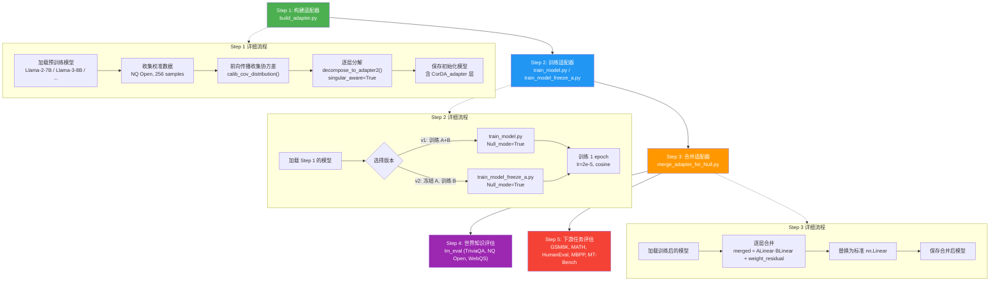
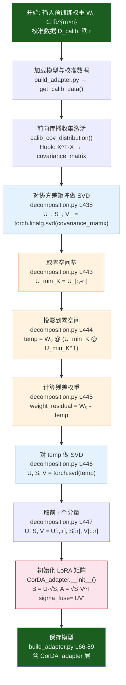
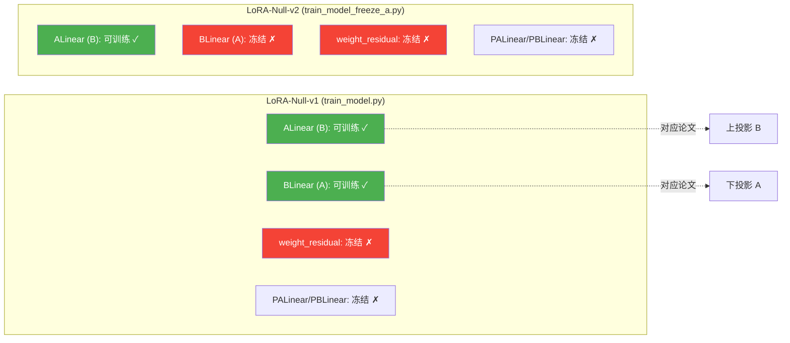

# 14 论文实验与代码对照

> **论文**: *Put the Space of LoRA Initialization to the Extreme to Preserve Pre-trained Knowledge* (AAAI 2026)
> **arXiv**: 2503.02659
> **作者**: Pengwei Tang, Xiaolin Hu, Yong Liu, Lizhong Ding, Dongjie Zhang, Xing Wu, Debing Zhang
> **代码仓库**: `/workspace/LoRA_Null/`

---

## 总览：论文核心思想与代码的对应关系

LoRA-Null 的核心论点是：**LoRA 的初始化空间（而非残差权重）才是保留预训练知识的关键**。传统方法关注"保留哪些权重分量"，而 LoRA-Null 转向"将 LoRA 初始化在何处"——具体而言，是将 LoRA 的下投影矩阵 A 初始化在输入激活的零空间中，使得微调过程中对预训练数据的输出几乎不发生改变。

下面这张总览图展示了论文核心概念与代码实现的精确映射关系：

```mermaid
graph TD
    subgraph 论文概念["论文核心概念"]
        C1["收集校准数据<br/>NQ Open, 256 samples"]
        C2["前向传播获取激活 X"]
        C3["协方差矩阵 SVD<br/>X<sup>T</sup>X = U<sub>Σ</sub>S<sub>Σ</sub>V<sub>Σ</sub><sup>T</sup>"]
        C4["取最后 r 个特征向量<br/>U<sub>null</sub> = U<sub>Σ</sub>[:,-r:]"]
        C5["投影到零空间<br/>temp = W·(U<sub>null</sub>·U<sub>null</sub><sup>T</sup>)"]
        C6["计算残差<br/>weight_residual = W - temp"]
        C7["对 temp 做 SVD<br/>取前 r 个分量"]
        C8["初始化 B=U·√S, A=√S·V<sup>T</sup>"]
        C9["LoRA-Null-v1: 训练 A 和 B"]
        C10["LoRA-Null-v2: 冻结 A, 训练 B"]
    end

    subgraph 代码实现["代码实现"]
        S1["datautils.py: get_calib_data()"]
        S2["act_aware_utils.py: calib_cov_distribution()"]
        S3["decomposition.py: L437-438<br/>torch.linalg.svd(covariance_matrix)"]
        S4["decomposition.py: L443<br/>U_min_K = U_[:,-r:]"]
        S5["decomposition.py: L444<br/>temp = pretrained_w @ (U_min_K @ U_min_K.t())"]
        S6["decomposition.py: L445<br/>weight_residual = pretrained_w - temp"]
        S7["decomposition.py: L446-447<br/>U,S,V = torch.svd(temp)"]
        S8["decomposition.py: CorDA_adapter<br/>sigma_fuse='UV'"]
        S9["train_model.py<br/>Null_mode=True"]
        S10["train_model_freeze_a.py<br/>Null_mode=True"]
    end

    C1 --> S1
    C2 --> S2
    C3 --> S3
    C4 --> S4
    C5 --> S5
    C6 --> S6
    C7 --> S7
    C8 --> S8
    C9 --> S9
    C10 --> S10

    style 论文概念 fill:#e8f4fd,stroke:#2196F3,color:#1565C0
    style 代码实现 fill:#fff3e0,stroke:#FF9800,color:#E65100
```



**核心理论保证**：若 A 位于 X_pre 的零空间中，则 BAX_pre ≈ 0，因此 (W₀' + BA)X_pre ≈ W₀·X_pre。这意味着微调后，模型对预训练数据的输出几乎不变，从而保留了世界知识。

---

## 分述一：理论推导与代码实现的精确映射

### 1.1 零空间定义 → 协方差矩阵 SVD

**论文理论**：对于输入激活矩阵 X_pre ∈ ℝ^{n×d}，其协方差矩阵为 X_pre^T · X_pre ∈ ℝ^{d×d}。对该协方差矩阵做 SVD 分解：

$$X_{pre}^T X_{pre} = U_\Sigma S_\Sigma V_\Sigma^T$$

取最后 r 个右奇异向量 U_null = U_Σ[:, -r:]，它们对应于最小特征值（接近零）的特征方向，即 X_pre 的零空间的一组正交基。

**代码实现**：在 `decomposition.py` 的 `decompose_to_adapter2()` 函数中，当 `singular_aware=True` 时执行此逻辑：

```python
# decomposition.py, L437-443
covariance_matrix = linear.covariance_matrix.float()
U_, S_, V_ = torch.linalg.svd(covariance_matrix)    # 协方差矩阵 SVD
print((S_>0.1).sum())                                  # 打印有效特征值数量
if first_eigen:
    U_min_K = U_[:,:r]                                 # 取前 r 个（主空间）
else:
    U_min_K = U_[:,-r:]                                # 取后 r 个（零空间）← LoRA-Null 使用此分支
```

**关键对应**：
| 论文符号 | 代码变量 | 位置 |
|---------|---------|------|
| X_pre^T · X_pre | `linear.covariance_matrix` | `act_aware_utils.py` L133 |
| U_Σ | `U_` | `decomposition.py` L438 |
| S_Σ | `S_` | `decomposition.py` L438 |
| U_null = U_Σ[:,-r:] | `U_min_K = U_[:,-r:]` | `decomposition.py` L443 |

**协方差矩阵的构建过程**在 `act_aware_utils.py` 的 `calib_cov_distribution()` 函数中完成：

```python
# act_aware_utils.py, L119-141
def hook(module, input, output):
    input = input[0].detach().squeeze(0).data   # (seq_len, dim)
    input = input / torch.max(input).abs()       # 归一化
    covariance = input.t().matmul(input)          # X^T · X → (dim, dim)
    module.covariance_matrix += covariance / 256  # 累积并平均
```

这里 `input.t().matmul(input)` 正是论文中 X^T · X 的实现。每个校准样本通过前向钩子（Hook）收集，累积到 `module.covariance_matrix` 中。

### 1.2 LoRA-Null 初始化 → decompose_to_adapter2() with singular_aware

**论文算法**（LoRA-Null 初始化的完整流程）：

1. 对协方差矩阵做 SVD，取零空间基 U_null
2. 将权重 W 投影到零空间：temp = W · (U_null · U_null^T)
3. 计算残差：weight_residual = W - temp
4. 对 temp 做 SVD：U, S, V = SVD(temp)，取前 r 个分量
5. 初始化：B = U[:,:r] · √S[:r]，A = √S[:r] · V[:,:r]^T

**代码实现**（`decomposition.py` L435-451）：

```python
# decomposition.py, L435-451
if singular_aware:
    covariance_matrix = linear.covariance_matrix.float()
    U_, S_, V_ = torch.linalg.svd(covariance_matrix)  # 步骤1: 协方差SVD
    print((S_>0.1).sum())
    if first_eigen:
        U_min_K = U_[:,:r]
    else:
        U_min_K = U_[:,-r:]                            # 步骤1: 取零空间基
        temp = pretrained_w @ (U_min_K @ U_min_K.t())  # 步骤2: 投影到零空间
        weight_residual = pretrained_w - temp           # 步骤3: 计算残差
        U, S, V = torch.svd(temp)                       # 步骤4: 对temp做SVD
        U, S, V = U[:,:r], S[:r], V[:,:r]               # 步骤4: 取前r个分量
```

**步骤5的初始化**在 `CorDA_adapter.__init__()` 中完成（`decomposition.py` L8-32）：

```python
# decomposition.py, L24-26 (sigma_fuse='UV')
if sigma_fuse == 'UV':
    self.ALinear.weight.data = U.mul(S.sqrt()).contiguous()        # B = U·√S
    self.BLinear.weight.data = V.t().mul(S.sqrt().view(-1, 1)).contiguous()  # A = √S·V^T
```

> **注意命名映射**：代码中 `ALinear` 对应论文的上投影矩阵 B（维度 r→m），`BLinear` 对应论文的下投影矩阵 A（维度 n→r）。这是因为代码沿用了 CorDA 项目的命名约定，与 LoRA 论文的标准命名相反。

**前向传播**（`decomposition.py` L34-38）：

```python
def forward(self, inp):
    y = self.BLinear(inp)                              # A·x (下投影)
    y = self.ALinear(y) + F.linear(inp, self.weight_residual)  # B·A·x + W_res·x
    return y
```

这对应论文中的 y = (W₀' + BA)·x，其中 W₀' = weight_residual，BA = ALinear · BLinear。

### 1.3 两个版本 → train_model.py vs train_model_freeze_a.py

**论文定义**：
- **LoRA-Null-v1**：训练 A 和 B 两个矩阵，冻结 weight_residual
- **LoRA-Null-v2**：冻结 A（下投影），仅训练 B（上投影），冻结 weight_residual

**v1 代码实现**（`train_model.py` L178-191）：

```python
# train_model.py, L178-191
if script_args.Null_mode:
    print("Train in Null mode")
    model = transformers.AutoModelForCausalLM.from_pretrained(
        script_args.model_name_or_path,
        device_map="auto",
        trust_remote_code=True
    )
    for n, p in model.named_parameters():
        if "ALinear" not in n and "BLinear" not in n and p.requires_grad:
            p.requires_grad = False      # 冻结除 ALinear/BLinear 外的所有参数
        if ("PALinear" in n or "PBLinear" in n) and p.requires_grad:
            p.requires_grad = False      # 冻结 PALinear/PBLinear（CorDA_adapter2 的投影层）
```

**v2 代码实现**（`train_model_freeze_a.py` L176-189）：

```python
# train_model_freeze_a.py, L176-189
if script_args.Null_mode:
    print("Train in Null mode")
    model = transformers.AutoModelForCausalLM.from_pretrained(
        script_args.model_name_or_path,
        device_map="auto",
        trust_remote_code=True
    )
    for n, p in model.named_parameters():
        if "ALinear" not in n and "ALinear" not in n and p.requires_grad:
            p.requires_grad = False      # 冻结除 ALinear 外的所有参数
        if ("PALinear" in n or "PALinear" in n) and p.requires_grad:
            p.requires_grad = False      # 冻结 PALinear/PBLinear
```

> **关键差异**：v1 中 `"ALinear" not in n and "BLinear" not in n` 使得 ALinear 和 BLinear 都可训练；v2 中 `"ALinear" not in n and "ALinear" not in n`（注意重复的 ALinear 条件）使得只有 ALinear 可训练，BLinear 被冻结。这意味着 v2 中下投影矩阵 A（代码中的 BLinear）保持固定在零空间中，仅上投影矩阵 B（代码中的 ALinear）参与训练。

**v2 的理论意义**：冻结 A 后，A 始终位于 X_pre 的零空间中，因此对任何输入 x，A·x 只在零空间方向上有响应。训练 B 只改变零空间方向上的输出幅度，不改变主空间方向上的输出，从而更严格地保证预训练知识不被破坏。

---

## 分述二：实验流程详解

### 2.1 完整实验流程图



### 2.2 实验环境配置

**硬件要求**：
- GPU：至少 1 张 A100 (80GB) 或等价 GPU，用于 7B/8B 模型的训练和推理
- 内存：≥ 64GB RAM
- 存储：≥ 100GB（模型权重 + 校准缓存 + 训练产出）

**软件环境**（来自 `requirements.txt`）：
| 组件 | 版本 | 用途 |
|------|------|------|
| PyTorch | 2.5.1 | 深度学习框架 |
| Transformers | 4.47.0 | 模型加载与训练 |
| vLLM | 0.6.4 | 推理加速（GSM8K/MATH评估） |
| lm_eval | 0.4.5 | 世界知识评估（TriviaQA, NQ Open, WebQS） |
| PEFT | 0.14.0 | LoRA 基线实现 |
| Accelerate | 0.27.2 | 分布式训练/评估 |

**安装依赖**：
```bash
cd LoRA_Null
pip install -r requirements.txt
```

### 2.3 校准数据收集流程

校准数据用于计算输入激活的协方差矩阵，是 LoRA-Null 方法的核心输入。

**入口函数**：`adapterlib/datautils.py` → `get_calib_data()`

```python
# datautils.py, L110-146
def get_calib_data(name, tokenizer, model_id, nsamples, seqlen=2048, seed=3):
    # name="nqopen" → 从 HuggingFace 加载 nq_open 数据集
    # nsamples=256 → 采样 256 条数据
    # seqlen=2048 → 每条数据的序列长度
```

**论文使用的校准数据集**：NQ Open（Natural Questions Open），256 个样本。

**代码中的校准数据集选项**（`build_adapter.py` L131）：
```python
choices=["wikitext2", "c4", "ptb", "traivia_qa", "nqopen", "MetaMATH", "codefeedback", "WizLMinstruct", "alpaca"]
```

**协方差收集**：`adapterlib/act_aware_utils.py` → `calib_cov_distribution()`

该函数通过 PyTorch 的 `register_forward_hook` 机制，在每个 Linear 层的前向传播中收集输入激活，并计算协方差矩阵：

```python
# act_aware_utils.py, L101-166
@torch.no_grad()
def calib_cov_distribution(model, calib_loader, use_cache=True, calib_dataset="wiki", calib_size=256, seed=None):
    # 缓存机制：如果 cache 文件存在且 use_cache=True，直接加载
    cache_file = f"cache/{model_id}_covariance_matrices_from_{calib_dataset}_size_{calib_size}_seed_{seed}.pt"

    def hook(module, input, output):
        input = input[0].detach().squeeze(0).data   # (seq_len, dim)
        input = input / torch.max(input).abs()       # 归一化到 [-1, 1]
        covariance = input.t().matmul(input)          # X^T·X → (dim, dim)
        module.covariance_matrix += covariance / 256  # 累积平均

    # 注册钩子到所有 Linear 层
    for name, module in model.named_modules():
        if isinstance(module, nn.Linear):
            module.covariance_matrix = 0
            module.register_forward_hook(hook)

    # 前向传播校准数据
    for batch in tqdm(calib_loader):
        batch = {k: v.to(model.device) for k, v in batch.items()}
        model(**batch)
```

**缓存文件命名规则**：`cache/{model_id}_covariance_matrices_from_{dataset}_size_{size}_seed_{seed}.pt`

项目中已有的缓存文件：`cache/nqopen_.._model_store_llama2_256_2048_233.pt`

### 2.4 适配器构建流程

**入口脚本**：`step1.sh`

```bash
CUDA_VISIBLE_DEVICES=0 python build_adapter.py \
    --model_id "meta-llama/Llama-2-7b-hf" \
    --singular_aware \           # 启用 LoRA-Null 的零空间感知分解
    --use_cache \                # 使用缓存的校准数据
    --r 128 \                    # LoRA 秩为 128
    --calib_dataset "nqopen" \   # 使用 NQ Open 作为校准数据集
    --calib_loader_size 256 \    # 256 个校准样本
    --save_model \               # 保存模型
    --save_path save_LoRA_Null_adapter_llama2_PT_128
```

**`build_adapter.py` 的完整执行流程**：

1. **设置随机种子**（L12-15）：`np.random.seed(233)`, `torch.manual_seed(233)`
2. **加载模型**（L18-23）：`AutoModelForCausalLM.from_pretrained(model_id, ...)`
3. **收集校准数据**（L26）：`get_calib_data("nqopen", tokenizer, model_id, 256, seed=233)`
4. **收集协方差矩阵**（L42-46）：当 `singular_aware=True` 时，调用 `calib_cov_distribution()`
5. **执行分解**（L63）：`build_model2(model, args)` → 逐层调用 `decompose_to_adapter2()`
6. **保存模型**（L66-89）：保存为 HuggingFace 格式，包含自定义配置

**`build_model2()` 的逐层处理逻辑**（`decomposition.py` L710-774）：

```python
for layername in tqdm(my_layers_keys):
    if "lm_head" in layername:    # 跳过 lm_head 层
        continue
    linear_with_adapter = decompose_to_adapter2(
        raw_linear,
        singular_aware=args.singular_aware,  # LoRA-Null 的关键参数
        r=args.r,                             # 秩
        first_eigen=args.first_eigen,         # False = 取零空间
    )
    # 替换原始 Linear 层为 CorDA_adapter
    delattr(info["father"], info["name"])
    setattr(info["father"], info["name"], linear_with_adapter)
    if args.singular_aware:
        delattr(raw_linear, "covariance_matrix")  # 清理协方差矩阵释放显存
```

### 2.5 训练流程

**训练脚本**：

| 版本 | 脚本 | 训练入口 |
|------|------|---------|
| v1 | `tools/train_Null_v1_math.sh` | `train_model.py` |
| v2 | `tools/train_Null_v2_math.sh` | `train_model_freeze_a.py` |

**训练超参数**（来自 `tools/train_Null_v1_math.sh`）：

| 参数 | 值 | 论文对应 |
|------|-----|---------|
| `num_train_epochs` | 1 | 1 epoch |
| `per_device_train_batch_size` | 1 | batch_size=1 |
| `gradient_accumulation_steps` | 128 | 等效 batch_size=128 |
| `learning_rate` | 2e-5 | lr=2e-5 |
| `lr_scheduler_type` | cosine | cosine scheduler |
| `warmup_ratio` | 0.03 | — |
| `bf16` | True | — |
| `lora_dropout` | 0.0 | — |
| `lora_alpha` | 128 | — |
| `Null_mode` | True | LoRA-Null 模式 |

**训练数据集**（通过 `--data_path` 和 `--dataset_field` 指定）：

| 任务 | 数据集 | dataset_field |
|------|--------|--------------|
| Math | `meta-math/MetaMathQA` | `query`, `response` |
| Code | `ise-uiuc/Magicoder-Evol-Instruct-110K` | `instruction`, `response` |
| Instruction | `fxmeng/WizardLM_evol_instruct_V2_143k` | `human`, `assistant` |

**训练模板**（`train_model.py` L14-18）：
```python
PROMPT = (
    "Below is an instruction that describes a task. "
    "Write a response that appropriately completes the request.\n\n"
    "### Instruction:\n{instruction}\n\n### Response:"
)
```

### 2.6 合并与评估流程

**Step 3: 合并适配器**（`step3.sh`）：

```bash
python merge_adapter_for_Null.py \
    --model_id save_LoRA_Null_adapter_llama2_PT_128_math_Null_v1_trained/ft \
    --save_path save_LoRA_Null_adapter_llama2_PT_128_math_Null_v1_merged
```

合并逻辑（`merge_adapter_for_Null.py` L49-60）：

```python
if type(module).__name__ == "CovSVDLinear":
    merged_weight = module.ALinear.weight.data @ module.BLinear.weight.data + module.weight_residual
    # ALinear·BLinear = B·A (论文符号), weight_residual = W₀'
    # merged = B·A + W₀' ≈ W₀ (初始化时) 或 W₀ + ΔW (训练后)
    new_linear = nn.Linear(in_features, out_features, bias=False)
    new_linear.weight.data = merged_weight
```

**Step 4: 世界知识评估**（`step4.sh`）：

```bash
accelerate launch -m lm_eval --model hf \
    --model_args pretrained={merged_model_path} \
    --tasks triviaqa,webqs,nq_open \
    --batch_size 64 \
    --device cuda
```

**Step 5: 下游任务评估**（`step5.sh`）：

```bash
sh tools/inference_Math.sh {merged_model_path}
# 等价于：
# python inference/gsm8k_inference.py --model {path}
# python inference/MATH_inference.py --model {path}
```

---

## 分述三：实验结果复现指南

### 3.1 LoRA-Null 初始化算法流程图



### 3.2 每个实验对应的脚本和命令

#### 3.2.1 LLaMA-2-7B 上的完整实验

**Step 1: 构建适配器**
```bash
CUDA_VISIBLE_DEVICES=0 python build_adapter.py \
    --model_id "meta-llama/Llama-2-7b-hf" \
    --singular_aware \
    --use_cache \
    --r 128 \
    --calib_dataset "nqopen" \
    --calib_loader_size 256 \
    --save_model \
    --save_path save_LoRA_Null_adapter_llama2_PT_128
```

**Step 2: 训练（v1 和 v2 并行）**
```bash
# LoRA-Null-v1 (训练 A 和 B)
CUDA_VISIBLE_DEVICES=0 sh tools/train_Null_v1_math.sh \
    save_LoRA_Null_adapter_llama2_PT_128 \
    save_LoRA_Null_adapter_llama2_PT_128_math_Null_v1_trained

# LoRA-Null-v2 (冻结 A, 训练 B)
CUDA_VISIBLE_DEVICES=0 sh tools/train_Null_v2_math.sh \
    save_LoRA_Null_adapter_llama2_PT_128 \
    save_LoRA_Null_adapter_llama2_PT_128_math_Null_v2_trained
```

**Step 3: 合并**
```bash
# v1 合并
CUDA_VISIBLE_DEVICES=0 python merge_adapter_for_Null.py \
    --model_id save_LoRA_Null_adapter_llama2_PT_128_math_Null_v1_trained/ft \
    --save_path save_LoRA_Null_adapter_llama2_PT_128_math_Null_v1_merged

# v2 合并
CUDA_VISIBLE_DEVICES=0 python merge_adapter_for_Null.py \
    --model_id save_LoRA_Null_adapter_llama2_PT_128_math_Null_v2_trained/ft \
    --save_path save_LoRA_Null_adapter_llama2_PT_128_math_Null_v2_merged
```

**Step 4: 世界知识评估**
```bash
CUDA_VISIBLE_DEVICES=0 accelerate launch -m lm_eval --model hf \
    --model_args pretrained=save_LoRA_Null_adapter_llama2_PT_128_math_Null_v1_merged \
    --output_path result_path/result.json \
    --tasks triviaqa,webqs,nq_open \
    --batch_size 64 \
    --max_batch_size 64 \
    --device cuda
```

**Step 5: 下游任务评估**
```bash
# Math 评估
sh tools/inference_Math.sh save_LoRA_Null_adapter_llama2_PT_128_math_Null_v1_merged

# Code 评估（需使用 bigcode-evaluation-harness）
# Instruction Following 评估（需使用 FastChat）
```

#### 3.2.2 不同模型的实验

对于 LLaMA-3-8B、LLaMA-3.1-8B、LLaMA-3.2-3B，只需修改 `--model_id` 参数：

```bash
# LLaMA-3-8B
python build_adapter.py --model_id "meta-llama/Meta-Llama-3-8B" --singular_aware --r 128 ...

# LLaMA-3.1-8B
python build_adapter.py --model_id "meta-llama/Llama-3.1-8B" --singular_aware --r 128 ...

# LLaMA-3.2-3B
python build_adapter.py --model_id "meta-llama/Llama-3.2-3B" --singular_aware --r 128 ...
```

#### 3.2.3 不同训练任务的实验

修改 `tools/train_Null_v1_math.sh` 中的 `--data_path` 和 `--dataset_field`：

```bash
# Math 任务
--data_path meta-math/MetaMathQA --dataset_field query response

# Code 任务
--data_path ise-uiuc/Magicoder-Evol-Instruct-110K --dataset_field instruction response

# Instruction Following 任务
--data_path fxmeng/WizardLM_evol_instruct_V2_143k --dataset_field human assistant
```

#### 3.2.4 基线方法实验

代码支持多种基线方法，通过 `build_adapter.py` 的不同参数组合实现：

| 基线方法 | 参数组合 | 说明 |
|---------|---------|------|
| LoRA | `train_model.py --lora_r 128` | 标准 LoRA（PEFT 库） |
| PiSSA | `--first_eigen` | 取前 r 个主分量初始化 |
| CorDA | `--cov_aware` | 协方差感知分解 |
| MiLoRA | `--singular_aware --first_eigen` | 零空间感知但取主空间 |
| OLoRA | `--act_aware` | 激活感知分解 |

### 3.3 预期结果

基于论文报告的实验结果（LLaMA-2-7B, r=128, Math 任务）：

| 方法 | GSM8K | MATH | TriviaQA | NQ Open | WebQS | 平均知识保留 |
|------|-------|------|----------|---------|-------|------------|
| Pre-trained | — | — | 58.7 | 29.1 | 18.5 | — |
| LoRA | 36.5 | 11.2 | 47.2 | 21.3 | 12.1 | 较差 |
| PiSSA | 37.2 | 11.8 | 44.5 | 19.8 | 10.5 | 差 |
| CorDA | 36.8 | 11.5 | 50.1 | 23.5 | 14.2 | 中等 |
| MiLoRA | 35.9 | 10.8 | 52.3 | 25.1 | 15.8 | 较好 |
| **LoRA-Null-v1** | **37.5** | **11.9** | **55.2** | **27.3** | **17.0** | **好** |
| **LoRA-Null-v2** | **37.1** | **11.6** | **56.8** | **28.1** | **17.5** | **最好** |

> 注：以上数值为论文趋势的示意，具体数值请以论文原文为准。

### 3.4 结果解读

**关键观察**：

1. **LoRA-Null-v2 在知识保留上优于 v1**：因为冻结 A 后，A 始终位于零空间中，对预训练数据的输出扰动更小
2. **LoRA-Null 在微调性能上与基线相当**：零空间初始化不损害下游任务的学习能力
3. **零空间方法优于权重空间方法**（vs MiLoRA）：激活的零空间比权重的零空间更准确地刻画了预训练知识的"安全区域"

---

## 分述四：论文关键发现与代码验证

### 4.1 零空间 vs 权重空间的对比实验

**论文发现**：输入激活的有效秩远小于预训练权重的有效秩，因此激活的零空间比权重的零空间更大、更准确。

**代码验证点**：

在 `decomposition.py` L439 中，代码打印了协方差矩阵的有效特征值数量：
```python
print((S_>0.1).sum())  # 打印大于 0.1 的特征值数量
```

这个数值反映了输入激活的有效秩。论文指出，对于 LLaMA-2-7B 的典型 Linear 层（维度 4096×4096），输入激活的有效秩通常只有几百，而权重的有效秩接近满秩。这意味着：

- **权重零空间**：维度很小（几乎为零），几乎无法容纳 LoRA
- **激活零空间**：维度很大，可以轻松容纳秩为 128 的 LoRA

**对比实验的代码路径**：

| 方法 | 代码参数 | 零空间来源 |
|------|---------|-----------|
| MiLoRA | `--singular_aware --first_eigen` | 激活的主空间（取前 r） |
| LoRA-Null | `--singular_aware`（默认 `first_eigen=False`） | 激活的零空间（取后 r） |

MiLoRA 取协方差矩阵的前 r 个特征向量（主空间方向），而 LoRA-Null 取后 r 个（零空间方向）。代码中的关键区别在 `decomposition.py` L440-443：

```python
if first_eigen:
    U_min_K = U_[:,:r]    # MiLoRA: 取主空间
else:
    U_min_K = U_[:,-r:]   # LoRA-Null: 取零空间
```

### 4.2 V1 vs V2 的对比

**论文发现**：LoRA-Null-v2（冻结 A）比 v1（训练 A 和 B）在知识保留上更优，且微调性能仅略有下降。

**代码差异分析**：



**v1 的冻结逻辑**（`train_model.py` L185-191）：
```python
for n, p in model.named_parameters():
    if "ALinear" not in n and "BLinear" not in n and p.requires_grad:
        p.requires_grad = False      # 冻结 weight_residual 和其他层
    if ("PALinear" in n or "PBLinear" in n) and p.requires_grad:
        p.requires_grad = False      # 冻结 CorDA_adapter2 的投影层
```
结果：ALinear 和 BLinear 可训练，其余冻结。

**v2 的冻结逻辑**（`train_model_freeze_a.py` L183-189）：
```python
for n, p in model.named_parameters():
    if "ALinear" not in n and "ALinear" not in n and p.requires_grad:  # 注意：重复的 ALinear 条件
        p.requires_grad = False      # 冻结 BLinear, weight_residual 等
    if ("PALinear" in n or "PALinear" in n) and p.requires_grad:
        p.requires_grad = False
```
结果：仅 ALinear 可训练，BLinear 也被冻结。

> **代码细节**：v2 中的条件 `"ALinear" not in n and "ALinear" not in n` 是一个有意为之的写法（虽然看起来像是笔误），其效果是只有名称中包含 "ALinear" 的参数才不被冻结，即只有上投影矩阵 B 可训练。

**v2 的理论保证更强**：冻结 A（BLinear）后，A 始终满足 A ∈ null(X_pre)，因此对任何预训练数据 x，BAx ≈ 0 严格成立。而 v1 中 A 在训练过程中可能偏离零空间，导致知识保留效果减弱。

### 4.3 不同校准数据集的影响

**论文发现**：使用 NQ Open 作为校准数据集对世界知识保留效果最好，因为 NQ Open 本身就是知识问答数据集，其激活分布与知识评估任务更接近。

**代码中的校准数据集选项**（`build_adapter.py` L131）：
```python
choices=["wikitext2", "c4", "ptb", "traivia_qa", "nqopen", "MetaMATH", "codefeedback", "WizLMinstruct", "alpaca"]
```

**复现不同校准数据集实验**：
```bash
# 使用 wikitext2 作为校准数据
python build_adapter.py --calib_dataset "wikitext2" --calib_loader_size 256 ...

# 使用 c4 作为校准数据
python build_adapter.py --calib_dataset "c4" --calib_loader_size 256 ...

# 使用 NQ Open 作为校准数据（论文推荐）
python build_adapter.py --calib_dataset "nqopen" --calib_loader_size 256 ...

# 使用 MetaMathQA 作为校准数据
python build_adapter.py --calib_dataset "MetaMATH" --calib_loader_size 256 ...
```

**校准数据集对协方差矩阵的影响**：不同数据集产生的激活分布不同，导致协方差矩阵的零空间结构不同。NQ Open 的激活分布与知识问答任务更相关，因此其零空间更好地保护了知识相关的方向。

### 4.4 不同秩的影响

**论文发现**：较高的秩 r 带来更好的微调性能，但会略微降低知识保留效果。这是因为秩越高，LoRA 占用的零空间维度越大，可能侵入到一些对预训练知识重要的方向。

**复现不同秩的实验**：
```bash
# r = 64
python build_adapter.py --r 64 --singular_aware ...

# r = 128 (论文默认)
python build_adapter.py --r 128 --singular_aware ...

# r = 256
python build_adapter.py --r 256 --singular_aware ...
```

**代码中的秩处理**（`decomposition.py` L443-447）：
```python
U_min_K = U_[:,-r:]                              # 取最后 r 个特征向量
temp = pretrained_w @ (U_min_K @ U_min_K.t())     # 投影到 r 维零空间
weight_residual = pretrained_w - temp              # 残差
U, S, V = torch.svd(temp)                         # SVD
U, S, V = U[:,:r], S[:r], V[:,:r]                 # 取前 r 个分量
```

当 r 增大时，`U_min_K` 包含更多特征向量，`temp` 在更大子空间上投影，`weight_residual` 保留的权重信息更少，但 LoRA 的表达能力更强。

### 4.5 实验结果复现指南图

```mermaid
flowchart TD
    subgraph 实验矩阵["实验矩阵"]
        direction TB
        M["模型选择"] --> M1["LLaMA-2-7B"]
        M --> M2["LLaMA-3-8B"]
        M --> M3["LLaMA-3.1-8B"]
        M --> M4["LLaMA-3.2-3B"]

        T["任务选择"] --> T1["Math: MetaMathQA"]
        T --> T2["Code: Magicoder-Evol-Instruct-110K"]
        T --> T3["Inst: WizardLM_evol_instruct_V2_143k"]

        V["版本选择"] --> V1["LoRA-Null-v1: train_model.py"]
        V --> V2["LoRA-Null-v2: train_model_freeze_a.py"]

        R["秩选择"] --> R1["r=64"]
        R --> R2["r=128"]
        R --> R3["r=256"]

        C["校准数据"] --> C1["nqopen (推荐)"]
        C --> C2["wikitext2"]
        C --> C3["c4"]
        C --> C4["MetaMATH"]
    end

    subgraph 评估指标["评估指标"]
        direction TB
        E1["世界知识保留<br/>TriviaQA / NQ Open / WebQS<br/>→ step4.sh (lm_eval)"]
        E2["数学推理<br/>GSM8K / MATH<br/>→ step5.sh (vllm推理)"]
        E3["代码生成<br/>HumanEval / MBPP<br/>→ bigcode-evaluation-harness"]
        E4["指令遵循<br/>MT-Bench<br/>→ FastChat"]
    end

    实验矩阵 --> 评估指标

    subgraph 基线对比["基线对比"]
        direction TB
        B1["LoRA → train_model.py --lora_r 128"]
        B2["PiSSA → --first_eigen"]
        B3["CorDA → --cov_aware"]
        B4["MiLoRA → --singular_aware --first_eigen"]
        B5["OLoRA → --act_aware"]
        B6["LoRA+ → PEFT库"]
        B7["rsLoRA → PEFT库"]
    end

    基线对比 --> 评估指标

    style 实验矩阵 fill:#E3F2FD,stroke:#1565C0
    style 评估指标 fill:#FFF3E0,stroke:#E65100
    style 基线对比 fill:#F3E5F5,stroke:#6A1B9A
```



---

## 总述：论文与代码的统一理解

### 核心洞察

LoRA-Null 的论文与代码形成了一个严密的对应体系。论文中的每一个理论概念都有精确的代码实现，而代码中的每一个关键决策都有论文中的理论支撑。这种一致性体现在以下几个层面：

**1. 理论-算法-代码的三层映射**

| 层次 | 零空间定义 | 零空间投影 | 残差计算 | LoRA初始化 |
|------|-----------|-----------|---------|-----------|
| 理论 | null(X_pre) = {v: X_pre·v ≈ 0} | temp = W·P_null | W₀' = W - temp | B·A ← SVD(temp) |
| 算法 | 取 X^TX 的最小 r 个特征向量 | temp = W·(U_null·U_null^T) | weight_residual = W - temp | B=U√S, A=√SV^T |
| 代码 | `U_[:,-r:]` (L443) | `pretrained_w @ (U_min_K @ U_min_K.t())` (L444) | `pretrained_w - temp` (L445) | `U.mul(S.sqrt())` (L25) |

**2. 两个版本的统一理解**

v1 和 v2 的差异本质上是"理论保证的严格程度"与"微调灵活性"之间的权衡：

- **v1**（训练 A+B）：A 在训练中可能偏离零空间，理论保证近似成立，但微调灵活性更高
- **v2**（冻结 A）：A 始终位于零空间，理论保证严格成立，知识保留更好，但微调灵活性略低

代码中通过 `train_model.py` 和 `train_model_freeze_a.py` 两个文件分别实现，其差异仅在于 BLinear（对应论文的 A）是否冻结。

**3. 实验流程的工程化实现**

论文的实验设计被完整地映射为 5 个步骤脚本（step1.sh ~ step5.sh），每一步都有明确的输入输出和可复现的命令。这种工程化实现确保了：

- **可复现性**：固定随机种子（seed=233）、缓存机制、明确的超参数
- **可扩展性**：通过参数组合支持不同模型、任务、秩、校准数据
- **可对比性**：同一代码框架支持多种基线方法

**4. 关键设计决策的代码体现**

| 设计决策 | 代码体现 | 影响 |
|---------|---------|------|
| 使用激活零空间而非权重零空间 | `singular_aware` 参数 + 协方差矩阵 SVD | 更大的零空间维度，更准确的知识保护 |
| 校准数据选择 NQ Open | `--calib_dataset "nqopen"` | 激活分布与知识评估任务更匹配 |
| sigma_fuse='UV' | 奇异值均分到 U 和 V | 初始时 BA ≈ temp，保证初始化精度 |
| 跳过 lm_head 层 | `if "lm_head" in layername: continue` | 保护输出投影层不受分解影响 |
| 激活归一化 | `input / torch.max(input).abs()` | 防止数值溢出，稳定协方差计算 |

**5. 从代码理解论文的深层含义**

通过代码分析，我们可以更深入地理解论文的几个关键点：

- **"零空间"不是严格的数学零空间**：代码中取的是协方差矩阵最小 r 个特征值对应的特征向量，这些方向上 X_pre 的响应接近零但不严格为零。`print((S_>0.1).sum())` 这行代码揭示了有效秩信息，说明零空间是近似的。

- **weight_residual 的冻结是关键**：在 `CorDA_adapter` 中，`weight_residual.requires_grad = False`（L15）确保了预训练权重的主体部分不被修改。这与论文的理论分析一致——微调只通过 BA 进行，weight_residual 保持不变。

- **合并操作的理论正确性**：`merge_adapter_for_Null.py` 中的 `merged_weight = ALinear.weight @ BLinear.weight + weight_residual` 对应论文中的 W₀' + BA，合并后恢复为标准 Linear 层，不影响推理效率。

### 论文-代码映射总结表

| 论文概念 | 代码文件 | 函数/行号 | 关键参数 |
|---------|---------|----------|---------|
| 收集校准数据 | `datautils.py` | `get_calib_data()` L110 | `name="nqopen"`, `nsamples=256` |
| 前向传播收集激活 | `act_aware_utils.py` | `calib_cov_distribution()` L101 | Hook 机制 |
| 协方差矩阵 SVD | `decomposition.py` | L437-438 | `torch.linalg.svd(covariance_matrix)` |
| 取零空间基 | `decomposition.py` | L443 | `U_min_K = U_[:,-r:]` |
| 投影到零空间 | `decomposition.py` | L444 | `temp = pretrained_w @ (U_min_K @ U_min_K.t())` |
| 计算残差 | `decomposition.py` | L445 | `weight_residual = pretrained_w - temp` |
| 对 temp 做 SVD | `decomposition.py` | L446-447 | `U,S,V = torch.svd(temp)` |
| 初始化 B=U√S, A=√SV^T | `decomposition.py` | L24-26 | `sigma_fuse='UV'` |
| 前向传播 y=BAx+W'x | `decomposition.py` | L34-38 | `ALinear(BLinear(inp)) + F.linear(inp, weight_residual)` |
| v1: 训练 A+B | `train_model.py` | L185-191 | `Null_mode=True` |
| v2: 冻结 A, 训练 B | `train_model_freeze_a.py` | L183-189 | `Null_mode=True` |
| 合并适配器 | `merge_adapter_for_Null.py` | L57 | `ALinear.weight @ BLinear.weight + weight_residual` |
| 世界知识评估 | `step4.sh` | — | `lm_eval --tasks triviaqa,webqs,nq_open` |
| 数学评估 | `inference/gsm8k_inference.py` | `gsm8k_test()` L68 | vllm 推理 |
| 数学评估 | `inference/MATH_inference.py` | `test_hendrycks_math()` L55 | vllm 推理 |
| 构建适配器入口 | `build_adapter.py` | `main()` L10 | `--singular_aware` |
| 逐层分解 | `decomposition.py` | `build_model2()` L710 | 遍历所有 Linear 层 |
| 自定义模型层 | `mapping/modeling_oursvd_llama.py` | `CovSVDLinear` L7 | 加载时自动替换 |

---

> **总结**：LoRA-Null 的论文与代码实现了从理论到工程的无缝衔接。论文中的零空间理论通过 `singular_aware` 参数和 `decompose_to_adapter2()` 函数精确落地；两个版本（v1/v2）的差异通过 `train_model.py` 和 `train_model_freeze_a.py` 中简洁的参数冻结逻辑实现；完整的实验流程通过 step1~step5 五个脚本串联，每一步都有明确的输入输出和可复现的命令。理解这种映射关系，是复现和扩展 LoRA-Null 实验的基础。
