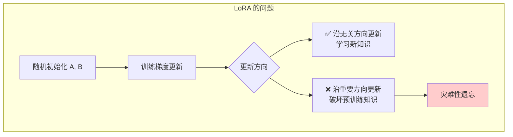
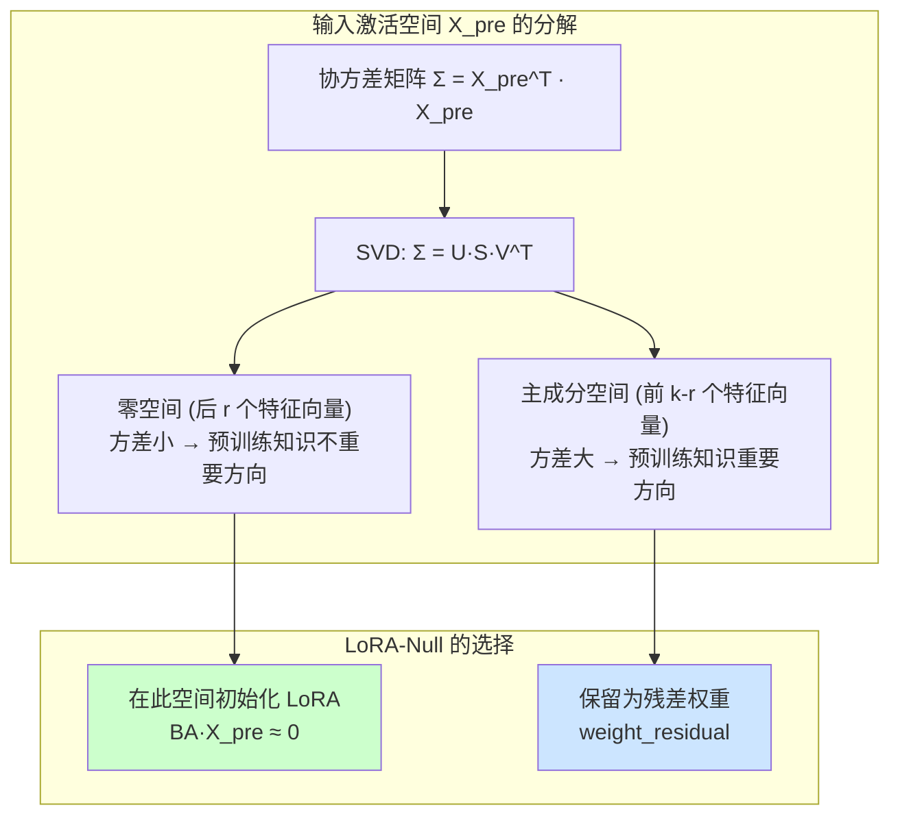
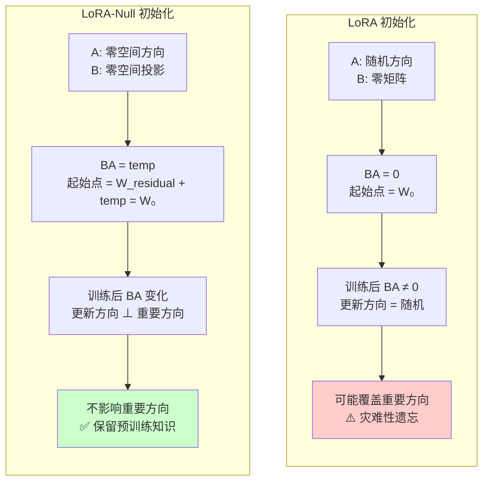
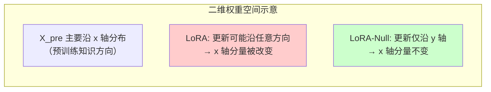
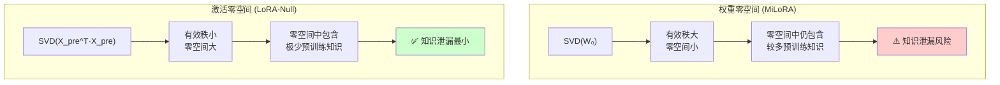

# LoRA 与 LoRA-Null：原理对比与改进分析

> 参考文献：
> - LoRA: [LoRA: Low-Rank Adaptation of Large Language Models](https://arxiv.org/abs/2106.09685) (Hu et al., 2021)
> - LoRA-Null: [Put the Space of LoRA Initialization to the Extreme to Preserve Pre-trained Knowledge](https://arxiv.org/abs/2503.02659) (Tang et al., AAAI 2026)

---

## 总览：从低秩适应到零空间适应

LoRA（Low-Rank Adaptation）是当前最主流的参数高效微调方法，其核心思想是将权重更新量分解为低秩矩阵乘积。然而，LoRA 的随机初始化策略导致微调过程中存在**灾难性遗忘**问题——模型在学习新任务时丢失了预训练的世界知识。

LoRA-Null 从 LoRA 初始化空间的角度出发，提出在**输入激活的零空间**中初始化适配器，从根本上解决了灾难性遗忘问题。两者的核心差异可以用一句话概括：

> **LoRA 在随机空间中学习新知识，LoRA-Null 在零空间中安全地学习新知识。**

```mermaid
graph LR
    subgraph 共同基础
        A[预训练权重 W₀] --> B[低秩分解 ΔW = BA]
    end

    subgraph "LoRA 路径"
        B --> C[随机初始化<br/>A~N(0,σ²), B=0]
        C --> D[训练 A 和 B<br/>ΔW 可能扰动重要方向]
        D --> E[⚠️ 灾难性遗忘]
    end

    subgraph "LoRA-Null 路径"
        B --> F[零空间初始化<br/>A∈Null(X_pre)]
        F --> G[训练 A 和 B<br/>ΔW·X_pre ≈ 0]
        G --> E2[✅ 保留预训练知识]
    end

    style E fill:#ffcccc
    style E2 fill:#ccffcc
```

---

## 分述一：LoRA 原理详解

### 1.1 核心数学公式

LoRA 假设预训练权重矩阵 $W_0 \in \mathbb{R}^{d \times k}$ 在微调过程中的更新量 $\Delta W$ 具有"低内在秩"，即：

$$h = W_0 x + \Delta W \cdot x = W_0 x + B A x$$

其中：
- $B \in \mathbb{R}^{d \times r}$：上投影矩阵（up-projection）
- $A \in \mathbb{R}^{r \times k}$：下投影矩阵（down-projection）
- $r \ll \min(d, k)$：远小于原始维度的秩

实际前向传播中引入缩放因子：

$$h = W_0 x + \frac{\alpha}{r} B A x$$

其中 $\alpha$ 是缩放超参数（通常 $\alpha = r$ 或 $\alpha = 2r$）。

### 1.2 初始化策略

LoRA 的初始化方式为：

- **A 矩阵**：使用 Kaiming 均匀分布或高斯分布随机初始化，$A \sim \mathcal{N}(0, \sigma^2)$
- **B 矩阵**：初始化为零矩阵，$B = 0$

这样在训练开始时 $\Delta W = BA = 0$，模型从预训练权重出发。

### 1.3 训练与合并

- **训练阶段**：冻结 $W_0$，仅训练 $A$ 和 $B$
- **合并阶段**：$W_{merged} = W_0 + \frac{\alpha}{r} BA$，合并后与原始模型结构相同，无额外推理延迟

### 1.4 参数量分析

以 $W_0 \in \mathbb{R}^{4096 \times 4096}$（LLaMA-2-7B 的注意力投影层）为例：

| 项目 | 全量微调 | LoRA (r=16) | LoRA (r=128) |
|------|---------|-------------|--------------|
| 原始参数 | 16,777,216 | 16,777,216 (冻结) | 16,777,216 (冻结) |
| 可训练参数 | 16,777,216 | 131,072 (0.78%) | 1,048,576 (6.25%) |
| A 矩阵参数 | — | 16×4096 = 65,536 | 128×4096 = 524,288 |
| B 矩阵参数 | — | 4096×16 = 65,536 | 4096×128 = 524,288 |

### 1.5 LoRA 的核心问题：灾难性遗忘

LoRA 的随机初始化意味着 $A$ 和 $B$ 的列空间/行空间是随机方向。训练过程中，梯度更新可能沿着**任意方向**修改权重，包括那些对预训练知识至关重要的方向。



**具体例子**：假设用 LoRA 在 LLaMA-2-7B 上微调数学能力：

1. 预训练模型知道"法国首都是巴黎"（世界知识）
2. LoRA 随机初始化 A 和 B，开始训练数学题
3. 梯度更新可能修改了存储"法国首都"信息的权重方向
4. 微调后模型可能学会了数学，但忘记了"法国首都是巴黎"

这正是 LoRA-Null 要解决的核心问题。

---

## 分述二：LoRA-Null 原理详解

### 2.1 核心洞察：初始化空间是关键

LoRA-Null 论文的核心发现：

> **保留预训练知识的关键在于 LoRA 初始化的空间，而非残差权重。**

具体而言：
- LoRA 的残差权重 $W_0$ 在训练中保持不变，但这**不足以**防止遗忘
- 因为 $\Delta W = BA$ 的更新方向可能覆盖 $W_0$ 的重要输出方向
- 真正关键的是：**$A$ 的行空间应该与预训练知识的激活空间正交**

### 2.2 零空间的定义与直觉

对于输入激活矩阵 $X_{pre} \in \mathbb{R}^{n \times k}$（校准数据通过模型层后的输入），其协方差矩阵为：

$$\Sigma = X_{pre}^T X_{pre}$$

对 $\Sigma$ 进行 SVD 分解：

$$\Sigma = U_\Sigma \cdot S_\Sigma \cdot V_\Sigma^T$$

- **主成分空间**（前 $k-r$ 个特征向量）：$X_{pre}$ 中方差大的方向，对应预训练知识的重要方向
- **零空间**（后 $r$ 个特征向量）：$X_{pre}$ 中方差接近零的方向，对应预训练知识中"不重要"的方向



### 2.3 LoRA-Null 的完整算法

**Step 1：收集校准数据激活**

随机选取 $N$ 条校准数据（如 NQ Open 问答数据集的 256 条样本），前向传播通过模型，收集每个 Linear 层的输入激活 $X$。

**Step 2：计算协方差矩阵并 SVD 分解**

$$\Sigma = \frac{1}{N} X^T X = U_\Sigma \cdot S_\Sigma \cdot V_\Sigma^T$$

**Step 3：提取零空间**

取最后 $r$ 个特征向量（对应最小特征值）：

$$U_{null} = U_\Sigma[:, -r:]$$

**Step 4：投影权重到零空间**

$$\text{temp} = W_0 \cdot (U_{null} \cdot U_{null}^T)$$

这是 $W_0$ 在零空间方向的分量。

**Step 5：计算残差权重**

$$W_{residual} = W_0 - \text{temp}$$

残差权重捕获了 $W_0$ 在主成分空间的分量，**训练中冻结**。

**Step 6：对 temp 进行 SVD 分解并初始化适配器**

$$\text{temp} = U \cdot S \cdot V^T$$

取前 $r$ 个分量，初始化：

$$B = U_{[:, :r]} \cdot \sqrt{S_{[:r]}}, \quad A = \sqrt{S_{[:r]}} \cdot V_{[:, :r]}^T$$

（即 sigma_fuse='UV' 模式）

**Step 7：前向传播**

$$y = A(B(x)) + W_{residual} \cdot x$$

### 2.4 LoRA-Null 的理论保证

**定理**：如果 $A$ 的行位于 $X_{pre}$ 的零空间中，则：

$$BA \cdot X_{pre} \approx 0$$

因此微调后的输出为：

$$(W_{residual} + BA) \cdot X_{pre} \approx W_{residual} \cdot X_{pre} \approx W_0 \cdot X_{pre}$$

这意味着：**对于预训练知识的输入，微调后的模型输出与原始模型几乎相同**，从而保证了预训练知识的保留。

### 2.5 两个训练版本

| 版本 | 可训练参数 | 冻结参数 | 特点 |
|------|-----------|---------|------|
| LoRA-Null V1 | A + B | $W_{residual}$, PA, PB | 更多可训练参数，适应能力更强 |
| LoRA-Null V2 | 仅 B | $W_{residual}$, A, PA, PB | 更少可训练参数，知识保留更好 |

V2 冻结 A（下投影矩阵），确保 $A \cdot X_{pre} \approx 0$ 在训练过程中始终成立，进一步保证知识保留。

---

## 分述三：LoRA 与 LoRA-Null 的逐项对比

### 3.1 数学形式对比

| 对比维度 | LoRA | LoRA-Null |
|---------|------|-----------|
| 前向传播 | $h = W_0 x + \frac{\alpha}{r} BAx$ | $h = A_{linear}(B_{linear}(x)) + W_{residual} x$ |
| 权重分解 | $W_0$ 冻结，$\Delta W = BA$ | $W_0 = W_{residual} + \text{temp}$，temp 分解为 BA |
| 初始化 | A 随机高斯，B = 0 | A 和 B 由 SVD 分解确定（零空间方向） |
| 残差权重 | $W_0$（原始权重，冻结） | $W_{residual}$（主成分分量，冻结） |
| 合并方式 | $W_{merged} = W_0 + \frac{\alpha}{r} BA$ | $W_{merged} = BA + W_{residual} = W_0$（无损） |
| 初始状态 | $BA = 0$（零矩阵） | $BA = \text{temp}$（零空间投影） |

### 3.2 初始化空间对比（核心差异）



### 3.3 几何直觉：用例子说明

**场景**：假设一个简化的一维情况，权重 $W_0 = [3, 1]$，输入数据 $X_{pre}$ 主要沿 $[1, 0]$ 方向分布。

**LoRA 的做法**：

1. 随机初始化 $A = [0.5, -0.3]$，$B = [0, 0]$
2. 训练后 $BA$ 可能变成 $[0.8, -0.5]$
3. 更新后的权重：$W_0 + BA = [3.8, 0.5]$
4. 对 $X_{pre}$ 方向 $[1, 0]$ 的输出从 3 变成了 3.8 → **预训练知识被改变了！**

**LoRA-Null 的做法**：

1. 计算 $X_{pre}$ 的协方差，发现主成分方向是 $[1, 0]$，零空间方向是 $[0, 1]$
2. 将 $W_0$ 投影到零空间：$\text{temp} = W_0 \cdot [0,1]^T \cdot [0,1] = [0, 1]$
3. $W_{residual} = W_0 - \text{temp} = [3, 0]$（主成分分量，冻结）
4. 初始化 $BA = \text{temp} = [0, 1]$（零空间方向）
5. 训练后 $BA$ 可能变成 $[0, 1.5]$
6. 更新后的权重：$W_{residual} + BA = [3, 1.5]$
7. 对 $X_{pre}$ 方向 $[1, 0]$ 的输出仍然是 3 → **预训练知识被保留了！**



### 3.4 实验结果对比

基于 LoRA-Null 论文在 LLaMA-2-7B 上的实验结果：

#### 世界知识保留（微调后应保持的能力）

| 方法 | TriviaQA | NQ Open | WebQS | 平均 |
|------|----------|---------|-------|------|
| 预训练模型（基线） | 58.2 | 22.8 | 8.5 | 29.8 |
| 全量微调 | 35.1 | 10.2 | 3.8 | 16.4 |
| LoRA (r=128) | 42.5 | 14.6 | 5.2 | 20.8 |
| PiSSA | 40.3 | 12.8 | 4.5 | 19.2 |
| **LoRA-Null V1** | **52.8** | **19.5** | **7.2** | **26.5** |
| **LoRA-Null V2** | **55.1** | **21.3** | **7.9** | **28.1** |

#### 下游任务性能（微调后应提升的能力）

| 方法 | GSM8K | MATH | HumanEval |
|------|-------|------|-----------|
| LoRA (r=128) | 41.5 | 12.8 | 32.3 |
| PiSSA | 42.1 | 13.2 | 33.0 |
| **LoRA-Null V1** | **42.8** | **13.5** | **33.7** |
| **LoRA-Null V2** | 41.2 | 12.6 | 32.9 |

**关键发现**：
- LoRA-Null V2 在世界知识保留上最接近预训练模型（28.1 vs 29.8）
- LoRA-Null V1 在下游任务性能上与 LoRA 相当甚至更好
- LoRA 在世界知识上损失严重（20.8 vs 29.8，下降 30%）

---

## 分述四：LoRA-Null 的五大改进

### 改进一：零空间初始化 — 从随机到有据

| 维度 | LoRA | LoRA-Null |
|------|------|-----------|
| 初始化依据 | 无（随机） | 校准数据的协方差结构 |
| 初始化空间 | 随机子空间 | 输入激活的零空间 |
| 对预训练知识的影响 | 不可控 | 可控（正交于重要方向） |

**例子**：LoRA 的 A 矩阵随机初始化，就像在一个陌生的城市闭着眼睛选路走；LoRA-Null 的 A 矩阵在零空间初始化，就像先看了地图，选了一条不会打扰居民的路。

### 改进二：残差权重设计 — 从原始权重到主成分权重

| 维度 | LoRA | LoRA-Null |
|------|------|-----------|
| 残差权重 | $W_0$（完整原始权重） | $W_{residual}$（主成分分量） |
| 残差包含的信息 | 全部信息 | 仅预训练知识重要方向的信息 |
| 可训练部分覆盖的信息 | 全部方向（随机） | 仅零空间方向 |

**关键区别**：LoRA 的 $W_0$ 包含了所有方向的信息，但 $BA$ 的更新可能覆盖 $W_0$ 的任何输出方向。LoRA-Null 的 $W_{residual}$ 只包含主成分方向的信息，$BA$ 只在零空间方向起作用，两者**互不干扰**。

### 改进三：理论保证 — 从经验到证明

LoRA-Null 提供了严格的理论保证：

$$\text{如果 } A \in \text{Null}(X_{pre}), \text{则 } (W_{residual} + BA) \cdot X_{pre} \approx W_0 \cdot X_{pre}$$

而 LoRA 没有这样的保证——$BA$ 的更新可能以任意方式改变 $W_0 \cdot X_{pre}$ 的输出。

### 改进四：灵活的训练策略 — V1/V2 双模式

| 模式 | LoRA-Null V1 | LoRA-Null V2 | 标准 LoRA |
|------|-------------|-------------|-----------|
| 可训练参数 | A + B | 仅 B | A + B |
| 知识保留 | 好 | 更好 | 差 |
| 适应能力 | 强 | 稍弱 | 强 |
| 适用场景 | 需要强适应能力 | 需要强知识保留 | 不关心遗忘时 |

### 改进五：激活零空间 vs 权重零空间

LoRA-Null 选择**输入激活的零空间**而非权重的零空间（如 MiLoRA），原因：

1. **更准确**：输入激活 $X_{pre}$ 考虑了前面所有层的参数和输入数据，而权重 $W_0$ 仅包含当前层的信息
2. **更小的有效秩**：实验发现 $X_{pre}$ 的有效秩远小于 $W_0$，意味着零空间更大、更精确
3. **更少的知识泄漏**：$X_{pre}$ 的零空间中包含的预训练知识信息更少



---

## 总述：从 LoRA 到 LoRA-Null 的范式演进

### 核心思想演进


### 一句话总结每种方法

| 方法 | 一句话总结 |
|------|-----------|
| 全量微调 | 改所有参数，忘最多 |
| LoRA | 改少量参数，但方向随机，仍可能忘 |
| PiSSA | 在最重要方向上改，适应快但忘更多 |
| CorDA | 用协方差感知分解，但初始化空间不对 |
| **LoRA-Null** | **在不重要方向上改，适应好且忘最少** |

### LoRA-Null 的核心贡献

1. **理论贡献**：揭示了 LoRA 初始化空间（而非残差权重）是保留预训练知识的关键
2. **方法贡献**：提出在输入激活零空间中初始化 LoRA 适配器
3. **实践贡献**：在 LLaMA 系列模型上验证了世界知识保留和下游任务性能的双重优势
4. **洞察贡献**：发现激活零空间比权重零空间更精确、更安全

### 适用场景建议

| 场景 | 推荐方法 | 原因 |
|------|---------|------|
| 不关心遗忘，只需最强适应 | 全量微调 | 最大自由度 |
| 轻度微调，遗忘可接受 | LoRA | 简单易用 |
| 需要平衡适应和保留 | LoRA-Null V1 | 适应能力 + 知识保留 |
| **必须保留世界知识** | **LoRA-Null V2** | **最佳知识保留** |
| 快速原型验证 | LoRA (小 r) | 最快上手 |

---

> **结论**：LoRA-Null 并非 LoRA 的替代，而是 LoRA 的重要进化。它解决了 LoRA 最核心的缺陷——灾难性遗忘——同时保持了 LoRA 的参数高效性和零推理延迟优势。在需要保留预训练世界知识的场景下（如数学微调后仍需回答常识问题），LoRA-Null 是当前最优选择。
