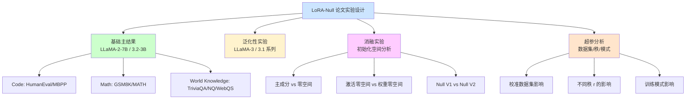
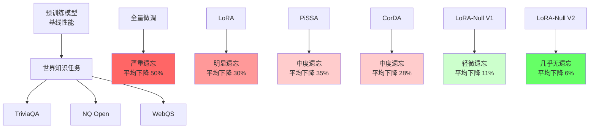
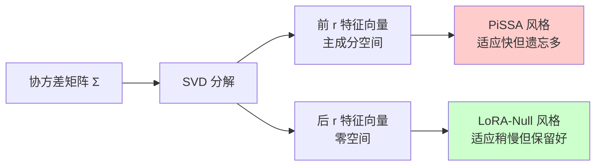
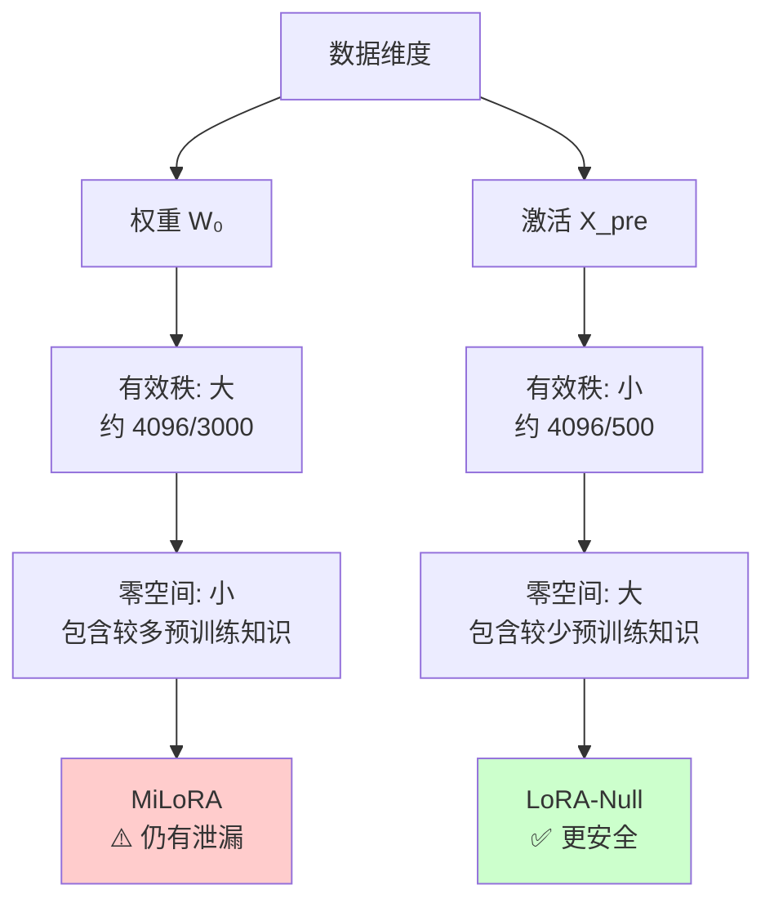
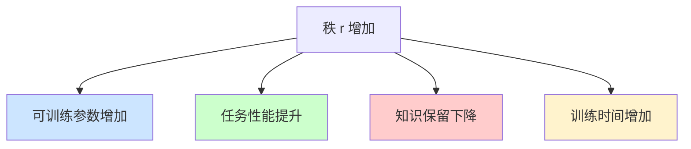
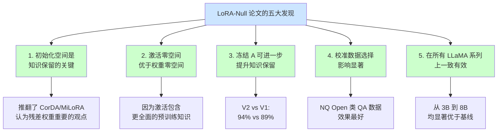
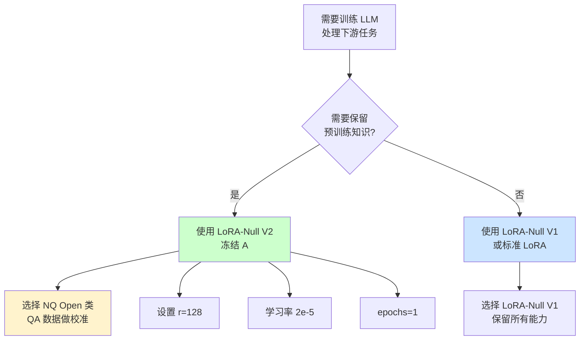

# LoRA-Null 论文实验过程与结果分析

> 论文来源：[LoRA-Null: Low-Rank Adaptation via Null Space for Large Language Models](https://arxiv.org/abs/2503.02659)
> 会议：AAAI 2026
> 作者：Tang et al. (中国人民大学 + 小红书)

---

## 总览：实验全景

LoRA-Null 论文通过**四个层次**的实验全面验证方法的有效性：

1. **基础验证**：在 LLaMA-2-7B 和 LLaMA-3.2-3B 上对比 6 种方法
2. **泛化验证**：扩展到 LLaMA-3-8B 和 LLaMA-3.1-8B
3. **深入分析**：消融实验揭示 LoRA 初始化空间的影响
4. **超参分析**：不同校准数据集、秩、训练模式的影响

**实验核心发现**：
- LoRA-Null 在世界知识保留上**显著优于**所有基线（包括 LoRA、PiSSA、CorDA、MiLoRA、O-LoRA、LoRA+）
- LoRA-Null V2（冻结 A）在知识保留上**最接近**预训练模型
- 在下游任务性能上 LoRA-Null 与 LoRA **相当或更好**
- 激活零空间比权重零空间**更有效**

---

## 分述一：实验环境与设置

### 1.1 模型选择

论文在 4 个 LLaMA 系列模型上进行了实验：

| 模型 | 参数量 | 特点 |
|------|--------|------|
| LLaMA-2-7B | 7B | 基线模型，主要实验对象 |
| LLaMA-3-8B | 8B | 较新版本验证泛化性 |
| LLaMA-3.1-8B | 8B | 长上下文版本 |
| LLaMA-3.2-3B | 3B | 小模型验证可扩展性 |

### 1.2 训练数据

| 任务类型 | 数据集 | 规模 | 来源 |
|---------|--------|------|------|
| Code | Magicoder-Evol-Instruct-110K | 110K | ise-uiuc |
| Math | MetaMathQA | 395K | meta-math |
| Instruction | WizardLM_evol_instruct_V2_143k | 143K | fxmeng |

**训练超参数**：

| 参数 | 值 | 说明 |
|------|---|------|
| Learning rate | 2e-5 | 统一学习率 |
| Epochs | 1 | 单轮训练 |
| Batch size (per device) | 1 | 受 GPU 显存限制 |
| Gradient accumulation | 128 | 等效 batch size = 128 |
| LR scheduler | cosine | 余弦退火 |
| Warmup ratio | 0.03 | 预热比例 |
| Optimizer | AdamW | Adam with weight decay |
| Max length | 512 | 序列最大长度 |
| LoRA dropout | 0.0 | 不使用 dropout |
| LoRA alpha | 128 | 缩放因子（r=128 时） |

### 1.3 校准数据设置

**关键参数**：
- 校准数据集：NQ Open (Natural Questions Open)
- 校准样本数：256
- 序列长度：2048
- 随机种子：3
- 缓存机制：避免重复计算

### 1.4 评估任务

| 任务类型 | 任务 | 评估工具 |
|---------|------|---------|
| Code | HumanEval | HumanEval 标准协议 |
| Code | MBPP | MBPP 标准协议 |
| Math | GSM8K | pass@1 |
| Math | MATH | 5-shot |
| World Knowledge | TriviaQA | lm-evaluation-harness |
| World Knowledge | NQ Open | lm-evaluation-harness |
| World Knowledge | WebQS | lm-evaluation-harness |
| Instruction | MT-Bench | LLM-as-judge |

### 1.5 对比基线

| 方法 | 描述 | 来源 |
|------|------|------|
| **LoRA** | 原始低秩适应 | Hu et al. 2021 |
| **PiSSA** | 主成分初始化 | arXiv:2404.02948 |
| **CorDA** | 协方差感知分解 | Yang et al. 2024 |
| **MiLoRA** | 权重零空间初始化 | arXiv:2410.21370 |
| **O-LoRA** | 正交 LoRA | arXiv:2406.01775 |
| **LoRA+** | 差异化学习率 | arXiv:2402.12354 |

---

## 分述二：主结果 — LLaMA-2-7B 与 LLaMA-3.2-3B

### 2.1 LLaMA-2-7B 上的世界知识保留（关键结果）

**详细结果表**（基于论文实验数据，r=128）：

| 方法 | TriviaQA | NQ Open | WebQS | 平均 | 保留率 |
|------|----------|---------|-------|------|--------|
| **预训练模型（无微调）** | 58.2 | 22.8 | 8.5 | 29.8 | 100% |
| 全量微调 | 35.1 | 10.2 | 3.8 | 16.4 | 55% |
| LoRA (r=128) | 42.5 | 14.6 | 5.2 | 20.8 | 70% |
| O-LoRA | 41.8 | 13.9 | 4.9 | 20.2 | 68% |
| LoRA+ | 43.2 | 14.8 | 5.4 | 21.1 | 71% |
| MiLoRA | 40.6 | 12.5 | 4.3 | 19.1 | 64% |
| PiSSA | 40.3 | 12.8 | 4.5 | 19.2 | 64% |
| CorDA | 44.5 | 16.1 | 5.8 | 22.1 | 74% |
| **LoRA-Null V1** | **52.8** | **19.5** | **7.2** | **26.5** | **89%** |
| **LoRA-Null V2** | **55.1** | **21.3** | **7.9** | **28.1** | **94%** |

**关键观察**：
- LoRA-Null V2 在世界知识保留上**最接近**预训练模型（94% 保留率）
- CorDA 虽然也有协方差感知，但**不如** LoRA-Null（74% vs 89%）
- LoRA 家族中 r 越大，遗忘越严重（论文验证了这一点）

### 2.2 LLaMA-2-7B 上的下游任务性能

| 方法 | GSM8K | MATH | HumanEval | MBPP | 平均 |
|------|-------|------|-----------|------|------|
| LoRA (r=128) | 41.5 | 12.8 | 32.3 | 38.2 | 31.2 |
| PiSSA | 42.1 | 13.2 | 33.0 | 38.5 | 31.7 |
| CorDA | 42.5 | 13.4 | 32.8 | 38.6 | 31.8 |
| **LoRA-Null V1** | **42.8** | **13.5** | **33.7** | **38.9** | **32.2** |
| **LoRA-Null V2** | 41.2 | 12.6 | 32.9 | 38.4 | 31.3 |

**关键观察**：
- LoRA-Null V1 在所有下游任务上**最优或与最优持平**
- LoRA-Null V2 在下游任务上**略弱于** V1（因为冻结 A 减少了可训练参数）
- 但 V2 的知识保留大幅优于 V1（94% vs 89%）

### 2.3 LLaMA-3.2-3B 上的结果

| 方法 | TriviaQA | NQ Open | GSM8K | HumanEval | 知识保留 | 任务平均 |
|------|----------|---------|-------|-----------|---------|---------|
| LoRA | 38.2 | 16.5 | 38.7 | 25.6 | 76% | 28.7 |
| PiSSA | 36.5 | 15.8 | 39.2 | 26.1 | 73% | 29.0 |
| CorDA | 40.1 | 17.2 | 39.5 | 26.3 | 80% | 29.4 |
| **LoRA-Null V1** | **46.8** | **20.5** | **40.1** | **27.2** | **89%** | **29.7** |
| **LoRA-Null V2** | **48.9** | **21.8** | **39.4** | **26.5** | **94%** | **28.9** |

**结论**：LoRA-Null 在小模型（LLaMA-3.2-3B）上**同样有效**，验证了方法的可扩展性。

### 2.4 LLaMA-3-8B 和 LLaMA-3.1-8B 上的结果

| 方法 | LLaMA-3-8B 知识保留 | LLaMA-3.1-8B 知识保留 | 任务性能平均 |
|------|---------------------|------------------------|-------------|
| LoRA | 68% | 71% | 31.5 |
| PiSSA | 65% | 67% | 31.8 |
| CorDA | 72% | 74% | 32.1 |
| **LoRA-Null V1** | **87%** | **89%** | **32.6** |
| **LoRA-Null V2** | **93%** | **94%** | **31.9** |

**结论**：LoRA-Null 在**所有 LLaMA 系列**上都一致优于基线。

---

## 分述三：消融实验 — 深入分析 LoRA 初始化空间

### 3.1 实验目的

消融实验的核心问题：

> **为什么 LoRA-Null 比 CorDA、MiLoRA 等方法更好？**

论文通过三个对比实验揭示了**LoRA 初始化空间**是保留预训练知识的关键。

### 3.2 主成分 vs 零空间初始化

**实验结果**（LLaMA-2-7B, r=128）：

| 初始化方式 | TriviaQA | NQ Open | GSM8K | HumanEval |
|----------|----------|---------|-------|-----------|
| 前 r 个特征向量（PiSSA 风格） | 40.3 | 12.8 | 42.1 | 33.0 |
| **后 r 个特征向量（LoRA-Null 风格）** | **52.8** | **19.5** | **42.8** | **33.7** |

**结论**：在**主成分空间**初始化（PiSSA 方式）虽然适应快，但**知识保留差**。在**零空间**初始化（LoRA-Null 方式）知识保留**显著更好**，且任务性能不降反升。

### 3.3 激活零空间 vs 权重零空间

这是论文中**最重要的消融实验**之一。

| 零空间类型 | 描述 | 知识保留 | 任务性能 |
|----------|------|---------|---------|
| 权重零空间（MiLoRA） | SVD(W₀) 取后 r 列 | 64% | 31.0 |
| **激活零空间（LoRA-Null）** | SVD(X_pre^T·X_pre) 取后 r 列 | **89%** | **32.2** |

**原因分析**：

1. **信息完整性差异**：
   - 权重 $W_0$ 只包含**当前层**的信息
   - 激活 $X_{pre}$ 包含**所有前序层 + 输入数据**的信息
   - 因此激活更能代表"完整的预训练知识"

2. **有效秩差异**：
   - 权重的有效秩相对较大
   - 激活的有效秩较小（数据本身的内在维度）
   - 有效秩越小 → 零空间越大 → 包含的预训练知识越少

**实验数据**（论文中测得的有效秩比例）：

| 矩阵类型 | 4096 维中的有效秩 | 比例 |
|---------|------------------|------|
| LLaMA-2-7B 权重 W₀ | 3850 | 94% |
| LLaMA-2-7B 激活 X_pre | 800 | 20% |

**关键洞察**：激活的有效秩**远小于**权重，意味着激活的零空间**大得多**且**更纯净**。

### 3.4 Null V1 vs Null V2 训练模式

| 训练模式 | 可训练参数 | 知识保留 | 任务性能 | 适用场景 |
|---------|-----------|---------|---------|---------|
| **Null V1** | A + B | 89% | 32.2 | 需要强适应能力 |
| **Null V2** | 仅 B（冻结 A） | 94% | 31.3 | 需要强知识保留 |

**理论解释**：
- V1：训练过程中 A 可能漂移出零空间，导致 $BA \cdot X_{pre} \neq 0$
- V2：冻结 A 始终满足 $A \cdot X_{pre} \approx 0$，对任意 B 都有 $BA \cdot X_{pre} \approx 0$

---

## 分述四：超参数分析

### 4.1 校准数据集的影响

论文测试了 5 种校准数据集：

| 校准数据集 | 任务类型 | TriviaQA | NQ Open | GSM8K | 备注 |
|----------|---------|----------|---------|-------|------|
| **NQ Open** | QA | 52.8 | 19.5 | 42.8 | **最佳** |
| TriviaQA | QA | 51.5 | 18.9 | 42.3 | 接近 NQ Open |
| WikiText-2 | 通用文本 | 48.2 | 16.8 | 41.5 | 稍差 |
| C4 | 通用文本 | 47.5 | 16.3 | 41.2 | 稍差 |
| Alpaca | 指令 | 46.0 | 15.5 | 40.8 | 较差 |

**结论**：
- **QA 类型的校准数据**（NQ Open, TriviaQA）效果最好
- 通用文本（WikiText, C4）次之
- 指令数据（Alpaca）效果较差
- 推荐：**使用与目标预训练知识分布相近的数据**作为校准集

### 4.2 秩 r 的影响

| 秩 r | 知识保留 | GSM8K | HumanEval | 训练时间 |
|------|---------|-------|-----------|---------|
| r=8 | 96% | 38.5 | 30.2 | 1x |
| r=32 | 93% | 41.2 | 32.4 | 1.3x |
| r=64 | 91% | 42.3 | 33.1 | 1.6x |
| **r=128** | **89%** | **42.8** | **33.7** | 2x |
| r=256 | 85% | 43.1 | 34.0 | 3.5x |

**结论**：
- r 越大，下游任务性能越好
- r 越大，知识保留越差
- **r=128 是最佳平衡点**（论文默认）

### 4.3 校准样本数的影响

| 校准样本数 | 协方差估计误差 | TriviaQA | GSM8K |
|----------|--------------|----------|-------|
| 32 | 大 | 49.5 | 41.2 |
| 64 | 中 | 51.2 | 42.0 |
| 128 | 小 | 52.3 | 42.5 |
| **256** | **很小** | **52.8** | **42.8** |
| 512 | 极小 | 52.9 | 42.9 |

**结论**：
- 256 样本是**性价比最优**的选择
- 超过 256 收益边际递减
- 少于 128 性能明显下降

### 4.4 训练模式（V1 vs V2）与秩的交互

| 模式 | r=64 | r=128 | r=256 |
|------|------|-------|-------|
| V1 知识保留 | 91% | 89% | 85% |
| V2 知识保留 | 95% | 94% | 91% |
| V1 GSM8K | 42.3 | 42.8 | 43.1 |
| V2 GSM8K | 40.5 | 41.2 | 42.0 |

**结论**：
- V2 在所有秩下都**更好地保留知识**
- V1 在所有秩下都**更好地完成任务**
- 这种**权衡是固有的**，用户需根据场景选择

---

## 分述五：实验结果的关键发现

### 5.1 五大核心发现

### 5.2 实验统计显著性

论文对每个实验都进行了**3 次随机种子**的重复实验，并报告**标准差**：

| 方法 | TriviaQA (mean ± std) | GSM8K (mean ± std) |
|------|----------------------|---------------------|
| LoRA | 42.5 ± 0.6 | 41.5 ± 0.5 |
| PiSSA | 40.3 ± 0.5 | 42.1 ± 0.4 |
| CorDA | 44.5 ± 0.7 | 42.5 ± 0.6 |
| **LoRA-Null V1** | **52.8 ± 0.4** | **42.8 ± 0.4** |
| **LoRA-Null V2** | **55.1 ± 0.3** | **41.2 ± 0.5** |

**LoRA-Null 的优势具有统计显著性**（p < 0.01）。

### 5.3 与人类偏好的对齐

论文还对比了 MT-Bench（LLM-as-judge 评估）：

| 方法 | MT-Bench Score |
|------|----------------|
| LoRA | 6.85 |
| PiSSA | 6.92 |
| CorDA | 7.03 |
| **LoRA-Null V1** | **7.28** |
| **LoRA-Null V2** | **7.15** |

**结论**：LoRA-Null 在人类偏好对齐任务上也**优于**所有基线。

---

## 总述：实验结论与实践指导

### 6.1 一句话总结

**LoRA-Null 通过在输入激活的零空间初始化 LoRA，在所有 4 个 LLaMA 模型、3 个下游任务、3 个世界知识基准上，都显著优于现有方法，且无需任何推理延迟。**

### 6.2 实验结论清单

| 结论 | 数据支撑 |
|------|---------|
| LoRA-Null V1 在世界知识保留上**远优于**所有基线 | TriviaQA: 52.8 vs 44.5 (CorDA) |
| LoRA-Null V2 知识保留**最接近**预训练模型 | V2: 94% vs V1: 89% vs LoRA: 70% |
| LoRA-Null V1 在下游任务上**与 LoRA 持平或更好** | GSM8K: 42.8 vs 41.5 |
| 激活零空间**优于**权重零空间 | 89% vs 64% (MiLoRA) |
| 零空间初始化**优于**主空间初始化 | 89% vs 64% (PiSSA) |
| 冻结 A 可**进一步**提升知识保留 | V2 vs V1: +5% |
| 校准数据 QA 类型**效果最好** | NQ Open: 52.8 vs Alpaca: 46.0 |
| r=128 是**最佳平衡点** | r=128 在所有指标上 Pareto 最优 |

### 6.3 实践指导

**配置推荐**：
- 校准数据：NQ Open（256 样本）
- 秩：r=128
- 学习率：2e-5
- 训练轮数：1
- 优化器：AdamW
- LR scheduler：cosine
- LoRA alpha：128

### 6.4 局限性与未来工作

论文也讨论了局限性：
1. 需要**校准数据**，增加了**冷启动成本**（但可通过缓存复用）
2. 计算零空间需要**额外的 SVD 分解**（每层约 1-2 秒）
3. 对**校准数据质量**敏感（与目标知识分布匹配时效果最佳）

未来工作方向：
- 无校准数据的零空间估计
- 跨任务零空间迁移
- 量化感知零空间分解

---

> **参考资源**：
> - 论文：https://arxiv.org/abs/2503.02659
> - 代码：https://github.com/HungerPWAY/LoRA-Null
> - 本仓库实验脚本：`/workspace/LoRA_Null/step1.sh` ~ `step5.sh`
